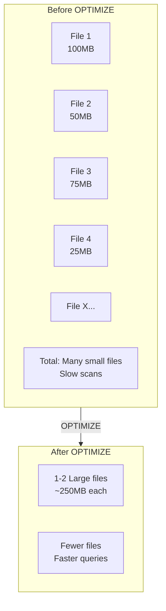

# Delta Lake Optimization

## Overview

Delta Lake optimization ensures tables remain performant as they grow. Key operations include compacting small files, removing old data, indexing for faster queries, and collecting statistics for query optimization.

## OPTIMIZE Command (Compaction)



### Basic OPTIMIZE

```sql
OPTIMIZE employees;

-- Output:
-- Added file count: 0
-- Removed file count: 150
-- Partition Values: [...]
```

```python
# Python API

from delta.tables import DeltaTable

delta_table = DeltaTable.forPath(spark, "/mnt/data/employees")
delta_table.optimize().executeCompaction()
```

### Partitioned OPTIMIZE

```sql
-- Optimize specific partitions only
OPTIMIZE employees WHERE year = 2025;

OPTIMIZE employees WHERE year = 2025 AND month = 1;
```

```python
# Optimize with partition pruning

(delta_table.optimize()
    .where("year = 2025")
    .executeCompaction())
```

### OPTIMIZE with Z-order

Z-order indexing rearranges data to improve query performance on frequently filtered columns:

```sql
-- Optimize and Z-order by department (most filtered column)
OPTIMIZE employees
ZORDER BY (department, year);

-- Multiple columns for complex access patterns
OPTIMIZE orders
ZORDER BY (customer_id, order_date);
```

```python
# Z-order via Python

from delta.tables import DeltaTable

(DeltaTable.forPath(spark, "/mnt/data/employees")
    .optimize()
    .zorderBy("department")
    .executeCompaction())
```

## Z-order Indexing

Z-order clustering colocates related data to speed up queries:

```python

# Scenario: Employee queries typically filter by department and salary range
# Z-order on these columns

# Bad query (without Z-order):
# Scans many files to find department='Engineering' with salary > 100000

# Good query (with Z-order):
# Z-order clusters by (department, salary)
# Only scans files containing relevant data

```

### When to Use Z-order

| Column Type | Benefit | Example |
|-----------|---------|---------|
| **Frequently Filtered** | High | WHERE department = 'X' |
| **Range Queries** | High | WHERE salary BETWEEN X AND Y |
| **High Cardinality** | Medium | Employee IDs |
| **Date Columns** | High | WHERE date > '2025-01-01' |
| **Low Cardinality** | Low | WHERE active = true |

## VACUUM Command

VACUUM removes old data files and transaction log entries to save storage:

```sql
-- Remove files older than 7 days (default)
VACUUM employees;

-- Remove files older than 30 days
VACUUM employees RETAIN 30 DAYS;

-- Remove files older than 1 hour (not recommended - breaks retention)
VACUUM employees RETAIN 1 HOURS;

-- Dry run (preview what would be deleted)
VACUUM employees DRY RUN;
```

```python
# VACUUM via Python

from delta.tables import DeltaTable

delta_table = DeltaTable.forPath(spark, "/mnt/data/employees")
delta_table.vacuum(retention_hours=168)  # 7 days
```

### VACUUM Safety

```python
# Default retention (7 days)

spark.conf.set("delta.deletedFileRetentionDuration", "interval 7 days")

# This prevents accidental data loss:
# - Retains versions for 7 days
# - Queries using timestamps within 7 days still work
# - Restoring to old versions requires 7-day retention

```

### VACUUM and Time Travel Impact

```python

# VACUUM removes old files, breaking time travel to those versions
# Example:

# Create table (v0)

spark.sql("CREATE TABLE employees AS SELECT ...")

# Insert data daily for 60 days (v0 - v60)
# Run VACUUM RETAIN 30 DAYS
#    - Removes versions older than 30 days
#    - Time travel to v5 fails!

# Run VACUUM RETAIN 60 DAYS (safer)
#    - Time travel works for all versions within 60 days

```

## Table Statistics

Delta stores statistics to help the query optimizer make better decisions:

### Inspecting Statistics

```sql
-- Show detailed statistics
SHOW TABLES
EXTENDED employees;

-- Check column statistics
SELECT
    COLUMN_NAME,
    STATISTICS
FROM
    (DESCRIBE EXTENDED employees)
WHERE
    COLUMN_NAME IN ('id', 'salary')
```

### Column Statistics

```python

# Columns statistics tracked automatically:
# - min value
# - max value
# - null count
# - data type
# - index

# Example for salary column:
# min: 30000
# max: 500000
# nullCount: 0
# numValues: 10000

```

### Collecting Statistics

```sql
-- Spark automatically collects stats on write
-- But can force collection:

ANALYZE TABLE employees COMPUTE STATISTICS;

-- Per-column statistics
ANALYZE TABLE employees COMPUTE STATISTICS FOR COLUMNS salary, department;
```

```python
# Python equivalent

spark.sql("ANALYZE TABLE employees COMPUTE STATISTICS")
spark.sql("ANALYZE TABLE employees COMPUTE STATISTICS FOR COLUMNS salary, department")
```

## Delta Table Properties for Optimization

### Auto-Optimize

```sql
-- Enable auto-optimization (runs OPTIMIZE on every commit)
ALTER TABLE employees
SET TBLPROPERTIES (
    'delta.autoOptimize.optimizeWrite' = 'true',
    'delta.autoOptimize.autoCompact' = 'true'
);
```

### Data Indexing

```sql
-- Enable data skipping with statistics
ALTER TABLE employees
SET TBLPROPERTIES (
    'delta.dataSkippingNumIndexedCols' = '32'
);
```

### Bloom Filters

```sql
-- Bloom filter for fast lookups on specific column
ALTER TABLE employees
SET TBLPROPERTIES (
    'delta.bloomFilter.enabled' = 'true',
    'delta.bloomFilter.columns' = 'email'
);
```

## Performance Tuning Strategy

### Monitor File Size

```python
# Check average file size

files = spark.sql("""
    SELECT
        COUNT(*) as num_files,
        AVG(size) as avg_size_mb,
        SUM(size) as total_size_mb
    FROM
        (SELECT path, size FROM delta.detail('employees'))
""")
```

### Schedule Regular OPTIMIZE

```python

# Recommended: Weekly optimization for large tables
# Run during off-peak hours

def optimize_all_tables():
    tables = spark.sql("SHOW TABLES").collect()
    for table_row in tables:
        table_name = table_row['tableName']
        print(f"Optimizing {table_name}")
        spark.sql(f"OPTIMIZE {table_name}")
```

### Partition Strategy

```python
# Partition large tables by date

spark.sql("""
CREATE TABLE events (
    event_id INT,
    event_name STRING,
    timestamp TIMESTAMP,
    user_id INT
)
USING DELTA
PARTITIONED BY (year INT, month INT, day INT)
""")

# Insert with partition pruning

spark.sql("""
INSERT INTO events PARTITION (year=2025, month=1, day=15)
SELECT event_id, event_name, timestamp, user_id
FROM raw_events
WHERE YEAR(timestamp) = 2025 AND MONTH(timestamp) = 1 AND DAY(timestamp) = 15
""")
```

## Maintenance Schedule

```python

# Recommended maintenance tasks

# Daily: Monitor table size

spark.sql("SELECT COUNT(*) FROM employees").show()

# Weekly: Optimize and analyze

spark.sql("OPTIMIZE employees")
spark.sql("ANALYZE TABLE employees COMPUTE STATISTICS")

# Monthly: VACUUM old data

spark.sql("VACUUM employees RETAIN 30 DAYS")

# Quarterly: Review Z-order strategy and adjust
# spark.sql("OPTIMIZE employees ZORDER BY (new_column)")

```

## Compression and Format

### Delta with Different Encodings

```python
# Delta automatically uses optimal compression (Snappy by default)

(df.write
    .format("delta")
    .option("compression", "snappy")
    .mode("overwrite")
    .save("/mnt/data/employees"))

# Other options: gzip, lz4, uncompressed

```

### Storage Format Comparison

| Format | Compression | Scan Speed | Size |
|--------|-----------|-----------|------|
| **Parquet (Snappy)** | Good | Fast | Medium |
| **Delta (Snappy)** | Good | Fast | Medium |
| **Parquet (Gzip)** | Best | Slower | Small |
| **Uncompressed** | None | Fastest | Large |

## Monitoring Query Performance

```python
# Check query execution plan

spark.sql("""
EXPLAIN EXTENDED
SELECT * FROM employees WHERE salary > 100000
""").show(truncate=False)

# Check if Z-order is used
# Look for "DataFilters" section

```

## Optimization Workflow Example

```python

# Complete optimization example

from delta.tables import DeltaTable
from pyspark.sql.functions import *

table_path = "/mnt/data/employees"
delta_table = DeltaTable.forPath(spark, table_path)

# Analyze current state

spark.sql("ANALYZE TABLE employees COMPUTE STATISTICS")

# Optimize and Z-order

(delta_table.optimize()
    .zorderBy("department", "hire_date")
    .executeCompaction())

# VACUUM old files

delta_table.vacuum(retention_hours=168)  # 7 days

# Verify improvements

print("Optimization complete!")
spark.sql("DESCRIBE HISTORY employees LIMIT 1").show()
```

## Use Cases

- **Scheduled Table Maintenance**: Running weekly `OPTIMIZE` with Z-ORDER and monthly `VACUUM` as part of a maintenance job to keep Delta tables performant as data volume grows.
- **Query Acceleration for BI Dashboards**: Z-ORDERing Delta tables on the columns used in dashboard filters (e.g., `region`, `product_category`) so that BI queries skip irrelevant files and return results in seconds.

## Common Issues & Errors

### Small File Problem

**Scenario:** Frequent micro-batch writes cause slow reads.
**Fix:** Run OPTIMIZE with Z-ORDER regularly.

### OPTIMIZE Not Improving Query Performance

**Scenario:** Running `OPTIMIZE` compacts files but queries remain slow because the workload filters on columns that are not Z-ORDERed.
**Fix:** Ensure that `OPTIMIZE ... ZORDER BY` targets the columns actually used in query `WHERE` clauses. Without Z-ORDER on filtered columns, compaction alone provides limited benefit for selective queries.

### ZORDER on High-Cardinality Columns Wastes Resources

**Scenario:** Z-ORDERing on a primary key or a timestamp column with millions of unique values provides no meaningful data skipping and wastes OPTIMIZE compute time.
**Fix:** Z-ORDER on 1-4 frequently filtered columns with moderate cardinality (e.g., `region`, `category`, `date`). Avoid Z-ORDERing on columns with nearly unique values like auto-increment IDs or microsecond timestamps.

## Exam Tips

- OPTIMIZE compacts small files; Z-ORDER clusters data by specified columns for faster filtering -- know the syntax `OPTIMIZE table ZORDER BY (col)`
- VACUUM default retention is 7 days; running `VACUUM RETAIN 0 HOURS` breaks time travel and is dangerous
- `ANALYZE TABLE ... COMPUTE STATISTICS` collects column-level statistics for the query optimizer
- Auto-optimize (`delta.autoOptimize.optimizeWrite` and `delta.autoOptimize.autoCompact`) runs optimization on every write

## Key Takeaways

- **OPTIMIZE**: Compact small files into larger ones for faster scans
- **Z-order**: Index columns for better query performance on filters
- **VACUUM**: Remove old data files and transaction logs to save storage
- **Statistics**: Automatic collection helps query optimizer
- **Retention**: Default 7 days prevents accidental data loss
- **Auto-optimize**: Automatic OPTIMIZE on write (if enabled)
- **Bloom Filters**: Fast lookup filtering on specific columns
- **Maintenance**: Regular OPTIMIZE, ANALYZE, and VACUUM needed

## Related Topics

- [Time Travel and Versioning](./02-time-travel-versioning.md)
- [Delta Lake Fundamentals](./01-delta-lake-fundamentals.md)
- [Performance Optimization Cheat Sheet](../../../shared/cheat-sheets/performance-optimization.md)

## Official Documentation

- [Optimize Data Files](https://docs.databricks.com/en/delta/optimize.html)
- [Remove Unused Data Files with Vacuum](https://docs.databricks.com/en/delta/vacuum.html)

---

**[← Previous: Time Travel and Versioning](./02-time-travel-versioning.md) | [↑ Back to Delta Lake](./README.md)**
