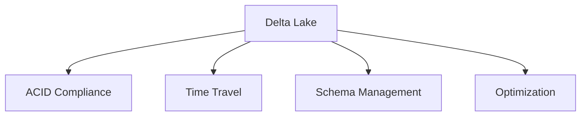

# Delta Lake (22% of Exam)

Delta Lake provides ACID guarantees and time travel capabilities on top of Data Lake.

## Topics Overview

## Section Contents

| File | Topic | Priority |
| :--- | :--- | :--- |
| [01-delta-lake-fundamentals.md](01-delta-lake-fundamentals.md) | ACID properties, benefits, table format | High |
| [02-time-travel-versioning.md](02-time-travel-versioning.md) | Version history, rollback, time travel queries | High |
| [03-delta-optimization.md](03-delta-optimization.md) | OPTIMIZE, VACUUM, Z-order, compaction | High |

## Key Concepts

- **ACID Compliance**: Atomicity, Consistency, Isolation, Durability
- **Time Travel**: Query historical versions of data
- **Data Governance**: Schema enforcement and evolution
- **Performance**: Optimized for both reads and writes

## Related Resources

- [Delta Lake Basics](../../../shared/fundamentals/delta-lake-basics.md)
- [Delta Lake Commands Cheat Sheet](../../../shared/cheat-sheets/delta-lake-commands.md)

## Next Steps

Learn about [04-Workflows and Orchestration](../04-workflows-orchestration/README.md) to productionize your data.

---

**[← Back to Certification](../README.md)**
