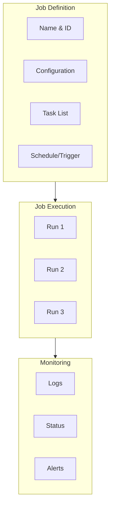
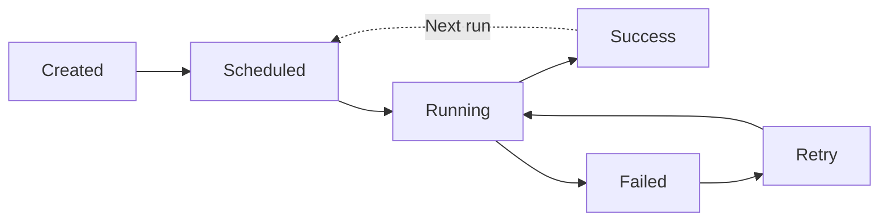

# Databricks Jobs

## Overview

Databricks Jobs are the primary mechanism for deploying and running production data engineering workloads. Jobs provide reliability, monitoring, alerting, and integration with external orchestrators.

## What is a Job?



A job packages together:

- **Tasks**: Code to execute (notebook, Python, SQL, JAR, etc.)
- **Configuration**: Parameters, clusters, dependencies
- **Scheduling**: When/how often to run
- **Monitoring**: Logs, alerts, retry policy

## Job Types and Task Types

### Supported Task Types

| Task Type | Language | Use Case |
|-----------|----------|----------|
| **Notebook** | Python, SQL, Scala, R | Data processing, ETL |
| **Python** | Python script | ML pipelines, custom logic |
| **SQL** | SQL | Analytics, data prep |
| **JAR** | Java/Scala | Spark jobs, legacy code |
| **Spark Submit** | Python, Scala, Java | Direct spark-submit jobs |
| **dbt** | SQL | Data transformation |
| **Spark Python/SQL** | Python/SQL | Spark workloads |

### Notebook Task Example

```python

# When job references this notebook: /Users/name/my_pipeline

# It receives parameters

dbutils.widgets.get("env")  # "prod"
dbutils.widgets.get("date")  # "2025-01-15"

# Main logic

import pyspark.sql.functions as F

# Read data

df = spark.read.delta(f"/mnt/data/raw/{dbutils.widgets.get('date')}")

# Process

df_processed = (df
    .filter(F.col("value") > 0)
    .groupBy("category")
    .agg(F.count("*").alias("count"))
)

# Write results

(df_processed.write
    .format("delta")
    .mode("overwrite")
    .save(f"/mnt/data/processed/{dbutils.widgets.get('date')}"))

print("Pipeline complete!")
```

### Python Script Task Example

```python

# save as /Users/name/etl_job.py

import argparse
import pyspark.sql.functions as F
from pyspark.sql import SparkSession

def main():
    parser = argparse.ArgumentParser()
    parser.add_argument("--environment", required=True)
    parser.add_argument("--date", required=True)
    args = parser.parse_args()

    spark = SparkSession.builder.appName("ETL").getOrCreate()

    # Read
    df = spark.read.delta(f"/mnt/data/raw/{args.date}")

    # Transform
    result = df.filter(F.col("value") > 0)

    # Write
    (result.write
        .format("delta")
        .mode("overwrite")
        .save(f"/mnt/data/processed/{args.date}"))

if __name__ == "__main__":
    main()
```

## Creating Jobs via UI

### Step-by-Step in Databricks UI

1. **Navigate to Workflows > Jobs**
2. **Click "Create Job"**
3. **Configure Task:**
   - Select task type (Notebook, Python, SQL, etc.)
   - Select cluster or create new
   - Add task name and source path
4. **Add Parameters** (optional):
   - `environment`: "prod"
   - `date`: "{{job.start_date}}"
5. **Configure Schedule** (optional):
   - Cron expression
   - Timezone
6. **Add Alerts** (optional):
   - Email notifications
   - Slack webhooks
7. **Save and Run**

## Creating Jobs via API

### Job Definition JSON

```json
{
  "name": "daily_etl_pipeline",
  "description": "Daily ETL process",
  "max_runs": 1,
  "tasks": [
    {
      "task_key": "extract_data",
      "notebook_task": {
        "notebook_path": "/Users/user@company.com/etl/extract",
        "base_parameters": {
          "environment": "prod",
          "date": "{{job.start_date}}"
        }
      },
      "existing_cluster_id": "cluster-123",
      "timeout_seconds": 3600
    }
  ],
  "schedule": {
    "quartz_cron_expression": "0 0 * * * ?",
    "timezone_id": "America/Los_Angeles"
  }
}
```

### Create Job via API

```bash
curl -X POST \
  https://databricks-instance.cloud.databricks.com/api/2.1/jobs/create \
  -H "Authorization: Bearer <PAT>" \
  -d @job_config.json
```

```python
# Python request

import requests
import json

job_config = {
    "name": "daily_etl",
    "tasks": [
        {
            "task_key": "main",
            "notebook_task": {
                "notebook_path": "/Users/user/pipeline",
                "base_parameters": {"env": "prod"}
            },
            "existing_cluster_id": "cluster-123"
        }
    ]
}

response = requests.post(
    "https://databricks-instance.cloud.databricks.com/api/2.1/jobs/create",
    headers={"Authorization": f"Bearer {pat_token}"},
    json=job_config
)

job_id = response.json()["job_id"]
print(f"Created job: {job_id}")
```

## Job Parameters

### Parameter Types

```python
# Static parameters

{
    "base_parameters": {
        "environment": "prod",
        "year": "2025"
    }
}

# Dynamic parameters (macros)

{
    "base_parameters": {
        "run_date": "{{job.start_date}}",
        "run_id": "{{job.run_id}}",
        "task_run_id": "{{task.run_id}}"
    }
}
```

### Parameter Macros Available

| Macro | Description | Example |
|-------|-----------|---------|
| `{{job.start_date}}` | Job execution date | "2025-01-15" |
| `{{job.start_time}}` | Job start timestamp | "2025-01-15T10:30:00Z" |
| `{{job.run_id}}` | Unique run ID | "1234567890" |
| `{{task.run_id}}` | Task-specific run ID | "run_abc123" |
| `{{job.id}}` | Job ID | "123456" |

### Accessing Parameters in Tasks

```python
# Notebook with dbutils

env = dbutils.widgets.get("environment")
run_date = dbutils.widgets.get("run_date")

# Python script with argparse

import argparse
parser = argparse.ArgumentParser()
parser.add_argument("--environment")
parser.add_argument("--run_date")
args = parser.parse_args()
```

## Multi-Task Jobs


*The Databricks UI DAG visualizer showing task dependencies in a multi-task job.*

### Job with Dependencies

```json
{
  "name": "etl_pipeline_with_tasks",
  "tasks": [
    {
      "task_key": "extract",
      "notebook_task": {
        "notebook_path": "/Users/user/extract"
      },
      "existing_cluster_id": "cluster-123"
    },
    {
      "task_key": "transform",
      "depends_on": [{"task_key": "extract"}],
      "notebook_task": {
        "notebook_path": "/Users/user/transform"
      },
      "existing_cluster_id": "cluster-123"
    },
    {
      "task_key": "load",
      "depends_on": [{"task_key": "transform"}],
      "notebook_task": {
        "notebook_path": "/Users/user/load"
      },
      "existing_cluster_id": "cluster-123"
    }
  ]
}
```

### Parallel Tasks

```json
{
  "tasks": [
    {
      "task_key": "process_region_a",
      "notebook_task": {"notebook_path": "/users/user/process_region_a"},
      "existing_cluster_id": "cluster-123"
    },
    {
      "task_key": "process_region_b",
      "notebook_task": {"notebook_path": "/users/user/process_region_b"},
      "existing_cluster_id": "cluster-123"
    },
    {
      "task_key": "merge_results",
      "depends_on": [
        {"task_key": "process_region_a"},
        {"task_key": "process_region_b"}
      ],
      "notebook_task": {"notebook_path": "/users/user/merge"},
      "existing_cluster_id": "cluster-123"
    }
  ]
}
```

## Cluster Options

### Existing Cluster

```json
{
  "task_key": "my_task",
  "notebook_task": {"notebook_path": "/path/to/notebook"},
  "existing_cluster_id": "cluster-123"
}
```

Pros: Faster startup (cluster already running)
Cons: Manual cluster management, cost if not shared

### Job Cluster

```json
{
  "task_key": "my_task",
  "notebook_task": {"notebook_path": "/path/to/notebook"},
  "new_cluster": {
    "spark_version": "14.3.x-scala2.12",
    "node_type_id": "i3.xlarge",
    "num_workers": 2,
    "aws_attributes": {
      "availability": "SPOT"
    }
  }
}
```

Pros: Automatic cluster creation/cleanup, cost-efficient
Cons: Startup latency (3-5 minutes)

## Job Configuration Best Practices

### Timeout Settings

```json
{
  "timeout_seconds": 3600,  // 1 hour timeout
  "max_retries": 2,
  "min_retry_interval_millis": 60000
}
```

### Resource Limits

```json
{
  "max_runs": 1,  // Only one run at a time
  "tasks": [
    {
      "timeout_seconds": 7200,
      "max_retries": 3
    }
  ]
}
```

### Alerts and Notifications

```json
{
  "email_notifications": {
    "on_success": ["user@company.com"],
    "on_failure": ["user@company.com", "ops@company.com"]
  },
  "webhook_notifications": {
    "on_failure": [
      {
        "id": "slack-webhook-123"
      }
    ]
  }
}
```

## Job Lifecycle



## Common Job Patterns

### Pattern 1: Daily Full Refresh

```json
{
  "name": "daily_metrics_refresh",
  "schedule": {"quartz_cron_expression": "0 2 * * * ?"},
  "tasks": [
    {
      "task_key": "refresh",
      "notebook_task": {"notebook_path": "/users/user/refresh_metrics"},
      "new_cluster": {
        "spark_version": "14.3.x-scala2.12",
        "num_workers": 4
      }
    }
  ]
}
```

### Pattern 2: Incremental Load

```json
{
  "name": "hourly_delta_load",
  "schedule": {"quartz_cron_expression": "0 * * * * ?"},
  "tasks": [
    {
      "task_key": "incremental_load",
      "notebook_task": {
        "notebook_path": "/users/user/incremental_load",
        "base_parameters": {"date": "{{job.start_date}}"}
      },
      "new_cluster": {
        "spark_version": "14.3.x-scala2.12",
        "num_workers": 2
      }
    }
  ]
}
```

## Use Cases

- **Multi-Task ETL Pipelines**: Defining extract, transform, and load as separate tasks within a single job, using `depends_on` to create a DAG that runs tasks in the correct order with parallel branches where possible.
- **Parameterized Backfill Jobs**: Using dynamic parameter macros like `{{job.start_date}}` to run the same job for different date ranges, enabling efficient historical data backfills without duplicating job definitions.

## Common Issues & Errors

### Configuration Oversights

**Scenario:** The default settings for Databricks Jobs do not scale well with sudden spikes in data volume.
**Fix:** Explicitly define and tune the configuration parameters for Databricks Jobs to handle production-scale workloads.

### Job Fails But No Alert Received

**Scenario:** A production job fails overnight but the on-call engineer is not notified because email or webhook notifications were never configured in the job settings.
**Fix:** Configure email notifications (on_failure) and/or webhook notifications (e.g., Slack) in the job definition. Always verify alert delivery with a test run before relying on notifications in production.

### Task Dependency Misconfiguration Causing Skipped Tasks

**Scenario:** A downstream task in a multi-task job never executes because its `depends_on` references the wrong `task_key`, or an upstream task's failure condition is not handled.
**Fix:** Review the task DAG visualization in the Jobs UI to verify that all dependency edges are correct and that upstream task success conditions match expectations.

## Exam Tips

- Job clusters are more cost-efficient than all-purpose clusters for production jobs; they auto-terminate when the job finishes
- Multi-task jobs use `depends_on` to define a DAG of task dependencies; tasks without dependencies run in parallel
- Know the parameter macro syntax: `{{job.start_date}}`, `{{job.run_id}}`, `{{task.run_id}}`
- `max_concurrent_runs: 1` prevents overlapping runs; skipped runs get status SKIPPED

## Key Takeaways

- **Job**: Container for scheduled/triggered workloads
- **Task**: Individual unit of work (notebook, Python, SQL, etc.)
- **Cluster**: Compute resource (existing or job-specific)
- **Parameters**: Dynamic/static inputs to jobs via macros
- **Dependencies**: Multi-task workflows with ordering constraints
- **Max Runs**: Limits concurrent executions
- **Timeout**: Maximum execution time per task
- **Max Retries**: Automatic retry on failure
- **Job Cluster**: Auto-created, cost-efficient (slower startup)
- **Existing Cluster**: Pre-running, faster (manual management)

## Related Topics

- [Scheduling and Triggers](./02-scheduling-triggers.md)
- [Job Monitoring](./03-job-monitoring.md)
- [Compute and Clusters](../01-lakehouse-platform/03-compute-clusters.md)

## Official Documentation

- [Databricks Jobs](https://docs.databricks.com/en/workflows/jobs/create-run-jobs.html)
- [Jobs API Reference](https://docs.databricks.com/en/workflows/jobs/jobs-api-updates.html)

---

**[↑ Back to Workflows and Orchestration](./README.md) | [Next: Scheduling and Triggers](./02-scheduling-triggers.md) →**
