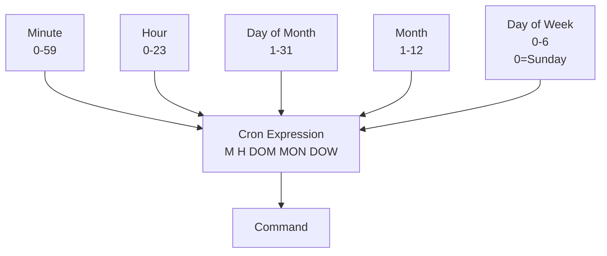

# Scheduling and Triggers

## Overview

Scheduling and triggering mechanisms automate job execution based on time (cron) or external events. Databricks supports cron-based scheduling, event-based triggers, and programmatic run submission.

## Cron Scheduling

### Cron Syntax Overview



### Cron Format: `minute hour day_of_month month day_of_week`

| Field | Range | Examples |
|-------|-------|----------|
| Minute | 0-59 | `0`, `15`, `*/15` |
| Hour | 0-23 | `0`, `2`, `9-17` |
| Day of Month | 1-31 | `1`, `15`, `*/2` |
| Month | 1-12 | `1`, `6-8`, `*` |
| Day of Week | 0-6 | `0=Sunday`, `5=Friday`, `1-5=Mon-Fri` |

### Cron Examples

```text
# Daily at 2 AM UTC

0 2 * * * ?

# Every 15 minutes

*/15 * * * * ?

# Monday-Friday at 9 AM

0 9 * * 1-5 ?

# Every hour at the top of the hour

0 * * * * ?

# First day of month at midnight

0 0 1 * * ?

# Every Sunday at 3 PM

0 15 * * 0 ?

# Weekdays (Mon-Fri) at 8 AM and 5 PM

0 8,17 * * 1-5 ?

# Every 6 hours

0 0,6,12,18 * * * ?
```

### Databricks Cron Format

Databricks uses Quartz Cron, which requires a seconds field:

```text
second minute hour day_of_month month day_of_week ?
```

### Common Databricks Cron Expressions

```json
{
  "schedule": {
    "quartz_cron_expression": "0 0 2 * * ?",
    "timezone_id": "America/Los_Angeles"
  }
}
```

| Frequency | Expression | Notes |
|-----------|-----------|-------|
| Every minute | `0 * * * * ?` | High frequency, not recommended |
| Every 5 minutes | `0 */5 * * * ?` | Mid frequency |
| Every hour | `0 0 * * * ?` | Hourly at :00 |
| Daily 2 AM UTC | `0 0 2 * * ?` | Single run per day |
| Business days 9 AM | `0 0 9 * * 1-5 ?` | Mon-Fri |
| Weekly Monday midnight | `0 0 0 * * 1 ?` | Once per week |
| Monthly 1st at midnight | `0 0 0 1 * ?` | Monthly schedule |

## Timezones

### Timezone Configuration

```json
{
  "schedule": {
    "quartz_cron_expression": "0 0 9 * * 1-5 ?",
    "timezone_id": "America/New_York"
  }
}
```

### Common Timezone IDs

| Timezone | Identifier |
|----------|-----------|
| UTC | `UTC` |
| US Eastern | `America/New_York` |
| US Central | `America/Chicago` |
| US Mountain | `America/Denver` |
| US Pacific | `America/Los_Angeles` |
| UK | `Europe/London` |
| Europe Central | `Europe/Berlin` |
| Asia Tokyo | `Asia/Tokyo` |
| Australia Sydney | `Australia/Sydney` |

## Scheduling Policies

### Max Concurrent Runs

Prevents multiple instances of the same job from running simultaneously:

```json
{
  "name": "daily_load",
  "max_concurrent_runs": 1,
  "schedule": {
    "quartz_cron_expression": "0 0 * * * ?"
  }
}
```

If a job runs longer than the schedule interval with `max_concurrent_runs: 1`:

- New scheduled runs are skipped
- No queue builds up
- Prevents cascading failures

### Timeout Behavior

```json
{
  "tasks": [
    {
      "timeout_seconds": 3600,  // 1 hour max
      "max_retries": 2
    }
  ]
}
```

When timeout exceeded:

1. Task is terminated
2. On-failure alerts sent
3. Retry logic triggered (if configured)
4. Overall job run marked as failed

## Event-Based Triggers

### Webhook Triggers

External systems trigger jobs via webhook:

```bash
# Example: Trigger job from CI/CD pipeline

curl -X POST \
  https://databricks-instance.cloud.databricks.com/api/2.1/jobs/run-now \
  -H "Authorization: Bearer <PAT>" \
  -d '{
    "job_id": 123,
    "notebook_params": {
      "environment": "prod",
      "version": "1.2.3"
    }
  }'
```

### File-Based Triggers

Monitor for new files in cloud storage:

```python
# Check for new files before running (in notebook before main logic)

import os
from datetime import datetime

wait_time = 0
timeout = 300  # 5 minutes

while not os.path.exists("/mnt/data/trigger_file.txt"):
    if wait_time > timeout:
        raise TimeoutError("Trigger file not found")

    dbutils.notebook.run("wait", 60)  # Wait 1 minute
    wait_time += 60

# Continue with main logic

```

### Object Storage Events (S3, ADLS)

```python

# Databricks can monitor object storage for trigger events
# Setup via Databricks Events API or UI

# When configured, jobs trigger when:
# - New files uploaded to S3/ADLS
# - Specific pattern matches (e.g., *.csv)
# - File size thresholds met

```

## Scheduling Patterns

### Pattern 1: Daily at Specific Time

```json
{
  "name": "daily_analytics",
  "schedule": {
    "quartz_cron_expression": "0 0 6 * * ?",
    "timezone_id": "America/New_York"
  }
}
```

Runs once daily at 6 AM Eastern Time.

### Pattern 2: Multiple Times Per Day

```json
{
  "name": "hourly_load",
  "schedule": {
    "quartz_cron_expression": "0 0 * * * ?"
  }
}
```

Runs every hour at :00.

### Pattern 3: Business Day at Business Hours

```json
{
  "name": "business_hours_refresh",
  "schedule": {
    "quartz_cron_expression": "0 0 9-17 * * 1-5 ?",
    "timezone_id": "America/Chicago"
  }
}
```

Runs every hour (9 AM - 5 PM) Monday-Friday.

### Pattern 4: Staggered Jobs (Avoid Conflicts)

```json
[
  {
    "name": "region_a_load",
    "schedule": {"quartz_cron_expression": "0 0 * * * ?"}
  },
  {
    "name": "region_b_load",
    "schedule": {"quartz_cron_expression": "0 10 * * * ?"}
  },
  {
    "name": "region_c_load",
    "schedule": {"quartz_cron_expression": "0 20 * * * ?"}
  }
]
```

Stagger regional loads to distribute compute load.

## Pause and Resume

### Pause Job from UI

In Workflows > Jobs:

1. Click job row
2. Click "Pause" button
3. No new runs scheduled

### Pause via API

```bash
curl -X POST \
  https://databricks-instance.cloud.databricks.com/api/2.1/jobs/pause \
  -H "Authorization: Bearer <PAT>" \
  -d '{"job_id": 123}'
```

### Resume via API

```bash
curl -X POST \
  https://databricks-instance.cloud.databricks.com/api/2.1/jobs/unpause \
  -H "Authorization: Bearer <PAT>" \
  -d '{"job_id": 123}'
```

## Manual Trigger

### One-Time Run

```bash
# Run job immediately (ignores schedule)

curl -X POST \
  https://databricks-instance.cloud.databricks.com/api/2.1/jobs/run-now \
  -H "Authorization: Bearer <PAT>" \
  -d '{"job_id": 123}'
```

### Run with Custom Parameters

```bash
curl -X POST \
  https://databricks-instance.cloud.databricks.com/api/2.1/jobs/run-now \
  -H "Authorization: Bearer <PAT>" \
  -d '{
    "job_id": 123,
    "notebook_params": {
      "date": "2025-01-20",
      "environment": "staging"
    }
  }'
```

## Scheduling Best Practices

### Avoid Peak Hours When Possible

```json
{
  "schedule": {
    "quartz_cron_expression": "0 0 2 * * ?",  // 2 AM
    "timezone_id": "UTC"
  }
}
```

Off-peak scheduling reduces contention with interactive users.

### Stagger Interdependent Jobs

```text
Job A: 0 0 * * * ?       // Top of every hour
Job B: 0 15 * * * ?      // 15 min past every hour
Job C: 0 30 * * * ?      // 30 min past every hour
```

### Set Appropriate Timeouts

```json
{
  "tasks": [
    {
      "timeout_seconds": 3600,  // 1 hour
      "max_retries": 2
    }
  ]
}
```

Prevents hanging jobs from consuming resources.

### Use Max Concurrent Runs for Safety

```json
{
  "max_concurrent_runs": 1
}
```

Prevents duplicate processing if previous run still running.

### Different Schedules for Environments

```json
[
  {
    "name": "daily_load_prod",
    "schedule": {"quartz_cron_expression": "0 0 2 * * ?"}
  },
  {
    "name": "daily_load_test",
    "schedule": {"quartz_cron_expression": "0 0 6 * * ?"}
  }
]
```

Separate schedules by environment prevent cross-environment issues.

## Daylight Saving Time Considerations

When DST changes occur:

- Jobs scheduled with `timezone_id` automatically adjust
- `UTC` timezone unaffected
- Check your scheduled time before/after DST transition
- Document timezone explicitly in job config

## Use Cases

- **Time-Based Batch Scheduling**: Running nightly ETL jobs at 2 AM via cron expressions to process the previous day's data before business users arrive, with timezone-aware scheduling for global teams.
- **Event-Driven Ingestion via File Arrival**: Triggering a job automatically when new files land in cloud storage (S3/ADLS), eliminating polling delays and processing data as soon as it becomes available.

## Common Issues & Errors

### Configuration Oversights

**Scenario:** The default settings for Scheduling and Triggers do not scale well with sudden spikes in data volume.
**Fix:** Explicitly define and tune the configuration parameters for Scheduling and Triggers to handle production-scale workloads.

### Cron Schedule Running at Wrong Time Due to Timezone

**Scenario:** A job scheduled for 2 AM local time runs at the wrong hour because the timezone was not explicitly set, defaulting to UTC.
**Fix:** Always set `timezone_id` explicitly in the schedule configuration (e.g., `"timezone_id": "America/New_York"`). Document the intended timezone in the job description for clarity.

### Overlapping Job Runs From File-Arrival Triggers

**Scenario:** A file-arrival trigger fires multiple times in rapid succession (e.g., batch of files landing simultaneously), causing duplicate or concurrent job runs that corrupt downstream tables.
**Fix:** Set `max_concurrent_runs = 1` in the job definition to prevent parallel execution. The overlapping trigger will be skipped, and data will be picked up on the next run.

## Exam Tips

- Databricks uses Quartz Cron (7 fields including seconds): `second minute hour day_of_month month day_of_week ?`
- Know common cron expressions: daily at 2 AM (`0 0 2 * * ?`), every hour (`0 0 * * * ?`), weekdays only (`0 0 9 * * 1-5 ?`)
- `max_concurrent_runs: 1` prevents duplicate processing when a job takes longer than the schedule interval
- Jobs scheduled with `timezone_id` automatically adjust for daylight saving time changes

## Key Takeaways

- **Cron Syntax**: `minute hour day month day_of_week`
- **Quartz Format**: Requires seconds field (7 fields)
- **Timezone**: Affects when cron fires (different regions)
- **Max Concurrent Runs**: Prevents duplicate execution
- **Timeout**: Maximum execution time per task
- **Pause/Resume**: Control scheduling without deleting job
- **Webhooks**: External systems trigger via API
- **Off-Peak**: Schedule during low-demand hours
- **Staggering**: Space jobs to avoid resource contention
- **Daylight Saving**: Automatic adjustment with timezone

## Related Topics

- [Databricks Jobs](./01-databricks-jobs.md)
- [Job Monitoring](./03-job-monitoring.md)

## Official Documentation

- [Schedule a Job](https://docs.databricks.com/en/workflows/jobs/schedule-jobs.html)
- [Trigger a Job](https://docs.databricks.com/en/workflows/jobs/trigger-jobs.html)

---

**[← Previous: Databricks Jobs](./01-databricks-jobs.md) | [↑ Back to Workflows and Orchestration](./README.md) | [Next: Job Monitoring](./03-job-monitoring.md) →**
