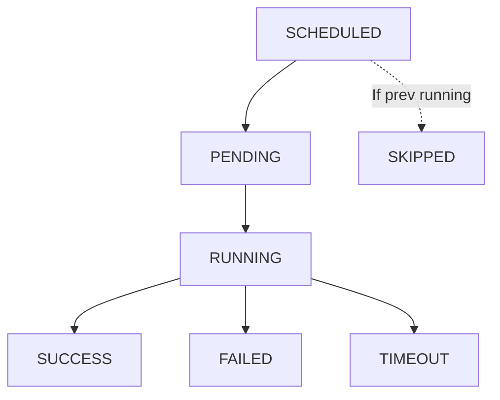

# Job Monitoring

## Overview

Effective monitoring and troubleshooting is critical for reliable data pipelines. Databricks provides comprehensive logging, run history, alerting, and performance metrics to diagnose and resolve issues.

## Job Run History

### Understanding Run Status



### Run Status Meanings

| Status | Meaning | Action |
|--------|---------|--------|
| `PENDING` | Waiting for cluster/resources | Wait or check cluster |
| `RUNNING` | Currently executing | Monitor logs |
| `SUCCESS` | Completed successfully | None |
| `FAILED` | Task execution failed | Check logs for errors |
| `TIMEOUT` | Exceeded timeout_seconds | Increase timeout or optimize |
| `SKIPPED` | Skipped due to max_runs limit | Previous run still executing |
| `INTERNAL_ERROR` | Databricks system error | Retry or contact support |

### Viewing Run History

```python
# Via Databricks CLI

databricks jobs list --job-id 123

# View specific run

databricks jobs get-run --run-id 456789

# List all runs for a job

databricks jobs list-runs --job-id 123 --limit 20

# Via Python API

import requests

response = requests.get(
    "https://databricks-instance.cloud.databricks.com/api/2.1/jobs/get-run",
    headers={"Authorization": f"Bearer {pat_token}"},
    params={"run_id": 456789}
)

run_details = response.json()
print(run_details["state"])  # SUCCESS/FAILED/etc
```

## Logs and Debugging

### Access Logs from UI

1. In Workflows > Jobs, select job
2. Click on run ID
3. View "Logs" tab
4. Search for errors (Ctrl+F)

### Log Levels in Notebooks

```python
# logging module in Python

import logging

logger = logging.getLogger(__name__)
logger.info("Processing started")
logger.warning("Found duplicate rows")
logger.error("Failed to connect to database")

# print statements (also logged)

print("INFO: Step 1 complete")
print("ERROR: Step 2 failed")
```

### SQL Query Logs

```sql
-- View query execution history (in SQL queries)
SELECT
    query_id,
    query_text,
    execution_time_ms,
    rows_produced
FROM system.query_history
WHERE execution_date > CURRENT_DATE - 1
ORDER BY execution_time_ms DESC
LIMIT 10
```

### Driver and Worker Logs

#### Driver Logs

- Contain job initialization, parameter setup
- Available in job run details
- Useful for understanding early failures

#### Worker Logs

- Task-specific logs from Spark workers
- Less accessible than driver logs
- Check for out-of-memory errors

### Common Log Patterns

```python

# Python job log patterns

# Successful start
# [INFO] Execution started

# Reading data
# [INFO] Reading from /mnt/data/input

# Processing status
# [INFO] Processing 1000000 rows
# [INFO] Completed transformation

# Write operation
# [INFO] Writing results to Delta table

# Success
# [INFO] Pipeline completed successfully

```

### Debugging Failed Jobs

```python

# Add debug output to notebook/script

from datetime import datetime

def debug_log(message):
    """Custom logging helper"""
    print(f"[{datetime.now().isoformat()}] {message}")

try:
    debug_log("Starting ETL")

    # Read data
    df = spark.read.delta("/mnt/data/raw")
    debug_log(f"Read {df.count()} rows")

    # Transform
    df_clean = df.filter(col("value") > 0)
    debug_log(f"After filter: {df_clean.count()} rows")

    # Write
    df_clean.write.format("delta").mode("overwrite").save("/mnt/data/clean")
    debug_log("Write complete")

except Exception as e:
    debug_log(f"ERROR: {str(e)}")
    raise
```

## Alerts and Notifications

### Email Alerts

```json
{
  "email_notifications": {
    "on_success": ["user@company.com"],
    "on_failure": ["user@company.com", "ops@company.com"]
  }
}
```

### Slack Integration

First, create Slack webhook in Databricks:

1. Admin Console > Integrations > Slack
2. Click "Add"
3. Authorize Databricks in Slack workspace
4. Copy webhook ID

Then configure job:

```json
{
  "webhook_notifications": {
    "on_failure": [
      {
        "id": "slack-webhook-xyz"
      }
    ],
    "on_success": [
      {
        "id": "slack-webhook-xyz"
      }
    ]
  }
}
```

### Custom Alerts via Notebooks

```python

# Send custom alert from notebook

import requests

def send_slack_alert(message, webhook_url):
    payload = {
        "text": message
    }
    requests.post(webhook_url, json=payload)

try:
    # Job logic
    df = spark.read.delta("/mnt/data/input")

    if df.count() == 0:
        send_slack_alert(
            "WARNING: Input data is empty!",
            os.environ.get("SLACK_WEBHOOK")
        )

except Exception as e:
    send_slack_alert(
        f"ALERT: Job failed - {str(e)}",
        os.environ.get("SLACK_WEBHOOK")
    )
    raise
```

## Performance Metrics

### Job Run Metrics

```python
# Access from API

import requests

response = requests.get(
    "https://databricks-instance.cloud.databricks.com/api/2.1/jobs/get-run",
    headers={"Authorization": f"Bearer {pat_token}"},
    params={"run_id": 123}
)

run_info = response.json()

print(f"State: {run_info['state']}")
print(f"State Message: {run_info['state_message']}")
print(f"Created Time: {run_info['start_time']}")
print(f"Run Duration: {run_info['end_time'] - run_info['start_time']} ms")

# Check task-specific metrics

for task in run_info['tasks']:
    print(f"Task {task['task_key']}: {task['state']}")
```

### Cluster Metrics

During job execution, monitor:

- **Driver CPU/Memory**: Main Spark driver
- **Worker CPU/Memory**: Task execution nodes
- **Shuffle Read/Write**: Data movement overhead
- **GC Time**: Garbage collection pauses

### Tracking Execution Time

```python
# Track within notebook

from datetime import datetime

start = datetime.now()

# ... execute tasks ...

end = datetime.now()
duration = (end - start).total_seconds()

print(f"Job executed in {duration:.2f} seconds")

# Log for monitoring

spark.createDataFrame([
    (duration, datetime.now())
], ["execution_seconds", "run_time"]
).write.mode("append").save("/mnt/metrics/job_duration")
```

## Troubleshooting Common Issues

### Issue 1: Timeout

**Error**: `TaskFailedReason: Task failed due to timeout`

**Causes**: Long-running query, insufficient cluster size, inefficient code

**Solutions**:

- Increase `timeout_seconds` in job config
- Optimize query with OPTIMIZE/Z-order
- Increase cluster worker count
- Add WHERE clause filters early

```json
{
  "timeout_seconds": 7200  // Increase from 3600
}
```

### Issue 2: Out of Memory

**Error**: `java.lang.OutOfMemoryError` or `PySpark MemoryError`

**Causes**: Large DataFrame in memory, no shuffle partitions

**Solutions**:

- Increase cluster worker count
- Add repartitioning
- Use streaming for large files
- Filter early in pipeline

```python
# Repartition to use more workers

df = (spark.read.delta("/mnt/data/large")
    .repartition(1000))  # Spread across workers
```

### Issue 3: Max Concurrent Runs Skipped

**Error**: Job scheduled but didn't run (status: SKIPPED)

**Cause**: Previous run still executing with `max_concurrent_runs: 1`

**Solutions**:

- Increase `timeout_seconds` to complete faster
- Optimize job code for speed
- Set `max_concurrent_runs: 2` if parallel safe

```json
{
  "max_concurrent_runs": 1,
  "timeout_seconds": 3600
}
```

### Issue 4: Cluster Launch Failure

**Error**: `Cluster failed to start` or `No worker nodes available`

**Causes**: Quota exceeded, instance type unavailable, subnet issues

**Solutions**:

- Check AWS/Azure/GCP quota
- Use different node type
- Check network/VPC configuration
- Retry after quota reset

### Issue 5: Data Quality Issues

**Error**: Job completes but data looks wrong

**Solutions**:

- Add data quality checks
- Log row counts at each stage
- Validate schema changes
- Check for duplicate processing

```python
# Add validation in notebook

row_count_before = spark.read.delta("/mnt/data/raw").count()
row_count_after = spark.read.delta("/mnt/data/clean").count()

if row_count_after == 0:
    raise ValueError("Output table is empty!")

if row_count_after > row_count_before * 2:
    raise ValueError("Output has suspiciously high row count!")

print(f"Validation passed: {row_count_after} rows processed")
```

## Monitoring Dashboard Pattern

```python

# Create metrics table to track job health over time

job_metrics = spark.createDataFrame([
    {
        "job_id": 123,
        "run_id": "run_abc",
        "status": "SUCCESS",
        "duration_seconds": 1234,
        "rows_processed": 1000000,
        "run_date": "2025-01-15"
    }
], schema="""
    job_id INT,
    run_id STRING,
    status STRING,
    duration_seconds INT,
    rows_processed INT,
    run_date DATE
""")

(job_metrics.write
    .format("delta")
    .mode("append")
    .save("/mnt/metrics/job_runs"))

# Analyze trends

spark.sql("""
SELECT
    DATE(run_date) as date,
    COUNT(*) as total_runs,
    COUNTIF(status = 'SUCCESS') as successful,
    COUNTIF(status = 'FAILED') as failed,
    AVG(duration_seconds) as avg_duration
FROM job_runs
WHERE job_id = 123
GROUP BY DATE(run_date)
ORDER BY date DESC
""").show()
```

## Audit and Compliance

### Track Who Ran What

```python
# Log execution metadata

from pyspark.sql.functions import lit, current_timestamp, current_user

spark.sql("""
SELECT
    current_user() as user,
    current_timestamp() as execution_time,
    'daily_pipeline' as job_name
""").write.mode("append").save("/mnt/audit/executions")
```

### Job Run API for Integration

```python
# Query job runs programmatically

response = requests.get(
    "https://databricks-instance.cloud.databricks.com/api/2.1/jobs/list-runs",
    headers={"Authorization": f"Bearer {pat_token}"},
    params={"job_id": 123, "limit": 50}
)

runs = response.json()["runs"]

for run in runs:
    print(f"Run {run['run_id']}: {run['state']} - {run['start_time']}")
```

## Use Cases

- **Proactive Pipeline Health Dashboards**: Logging job run metrics (duration, row counts, status) to a Delta table and building Databricks SQL dashboards to track pipeline health trends, SLA adherence, and failure rates over time.
- **Automated Alerting and Escalation**: Configuring email and Slack webhook notifications for job failures, with tiered escalation (e.g., task owner on first failure, on-call team after retry exhaustion) to ensure rapid incident response.

## Common Issues & Errors

### Configuration Oversights

**Scenario:** The default settings for Job Monitoring do not scale well with sudden spikes in data volume.
**Fix:** Explicitly define and tune the configuration parameters for Job Monitoring to handle production-scale workloads.

### Spark UI Not Loading for Completed Runs

**Scenario:** After a job cluster terminates, the Spark UI link in the job run page becomes inaccessible, making it impossible to debug performance issues from a past run.
**Fix:** Access the Spark UI link while the cluster is still running, or query system tables (`system.compute.clusters`, `system.billing.usage`) for historical metrics. Consider logging key performance counters (row counts, durations) within the notebook itself.

### Alert Fatigue From Noisy Failure Notifications

**Scenario:** Transient errors (e.g., spot instance preemption, brief network blips) trigger failure alerts on every retry attempt, flooding the on-call engineer's inbox with non-actionable notifications.
**Fix:** Configure task-level retries (`max_retries: 2-3`) and set email/webhook notifications to fire only on the final failure after all retries are exhausted, not on each individual attempt.

## Exam Tips

- Know the job run statuses: PENDING, RUNNING, SUCCESS, FAILED, TIMEOUT, SKIPPED -- and what causes each
- SKIPPED status means a previous run was still executing and `max_concurrent_runs` prevented a new one
- Email notifications support `on_success` and `on_failure` -- configure both for production pipelines
- OOM errors are resolved by increasing cluster size, adding workers, or repartitioning data

## Key Takeaways

- **Run Status**: PENDING, RUNNING, SUCCESS, FAILED, TIMEOUT, SKIPPED
- **Logs**: Access via UI or API; contain execution details
- **Email Alerts**: on_success/on_failure notifications
- **Slack Integration**: Webhook-based alerting
- **Performance Metrics**: Duration, CPU, memory, shuffle I/O
- **Timeout**: Task execution time limit
- **Max Concurrent Runs**: Prevents duplicate execution
- **OOM Errors**: Increase cluster size or repartition
- **Skipped Runs**: Previous run still executing
- **Audit Trail**: Track user, time, status via metrics tables

## Related Topics

- [Databricks Jobs](./01-databricks-jobs.md)
- [Scheduling and Triggers](./02-scheduling-triggers.md)
- [Spark UI Debugging (DE Professional)](../../data-engineer-professional/05-monitoring-logging/02-spark-ui-debugging.md)

## Official Documentation

- [Monitor Job Runs](https://docs.databricks.com/en/workflows/jobs/monitor-job-runs.html)
- [Job Run Notifications](https://docs.databricks.com/en/workflows/jobs/notifications.html)

---

**[← Previous: Scheduling and Triggers](./02-scheduling-triggers.md) | [↑ Back to Workflows and Orchestration](./README.md)**
