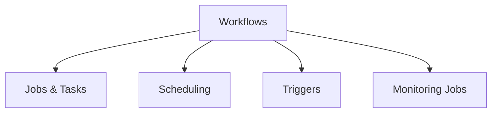

# Workflows and Orchestration (16% of Exam)

Building production data pipelines with jobs and workflow orchestration.

## Topics Overview

## Section Contents

| File | Topic | Priority |
| :--- | :--- | :--- |
| [01-databricks-jobs.md](01-databricks-jobs.md) | Job creation, task types, execution | High |
| [02-scheduling-triggers.md](02-scheduling-triggers.md) | Scheduling policies, cron schedules, triggers | High |
| [03-job-monitoring.md](03-job-monitoring.md) | Job runs, alerts, logging, troubleshooting | Medium |

## Key Concepts

- **Jobs**: Reusable orchestration units for data pipelines
- **Tasks**: Individual work units within a job
- **Triggers**: Conditions that initiate job runs
- **Monitoring**: Tracking job health and performance

## Related Resources

- [Workflows Documentation](../../../shared/fundamentals/databricks-workspace.md)

## Next Steps

Understand [05-Data Governance](../05-data-governance/README.md) for securing your pipelines.

---

**[← Back to Certification](../README.md)**
