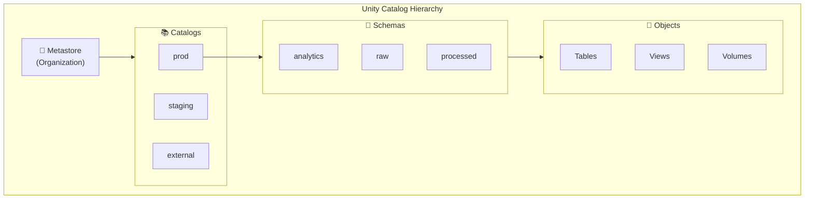

# Unity Catalog Basics

## Overview

Unity Catalog (UC) is Databricks' centralized metadata and access control solution that provides a single place to govern data across the entire Databricks platform. It addresses data governance challenges like scattered metadata, inconsistent access control, and lack of audit trails.

## Unity Catalog Architecture



## Metastore

A **Metastore** is the root container for Unity Catalog within a Databricks region. It's created per region and contains:

- All catalogs, schemas, and objects
- Access control policies
- Audit logs
- Lineage information

### Metastore Setup

```python

# Workspace must be enabled for UC (admin task)
# Check current metastore

spark.sql("SELECT * FROM system.information_schema.metastores").show()

# Each region has ONE metastore:
# us-east-1: One metastore
# eu-west-1: One metastore (separate)
# us-west-2: One metastore (separate)

```

## Three-Level Namespace

Unity Catalog uses a **three-level namespace**: `catalog.schema.object`

### Structure

```text
metastore/
├── prod/                          (Catalog)
│   ├── analytics/                 (Schema)
│   │   ├── orders                 (Table)
│   │   ├── customers              (Table)
│   │   └── revenue_metrics        (View)
│   └── raw/                       (Schema)
│       ├── events                 (Table)
│       └── clickstream            (Table)
├── staging/                       (Catalog)
│   └── experimental/              (Schema)
│       └── test_data              (Table)
└── external/                      (Catalog)
    └── partner_data/              (Schema)
        └── partner_a_forecast     (Table)
```

### Fully Qualified Names

```sql
-- With Unity Catalog
SELECT * FROM prod.analytics.orders;
SELECT * FROM staging.experimental.test_data;
SELECT * FROM external.partner_data.partner_a_forecast;

-- No ambiguity (must specify all 3 levels inside UC warehouse)
-- Hive metastore (legacy) used 2-level: schema.table
```

## Creating Catalogs and Schemas

### Create Catalog

```sql
CREATE CATALOG prod
COMMENT "Production data catalog";

CREATE CATALOG staging
COMMENT "Staging and test data";

CREATE CATALOG external
COMMENT "External partner data";
```

```python
# Via Python

spark.sql("CREATE CATALOG IF NOT EXISTS prod COMMENT 'Production catalog'")
```

### Create Schema

```sql
CREATE SCHEMA IF NOT EXISTS prod.analytics
COMMENT "Analytics datasets";

CREATE SCHEMA IF NOT EXISTS prod.raw
COMMENT "Raw data ingestion layer";

CREATE SCHEMA IF NOT EXISTS staging.experimental
COMMENT "Experimental datasets";
```

### Listing Catalogs and Schemas

```sql
-- List all catalogs
SHOW CATALOGS;

-- List schemas in a catalog
SHOW SCHEMAS IN prod;

-- Show details
DESCRIBE CATALOG prod;
DESCRIBE SCHEMA prod.analytics;
```

## Objects in Unity Catalog

### Managed Tables (UC)

```sql
-- Create managed table in UC
CREATE TABLE prod.analytics.orders (
    order_id INT,
    customer_id INT,
    amount DECIMAL(10, 2),
    order_date DATE
)
USING DELTA;

-- Data stored in UC managed location
-- Databricks fully manages lifecycle and access
```

### External Tables (UC)

```sql
-- Create external table pointing to cloud storage
CREATE TABLE external.partner_data.forecasts (
    forecast_id INT,
    product_id INT,
    predicted_sales DECIMAL(10, 2)
)
USING DELTA
LOCATION 's3://partner-bucket/forecasts/';

-- Data lives in partner bucket
-- UC provides metadata and access control
```

### Views

```sql
-- Create view in UC
CREATE VIEW prod.analytics.high_value_orders AS
SELECT
    order_id,
    customer_id,
    amount
FROM prod.analytics.orders
WHERE amount > 10000;

-- Views are stored in UC
-- Can be secured independently
```

### Volumes

Volumes are designated storage locations for files (documents, images, code):

```sql
-- Create volume
CREATE VOLUME IF NOT EXISTS prod.analytics.documents;

-- Write file to volume
DBFS:
/Volumes/prod/analytics/documents/report_2025.pdf

-- Read from volume
dbutils.fs.ls("/Volumes/prod/analytics/documents/")
```

## External Locations

External Locations point to cloud storage and define UC's access boundaries:

```sql
-- Admin: Create external location
CREATE EXTERNAL LOCATION s3_partner_data
URL 's3://partner-bucket/data/'
WITH (CREDENTIAL 'aws-role-arn-123');

-- Create UC table using external location
CREATE TABLE external.partner_data.sales
USING DELTA
LOCATION EXTERNAL LOCATION s3_partner_data;
```

## UC vs Hive Metastore

| Feature | Unity Catalog | Hive Metastore |
|---------|---|---|
| **Namespace** | 3-level (catalog.schema.table) | 2-level (schema.table) |
| **Access Control** | Granular permissions per object | Limited, workspace-level |
| **Audit Logs** | Complete lineage and access trail | Limited audit |
| **External Data** | UC catalog external locations | Unmanaged, scattered |
| **Multi-cloud** | Single metastore across regions | Per-workspace metastore |
| **Cross-org** | Delta Sharing for sharing | Manual exports |

### Migration Path

```text
Hive Metastore → Unity Catalog
Legacy approach → Modern governance
Limited security → Fine-grained control
Scattered data → Centralized discovery
```

## Creating Tables in UC

### From Data

```python
# Create UC table from DataFrame

df = spark.read.csv("/mnt/landing/data.csv", header=True)

(df.write
    .format("delta")
    .mode("overwrite")
    .saveAsTable("prod.raw.incoming_data"))

# Verify in UC

spark.sql("SHOW TABLES IN prod.raw;").show()
```

### SQL CREATE TABLE

```sql
-- Create managed table
CREATE TABLE prod.analytics.transactions (
    transaction_id INT,
    date DATE,
    amount DECIMAL(10, 2)
)
USING DELTA
PARTITIONED BY (date);

-- Create from query
CREATE TABLE prod.analytics.daily_summary AS
SELECT
    DATE(date) as date,
    COUNT(*) as transaction_count,
    SUM(amount) as total_amount
FROM prod.analytics.transactions
GROUP BY DATE(date);

-- Create external table
CREATE TABLE external.data.raw_events
USING DELTA
LOCATION 'abfss://raw@storageacct.dfs.core.windows.net/events/';
```

## Workspace Settings with UC

### Enable UC for Workspace

```python

# Admin: Enable UC on workspace (one-time)
# Settings > Catalog > Enable Unity Catalog

# Set default catalog for sessions

spark.sql("SET CATALOG prod")

# Now queries default to prod catalog

spark.sql("SELECT * FROM analytics.orders")  # Same as prod.analytics.orders
```

### Catalog Navigation

```sql
-- Set search path
SET CATALOG prod;
SET SCHEMA analytics;

-- Now can reference table directly
SELECT * FROM orders;  -- Same as prod.analytics.orders
```

## Naming and Convention

### Naming Best Practices

```text
Catalogs: lowercase, descriptive
- prod, staging, external, archive

Schemas: lowercase, functional area
- raw, analytics, reporting, temp, ml

Tables: lowercase, snake_case
- customer_transactions, order_status, inventory_levels

Columns: lowercase, snake_case, no spaces
- customer_id, order_date, amount_usd

Views: descriptive, prefixed with v_
- v_high_value_customers, v_monthly_revenue
```

### Catalog Organization Patterns

```text
Pattern 1: By Environment
├── prod/          (Production data)
├── staging/       (Test environment)
└── dev/           (Development)

Pattern 2: By Data Zone
├── raw/           (Bronze - ingested)
├── processed/     (Silver - cleaned)
└── analytics/     (Gold - ready for BI/ML)

Pattern 3: By Source
├── crm/           (Salesforce data)
├── erp/           (SAP data)
├── external/      (Partner data)
└── derived/       (Computed tables)
```

## UC Objects and Types

### Supported Objects

```sql
-- Tables (managed and external)
CREATE TABLE catalog.schema.table_name ...

-- Views
CREATE VIEW catalog.schema.view_name AS ...

-- Volumes (file storage)
CREATE VOLUME catalog.schema.volume_name

-- Connection (for external systems)
CREATE CONNECTION connection_name

-- Storage credentials
CREATE STORAGE CREDENTIAL aws_credentials

-- External locations
CREATE EXTERNAL LOCATION location_name

-- Metastore assignments
CREATE METASTORE ASSIGNMENT catalog_name
```

## Use Cases

- **Centralized Multi-Environment Governance**: Organizing data into separate catalogs (`prod`, `staging`, `dev`) so that access controls, lineage tracking, and audit logging apply consistently across all environments from a single metastore.
- **Cross-Team Data Discovery**: Enabling analysts and data scientists to browse the three-level namespace (`catalog.schema.table`) to discover and request access to datasets without needing direct knowledge of storage locations or file paths.

## Common Issues & Errors

### Configuration Oversights

**Scenario:** The default settings for Unity Catalog Basics do not scale well with sudden spikes in data volume.
**Fix:** Explicitly define and tune the configuration parameters for Unity Catalog Basics to handle production-scale workloads.

### INSUFFICIENT_PERMISSIONS When Querying Across Catalogs

**Scenario:** A user receives `INSUFFICIENT_PERMISSIONS` when running `SELECT * FROM other_catalog.schema.table` even though they have `SELECT` on the table.
**Fix:** Verify that the user also has `USE CATALOG` on the target catalog and `USE SCHEMA` on the target schema. All three privileges (`USE CATALOG` + `USE SCHEMA` + `SELECT`) are required to query a table.

### Metastore Not Attached to Workspace

**Scenario:** Unity Catalog objects are not visible in the workspace, and `SHOW CATALOGS` returns empty results or an error because no metastore is attached.
**Fix:** A workspace admin or account admin must attach the Unity Catalog metastore to the workspace via the account console. Each workspace must be explicitly associated with a regional metastore.

## Exam Tips

- The three-level namespace is `catalog.schema.object` -- be able to write fully qualified table references like `prod.analytics.orders`
- One metastore per region per organization; metastore is the root container for all UC objects
- Know the difference between managed tables (UC manages storage) and external tables (data in external location with UC access control)
- Volumes store non-tabular files (PDFs, images, code) and are accessed via `/Volumes/catalog/schema/volume_name/`

## Key Takeaways

- **Unity Catalog**: Centralized governance across Databricks platform
- **Metastore**: Root container (per region, per organization)
- **Catalog**: Top-level organizational container
- **Schema**: Groups related objects
- **Three-level namespace**: `catalog.schema.object`
- **Managed Tables**: UC manages storage and lifecycle
- **External Tables**: UC provides access control, data in external storage
- **Volumes**: Designated storage for files, documents, artifacts
- **External Locations**: Cloud storage paths with credential binding
- **UC vs Hive**: UC is modern, fine-grained access control

## Related Topics

- [Access Control and Permissions](./02-access-control-permissions.md)
- [Data Sharing](./03-data-sharing.md)
- [Unity Catalog Basics (Shared)](../../../shared/fundamentals/unity-catalog-basics.md)

## Official Documentation

- [Unity Catalog Overview](https://docs.databricks.com/en/data-governance/unity-catalog/index.html)
- [Create and Manage Catalogs](https://docs.databricks.com/en/catalogs/index.html)

---

**[↑ Back to Data Governance](./README.md) | [Next: Access Control and Permissions](./02-access-control-permissions.md) →**
