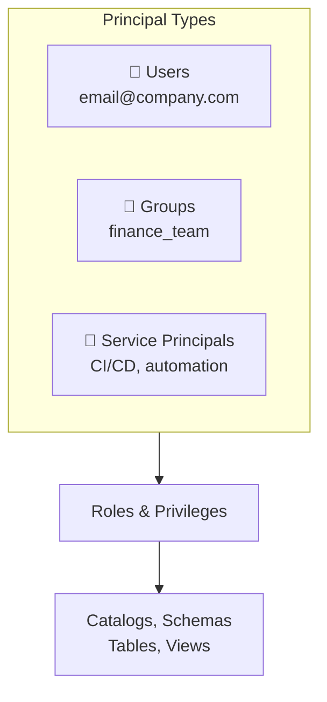
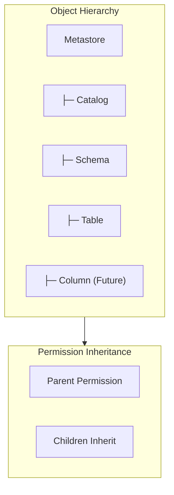

# Access Control and Permissions

## Overview

Access Control and Permissions in Unity Catalog provide fine-grained control over who can access what data. The privilege model is role-based and hierarchical, allowing delegation of access management throughout the organization.

## Principals: Users, Groups, and Service Principals



### Users

Individual accounts with email-based identity:

```python
# Grant permission to user

spark.sql("GRANT SELECT ON prod.analytics.orders TO `user@company.com`")

# Grant multiple privileges

spark.sql("""
GRANT SELECT, MODIFY
ON prod.analytics.orders
TO `user@company.com`
""")
```

### Groups

Collection of users for easier management:

```python

# Create group (admin task)
# Admin Console > Groups > Create Group

# Add users to group
# Admin Console > Groups > group_name > Add members

# Grant to group (applies to all members)

spark.sql("GRANT SELECT ON prod.analytics.orders TO finance_team")

# When user joins group, automatically receives access

```

### Service Principals

Machine accounts for applications, CI/CD, automation:

```python

# Create service principal (admin task)
# Admin Console > Service Principals > Create Service Principal

# Generate personal access token
# Service principal name: my-etl-app-abc123

# Grant permissions

spark.sql("GRANT SELECT, MODIFY ON prod.analytics.orders TO `my-etl-app-abc123`")

# Use in job configuration

{
    "service_credential_service_principal_id": "my-etl-app-abc123"
}
```

## Privilege Hierarchy



Permissions **cascade downward**:

- Grant on Catalog → applies to all Schemas, Tables in that Catalog
- Grant on Schema → applies to all Tables in that Schema
- Grant on Table → applies only to that Table

## Available Privileges

### Catalog Privileges

| Privilege | Allows |
|-----------|--------|
| `USAGE` | Browse catalog, see schemas |
| `CREATE_SCHEMA` | Create new schemas in catalog |
| `CREATE_EXTERNAL_LOCATION` | Create external locations |

### Schema Privileges

| Privilege | Allows |
|-----------|--------|
| `USAGE` | Browse schema, see tables |
| `CREATE_TABLE` | Create new tables in schema |
| `CREATE_VIEW` | Create new views in schema |
| `CREATE_VOLUME` | Create volumes in schema |

### Table Privileges

| Privilege | Allows |
|-----------|--------|
| `SELECT` | Read data from table |
| `MODIFY` | INSERT, UPDATE, DELETE |
| `READ_METADATA` | See table schema, but not data |
| `ALL_PRIVILEGES` | All permissions on table |

### View Privileges

| Privilege | Allows |
|-----------|--------|
| `SELECT` | Query the view |
| `READ_METADATA` | See view definition |

## GRANT and REVOKE

### GRANT Syntax

```sql
-- Grant to user
GRANT SELECT ON prod.analytics.orders TO `user@company.com`;

-- Grant to group
GRANT SELECT, MODIFY ON prod.analytics.orders TO finance_team;

-- Grant to service principal
GRANT SELECT ON prod.raw.transactions TO `my-etl-app-abc123`;

-- Grant on entire schema
GRANT USAGE, CREATE_TABLE ON prod.analytics TO analytics_team;

-- Grant on catalog
GRANT USAGE ON prod TO all_users;
```

### REVOKE Syntax

```sql
-- Revoke single privilege
REVOKE SELECT ON prod.analytics.orders FROM `user@company.com`;

-- Revoke multiple privileges
REVOKE SELECT, MODIFY
ON prod.analytics.orders
FROM `user@company.com`;

-- Revoke from group
REVOKE SELECT ON prod.analytics.orders FROM finance_team;

-- Revoke all privileges
REVOKE ALL PRIVILEGES ON prod.analytics.orders FROM `user@company.com`;
```

## Role-Based Access Control (RBAC)

Databricks doesn't have predefined roles like "Analyst" or "Engineer". Instead, grants are managed by:

1. **Direct Assignment**: Grant privileges directly to users
2. **Group-Based**: Grant to groups, users inherit via membership
3. **Bulk Operations**: Use scripts to manage permissions

### Recommended Pattern: Groups

```sql
-- Create groups for functional roles
-- + finance_team (analysts, controllers)
-- + data_engineers
-- + ml_engineers
-- + BI_developers

-- Create schemas for functional access
-- + prod.finance
-- + prod.analytics
-- + prod.ml
-- + prod.reporting

-- Grant permissions to groups
GRANT USAGE ON prod TO finance_team;
GRANT USAGE, CREATE_TABLE ON prod.finance TO finance_team;
GRANT SELECT ON prod.analytics TO finance_team;

-- Individual users join groups
-- Automatically receive all group permissions
```

## Best Practices for Access Control

### Principle of Least Privilege

Grant only necessary permissions:

```sql
-- Good: Minimal permissions
GRANT SELECT ON prod.analytics.public_sales TO junior_analyst;

-- Bad: Over-permissive
GRANT ALL PRIVILEGES ON prod TO junior_analyst;
```

### Use Groups for Scalability

```sql
-- Instead of granting to each user...
GRANT SELECT ON prod.analytics.orders TO `alice@company.com`;
GRANT SELECT ON prod.analytics.orders TO `bob@company.com`;
GRANT SELECT ON prod.analytics.orders TO `charlie@company.com`;

-- Grant to group
GRANT SELECT ON prod.analytics.orders TO analytics_team;

-- Users join/leave group, permissions automatic
```

### Organize by Schema for Security

```text
prod/
├── finance/          (Finance-sensitive data)
├── analytics/        (Open analytics)
├── hr/               (HR-sensitive)
└── raw/              (Restricted raw data)

-- Data engineers: access raw
-- Analysts: access analytics
-- Finance team: access finance
```

### Separate Environments

```text
-- Production (strict access)
prod/analytics/        SELECT only
prod/raw/              READ_METADATA only (Engineers with MODIFY)

-- Staging (more permissive)
staging/analytics/     SELECT, CREATE_TABLE
staging/experimental/  ALL_PRIVILEGES (test freely)
```

## Viewing Current Permissions

### Show Grants

```sql
-- Who has permissions on a table?
SHOW GRANT ON TABLE prod.analytics.orders;

-- What permissions does a principal have? (admin only)
SHOW GRANT TO `user@company.com`;
SHOW GRANT TO finance_team;
```

### Querying Permissions Programmatically

```python
# Get table permissions

grants_df = spark.sql("SHOW GRANT ON TABLE prod.analytics.orders")
grants_df.show()

# Output:
# principal | privileges | principal_type
# finance_team | SELECT | GROUP
# data_engineers | SELECT, MODIFY | GROUP
# user@company.com | SELECT | USER

```

## Column-Level Access Control (Future)

Unity Catalog is planning column-level access:

```sql
-- Planned future capability
GRANT SELECT(order_id, amount) ON prod.analytics.orders TO junior_analyst;

-- Restrictions:
GRANT SELECT(credit_card_number) ON prod.analytics.orders TO fraud_team;
```

## Dynamic Views for Access Control

Until column-level UC is available, use views to restrict columns:

```sql
-- Create public view (subset of columns)
CREATE VIEW prod.analytics.v_orders_public AS
SELECT
    order_id,
    customer_id,
    amount,
    order_date
FROM prod.analytics.orders;

-- Create sensitive view (with sensitive columns)
CREATE VIEW prod.analytics.v_orders_sensitive AS
SELECT
    order_id,
    customer_id,
    amount,
    order_date,
    credit_card_number,  -- Sensitive
    customer_address      -- Sensitive
FROM prod.analytics.orders;

-- Grant accordingly
GRANT SELECT ON prod.analytics.v_orders_public TO all_users;
GRANT SELECT ON prod.analytics.v_orders_sensitive TO finance_team;
```

## Service Principal for Automation

### Create Service Principal for CI/CD

```python

# Admin creates service principal
# Admin Console > Service Principals > Create

# Generate personal access token
# Service Principal Details > Generate Token
# Token: dapi...

# Grant permissions

spark.sql("""
GRANT SELECT, MODIFY
ON prod.analytics.orders
TO `my-ci-app-xyz123`
""")

# Use in job configuration

job_config = {
    "service_credential_service_principal_id": "my-ci-app-xyz123",
    "tasks": [...]
}
```

## Default Catalog and Schema

### Set for User/Group

```sql
-- Set default catalog for workspace
ALTER WORKSPACE CATALOG_SETTING FOR `user@company.com` SET TO prod;

-- Users' queries default to:
SELECT * FROM analytics.orders;  -- Resolves to prod.analytics.orders
```

## Audit and Compliance

### Access Audit Logs (Admin)

```sql
-- View who accessed what (availability varies)
SELECT
    user_identity.email as user_email,
    action_name,
    resource_name,
    timestamp
FROM system.access.audit
WHERE resource_type = 'TABLE'
    AND action_name IN ('SELECT', 'MODIFY')
ORDER BY timestamp DESC
```

### Track Permission Changes

```sql
-- Who made permission changes?
-- Admin Console > Audit Logs
-- Filter by action: "GRANT", "REVOKE"
```

## Permission Scenarios

### Scenario 1: Analyst Access

```sql
-- Create schema for analytics
CREATE SCHEMA prod.analytics;

-- Create table
CREATE TABLE prod.analytics.revenue_v2025 AS
SELECT * FROM prod.raw.transactions WHERE YEAR(date) = 2025;

-- Grant to analyst group
GRANT USAGE ON prod TO analysts;
GRANT USAGE ON prod.analytics TO analysts;
GRANT SELECT ON prod.analytics.revenue_v2025 TO analysts;
```

### Scenario 2: Data Engineer

```sql
-- Data engineers need broader access
GRANT USAGE, CREATE_TABLE, CREATE_VIEW ON prod TO data_engineers;
GRANT USAGE, CREATE_TABLE, CREATE_VIEW ON prod.raw TO data_engineers;
GRANT USAGE, CREATE_TABLE, CREATE_VIEW ON prod.analytics TO data_engineers;

-- But restrict sensitive schemas
REVOKE ALL PRIVILEGES ON prod.finance FROM data_engineers;
```

### Scenario 3: External Partner

```sql
-- Via Delta Sharing (separate mechanism)
-- Create share with specific tables
CREATE SHARE partner_data_2025;

ADD TABLE prod.analytics.public_data TO SHARE partner_data_2025;

-- Grant share access to recipient
-- Recipient gets read-only access via Share
```

## Use Cases

- **Group-Based Access Management**: Assigning permissions to groups (e.g., `finance_team`, `data_engineers`) instead of individual users, so that access is automatically granted or revoked when team members join or leave.
- **Column-Level Security via Dynamic Views**: Creating views that expose only non-sensitive columns and granting `SELECT` on the view to restricted users, effectively implementing column-level security before native UC column masking is available.

## Common Issues & Errors

### Configuration Oversights

**Scenario:** The default settings for Access Control and Permissions do not scale well with sudden spikes in data volume.
**Fix:** Explicitly define and tune the configuration parameters for Access Control and Permissions to handle production-scale workloads.

### GRANT Succeeds But User Still Cannot Access Data

**Scenario:** An admin runs `GRANT SELECT ON table TO user` and it succeeds, but the user still receives `INSUFFICIENT_PERMISSIONS` when querying the table.
**Fix:** Permissions require `USE CATALOG` and `USE SCHEMA` on parent objects in addition to `SELECT` on the table. Grants on a child object do not automatically grant traversal permissions on the parent catalog and schema.

### DENY Not Supported in Unity Catalog

**Scenario:** An admin tries to run `DENY SELECT ON table TO user` to explicitly block access, but receives a syntax error because `DENY` is not a valid statement in Unity Catalog.
**Fix:** Unity Catalog uses an allow-only permission model. To remove access, use `REVOKE` to remove the previously granted privilege instead of attempting to deny it.

## Exam Tips

- Permissions cascade downward: granting on a catalog applies to all schemas and tables within it
- `USAGE` is required on both the catalog and schema before `SELECT` on a table works
- Know the three principal types: Users (individuals), Groups (collections of users), Service Principals (automation/CI/CD)
- Dynamic views are the current approach for column-level security -- create a view that excludes sensitive columns and grant `SELECT` on the view

## Key Takeaways

- **Principals**: Users, Groups, Service Principals
- **Hierarchy**: Permissions cascade from parent to child objects
- **GRANT**: Add privileges to principal
- **REVOKE**: Remove privileges from principal
- **Usage**: Catalog/Schema permission to browse/reference
- **SELECT**: Read data from table
- **MODIFY**: INSERT, UPDATE, DELETE on table
- **Least Privilege**: Grant minimum necessary permissions
- **Groups**: Scales access management
- **Service Principal**: Machine account for automation
- **Dynamic Views**: Implement column-level security before UC supports it

## Related Topics

- [Unity Catalog Basics](./01-unity-catalog-basics.md)
- [Data Sharing](./03-data-sharing.md)
- [Unity Catalog Quick Reference](../../../shared/cheat-sheets/unity-catalog-quick-ref.md)

## Official Documentation

- [Manage Privileges in Unity Catalog](https://docs.databricks.com/en/data-governance/unity-catalog/manage-privileges/index.html)
- [Unity Catalog Best Practices](https://docs.databricks.com/en/data-governance/unity-catalog/best-practices.html)

---

**[← Previous: Unity Catalog Basics](./01-unity-catalog-basics.md) | [↑ Back to Data Governance](./README.md) | [Next: Data Sharing](./03-data-sharing.md) →**
