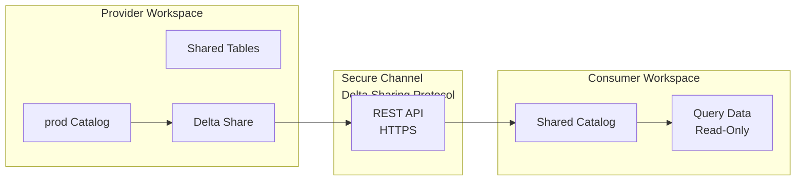

# Data Sharing

## Overview

Delta Sharing is a secure, open protocol for sharing data across organizations without copying data or managing credentials. It enables data providers to share live, curated data with consumers inside and outside their organization.

## Delta Sharing Architecture



## Delta Sharing Protocol

Delta Sharing is an **open protocol** that:

- Doesn't require data copying
- Provides read-only access
- Uses REST APIs
- Supports fine-grained access control
- Works across cloud providers and Databricks tiers

## Key Advantages

| Aspect | Traditional Export | Delta Sharing |
|--------|---|---|
| **Data Copy** | Full copy (storage cost, latency) | Live reference, no copy |
| **Access Control** | Single all-or-nothing file | Row/table-level granularity |
| **Freshness** | Stale data (snapshot) | Live, always current |
| **Audit Trail** | Limited tracking | Complete access logs |
| **Scalability** | Manual, error-prone | Automated, self-service |
| **Credentials** | Share creds (security risk) | No credential sharing |

## Creating Shares (Provider)

### Step 1: Create Share

```sql
-- Create share in provider workspace
CREATE SHARE sales_data_2025
COMMENT "Q1-Q4 2025 sales data for marketing team";

-- Check share exists
SHOW SHARES;
```

```python
# Via Python

spark.sql("CREATE SHARE sales_data_2025")
```

### Step 2: Add Tables to Share

```sql
-- Add tables (provider controls what's shared)
ADD TABLE prod.analytics.orders TO SHARE sales_data_2025;
ADD TABLE prod.analytics.customers TO SHARE sales_data_2025;
ADD TABLE prod.analytics.revenue TO SHARE sales_data_2025;

-- Verify
SHOW ALL IN SHARE sales_data_2025;
```

### Step 3: Create Recipients

Recipients are identities that can access shares:

```sql
-- Create recipient for internal team
CREATE RECIPIENT etl_team
COMMENT "Internal ETL team";

-- Create recipient for external partner (email-based)
CREATE RECIPIENT partner_company
COMMENT "External partner access"
USING EMAIL
VALUE partner.contact@externalcompany.com;
```

### Step 4: Grant Share Access to Recipient

```sql
-- Grant share access to recipient
GRANT ALL PRIVILEGES ON SHARE sales_data_2025 TO etl_team;

-- Or specific privileges (limited, usually ALL)
GRANT SELECT ON SHARE sales_data_2025 TO etl_team;
```

## Accepting Shares (Consumer)

### Receiving a Share

When provider grants share access:

1. Consumer receives notification
2. Consumer accepts the share
3. Consumer can query shared data

### Create Catalog from Share

```sql
-- Create read-only catalog from shared data
CREATE CATALOG shared_data
USING SHARE sales_data_2025;

-- Verify
SHOW CATALOGS;
```

### Query Shared Data

```sql
-- Once catalog created, query shared tables
SELECT * FROM shared_data.analytics.orders LIMIT 10;

-- Join shared data with local data
SELECT
    o.order_id,
    o.amount,
    l.inventory
FROM shared_data.analytics.orders o
LEFT JOIN local.warehouse.inventory l
    ON o.product_id = l.product_id;
```

## Access Control Within Shares

### Restrict Tables in Share

```sql
-- Provider: Control which tables consumers see
-- Instead of sharing entire schema, share specific tables

ADD TABLE prod.analytics.public_orders TO SHARE public_data;

-- Don't add sensitive tables
-- DO NOT ADD prod.analytics.sensitive_employee_info
```

### Row-Level Filtering

Currently not supported in Delta Sharing, but can use views:

```sql
-- Provider: Create filtered view
CREATE VIEW prod.analytics.v_orders_by_region AS
SELECT
    order_id,
    region,
    amount
FROM prod.analytics.orders
WHERE region != 'North America';  -- Hide N.A. data

-- Add view to share
ADD VIEW prod.analytics.v_orders_by_region TO SHARE partner_data;

-- Consumer sees only filtered rows
```

### Column Filtering (with View)

```sql
-- Provider: Create view with specific columns
CREATE VIEW prod.analytics.v_orders_public AS
SELECT
    order_id,
    customer_id,
    amount,
    order_date
FROM prod.analytics.orders;

-- Don't include sensitive columns:
-- credit_card_number, customer_address, etc.

-- Add to share
ADD VIEW prod.analytics.v_orders_public TO SHARE public_data;
```

## Managing Shares

### List Shares

```sql
-- Provider: List all shares they created
SHOW SHARES;

-- Consumer: List shares they subscribed to
SHOW SUBSCRIPTIONS;
```

### Show Share Details

```sql
-- Provider: See what's in share
SHOW ALL IN SHARE sales_data_2025;

-- Consumer: See shared objects available
SHOW ALL IN SHARE sales_data_2025;
```

### Update Share Contents

```sql
-- Add new table to existing share
ALTER SHARE sales_data_2025 ADD TABLE prod.analytics.new_metrics;

-- Remove table from share
ALTER SHARE sales_data_2025 REMOVE TABLE prod.analytics.old_data;

-- Changes immediately visible to consumers
```

### Revoke Share Access

```sql
-- Provider: Remove share from recipient
REVOKE ALL PRIVILEGES ON SHARE sales_data_2025 FROM partner_company;

-- Consumer immediately loses access
```

## Recipient Management

### Create Internal Recipient (One Workspace)

```sql
-- Grant share to internal workspace/team
CREATE RECIPIENT internal_warehouse
COMMENT "Internal BI warehouse";

-- Enable share
GRANT ALL PRIVILEGES ON SHARE sales_data TO internal_warehouse;
```

### Create External Recipient (Email)

```sql
-- Grant share to external organization
CREATE RECIPIENT partner_organization
COMMENT "External partner - Acme Corp"
USING EMAIL
VALUE partner.data.team@acmecorp.com;

-- Acme Corp accepts share via email link
-- Can then query the shared data
```

### Manage Recipients

```sql
-- List all recipients
SHOW RECIPIENTS;

-- Get recipient details
DESCRIBE RECIPIENT partner_organization;

-- Revoke recipient (they lose access to shares)
DROP RECIPIENT partner_organization;
```

## Common Sharing Patterns

### Pattern 1: Scheduled Data Export (Replacement for CSV Export)

**Before**: Daily CSV export to SFTP
**After**: Delta Share with live tables

```sql
-- Provider: Create share
CREATE SHARE daily_export;

ADD TABLE prod.analytics.sales TO SHARE daily_export;
ADD TABLE prod.analytics.inventory TO SHARE daily_export;

-- Create recipient for external system
CREATE RECIPIENT etl_partner;

GRANT ALL PRIVILEGES ON SHARE daily_export TO etl_partner;

-- Consumer: Reference live data (no nightly copy)
SELECT * FROM shared.analytics.sales;
```

### Pattern 2: Cross-Regional Access

```sql
-- Provider (US office): Share with Europe office
CREATE SHARE eu_market_data;

ADD TABLE prod.analytics.orders TO SHARE eu_market_data;
ADD TABLE prod.analytics.customers TO SHARE eu_market_data;

CREATE RECIPIENT eu_office;
GRANT ALL PRIVILEGES ON SHARE eu_market_data TO eu_office;

-- EU office (separate workspace) queries shared data
-- No data copy across regions
```

### Pattern 3: Partner Data Integration

```sql
-- Provider: Share public datasets to partners
CREATE SHARE partner_feeds;

ADD TABLE prod.analytics.public_catalog TO SHARE partner_feeds;
ADD TABLE prod.analytics.price_list TO SHARE partner_feeds;
ADD TABLE prod.analytics.service_offerings TO SHARE partner_feeds;

-- Partner integrates shared data into their pipelines
```

## Security Considerations

### Provider Safety

```sql
-- Before sharing, review what you're sharing
SHOW ALL IN SHARE sensitive_data;

-- Never add tables with:
-- - PII (personal identifiable info)
-- - Credentials, API keys
-- - Private financial data
-- - Confidential business logic

-- Use views to control exposure
CREATE VIEW prod.analytics.v_public_metrics AS
SELECT year, month, revenue  -- No customer/employee info
FROM prod.analytics.metrics;

ADD VIEW prod.analytics.v_public_metrics TO SHARE public_data;
```

### Consumer Side

```sql
-- Never assume shared data is private
-- Delta Sharing is designed for sharing across orgs

-- Don't re-share data
-- Only you can access shared catalog
-- Don't export and redistribute

-- Track shared data usage
-- Audit which shared tables you query
```

## Delta Sharing Limitations

| Limitation | Impact | Workaround |
|-----------|--------|-----------|
| **Read-only** | Can't modify shared data | Query into local table |
| **No row filtering** | All rows visible | Use views to pre-filter |
| **No column masking** | All columns visible | Use views to hide columns |
| **No real-time** | Updates not immediate | Refresh catalog objects |
| **External only** | Share outside company | Use traditional copy for internal |

## Audit and Compliance

### Track Shared Data Access

```sql
-- Provider: See who accessed shared data
SELECT
    recipient_email,
    object_name,
    access_time,
    action
FROM system.access.audit
WHERE share_name = 'sales_data_2025'
ORDER BY access_time DESC;
```

### Data Lineage

Delta Sharing integrates with Unity Catalog lineage:

```sql
-- See which tables are shared
SELECT
    table_name,
    created_date,
    shared_date
FROM system.lineage.table_sharing
WHERE catalog = 'prod'
ORDER BY shared_date DESC;
```

## Comparison: Data Sharing Methods

| Method | Copy | Access Control | Freshness | Security |
|--------|------|---|---|---|
| **CSV Export** | Yes (full) | File-level | Stale | Email at rest |
| **Database User** | No | User-level | Live | Credential sharing |
| **Delta Sharing** | No | Table/view level | Live | Token-based, no creds |
| **Snowflake Share** | No | Table-level | Live | Snowflake specific |

## Best Practices

### Share Views, Not Raw Tables

```sql
-- Bad: Share all raw data
ADD TABLE prod.raw.events TO SHARE partner_data;

-- Good: Share curated view
CREATE VIEW prod.analytics.v_partner_events AS
SELECT event_id, event_type, created_date
FROM prod.raw.events
WHERE year = YEAR(current_date());

ADD VIEW prod.analytics.v_partner_events TO SHARE partner_data;
```

### Version Shares for Change Control

```sql
-- Create new share for new version
CREATE SHARE partner_data_v2;
ADD TABLE ... TO SHARE partner_data_v2;

-- Keep old share running during transition
-- Then deprecate partner_data_v1
```

### Document Shared Tables

```sql
-- Add comments for consumers
ALTER TABLE prod.analytics.orders SET TBLPROPERTIES (
    'delta_sharing' = 'true',
    'shared_with' = 'partner_company',
    'update_frequency' = 'daily',
    'contact' = 'data-team@company.com'
);
```

### Monitor Share Usage

```sql
-- Track which consumers use which shares
SELECT
    recipient_name,
    share_name,
    object_accessed,
    COUNT(*) as query_count
FROM system.access.audit
WHERE action = 'SELECT'
GROUP BY recipient_name, share_name, object_accessed
ORDER BY query_count DESC;
```

## Use Cases

- **Replacing CSV Exports With Live Shares**: Migrating from nightly CSV file exports to Delta Sharing so that partners and downstream teams always query live, up-to-date data without managing file transfers or stale snapshots.
- **Cross-Organization Data Collaboration**: Sharing curated datasets (e.g., product catalogs, anonymized usage metrics) with external partners or subsidiary organizations via Delta Sharing, with full audit trail and no credential exchange.

## Common Issues & Errors

### Configuration Oversights

**Scenario:** The default settings for Data Sharing do not scale well with sudden spikes in data volume.
**Fix:** Explicitly define and tune the configuration parameters for Data Sharing to handle production-scale workloads.

### Delta Sharing Recipient Cannot Read Shared Data

**Scenario:** An external recipient has been granted access to a share but receives errors when trying to query the shared data, often because the activation link was not used or has expired.
**Fix:** Verify that the recipient completed the activation process (clicked the activation link in the email and configured their client). Re-create the recipient and re-send the activation link if it has expired.

### Share Not Updating With New Tables

**Scenario:** New tables are added to the provider's schema, but the consumer's shared catalog does not include them, leading to confusion about data availability.
**Fix:** Shares are point-in-time definitions -- new tables are not automatically included. The provider must explicitly add new tables with `ALTER SHARE ... ADD TABLE` for them to appear in the consumer's catalog.

## Exam Tips

- Delta Sharing is read-only for consumers -- they cannot modify shared data
- No data copying occurs; consumers query live data via the Delta Sharing protocol (REST API over HTTPS)
- Share views instead of raw tables to control row and column exposure
- Recipients can be internal (another workspace) or external (email-based invitation)

## Key Takeaways

- **Delta Sharing**: Protocol for sharing without copying data
- **Provider**: Databricks workspace that creates shares
- **Consumer**: Workspace/organization that receives shared data
- **Recipient**: Identity (workspace, email) that accesses share
- **Share**: Collection of tables/views shared together
- **Read-only**: Consumers can only query, not modify
- **Live Data**: No copying, always current
- **Rest API**: Uses HTTPS REST for access
- **Row/Column Filtering**: Use views to control exposure
- **Audit Trail**: Complete access logs

## Related Topics

- [Access Control and Permissions](./02-access-control-permissions.md)
- [Unity Catalog Basics](./01-unity-catalog-basics.md)
- [Data Sharing (DE Professional)](../../data-engineer-professional/04-security-governance/03-data-sharing.md)

## Official Documentation

- [Delta Sharing](https://docs.databricks.com/en/delta-sharing/index.html)
- [Create and Manage Shares](https://docs.databricks.com/en/delta-sharing/create-share.html)

---

**[← Previous: Access Control and Permissions](./02-access-control-permissions.md) | [↑ Back to Data Governance](./README.md)**
