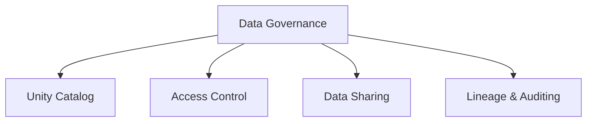

# Data Governance (9% of Exam)

Securing and governing data with Unity Catalog.

## Topics Overview

## Section Contents

| File | Topic | Priority |
| :--- | :--- | :--- |
| [01-unity-catalog-basics.md](01-unity-catalog-basics.md) | UC structure, metastores, catalogs, schemas | High |
| [02-access-control-permissions.md](02-access-control-permissions.md) | Privileges, roles, object ownership | Medium |
| [03-data-sharing.md](./03-data-sharing.md) | Sharing objects, collaboration, Delta Sharing | Low |

## Key Concepts

- **Unity Catalog**: Centralized metadata and access control layer
- **Three-layer namespace**: Catalog > Schema > Object
- **Privileges**: Control what users can do with objects
- **Delta Sharing**: Secure data sharing across organizations

## Related Resources

- [Unity Catalog Basics](../../../shared/fundamentals/unity-catalog-basics.md)
- [Unity Catalog Quick Reference](../../../shared/cheat-sheets/unity-catalog-quick-ref.md)

## Next Steps

You've completed the associate certification path. Review all topics with [Practice Questions](../resources/practice-questions/README.md) and [Mock Exams](../resources/mock-exam/README.md).

---

**[← Back to Certification](../README.md)**
