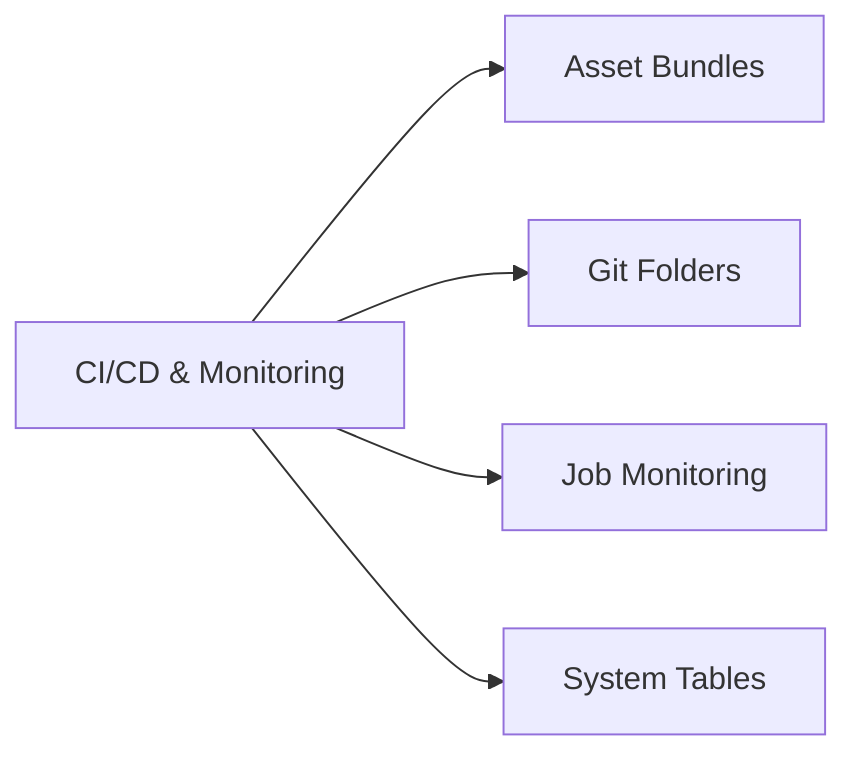

# CI/CD and Monitoring

> [!important]
> **New in the May 2026 blueprint.** The DE Associate exam now explicitly tests CI/CD practices (Databricks Asset Bundles, Git folders, deploying Lakeflow Jobs from source control) and basic monitoring (job-run state, Spark UI essentials, system tables for usage).

## Topics Overview

## Section Contents

| File | Topic | Priority |
| :--- | :--- | :--- |
| [01-asset-bundles-and-git-folders.md](./01-asset-bundles-and-git-folders.md) | Bundle anatomy, dev vs prod mode, Git folders for source control | High |
| [02-monitoring-basics.md](./02-monitoring-basics.md) | Lakeflow Jobs notifications, Spark UI, system tables for usage / failure tracking | High |

## Key Concepts

| Concept | Why it matters |
| :--- | :--- |
| **Databricks Asset Bundles (DAB)** | YAML-driven deployment unit covering Lakeflow Jobs, Lakeflow Declarative Pipelines, notebooks, ML models, dashboards |
| **`mode: development` vs `mode: production`** | Dev mode pauses schedules and prefixes resource names; production runs as the configured service principal |
| **Git folders** | Workspace-resident Git working tree (formerly Databricks Repos) — supports branch + pull-request operations from the UI |
| **Lakeflow Jobs notifications** | Email + webhook alerts on success / failure / duration thresholds — configured per job |
| **System tables** | UC tables under `system.lakeflow.*`, `system.access.*`, `system.billing.*` — queryable usage, audit, and cost data |

## Related Resources

- [DE Pro — Debugging and Deploying (deeper)](../../data-engineer-professional/06-debugging-and-deploying/README.md)
- [DE Pro — Monitoring and Alerting (deeper)](../../data-engineer-professional/04-monitoring-and-alerting/README.md)
- [Hands-on Lab 03 — Lakeflow Declarative Pipelines](../../../labs/03-lakeflow-declarative-pipelines.md)
- [Databricks Asset Bundles documentation](https://docs.databricks.com/en/dev-tools/bundles/index.html)

---

**[← Previous: Data Governance](../05-data-governance/README.md) | [↑ Back to Data Engineer Associate](../README.md)**
