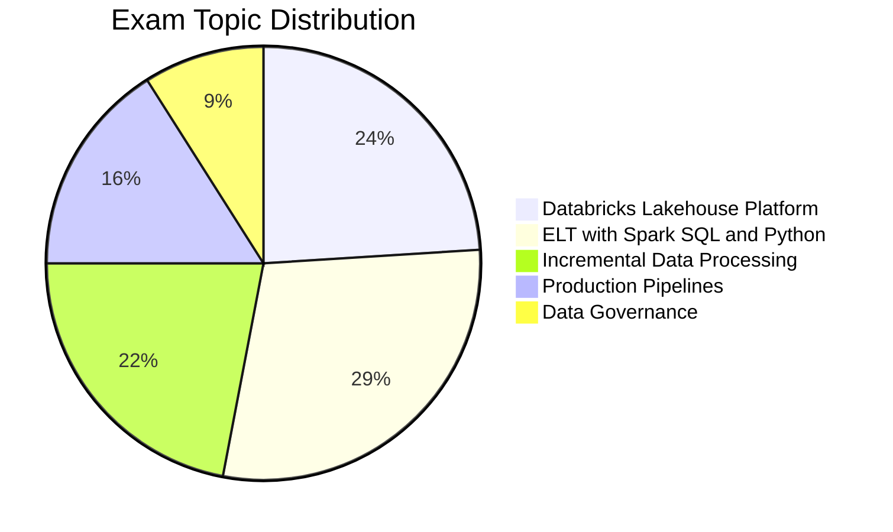

# Databricks Data Engineer Associate

## Exam Overview

| Detail | Information |
|--------|-------------|
| **Certification** | Databricks Certified Data Engineer Associate |
| **Questions** | ~45 multiple-choice |
| **Duration** | 90 minutes |
| **Passing Score** | 70% |
| **Languages** | Python and SQL |
| **Experience** | 6+ months with Databricks |
| **Recertification** | Every 2 years |
| **Cost** | $200 USD |

## Exam Domain Weights

## Study Topics

| Section | Weight | Topics |
|---------|--------|--------|
| [01-Lakehouse Platform](01-lakehouse-platform/) | 24% | Architecture, components, workspace |
| [02-ETL with Spark](02-etl-with-spark/) | 29% | SQL, DataFrames, transformations |
| [03-Delta Lake](03-delta-lake/) | 22% | ACID, time travel, optimization |
| [04-Workflows](04-workflows/) | 16% | Jobs, scheduling, orchestration |
| [05-Data Governance](05-data-governance/) | 9% | Unity Catalog basics, access control |

## Prerequisites

Review these shared fundamentals:

- [Delta Lake Basics](../../_shared/fundamentals/delta-lake-basics.md)
- [Spark Fundamentals](../../_shared/fundamentals/spark-fundamentals.md)
- [Databricks Workspace](../../_shared/fundamentals/databricks-workspace.md)

## Study Progress Tracker

- [ ] Understand Lakehouse architecture
- [ ] Master Spark SQL basics
- [ ] Learn Delta Lake operations
- [ ] Practice workflow creation
- [ ] Review Unity Catalog basics

## Official Resources

- [Databricks Certification Page](https://www.databricks.com/learn/certification/data-engineer-associate)
- [Databricks Documentation](https://docs.databricks.com/)

## Recommended Path

Complete this certification before attempting [Data Engineer Professional](../data-engineer-professional/).
