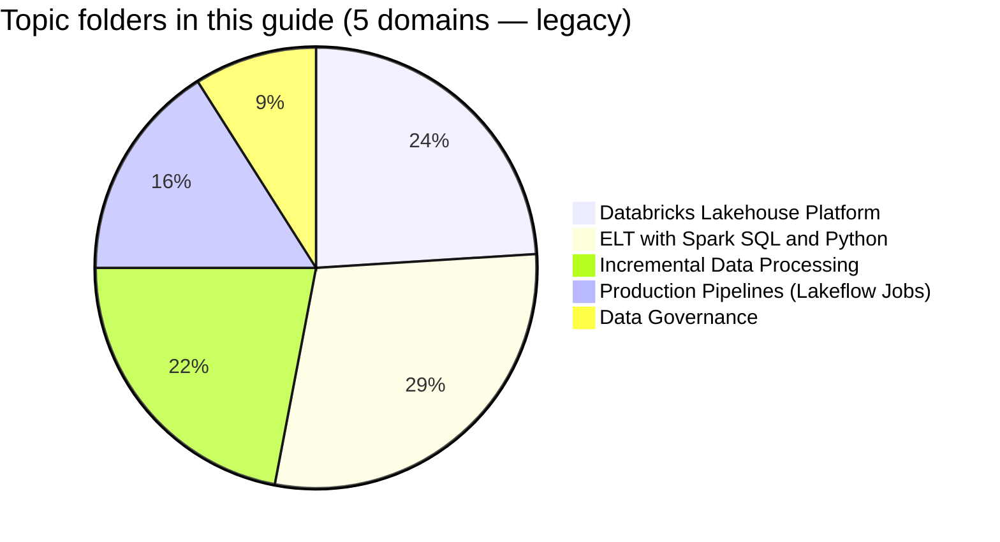

# Databricks Data Engineer Associate

> [!important]
> **What changed in the May 2026 exam guide**
>
> - Terminology shift: "Workflows" → **Lakeflow Jobs** throughout the blueprint
> - Expanded coverage of ingestion patterns (Auto Loader, COPY INTO) and CI/CD with **Databricks Asset Bundles**
> - Continued emphasis on Unity Catalog as the default governance layer
> - Pass / fail — **Databricks no longer publishes a numeric passing score**
>
> Topic folders in this guide preserve the previous structure; the official PDF is the source of truth: [May 2026 exam guide (PDF)](https://www.databricks.com/sites/default/files/2026-05/databricks-certified-data-engineer-associate-exam-guide-may-2026.pdf). A topic-folder reorganisation to match the new terminology is on the [guide roadmap](../../README.md#roadmap-for-the-guide-itself).

## Exam Overview

| Detail              | Information                                  |
| ------------------- | -------------------------------------------- |
| **Certification**   | Databricks Certified Data Engineer Associate |
| **Exam guide**      | [May 2026 (PDF)](https://www.databricks.com/sites/default/files/2026-05/databricks-certified-data-engineer-associate-exam-guide-may-2026.pdf) |
| **Scored questions**| 45 multiple-choice                           |
| **Duration**        | 90 minutes                                   |
| **Result**          | Pass / fail (no published threshold)         |
| **Languages**       | English, Japanese, Portuguese (BR), Korean   |
| **Code in stems**   | Python and SQL                               |
| **Experience**      | 6+ months hands-on with Databricks (recommended) |
| **Recertification** | Every 2 years                                |
| **Cost**            | $200 USD                                     |
| **Delivery**        | Online proctored or test center              |

## Exam Domain Weights (legacy structure — see PDF for May 2026 official)

The guide's existing topic folders track the prior blueprint structure; the weights below are kept for continuity. For the **official May 2026 weighting**, consult the [exam guide PDF](https://www.databricks.com/sites/default/files/2026-05/databricks-certified-data-engineer-associate-exam-guide-may-2026.pdf) — it is the source of truth.

## Study Topics

### Core Topics

| Section                                                              | Legacy weight | Topics                                   |
| -------------------------------------------------------------------- | :-----------: | ---------------------------------------- |
| [01-Lakehouse Platform](01-lakehouse-platform/README.md)             | 24 %          | Architecture, workspace, compute         |
| [02-ETL with Spark SQL and Python](02-etl-spark-sql/README.md)       | 29 %          | SQL, DataFrames, joins, aggregations     |
| [03-Delta Lake](03-delta-lake/README.md)                             | 22 %          | ACID, time travel, optimization          |
| [04-Workflows & Orchestration](04-workflows-orchestration/README.md) | 16 %          | Lakeflow Jobs, scheduling, monitoring    |
| [05-Data Governance](05-data-governance/README.md)                   |  9 %          | Unity Catalog, access control, sharing   |

### Practice & Resources

| Resource                                                | Description                              |
| ------------------------------------------------------- | ---------------------------------------- |
| [Practice Questions](resources/practice-questions/README.md)    | Topic-specific practice questions        |
| [Mock Exam 1](resources/mock-exam/README.md)                    | Full-length practice exam (45 questions) |
| [Mock Exam 2](resources/mock-exam-2/README.md)                  | Alternative practice exam                |
| [Exam Tips](resources/exam-tips.md)                    | Strategies and exam format guide         |
| [Official Links](resources/official-links.md)          | Documentation and registration links     |

## Interview Preparation

After completing this certification, explore design and architecture questions:

- [Interview Prep Resource](../../shared/interview-prep/README.md) - System design, Delta Lake internals, pipeline architecture, and more

## Prerequisites

Before starting this certification, review:

- [Databricks Workspace](../../shared/fundamentals/databricks-workspace.md)
- [Delta Lake Basics](../../shared/fundamentals/delta-lake-basics.md)
- [Spark Fundamentals](../../shared/fundamentals/spark-fundamentals.md)
- [Platform Architecture](../../shared/fundamentals/platform-architecture.md)

## Study Progress Tracker

### Phase 1: Foundations

- [ ] Lakehouse Platform fundamentals
- [ ] Delta Lake basics

### Phase 2: Processing

- [ ] Spark SQL and Python
- [ ] DataFrame operations

### Phase 3: Production

- [ ] Workflows and jobs (Lakeflow Jobs)
- [ ] Data governance

### Phase 4: Practice

- [ ] Complete practice questions (aim for 70%+)
- [ ] Take Mock Exam 1 (under timed conditions)
- [ ] Review weak areas
- [ ] Take Mock Exam 2

## Official Resources

- [Databricks Certification Page](https://www.databricks.com/learn/certification/data-engineer-associate)
- [May 2026 exam guide (PDF)](https://www.databricks.com/sites/default/files/2026-05/databricks-certified-data-engineer-associate-exam-guide-may-2026.pdf)
- [Databricks Documentation](https://docs.databricks.com/)
- [Databricks Academy](https://www.databricks.com/learn/training)

## Recommended Path

1. Complete this **Data Engineer Associate** certification
2. Progress to [Data Engineer Professional](../data-engineer-professional/README.md) for advanced topics
3. Reference [Learning Paths](../../learning-paths/README.md) for recommended progression
