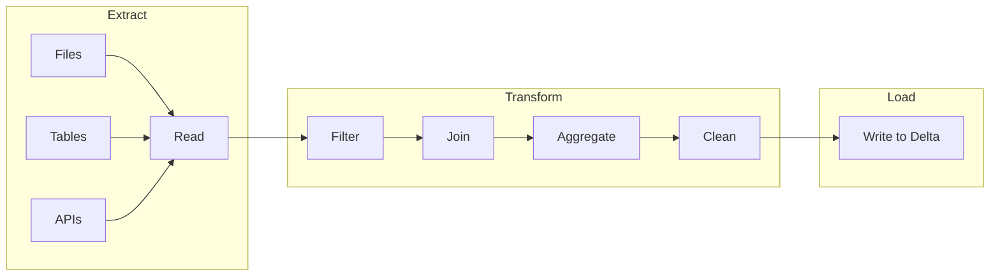
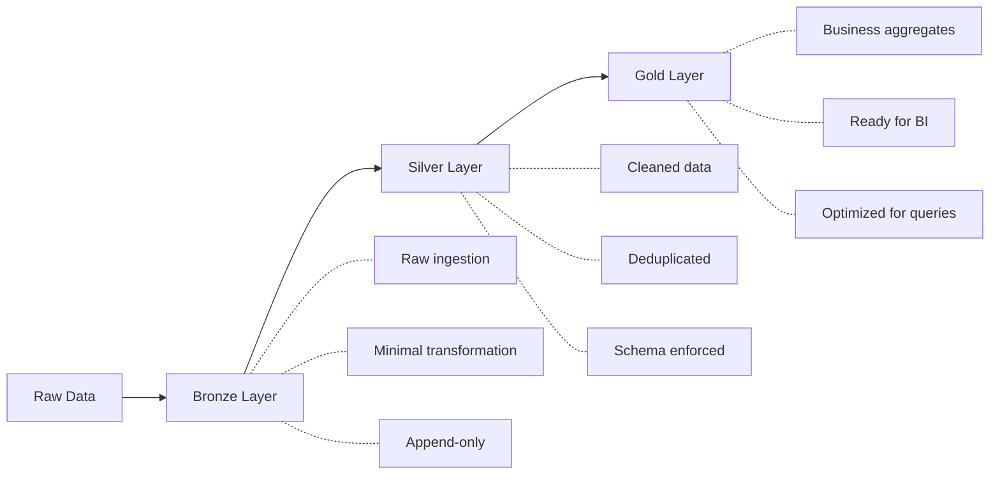
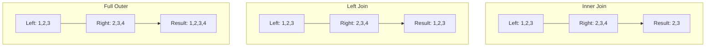
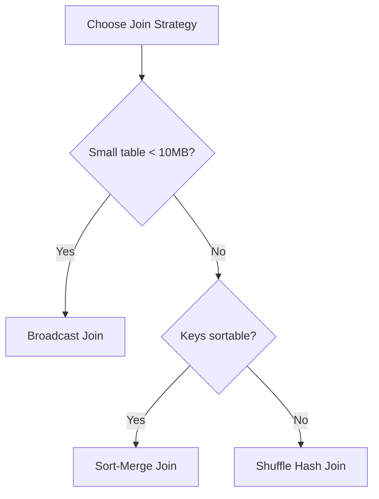

# Batch ETL Pipelines — Part 1

Batch ETL is foundational to data engineering. This part covers DataFrame transformations, read/write operations, join strategies, aggregations, window functions, and UDFs. Part 2 covers performance optimization, error handling, use cases, and exam tips.

## Overview



## ETL vs ELT

| Aspect | ETL | ELT |
| :--- | :--- | :--- |
| Transform location | Before loading | After loading |
| Best for | Structured data, compliance | Raw data, data lakes |
| Databricks approach | Use ELT with medallion architecture | |
| Flexibility | Less flexible | More flexible |

### Medallion Architecture (Bronze/Silver/Gold)



## Reading Data

### Read from Files

```python
# Read Parquet

df = spark.read.format("parquet").load("/path/to/files")

# Read CSV with options

df = (spark.read.format("csv")
    .option("header", "true")
    .option("inferSchema", "true")
    .option("multiLine", "true")
    .load("/path/to/files/*.csv"))

# Read JSON

df = (spark.read.format("json")
    .option("multiLine", "true")
    .load("/path/to/files"))

# Read Delta

df = spark.read.format("delta").load("/path/to/delta")
df = spark.table("catalog.schema.table_name")
```

### Read Options by Format

| Format | Key Options |
| :--- | :--- |
| CSV | `header`, `inferSchema`, `delimiter`, `multiLine`, `quote`, `escape` |
| JSON | `multiLine`, `primitivesAsString`, `allowComments` |
| Parquet | `mergeSchema` |
| Delta | `versionAsOf`, `timestampAsOf` |

### Schema Definition

```python
from pyspark.sql.types import StructType, StructField, StringType, IntegerType, TimestampType

# Define schema explicitly (recommended for production)

schema = StructType([
    StructField("id", IntegerType(), nullable=False),
    StructField("name", StringType(), nullable=True),
    StructField("created_at", TimestampType(), nullable=True)
])

df = (spark.read.format("json")
    .schema(schema)
    .load("/path/to/files"))
```

### Handling Corrupt Records

```python
# Mode options for corrupt records

df = (spark.read.format("json")
    # Default: nulls for corrupt fields
    .option("mode", "PERMISSIVE")
    .option("columnNameOfCorruptRecord", "_corrupt_record")
    .load("/path/to/files"))

# DROPMALFORMED: Skip corrupt records

df = (spark.read.format("csv")
    .option("mode", "DROPMALFORMED")
    .load("/path/to/files"))

# FAILFAST: Fail immediately on corrupt record

df = (spark.read.format("csv")
    .option("mode", "FAILFAST")
    .load("/path/to/files"))
```

| Mode | Behavior |
| :--- | :--- |
| `PERMISSIVE` | Set corrupt fields to null, store in `_corrupt_record` |
| `DROPMALFORMED` | Skip corrupt records |
| `FAILFAST` | Throw exception on first corrupt record |

## DataFrame Transformations

### Select and Column Operations

```python
from pyspark.sql.functions import col, lit, when, coalesce, concat, upper

# Select columns

df.select("col1", "col2")
df.select(col("col1"), col("col2").alias("renamed"))

# Add new column

df.withColumn("new_col", lit("constant"))
df.withColumn("full_name", concat(col("first"), lit(" "), col("last")))

# Conditional column

df.withColumn("status",
    when(col("amount") > 100, "high")
    .when(col("amount") > 50, "medium")
    .otherwise("low")
)

# Handle nulls

df.withColumn("value", coalesce(col("primary"), col("backup"), lit(0)))
```

### Filter Operations

```python
# Basic filter

df.filter(col("status") == "active")
df.filter("status = 'active'")  # SQL expression

# Multiple conditions

df.filter((col("amount") > 100) & (col("status") == "active"))
df.filter((col("region") == "US") | (col("region") == "CA"))

# Null handling

df.filter(col("email").isNotNull())
df.filter(col("phone").isNull())

# String operations

df.filter(col("name").like("%Smith%"))
df.filter(col("name").rlike("^[A-Z].*"))  # Regex
df.filter(col("email").contains("@company.com"))
```

### Type Casting

```python
from pyspark.sql.functions import col, to_date, to_timestamp

# Cast types

df.withColumn("amount", col("amount").cast("double"))
df.withColumn("id", col("id").cast("integer"))

# Date/timestamp conversions

df.withColumn("date", to_date(col("date_string"), "yyyy-MM-dd"))
df.withColumn("timestamp", to_timestamp(col("ts_string"), "yyyy-MM-dd HH:mm:ss"))
```

### SQL Expressions

```python
from pyspark.sql.functions import expr

# Use SQL expressions in DataFrame API

df.withColumn("discount_price", expr("price * (1 - discount_rate)"))
df.selectExpr("*", "price * quantity AS total")
```

## Join Operations

### Join Types



```python
# Inner join (default)

df1.join(df2, df1.id == df2.id, "inner")

# Left join

df1.join(df2, df1.id == df2.id, "left")

# Right join

df1.join(df2, df1.id == df2.id, "right")

# Full outer join

df1.join(df2, df1.id == df2.id, "full")

# Left anti join (rows in left not in right)

df1.join(df2, df1.id == df2.id, "left_anti")

# Left semi join (rows in left that have match in right)

df1.join(df2, df1.id == df2.id, "left_semi")

# Cross join

df1.crossJoin(df2)
```

### Join on Multiple Columns

```python
# Multiple join conditions

df1.join(df2,
    (df1.id == df2.id) & (df1.date == df2.date),
    "inner"
)

# Same column names (simpler syntax)

df1.join(df2, ["id", "date"], "inner")
```

### Join Strategies



| Strategy | When Used | Performance |
|----------|-----------|-------------|
| Broadcast | Small table (< 10MB default) | Fast, no shuffle |
| Sort-Merge | Large tables, sorted keys | Good for equi-joins |
| Shuffle Hash | Large tables, unsorted | Expensive shuffle |

### Join Hints

```python
from pyspark.sql.functions import broadcast

# Force broadcast join

df1.join(broadcast(df2), "id")

# SQL hints

spark.sql("""
    SELECT /*+ BROADCAST(small_table) */ *
    FROM large_table
    JOIN small_table ON large_table.id = small_table.id
""")

# Merge hint (sort-merge join)

spark.sql("""
    SELECT /*+ MERGE(df2) */ *
    FROM df1 JOIN df2 ON df1.id = df2.id
""")

# Shuffle hash hint

spark.sql("""
    SELECT /*+ SHUFFLE_HASH(df2) */ *
    FROM df1 JOIN df2 ON df1.id = df2.id
""")
```

### Broadcast Threshold

```python

# Default broadcast threshold is 10MB
# Increase for larger dimension tables

spark.conf.set("spark.sql.autoBroadcastJoinThreshold", "50MB")

# Disable auto broadcast

spark.conf.set("spark.sql.autoBroadcastJoinThreshold", "-1")
```

## Aggregations

### Basic Aggregations

```python
from pyspark.sql.functions import count, sum, avg, min, max, countDistinct

# Single aggregation

df.agg(count("*").alias("total"))

# Multiple aggregations

df.agg(
    count("*").alias("total_rows"),
    sum("amount").alias("total_amount"),
    avg("amount").alias("avg_amount"),
    countDistinct("customer_id").alias("unique_customers")
)
```

### Group By

```python
# Group by single column

df.groupBy("region").agg(
    count("*").alias("order_count"),
    sum("amount").alias("total_amount")
)

# Group by multiple columns

df.groupBy("region", "product_category").agg(
    sum("amount").alias("total")
)
```

### Pivot

```python
# Pivot table

df.groupBy("region").pivot("year").agg(sum("amount"))

# Pivot with specific values (more efficient)

df.groupBy("region").pivot("year", [2022, 2023, 2024]).agg(sum("amount"))
```

## Window Functions

Window functions compute values across a set of rows related to the current row.

### Window Specification

```python
from pyspark.sql.window import Window
from pyspark.sql.functions import row_number, rank, dense_rank, lead, lag, sum

# Basic window

window = Window.partitionBy("customer_id").orderBy("order_date")

# Window with frame

window_frame = (Window.partitionBy("customer_id")
    .orderBy("order_date")
    .rowsBetween(Window.unboundedPreceding, Window.currentRow))
```

### Ranking Functions

```python
# Row number (unique rank)

df.withColumn("row_num", row_number().over(window))

# Rank (gaps for ties)

df.withColumn("rank", rank().over(window))

# Dense rank (no gaps for ties)

df.withColumn("dense_rank", dense_rank().over(window))
```

| Function | Ties Handling | Example: [100, 100, 90] |
|----------|---------------|------------------------|
| `row_number()` | Arbitrary order | 1, 2, 3 |
| `rank()` | Same rank, skip next | 1, 1, 3 |
| `dense_rank()` | Same rank, no skip | 1, 1, 2 |

### Lead and Lag

```python
# Next value

df.withColumn("next_order_date", lead("order_date", 1).over(window))

# Previous value

df.withColumn("prev_amount", lag("amount", 1).over(window))

# With default value

df.withColumn("prev_amount", lag("amount", 1, 0).over(window))
```

### Running Totals

```python
# Cumulative sum

window_running = (Window.partitionBy("customer_id")
    .orderBy("order_date")
    .rowsBetween(Window.unboundedPreceding, Window.currentRow))

df.withColumn("running_total", sum("amount").over(window_running))
```

### Deduplication with Window Functions

```python
# Keep latest record per customer

window = Window.partitionBy("customer_id").orderBy(col("updated_at").desc())

(df.withColumn("rn", row_number().over(window))
    .filter(col("rn") == 1)
    .drop("rn"))
```

## Writing Data

### Write Modes

```python
# Append - add to existing data

df.write.format("delta").mode("append").save("/path/to/table")

# Overwrite - replace all data

df.write.format("delta").mode("overwrite").save("/path/to/table")

# Error (default) - fail if data exists

df.write.format("delta").mode("error").save("/path/to/table")

# Ignore - skip if data exists

df.write.format("delta").mode("ignore").save("/path/to/table")
```

| Mode | Behavior |
|------|----------|
| `append` | Add new records to existing data |
| `overwrite` | Replace all existing data |
| `error` / `errorifexists` | Fail if target exists |
| `ignore` | Do nothing if target exists |

### Write to Tables

```python
# Write to managed table

df.write.format("delta").saveAsTable("catalog.schema.table_name")

# Write to table (append)

df.write.format("delta").mode("append").saveAsTable("catalog.schema.table_name")

# Insert into existing table

df.write.insertInto("catalog.schema.table_name")
```

### Partitioning

```python
# Write with partitioning

(df.write.format("delta")
    .partitionBy("year", "month")
    .mode("overwrite")
    .save("/path/to/table"))

# Overwrite specific partitions

(df.write.format("delta")
    .mode("overwrite")
    .option("replaceWhere", "year = 2024 AND month = 1")
    .save("/path/to/table"))
```

### Dynamic Partition Overwrite

```python
# Only overwrite partitions that have data in the DataFrame

spark.conf.set("spark.sql.sources.partitionOverwriteMode", "dynamic")

(df.write.format("delta")
    .mode("overwrite")
    .partitionBy("date")
    .save("/path/to/table"))
```

## SQL Batch Operations

### CTAS (Create Table As Select)

```sql
-- Create new table from query
CREATE TABLE catalog.schema.new_table AS
SELECT * FROM source_table WHERE status = 'active';

-- Create or replace
CREATE OR REPLACE TABLE catalog.schema.new_table AS
SELECT * FROM source_table;
```

### INSERT Operations

```sql
-- Insert values
INSERT INTO table_name VALUES (1, 'John', '2024-01-01');

-- Insert from select
INSERT INTO table_name
SELECT * FROM source_table WHERE date = '2024-01-01';

-- Insert overwrite (replace all data)
INSERT OVERWRITE table_name
SELECT * FROM source_table;

-- Insert overwrite partition
INSERT OVERWRITE table_name PARTITION (date = '2024-01-01')
SELECT id, name FROM source_table WHERE date = '2024-01-01';
```

## User-Defined Functions (UDFs)

### Python UDFs

```python
from pyspark.sql.functions import udf
from pyspark.sql.types import StringType

# Define UDF

@udf(returnType=StringType())
def format_phone(phone):
    if phone and len(phone) == 10:
        return f"({phone[:3]}) {phone[3:6]}-{phone[6:]}"
    return phone

# Use UDF

df.withColumn("formatted_phone", format_phone(col("phone")))
```

### Pandas UDFs (Vectorized)

```python
from pyspark.sql.functions import pandas_udf
import pandas as pd

# Scalar Pandas UDF (much faster than regular UDFs)

@pandas_udf("double")
def calculate_discount(amount: pd.Series, rate: pd.Series) -> pd.Series:
    return amount * (1 - rate)

df.withColumn("discounted", calculate_discount(col("amount"), col("rate")))
```

| UDF Type | Performance | Use Case |
|----------|-------------|----------|
| Python UDF | Slow (row-by-row) | Complex logic, external libraries |
| Pandas UDF | Fast (vectorized) | Numerical computations |
| Built-in functions | Fastest | Use whenever possible |

**Best Practice**: Always prefer built-in Spark functions over UDFs when possible.

> **Continue reading:** [Part 2 — Performance Optimization, Error Handling, Use Cases & Exam Tips](./01-batch-etl-pipelines-part2.md)

---

**[↑ Back to Data Processing](./README.md) | [Next: Batch ETL Pipelines — Part 2](./01-batch-etl-pipelines-part2.md) →**
