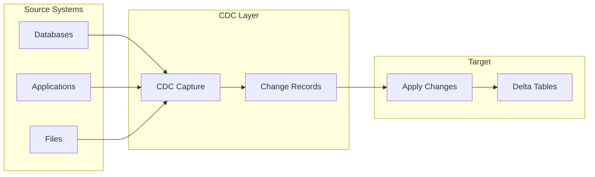
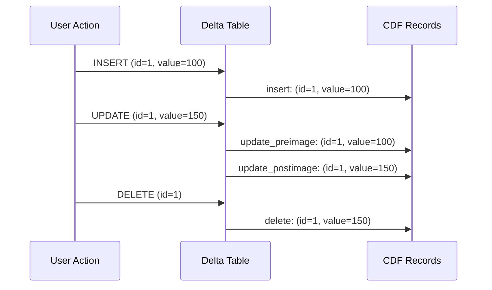
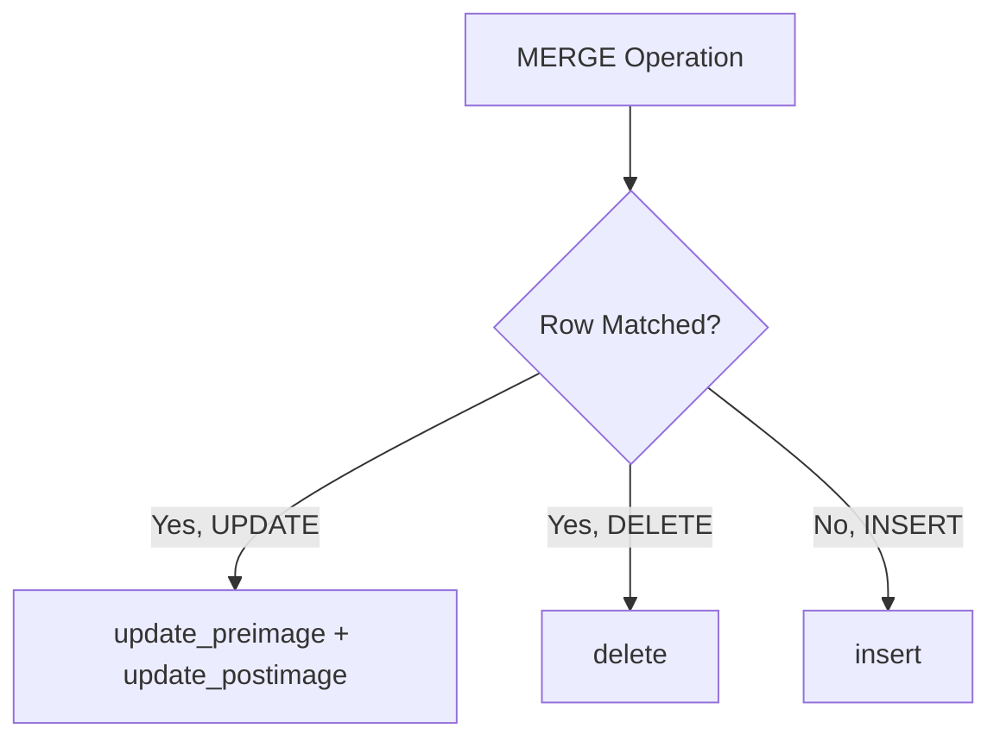

# Change Data Capture (CDC) — Part 1

Change Data Capture tracks data changes (inserts, updates, deletes) for downstream propagation. This part covers CDC fundamentals, Delta Change Data Feed, CDF processing, MERGE with CDF, APPLY CHANGES, and SCD patterns.

## Overview



## CDC Fundamentals

### What is CDC?

CDC captures row-level changes (INSERT, UPDATE, DELETE) instead of full data snapshots.

| Approach | Data Captured | Volume | Use Case |
| :--- | :--- | :--- | :--- |
| Full Load | All rows | High | Initial loads, small tables |
| CDC | Changed rows only | Low | Incremental updates |

### CDC Operation Types

| Operation | Description | CDF _change_type |
| :--- | :--- | :--- |
| INSERT | New row added | `insert` |
| UPDATE | Existing row modified | `update_preimage`, `update_postimage` |
| DELETE | Row removed | `delete` |

## Delta Change Data Feed (CDF)

CDF is Delta Lake's built-in CDC capability that tracks changes made to a table.

### Enabling CDF

```sql
-- Enable on new table
CREATE TABLE orders (
    order_id INT,
    customer_id INT,
    amount DOUBLE,
    status STRING
) USING DELTA
TBLPROPERTIES ('delta.enableChangeDataFeed' = 'true');

-- Enable on existing table
ALTER TABLE orders
SET TBLPROPERTIES ('delta.enableChangeDataFeed' = 'true');
```

```python
# Enable via Python

spark.sql("""
    ALTER TABLE orders
    SET TBLPROPERTIES ('delta.enableChangeDataFeed' = 'true')
""")
```

### CDF Metadata Columns

When reading change data, these columns are added:

| Column | Type | Description |
| :--- | :--- | :--- |
| `_change_type` | STRING | `insert`, `update_preimage`, `update_postimage`, `delete` |
| `_commit_version` | LONG | Delta version of the change |
| `_commit_timestamp` | TIMESTAMP | When the change was committed |

### Reading Change Data - SQL

```sql
-- Read changes between versions
SELECT * FROM table_changes('catalog.schema.orders', 1, 10);

-- Read changes between timestamps
SELECT * FROM table_changes('catalog.schema.orders', '2024-01-01', '2024-01-31');

-- Read changes from specific version to latest
SELECT * FROM table_changes('catalog.schema.orders', 5);
```

### Reading Change Data - Python (Batch)

```python
# Read changes by version range

changes_df = (spark.read.format("delta")
    .option("readChangeFeed", "true")
    .option("startingVersion", 1)
    .option("endingVersion", 10)
    .table("catalog.schema.orders"))

# Read changes by timestamp range

changes_df = (spark.read.format("delta")
    .option("readChangeFeed", "true")
    .option("startingTimestamp", "2024-01-01")
    .option("endingTimestamp", "2024-01-31")
    .table("catalog.schema.orders"))
```

### Reading Change Data - Python (Streaming)

```python
# Stream changes

changes_stream = (spark.readStream.format("delta")
    .option("readChangeFeed", "true")
    .option("startingVersion", 1)
    .table("catalog.schema.orders"))

# Process the stream

query = (changes_stream.writeStream
    .format("delta")
    .option("checkpointLocation", "/checkpoint")
    .start("/target/path"))
```

### CDF Change Types



## Processing CDF Changes

### Filter by Change Type

```python
from pyspark.sql.functions import col

changes_df = (spark.read.format("delta")
    .option("readChangeFeed", "true")
    .option("startingVersion", 1)
    .table("orders"))

# Get only inserts

inserts = changes_df.filter(col("_change_type") == "insert")

# Get only updates (postimage has new values)

updates = changes_df.filter(col("_change_type") == "update_postimage")

# Get only deletes

deletes = changes_df.filter(col("_change_type") == "delete")

# Get inserts and updates (latest values)

latest_changes = changes_df.filter(
    col("_change_type").isin("insert", "update_postimage")
)
```

### Propagate Changes to Downstream Table

```python
# Read changes from source

source_changes = (spark.read.format("delta")
    .option("readChangeFeed", "true")
    .option("startingVersion", last_processed_version)
    .table("bronze.orders"))

# Filter to actionable changes

actionable = source_changes.filter(
    col("_change_type").isin("insert", "update_postimage", "delete")
)

# Apply to target with MERGE

from delta.tables import DeltaTable

target = DeltaTable.forName(spark, "silver.orders")

target.alias("t").merge(
    actionable.alias("s"),
    "t.order_id = s.order_id"
).whenMatchedDelete(
    condition="s._change_type = 'delete'"
).whenMatchedUpdateAll(
    condition="s._change_type = 'update_postimage'"
).whenNotMatchedInsertAll(
    condition="s._change_type = 'insert'"
).execute()
```

## MERGE and CDF

When you perform MERGE operations on a CDF-enabled table, the changes are automatically recorded.

### How MERGE Generates CDF Records



```sql
-- This MERGE on a CDF-enabled table
MERGE INTO orders AS t
USING updates AS s
ON t.order_id = s.order_id
WHEN MATCHED AND s.deleted = true THEN DELETE
WHEN MATCHED THEN UPDATE SET *
WHEN NOT MATCHED THEN INSERT *;

-- Generates CDF records:
-- For matched deletes: _change_type = 'delete'
-- For matched updates: _change_type = 'update_preimage' and 'update_postimage'
-- For not matched: _change_type = 'insert'
```

## APPLY CHANGES (Lakeflow/DLT)

APPLY CHANGES is the declarative CDC API in Lakeflow Declarative Pipelines (formerly DLT).

### Basic Syntax

```python
import dlt
from pyspark.sql.functions import col

@dlt.table
def orders_clean():
    return dlt.read_stream("orders_raw")

dlt.apply_changes(
    target="orders",
    source="orders_clean",
    keys=["order_id"],
    sequence_by=col("updated_at"),
    apply_as_deletes=expr("operation = 'DELETE'"),
    apply_as_truncates=expr("operation = 'TRUNCATE'"),
    except_column_list=["operation", "_rescued_data"]
)
```

### APPLY CHANGES Parameters

| Parameter | Required | Description |
|-----------|----------|-------------|
| `target` | Yes | Target table name |
| `source` | Yes | Source table/stream name |
| `keys` | Yes | Primary key columns |
| `sequence_by` | Yes | Column to determine order (timestamp/version) |
| `apply_as_deletes` | No | Condition identifying delete records |
| `apply_as_truncates` | No | Condition identifying truncate records |
| `except_column_list` | No | Columns to exclude from target |
| `stored_as_scd_type` | No | 1 (default) or 2 for SCD handling |

### SCD Type 1 (Default)

Overwrites with the latest value - no history.

```python
dlt.apply_changes(
    target="dim_customer",
    source="customer_changes",
    keys=["customer_id"],
    sequence_by=col("updated_at"),
    stored_as_scd_type=1  # Default
)
```

### SCD Type 2

Maintains full history with effective dates.

```python
dlt.apply_changes(
    target="dim_customer",
    source="customer_changes",
    keys=["customer_id"],
    sequence_by=col("updated_at"),
    stored_as_scd_type=2
)
```

SCD Type 2 adds these columns to the target:

- `__START_AT` - When the record became effective
- `__END_AT` - When the record was superseded (null if current)

```mermaid
gantt
    title SCD Type 2 Record History
    dateFormat YYYY-MM-DD
    section Customer 123
    Version 1 (Name: John) :v1, 2024-01-01, 2024-03-15
    Version 2 (Name: Johnny) :v2, 2024-03-15, 2024-06-01
    Version 3 (Name: John D.) :active, v3, 2024-06-01, 2024-12-31
```

### SQL Syntax (DLT)

```sql
-- Create streaming table
CREATE OR REFRESH STREAMING TABLE customers_staged
AS SELECT * FROM STREAM(LIVE.customers_raw);

-- Apply changes
APPLY CHANGES INTO LIVE.customers
FROM STREAM(LIVE.customers_staged)
KEYS (customer_id)
SEQUENCE BY updated_at
COLUMNS * EXCEPT (operation, _rescued_data)
STORED AS SCD TYPE 2;
```

## SCD Patterns with MERGE

### SCD Type 1 (Overwrite)

```sql
MERGE INTO dim_customer AS t
USING stg_customer AS s
ON t.customer_id = s.customer_id
WHEN MATCHED THEN
    UPDATE SET
        t.name = s.name,
        t.email = s.email,
        t.updated_at = current_timestamp()
WHEN NOT MATCHED THEN
    INSERT (customer_id, name, email, created_at, updated_at)
    VALUES (s.customer_id, s.name, s.email, current_timestamp(), current_timestamp());
```

### SCD Type 2 (Historical)

```sql
-- Step 1: Close existing records
MERGE INTO dim_customer AS t
USING stg_customer AS s
ON t.customer_id = s.customer_id AND t.is_current = true
WHEN MATCHED AND (
    t.name != s.name OR
    t.email != s.email
) THEN
    UPDATE SET
        t.is_current = false,
        t.end_date = current_timestamp();

-- Step 2: Insert new versions
INSERT INTO dim_customer
SELECT
    customer_id,
    name,
    email,
    current_timestamp() AS start_date,
    NULL AS end_date,
    true AS is_current
FROM stg_customer s
WHERE NOT EXISTS (
    SELECT 1 FROM dim_customer t
    WHERE t.customer_id = s.customer_id
    AND t.is_current = true
    AND t.name = s.name
    AND t.email = s.email
);
```

### SCD Type 2 with MERGE (Single Statement)

```python
from delta.tables import DeltaTable

dim_customer = DeltaTable.forName(spark, "dim_customer")

# Prepare updates for existing records

updates = spark.sql("""
    SELECT
        s.*,
        true as is_new_version
    FROM stg_customer s
    JOIN dim_customer t ON s.customer_id = t.customer_id
    WHERE t.is_current = true
    AND (t.name != s.name OR t.email != s.email)
""")

# Single MERGE for SCD Type 2

dim_customer.alias("t").merge(
    updates.alias("s"),
    "t.customer_id = s.customer_id AND t.is_current = true"
).whenMatchedUpdate(
    set={
        "is_current": "false",
        "end_date": "current_timestamp()"
    }
).execute()

# Insert new versions

spark.sql("""
    INSERT INTO dim_customer
    SELECT
        customer_id, name, email,
        current_timestamp() as start_date,
        null as end_date,
        true as is_current
    FROM stg_customer s
    WHERE NOT EXISTS (
        SELECT 1 FROM dim_customer t
        WHERE t.customer_id = s.customer_id
        AND t.is_current = true
        AND t.name = s.name AND t.email = s.email
    )
""")
```

> **Continue reading:** [Part 2 — CDC Best Practices, Pipeline Patterns, Row Tracking, Multi-Hop CDC & Exam Tips](./05-change-data-capture-part2.md)

---

**[← Previous: Auto Loader](./04-auto-loader.md) | [↑ Back to Data Processing](./README.md) | [Next: Change Data Capture (CDC) — Part 2](./05-change-data-capture-part2.md) →**
