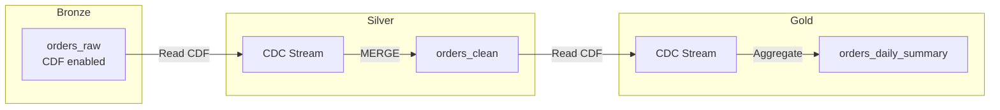
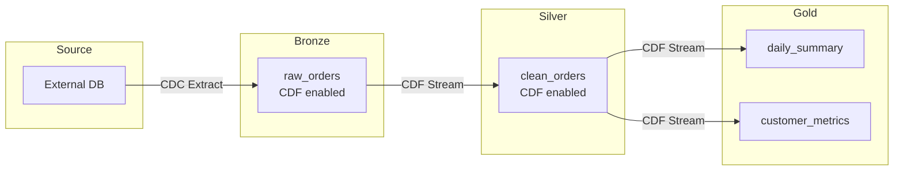

# Change Data Capture (CDC) — Part 2

This part covers CDC best practices, pipeline patterns, row tracking, multi-hop CDC propagation, external CDC integration, monitoring, use cases, and exam tips.

> For CDC fundamentals, Delta CDF, APPLY CHANGES, and SCD patterns, see [Part 1](./05-change-data-capture-part1.md).

## CDC Best Practices

### Idempotent Processing

```python
def process_cdc_idempotent(changes_df, target_table):
    """Process CDC changes idempotently using MERGE."""

    # Deduplicate changes - keep latest per key
    from pyspark.sql.window import Window
    from pyspark.sql.functions import row_number

    window = Window.partitionBy("id").orderBy(col("_commit_version").desc())
    latest_changes = (changes_df
        .withColumn("rn", row_number().over(window))
        .filter(col("rn") == 1)
        .drop("rn"))

    # MERGE ensures idempotency
    target = DeltaTable.forName(spark, target_table)

    target.alias("t").merge(
        latest_changes.alias("s"),
        "t.id = s.id"
    ).whenMatchedDelete(
        condition="s._change_type = 'delete'"
    ).whenMatchedUpdateAll(
        condition="s._change_type IN ('insert', 'update_postimage')"
    ).whenNotMatchedInsertAll(
        condition="s._change_type IN ('insert', 'update_postimage')"
    ).execute()
```

### Handling Out-of-Order Events

```python
# Use sequence column to handle out-of-order

window = Window.partitionBy("order_id").orderBy(col("event_timestamp").desc())

ordered_changes = (changes_df
    .withColumn("rn", row_number().over(window))
    .filter(col("rn") == 1)
    .drop("rn"))
```

### Deduplication Before Apply

```python
# Remove duplicates before applying CDC

deduped = changes_df.dropDuplicates(["id", "_commit_version"])
```

## CDC Pipeline Patterns

### Bronze to Silver CDC Propagation



```python
# Bronze table - CDF enabled

spark.sql("""
    ALTER TABLE bronze.orders
    SET TBLPROPERTIES ('delta.enableChangeDataFeed' = 'true')
""")

# Stream Bronze CDC to Silver

bronze_cdf = (spark.readStream.format("delta")
    .option("readChangeFeed", "true")
    .table("bronze.orders"))

def apply_to_silver(batch_df, batch_id):
    # Process and apply changes
    actionable = batch_df.filter(
        col("_change_type").isin("insert", "update_postimage", "delete")
    )

    target = DeltaTable.forName(spark, "silver.orders")
    # ... MERGE logic ...

query = (bronze_cdf.writeStream
    .foreachBatch(apply_to_silver)
    .option("checkpointLocation", "/checkpoint/bronze_to_silver")
    .start())
```

## Row Tracking

Row Tracking (Delta 3.2+) provides stable row identifiers for tracking changes across versions.

### Enabling Row Tracking

```sql
-- Enable on new table
CREATE TABLE table_name (
    id INT,
    name STRING
) USING DELTA
TBLPROPERTIES ('delta.enableRowTracking' = 'true');

-- Enable on existing table (backfills existing rows)
ALTER TABLE table_name
SET TBLPROPERTIES ('delta.enableRowTracking' = 'true');
```

### Row Tracking Columns

Row tracking adds hidden system columns:

| Column | Description |
|--------|-------------|
| `_metadata.row_id` | Stable unique identifier for each row |
| `_metadata.row_commit_version` | Version when row was last modified |

```python
# Access row tracking columns

df = spark.table("table_name")
df.select("*", "_metadata.row_id", "_metadata.row_commit_version").show()
```

### Row Tracking Use Cases

- **CDC Verification**: Confirm changes applied correctly
- **Audit Trails**: Track row-level lineage
- **Debugging**: Identify when specific rows changed
- **Deduplication Validation**: Verify no duplicate row_ids

```python
# Find rows modified in specific version

df.filter(col("_metadata.row_commit_version") == 5).show()

# Detect potential duplicates

df.groupBy("_metadata.row_id").count().filter(col("count") > 1).show()
```

## Multi-Hop CDC Propagation

Propagating changes through medallion architecture layers.

### Multi-Hop Pattern



### Implementation

```python
# Bronze: Raw CDC ingestion with CDF

bronze_table = spark.sql("""
    ALTER TABLE bronze.orders
    SET TBLPROPERTIES ('delta.enableChangeDataFeed' = 'true')
""")

# Silver: Stream from Bronze CDF

bronze_changes = (spark.readStream.format("delta")
    .option("readChangeFeed", "true")
    .table("bronze.orders"))

def bronze_to_silver(batch_df, batch_id):
    # Apply transformations
    cleaned = (batch_df.filter(col("_change_type") != "update_preimage")
        .transform(apply_data_quality_rules)
        .transform(standardize_columns))

    # MERGE to Silver (also CDF enabled)
    silver_table = DeltaTable.forName(spark, "silver.orders")
    silver_table.alias("t").merge(
        cleaned.alias("s"),
        "t.order_id = s.order_id"
    ).whenMatchedDelete(
        condition="s._change_type = 'delete'"
    ).whenMatchedUpdateAll(
    ).whenNotMatchedInsertAll(
    ).execute()

query = (bronze_changes.writeStream
    .foreachBatch(bronze_to_silver)
    .option("checkpointLocation", "/checkpoint/bronze_to_silver")
    .start())

# Gold: Stream from Silver CDF

silver_changes = (spark.readStream.format("delta")
    .option("readChangeFeed", "true")
    .table("silver.orders"))

# Aggregate to Gold

gold_query = (silver_changes
    .filter(col("_change_type").isin("insert", "update_postimage"))
    .groupBy(to_date("order_date").alias("date"))
    .agg(
        sum("amount").alias("daily_total"),
        count("*").alias("order_count")
    )
    .writeStream
    .format("delta")
    .outputMode("complete")
    .option("checkpointLocation", "/checkpoint/silver_to_gold")
    .toTable("gold.daily_summary"))
```

### CDC Amplification

Changes in upstream tables can multiply in downstream aggregations.

| Layer | Change | Downstream Effect |
|-------|--------|-------------------|
| Bronze | 1 UPDATE | 1 update_preimage + 1 update_postimage |
| Silver | 1 MERGE | May trigger aggregation recalculation |
| Gold | Aggregation | All related rows may update |

**Best Practices for Multi-Hop CDC**:

- Use `update_postimage` for latest values (skip `preimage`)
- Consider incremental aggregation patterns
- Monitor CDC lag at each layer
- Use different checkpoint locations per stream

## External CDC Integration

Integrating with external CDC tools like Debezium.

### Debezium Format Handling

```python
# Debezium CDC format from Kafka

debezium_df = (spark.readStream
    .format("kafka")
    .option("kafka.bootstrap.servers", "broker:9092")
    .option("subscribe", "dbserver1.inventory.orders")
    .load())

# Parse Debezium envelope

from pyspark.sql.functions import from_json, col

debezium_schema = StructType([
    StructField("before", order_schema),
    StructField("after", order_schema),
    StructField("op", StringType()),  # c=create, u=update, d=delete, r=read
    StructField("ts_ms", LongType()),
    StructField("source", source_schema)
])

parsed = (debezium_df
    .select(from_json(col("value").cast("string"), debezium_schema).alias("data"))
    .select("data.*"))

# Map Debezium ops to Delta operations

def debezium_to_delta(df):
    return df.withColumn(
        "_change_type",
        when(col("op") == "c", "insert")
        .when(col("op") == "u", "update")
        .when(col("op") == "d", "delete")
        .otherwise("unknown")
    ).select(
        when(col("op") == "d", col("before")).otherwise(col("after")).alias("*"),
        col("_change_type"),
        col("ts_ms").alias("_source_ts")
    )
```

### Custom CDC Format Parsing

```python
# Generic CDC format with operation column

def parse_custom_cdc(df, op_column="operation"):
    """Convert custom CDC format to standard change types."""
    op_mapping = {
        "I": "insert",
        "U": "update",
        "D": "delete",
        "INSERT": "insert",
        "UPDATE": "update",
        "DELETE": "delete"
    }

    return df.withColumn(
        "_change_type",
        when(upper(col(op_column)).isin(list(op_mapping.keys())),
             create_map([lit(k), lit(v) for k, v in op_mapping.items()])[upper(col(op_column))])
        .otherwise("unknown")
    )
```

## Monitoring CDC

### Track CDC Lag

```python
# Monitor CDC processing lag

lag_df = spark.sql("""
    SELECT
        source_table,
        last_processed_version,
        current_version,
        current_version - last_processed_version as version_lag,
        last_processed_timestamp,
        current_timestamp() - last_processed_timestamp as time_lag
    FROM cdc_monitoring.processing_status
""")
```

### CDC Metrics

```sql
-- Create monitoring table
CREATE TABLE cdc_monitoring.metrics (
    table_name STRING,
    batch_id LONG,
    records_processed LONG,
    inserts LONG,
    updates LONG,
    deletes LONG,
    processing_time_ms LONG,
    timestamp TIMESTAMP
) USING DELTA;
```

## Use Cases

| Scenario | Recommended Pattern | Why? |
|----------|---------------------|------|
| **Audit Compliance** | SCD Type 2 | Keeps full history of changes for regulatory reporting. |
| **Delete Propagation** | CDF Stream + MERGE | Standard streams ignore deletes; CDF captures `delete` events explicitly. |
| **Multi-Hop Propagation** | CDF at each layer | Ensures bronze-to-silver-to-gold sync maintains consistency efficiently. |
| **Debugging Data Issues** | Row Tracking + CDF | Allows pinpointing exactly when and how a row became corrupt. |

## Common Issues & Errors

### Missing History/Empty CDF

**Scenario:** Enabled CDF *after* data was written.

**Fix:** CDF only tracks changes *after* the property is set. Cannot backfill history for prior operations.

### Performance: "Small File Problem" in CDF

**Scenario:** Frequent small updates cause fragmentation in `_change_data` folder.

**Fix:** Run `OPTIMIZE` regularly on the table (it optimizes CDF files too).

### Duplicate Downstream Records

**Scenario:** Reprocessing a batch that isn't idempotent.

**Fix:** Deduplicate using `(id, _commit_version)` or ensure idempotent MERGE logic.

### Updates Not Reflecting in Target

**Scenario:** Filtering stream for `_change_type = 'update_preimage'`.

**Fix:** Use `update_postimage` to get the *new* values. Preimage is only for "before" state analysis.

## Exam Tips

1. **CDF must be enabled** before changes are tracked - not retroactive
2. **_change_type values**: `insert`, `update_preimage`, `update_postimage`, `delete`
3. **table_changes()** function reads CDF in SQL
4. **readChangeFeed** option reads CDF in DataFrame API
5. **APPLY CHANGES** is the DLT/Lakeflow declarative CDC API
6. **sequence_by** is required in APPLY CHANGES to order events
7. **SCD Type 1** = overwrite, **SCD Type 2** = history with effective dates
8. MERGE on CDF-enabled tables **automatically generates** change records
9. **Row Tracking** provides stable `_metadata.row_id` for lineage
10. **Multi-hop CDC** requires CDF enabled at each layer
11. Use `update_postimage` (not `preimage`) for latest values in downstream

## Best Practices

- Enable CDF on tables that need change tracking
- Use streaming for near-real-time CDC propagation
- Deduplicate and handle out-of-order events
- Use `sequence_by` column for consistent ordering
- Track CDC processing lag for monitoring
- Use MERGE for idempotent change application
- Consider SCD Type 2 for dimension tables requiring history

## Related Topics

- [Delta Lake Operations](06-delta-lake-operations-part1.md) - MERGE patterns
- [Structured Streaming](03-structured-streaming-part1.md) - Streaming CDC
- [Data Deduplication](07-data-deduplication.md) - Dedup before CDC apply
- [Lakeflow Pipelines](../07-lakeflow-pipelines/README.md) - APPLY CHANGES API

## Official Documentation

- [Change Data Feed](https://docs.databricks.com/delta/delta-change-data-feed.html)
- [APPLY CHANGES API](https://docs.databricks.com/delta-live-tables/cdc.html)
- [SCD in Lakeflow](https://docs.databricks.com/delta-live-tables/cdc.html#scd)

---

**[← Previous: Change Data Capture (CDC) — Part 1](./05-change-data-capture-part1.md) | [↑ Back to Data Processing](./README.md) | [Next: Delta Lake Operations — Part 1](./06-delta-lake-operations-part1.md) →**
