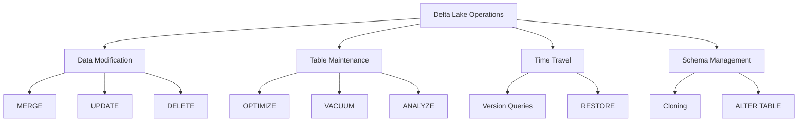
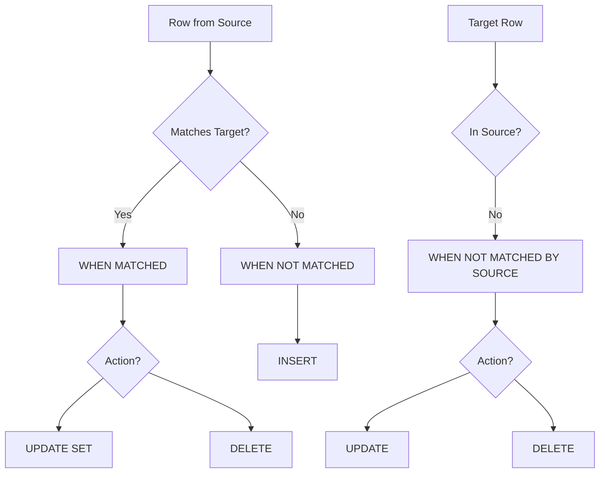
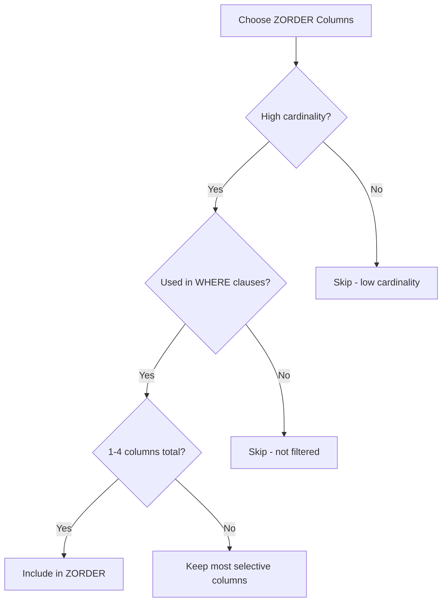
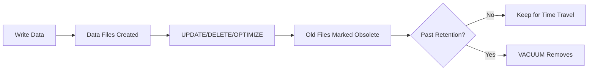

# Delta Lake Operations — Part 1

Delta Lake operations are fundamental to the exam. This part covers MERGE, OPTIMIZE, Liquid Clustering, VACUUM, time travel, table cloning, and ANALYZE TABLE. Part 2 covers schema operations, table properties, Delta 3.0+ features, and exam tips.

## Overview



## MERGE Operation

MERGE is the most important Delta Lake operation for the exam. It enables upserts (update + insert) in a single atomic transaction.

### Basic Syntax

```sql
MERGE INTO target_table AS t
USING source_table AS s
ON t.id = s.id
WHEN MATCHED THEN UPDATE SET *
WHEN NOT MATCHED THEN INSERT *;
```

### MERGE Clauses



| Clause | Purpose | When Triggered |
| :--- | :--- | :--- |
| `WHEN MATCHED` | Update or delete existing rows | Source row matches target row |
| `WHEN NOT MATCHED` | Insert new rows | Source row has no match in target |
| `WHEN NOT MATCHED BY SOURCE` | Handle orphan rows | Target row has no match in source |

### MERGE with Conditions

```sql
MERGE INTO customers AS t
USING updates AS s
ON t.customer_id = s.customer_id
WHEN MATCHED AND s.is_deleted = true THEN DELETE
WHEN MATCHED AND s.is_deleted = false THEN UPDATE SET
    t.name = s.name,
    t.email = s.email,
    t.updated_at = current_timestamp()
WHEN NOT MATCHED AND s.is_deleted = false THEN INSERT (
    customer_id, name, email, created_at, updated_at
) VALUES (
    s.customer_id, s.name, s.email, current_timestamp(), current_timestamp()
);
```

### Star Syntax

```sql
-- UPDATE SET * updates all columns from source
MERGE INTO target AS t
USING source AS s
ON t.id = s.id
WHEN MATCHED THEN UPDATE SET *
WHEN NOT MATCHED THEN INSERT *;
```

### MERGE with Schema Evolution

```sql
-- Allow new columns from source to be added to target
MERGE WITH SCHEMA EVOLUTION INTO target AS t
USING source AS s
ON t.id = s.id
WHEN MATCHED THEN UPDATE SET *
WHEN NOT MATCHED THEN INSERT *;
```

### Python MERGE API

```python
from delta.tables import DeltaTable

delta_table = DeltaTable.forPath(spark, "/path/to/target")

delta_table.alias("t").merge(
    source_df.alias("s"),
    "t.id = s.id"
).whenMatchedUpdateAll(
).whenNotMatchedInsertAll(
).execute()
```

```python
# With conditions

delta_table.alias("t").merge(
    source_df.alias("s"),
    "t.id = s.id"
).whenMatchedUpdate(
    condition="s.is_deleted = false",
    set={"name": "s.name", "email": "s.email"}
).whenMatchedDelete(
    condition="s.is_deleted = true"
).whenNotMatchedInsert(
    condition="s.is_deleted = false",
    values={"id": "s.id", "name": "s.name", "email": "s.email"}
).execute()
```

## Common MERGE Patterns

### Simple Upsert

```sql
-- Insert new, update existing
MERGE INTO target AS t
USING source AS s
ON t.id = s.id
WHEN MATCHED THEN UPDATE SET *
WHEN NOT MATCHED THEN INSERT *;
```

### Upsert with Delete

```sql
-- CDC pattern: handle inserts, updates, and deletes
MERGE INTO target AS t
USING source AS s
ON t.id = s.id
WHEN MATCHED AND s.operation = 'DELETE' THEN DELETE
WHEN MATCHED THEN UPDATE SET *
WHEN NOT MATCHED AND s.operation != 'DELETE' THEN INSERT *;
```

### Insert-Only Merge (Deduplication)

```sql
-- Only insert if not exists (no updates)
MERGE INTO target AS t
USING source AS s
ON t.id = s.id
WHEN NOT MATCHED THEN INSERT *;
```

### SCD Type 1 (Overwrite)

```sql
-- Always overwrite with latest values
MERGE INTO dim_customer AS t
USING stg_customer AS s
ON t.customer_id = s.customer_id
WHEN MATCHED THEN UPDATE SET *
WHEN NOT MATCHED THEN INSERT *;
```

## OPTIMIZE Command

OPTIMIZE compacts small files into larger ones, improving read performance.

### OPTIMIZE Syntax

```sql
-- Optimize entire table
OPTIMIZE catalog.schema.table_name;

-- Optimize specific partition
OPTIMIZE table_name WHERE date = '2024-01-01';

-- Optimize with predicate
OPTIMIZE table_name WHERE region = 'us-west';
```

### ZORDER BY

ZORDER co-locates related data in the same files for faster filtering.

```sql
-- Optimize with Z-ordering on frequently filtered columns
OPTIMIZE table_name ZORDER BY (customer_id, order_date);

-- Partition + ZORDER
OPTIMIZE table_name
WHERE date >= '2024-01-01'
ZORDER BY (customer_id);
```

| Aspect | OPTIMIZE | ZORDER |
|--------|----------|--------|
| Purpose | Compact small files | Co-locate data for queries |
| When to use | After many small writes | Improve filter performance |
| Columns | N/A | 1-4 columns (practical limit) |
| Cost | Rewrites files | Higher cost than plain OPTIMIZE |

### ZORDER Column Selection



### Auto Optimize

```sql
-- Enable auto optimize on table
ALTER TABLE table_name SET TBLPROPERTIES (
    'delta.autoOptimize.optimizeWrite' = 'true',
    'delta.autoOptimize.autoCompact' = 'true'
);
```

| Property | Behavior |
|----------|----------|
| `optimizeWrite` | Automatically optimize file sizes during writes |
| `autoCompact` | Automatically compact small files after writes |

## Liquid Clustering

Liquid Clustering is an alternative to ZORDER that automatically manages data layout.

```sql
-- Create table with liquid clustering
CREATE TABLE table_name (
    id INT,
    name STRING,
    region STRING
) USING DELTA
CLUSTER BY (region, id);

-- Add clustering to existing table
ALTER TABLE table_name CLUSTER BY (region, id);

-- Remove clustering
ALTER TABLE table_name CLUSTER BY NONE;
```

| Feature | ZORDER | Liquid Clustering |
|---------|--------|-------------------|
| Manual optimization | Required | Automatic |
| Column changes | Requires full rewrite | Incremental |
| Best for | Stable query patterns | Evolving patterns |
| Write overhead | During OPTIMIZE | During writes |

## VACUUM Command

VACUUM removes old files that are no longer referenced by the Delta table.

### VACUUM Syntax

```sql
-- Default retention (7 days / 168 hours)
VACUUM table_name;

-- Custom retention
VACUUM table_name RETAIN 240 HOURS;

-- Dry run (preview files to delete)
VACUUM table_name DRY RUN;
```

### Critical VACUUM Facts (Exam Important)

| Setting | Value |
|---------|-------|
| Default retention | **168 hours (7 days)** |
| Minimum safe retention | 168 hours |
| Override minimum | `spark.databricks.delta.retentionDurationCheck.enabled = false` |



### VACUUM Safety

```sql
-- DANGEROUS: Never do this in production
SET spark.databricks.delta.retentionDurationCheck.enabled = false;
VACUUM table_name RETAIN 0 HOURS;  -- Breaks time travel!

-- Safe: Always use default or higher retention
VACUUM table_name RETAIN 168 HOURS;
```

**Warning**: Running VACUUM with retention less than 7 days can break:

- Time travel queries
- Concurrent readers
- Streaming queries with old checkpoints

## Time Travel

Time travel allows querying previous versions of a Delta table.

### Query by Version

```sql
-- Query specific version
SELECT * FROM table_name VERSION AS OF 5;

-- Using @ syntax
SELECT * FROM table_name@v5;
```

### Query by Timestamp

```sql
-- Query at specific timestamp
SELECT * FROM table_name TIMESTAMP AS OF '2024-01-15 10:00:00';

-- Using @ syntax
SELECT * FROM table_name@'2024-01-15';
```

### Python Time Travel

```python
# By version

df = (spark.read.format("delta")
    .option("versionAsOf", 5)
    .load("/path/to/table"))

# By timestamp

df = (spark.read.format("delta")
    .option("timestampAsOf", "2024-01-15")
    .load("/path/to/table"))
```

### DESCRIBE HISTORY

```sql
-- View table history
DESCRIBE HISTORY table_name;

-- Limit results
DESCRIBE HISTORY table_name LIMIT 10;
```

Returns columns:

- `version` - Version number
- `timestamp` - When the version was created
- `operation` - WRITE, MERGE, DELETE, etc.
- `operationParameters` - Details of the operation
- `userIdentity` - Who made the change

### RESTORE Command

```sql
-- Restore to previous version
RESTORE TABLE table_name TO VERSION AS OF 5;

-- Restore to timestamp
RESTORE TABLE table_name TO TIMESTAMP AS OF '2024-01-15';
```

### Time Travel Retention

```sql
-- Configure log retention (default 30 days)
ALTER TABLE table_name SET TBLPROPERTIES (
    'delta.logRetentionDuration' = 'interval 45 days'
);

-- Configure deleted file retention (default matches VACUUM)
ALTER TABLE table_name SET TBLPROPERTIES (
    'delta.deletedFileRetentionDuration' = 'interval 14 days'
);
```

## Table Cloning

### Shallow Clone

Creates a copy that references the source's data files.

```sql
-- Shallow clone (fast, shares data files)
CREATE TABLE clone_table SHALLOW CLONE source_table;

-- Clone specific version
CREATE TABLE clone_table SHALLOW CLONE source_table VERSION AS OF 10;
```

### Deep Clone

Creates an independent copy with its own data files.

```sql
-- Deep clone (copies all data)
CREATE TABLE clone_table DEEP CLONE source_table;

-- Clone to specific location
CREATE TABLE clone_table DEEP CLONE source_table
LOCATION 'abfss://container@storage/path';
```

| Feature | Shallow Clone | Deep Clone |
|---------|---------------|------------|
| Data files | Shared (referenced) | Copied |
| Speed | Fast | Slow (copies data) |
| Storage | Minimal | Full copy |
| Independence | Dependent on source | Fully independent |
| Use case | Testing, experimentation | Backups, migration |

## ANALYZE TABLE

Compute statistics for the query optimizer.

```sql
-- Compute table statistics
ANALYZE TABLE table_name COMPUTE STATISTICS;

-- Compute column statistics
ANALYZE TABLE table_name COMPUTE STATISTICS FOR COLUMNS col1, col2;

-- Compute all column statistics
ANALYZE TABLE table_name COMPUTE STATISTICS FOR ALL COLUMNS;
```

> **Continue reading:** [Part 2 — Schema Operations, Table Properties, Delta 3.0+ Features & Exam Tips](./06-delta-lake-operations-part2.md)

---

**[← Previous: Change Data Capture (CDC) — Part 2](./05-change-data-capture-part2.md) | [↑ Back to Data Processing](./README.md) | [Next: Delta Lake Operations — Part 2](./06-delta-lake-operations-part2.md) →**
