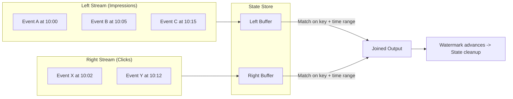
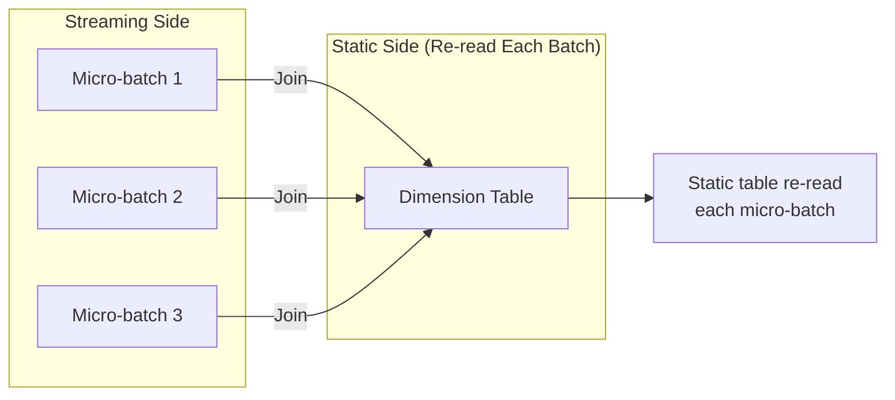
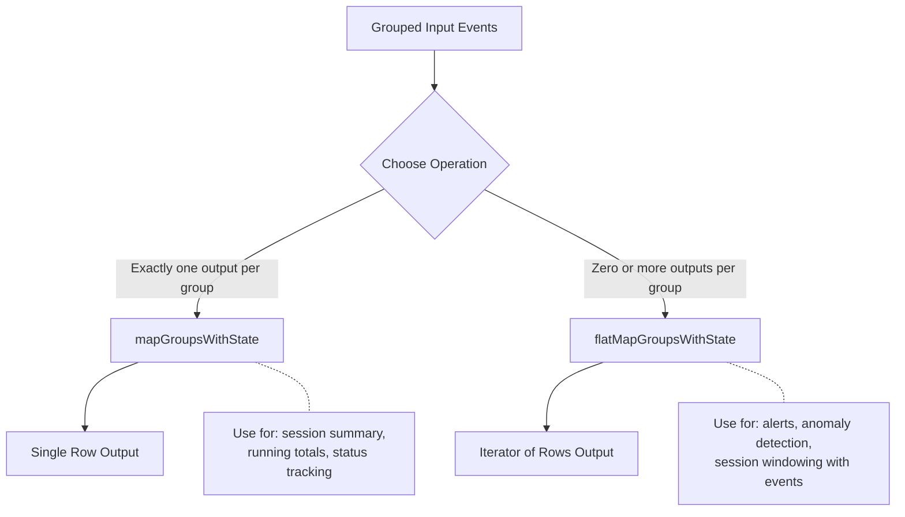
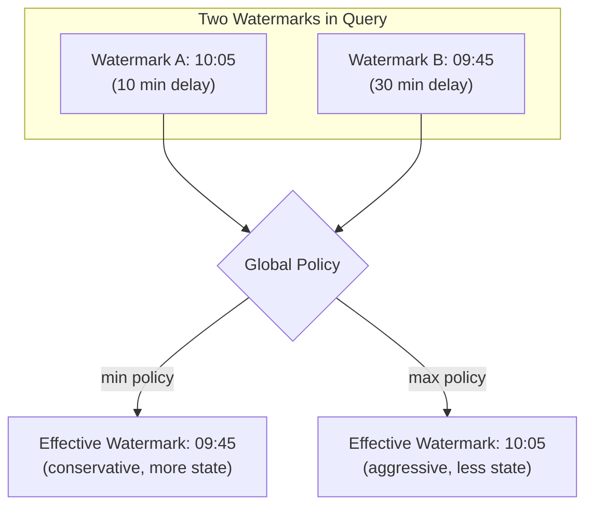
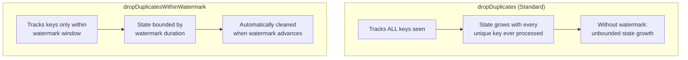
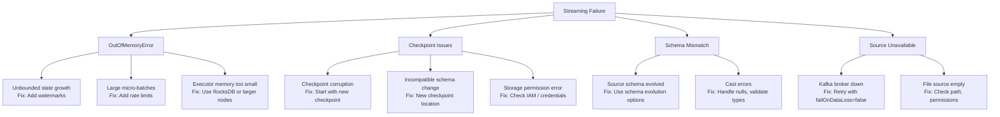
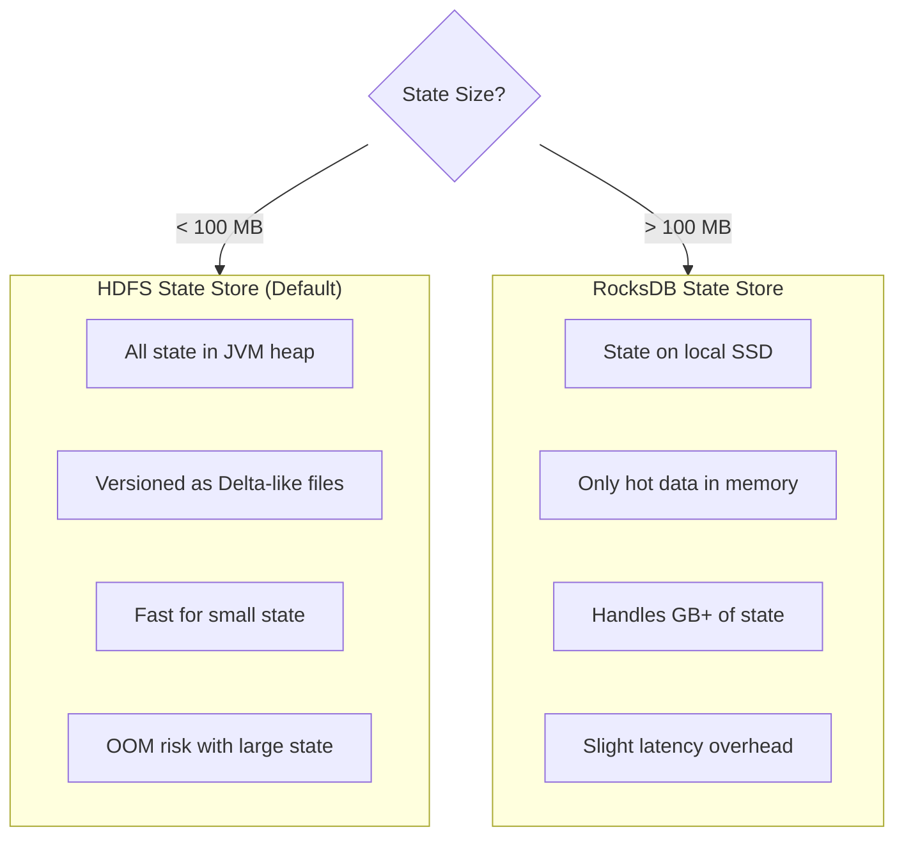

# Advanced Streaming

This guide covers advanced Structured Streaming topics beyond the fundamentals. Focus areas include stream-stream joins, stateful processing, advanced watermarking, deduplication patterns, back-pressure management, and production monitoring. These topics appear frequently on the Professional exam.

> For streaming basics (triggers, output modes, sources, sinks, foreachBatch), see [Structured Streaming](03-structured-streaming.md).

## Stream-Stream Joins

Stream-stream joins combine two unbounded streaming DataFrames. Both sides must buffer state until matching records arrive, making watermarks essential for bounding state.

### Architecture



### Inner Stream-Stream Join

Both streams must define watermarks. A time range condition in the join predicate bounds how long state is retained.

```python
from pyspark.sql.functions import expr

# Define watermarks on BOTH streams
impressions = (
    spark.readStream
    .format("delta")
    .load("/data/impressions")
    .withWatermark("impression_time", "2 hours")
)

clicks = (
    spark.readStream
    .format("delta")
    .load("/data/clicks")
    .withWatermark("click_time", "3 hours")
)

# Inner join with time range condition
joined = impressions.join(
    clicks,
    expr("""
        impressions.ad_id = clicks.ad_id AND
        click_time >= impression_time AND
        click_time <= impression_time + INTERVAL 1 HOUR
    """)
)

query = (
    joined.writeStream
    .format("delta")
    .option("checkpointLocation", "/checkpoints/impression_clicks")
    .outputMode("append")
    .start("/output/impression_clicks")
)
```

```sql
-- SQL equivalent for stream-stream inner join
CREATE OR REFRESH STREAMING TABLE impression_clicks AS
SELECT
    i.ad_id,
    i.impression_time,
    c.click_time,
    c.user_id,
    TIMESTAMPDIFF(SECOND, i.impression_time, c.click_time) AS time_to_click
FROM STREAM(impressions) i
JOIN STREAM(clicks) c
    ON i.ad_id = c.ad_id
    AND c.click_time >= i.impression_time
    AND c.click_time <= i.impression_time + INTERVAL 1 HOUR;
```

### Outer Stream-Stream Joins

Outer joins produce NULL-padded results when no match is found within the watermark window. The requirements differ by join type.

```python
# Left outer join: RIGHT side must have watermark
# Left rows emit with NULLs if no right match found after watermark
left_outer_joined = impressions.join(
    clicks,
    expr("""
        impressions.ad_id = clicks.ad_id AND
        click_time >= impression_time AND
        click_time <= impression_time + INTERVAL 1 HOUR
    """),
    "leftOuter"
)

# Right outer join: LEFT side must have watermark
right_outer_joined = impressions.join(
    clicks,
    expr("""
        impressions.ad_id = clicks.ad_id AND
        click_time >= impression_time AND
        click_time <= impression_time + INTERVAL 1 HOUR
    """),
    "rightOuter"
)
```

### Stream-Stream Join Requirements

| Join Type | Left Watermark | Right Watermark | Time Range Condition | Output Mode |
| :--- | :--- | :--- | :--- | :--- |
| Inner | Required | Required | Required for state cleanup | Append |
| Left Outer | Optional | **Required** | Required | Append |
| Right Outer | **Required** | Optional | Required | Append |
| Full Outer | Required | Required | Required | Append |

### Time Range Condition Explained

The time range condition in the join predicate controls how long buffered state is retained on each side.

```python
# The time range condition determines state retention
# Without it, state grows unboundedly even with watermarks

# Example: clicks must occur within 1 hour after impression
expr("""
    click_time >= impression_time AND
    click_time <= impression_time + INTERVAL 1 HOUR
""")

# This means:
#   - Impressions are buffered up to: watermark(click) + 1 hour
#   - Clicks are buffered up to: watermark(impression) + 0
#   - Wider range = more state retained = more memory
```

| Time Range Width | State Size | Late Match Tolerance | Use Case |
| :--- | :--- | :--- | :--- |
| 1 minute | Small | Very low | Real-time correlation |
| 1 hour | Medium | Moderate | Ad click attribution |
| 24 hours | Large | High | Daily event matching |

### Practice Question: Stream-Stream Joins

You have two streaming DataFrames, `orders` and `shipments`. You want to join them so that every order appears in the output, even if no matching shipment is found within 48 hours. Both streams have watermarks defined. Which join type should you use?

A) Inner join
B) Left outer join
C) Right outer join
D) Cross join

> [!success]- Answer
> **Correct Answer: B**
>
> A left outer join ensures every row from the left stream (orders) appears in the output. If no matching shipment arrives within the time range defined by the watermark, the shipment columns are filled with NULLs. Inner join would drop unmatched orders. Right outer would guarantee all shipments appear, not all orders.

## Stream-Static Joins

Stream-static joins combine a streaming DataFrame with a batch (static) DataFrame, commonly used for enrichment lookups such as adding dimension data to streaming events.

### Key Behavior



### Stream-Static Join Code

```python
# Static dimension table (read as batch)
dim_products = spark.table("catalog.schema.dim_products")

# Streaming events
event_stream = (
    spark.readStream
    .format("delta")
    .load("/data/sales_events")
)

# Stream-static join (no watermark needed on static side)
enriched = event_stream.join(
    dim_products,
    event_stream.product_id == dim_products.product_id,
    "left"
)

query = (
    enriched.writeStream
    .format("delta")
    .option("checkpointLocation", "/checkpoints/enriched_sales")
    .outputMode("append")
    .start("/output/enriched_sales")
)
```

```sql
-- SQL stream-static join pattern
CREATE OR REFRESH STREAMING TABLE enriched_sales AS
SELECT
    e.*,
    p.product_name,
    p.category,
    p.price
FROM STREAM(sales_events) e
LEFT JOIN dim_products p
    ON e.product_id = p.product_id;
```

### Stream-Static vs Stream-Stream Comparison

| Aspect | Stream-Static | Stream-Stream |
| :--- | :--- | :--- |
| Static side re-read | Each micro-batch | N/A (both streaming) |
| Watermark required | Not on static side | Both sides (for inner) |
| State management | No state for static | State for both sides |
| Dimension changes | Picked up each batch | N/A |
| Use case | Enrichment / lookup | Correlating two event streams |
| Memory impact | Low (broadcast possible) | High (state buffering) |

### When Static Data Changes

The static DataFrame is re-read at the start of each micro-batch. If the underlying table is updated between batches, new micro-batches will see the updated data. However, there is no guarantee of consistency within a single micro-batch if the static table is being written to concurrently.

```python
# Pattern: Force refresh of static table
# Option 1: The default behavior re-reads automatically
dim_table = spark.table("catalog.schema.dim_products")

# Option 2: Cache control for large static tables
dim_table = spark.table("catalog.schema.dim_products").cache()
# WARNING: Cached tables are NOT re-read each batch
# Only use cache if the static table rarely changes
```

### Practice Question: Stream-Static Joins

A data engineer has a streaming pipeline that enriches click events with user profile data from a Delta table. The user profile table is updated hourly. The streaming query uses a processing time trigger of 30 seconds. How often does the streaming query see updates to the user profile table?

A) Only at query start
B) Every 30 seconds (each micro-batch)
C) Every hour when the table updates
D) Never, unless the query is restarted

> [!success]- Answer
> **Correct Answer: B**
>
> In a stream-static join, the static DataFrame is re-read at the start of each micro-batch. With a 30-second processing time trigger, the static table is re-read every 30 seconds, so any updates to the user profile table are picked up at the next micro-batch boundary. This is a key behavioral difference from caching the static table.

## Stateful Streaming Operations

### mapGroupsWithState vs flatMapGroupsWithState

Both enable arbitrary stateful processing beyond built-in aggregations. The key difference is output cardinality.



### mapGroupsWithState Deep Dive

Returns exactly one output record per group per micro-batch.

```python
from pyspark.sql.streaming import GroupState, GroupStateTimeout
from pyspark.sql.types import StructType, StructField, StringType, LongType, DoubleType

# Define output schema
output_schema = StructType([
    StructField("device_id", StringType()),
    StructField("event_count", LongType()),
    StructField("avg_temperature", DoubleType()),
    StructField("last_event_time", StringType())
])

def update_device_stats(key, events, state: GroupState):
    """Track running statistics per device."""
    # Handle timeout (state expiry)
    if state.hasTimedOut:
        old_state = state.get
        state.remove()
        return (key[0], old_state["count"], old_state["avg_temp"], "EXPIRED")

    # Get current state or initialize
    if state.exists:
        current = state.get
    else:
        current = {"count": 0, "sum_temp": 0.0, "avg_temp": 0.0}

    # Process new events
    event_list = list(events)
    new_count = current["count"] + len(event_list)
    new_sum = current["sum_temp"] + sum(e.temperature for e in event_list)
    new_avg = new_sum / new_count
    last_time = str(max(e.event_time for e in event_list))

    # Update state
    new_state = {
        "count": new_count,
        "sum_temp": new_sum,
        "avg_temp": new_avg
    }
    state.update(new_state)

    # Set timeout (state expires if no new events within 30 minutes)
    state.setTimeoutDuration("30 minutes")

    return (key[0], new_count, new_avg, last_time)

# Apply mapGroupsWithState
result = (
    sensor_stream
    .withWatermark("event_time", "10 minutes")
    .groupByKey(lambda row: (row.device_id,))
    .mapGroupsWithState(
        update_device_stats,
        outputSchema=output_schema,
        outputMode="update",
        timeoutConf=GroupStateTimeout.ProcessingTimeTimeout
    )
)
```

### flatMapGroupsWithState Deep Dive

Returns zero or more output records per group per micro-batch.

```python
from typing import Iterator, Tuple

alert_schema = StructType([
    StructField("device_id", StringType()),
    StructField("alert_type", StringType()),
    StructField("value", DoubleType()),
    StructField("timestamp", StringType())
])

def detect_anomalies(
    key: Tuple,
    events: Iterator,
    state: GroupState
) -> Iterator[Tuple]:
    """Emit alerts when temperature exceeds thresholds."""
    # Handle timeout
    if state.hasTimedOut:
        state.remove()
        return iter([])

    # Get or initialize state
    if state.exists:
        history = state.get
    else:
        history = {"readings": [], "alert_count": 0}

    alerts = []
    event_list = list(events)

    for event in event_list:
        history["readings"].append(event.temperature)

        # Keep only last 10 readings
        if len(history["readings"]) > 10:
            history["readings"] = history["readings"][-10:]

        # Check for spike: current reading > 2x average
        avg = sum(history["readings"]) / len(history["readings"])
        if event.temperature > 2 * avg and len(history["readings"]) >= 5:
            history["alert_count"] += 1
            alerts.append((
                key[0],
                "TEMPERATURE_SPIKE",
                event.temperature,
                str(event.event_time)
            ))

        # Check for sustained high temperature
        if all(r > 100 for r in history["readings"][-5:]):
            alerts.append((
                key[0],
                "SUSTAINED_HIGH_TEMP",
                event.temperature,
                str(event.event_time)
            ))

    # Update state
    state.update(history)
    state.setTimeoutDuration("1 hour")

    return iter(alerts)

# Apply flatMapGroupsWithState
alerts = (
    sensor_stream
    .withWatermark("event_time", "10 minutes")
    .groupByKey(lambda row: (row.device_id,))
    .flatMapGroupsWithState(
        detect_anomalies,
        outputSchema=alert_schema,
        outputMode="append",
        timeoutConf=GroupStateTimeout.ProcessingTimeTimeout
    )
)
```

### GroupState Timeout Types

| Timeout Type | Trigger Condition | Requires Watermark | Use Case |
| :--- | :--- | :--- | :--- |
| `ProcessingTimeTimeout` | Wall clock time since last event | No | Idle session expiry |
| `EventTimeTimeout` | Watermark passes the timeout timestamp | Yes | Event-time based expiry |
| `NoTimeout` | Never expires | No | Permanent state (use with caution) |

```python
# Processing time timeout
# State expires based on wall clock (system time)
state.setTimeoutDuration("30 minutes")

# Event time timeout
# State expires when watermark passes the set timestamp
state.setTimeoutTimestamp(event_time_ms + 3600000)  # 1 hour in ms

# No timeout (dangerous - state grows forever)
# Only appropriate when number of keys is bounded and small
```

### When to Use Custom Stateful Operations vs Built-in

| Scenario | Recommended Approach |
| :--- | :--- |
| Windowed counts, sums, averages | Built-in aggregations + watermark |
| Distinct counts per window | Built-in `approx_count_distinct` |
| Custom session definitions | `flatMapGroupsWithState` |
| Running totals across windows | `mapGroupsWithState` |
| Anomaly detection with history | `flatMapGroupsWithState` |
| Complex state machines | `flatMapGroupsWithState` |
| Simple deduplication | `dropDuplicatesWithinWatermark` |

## Advanced Watermarking

### Multiple Watermarks in a Query

When a streaming query involves multiple operators that each define watermarks (for example, a stream-stream join followed by a windowed aggregation), Spark must reconcile them using a global watermark policy.

```python
# Stream A with 10-minute watermark
stream_a = (
    spark.readStream.format("delta").load("/data/stream_a")
    .withWatermark("event_time_a", "10 minutes")
)

# Stream B with 30-minute watermark
stream_b = (
    spark.readStream.format("delta").load("/data/stream_b")
    .withWatermark("event_time_b", "30 minutes")
)

# Join produces a query with two watermarks
joined = stream_a.join(
    stream_b,
    expr("""
        stream_a.key = stream_b.key AND
        event_time_b >= event_time_a AND
        event_time_b <= event_time_a + INTERVAL 5 MINUTES
    """)
)
```

### Global Watermark Policy

When multiple watermarks exist, Spark uses a global policy to determine the effective watermark for the entire query.

```python
# Set global watermark policy
spark.conf.set(
    "spark.sql.streaming.multipleWatermarkPolicy",
    "min"  # default: uses the MINIMUM watermark
)

# Alternative: use the maximum watermark
spark.conf.set(
    "spark.sql.streaming.multipleWatermarkPolicy",
    "max"
)
```

| Policy | Behavior | Data Safety | State Size |
| :--- | :--- | :--- | :--- |
| `min` (default) | Uses the slowest watermark | Safer (less data dropped) | Larger (more state retained) |
| `max` | Uses the fastest watermark | Aggressive (more data dropped) | Smaller (state cleaned sooner) |



### Watermark Propagation Through Operations

Watermarks propagate through transformations but have specific rules.

| Operation | Watermark Behavior |
| :--- | :--- |
| `filter`, `select`, `map` | Watermark passes through unchanged |
| `union` of two streams | Min of both watermarks |
| Stream-stream join | Both watermarks retained, global policy applies |
| Aggregation | Watermark used for state cleanup |
| `flatMapGroupsWithState` | Watermark available via `state.getCurrentWatermarkMs()` |

### Watermark Boundary Edge Cases

Understanding exact boundary behavior is critical for exam questions.

```python
# Watermark = max(event_time) - threshold
# Example: threshold = 10 minutes, max event_time seen = 10:25
# Watermark = 10:15

# Events arriving at exactly the watermark boundary:
#   event_time = 10:15 -> PROCESSED (not dropped)
#   event_time = 10:14 -> DROPPED (strictly less than watermark)
#   event_time = 10:16 -> PROCESSED
```

| Event Time | Watermark (10:15) | Result |
| :--- | :--- | :--- |
| 10:16 | 10:15 | Processed |
| 10:15 | 10:15 | Processed (at boundary = included) |
| 10:14 | 10:15 | Dropped (before boundary) |
| 10:00 | 10:15 | Dropped |

> **Key rule**: Events at exactly the watermark boundary are **included**, not dropped. The condition is `event_time >= watermark`, not `event_time > watermark`.

### Impact on State Store Cleanup

Watermark advancement triggers state cleanup for completed windows.

```python
# Window: 10:00-10:10, Watermark delay: 10 minutes
# When max event_time = 10:25 -> watermark = 10:15
# Window 10:00-10:10 end (10:10) < watermark (10:15) -> state cleaned
# Window 10:05-10:15 end (10:15) <= watermark (10:15) -> state cleaned
# Window 10:10-10:20 end (10:20) > watermark (10:15) -> state retained
```

### Practice Question: Watermark Policy

A streaming query joins two streams. Stream A has a watermark delay of 5 minutes and Stream B has a watermark delay of 30 minutes. The global watermark policy is set to "min". Stream A's max event time is 11:00 and Stream B's max event time is 10:50. What is the effective watermark for state cleanup?

A) 10:20 (Stream B: 10:50 - 30 min)
B) 10:55 (Stream A: 11:00 - 5 min)
C) 10:37 (average of both watermarks)
D) 10:50 (max of the two event times minus min delay)

> [!success]- Answer
> **Correct Answer: A**
>
> With the "min" policy, the effective watermark is the minimum of all individual watermarks. Stream A's watermark = 11:00 - 5 min = 10:55. Stream B's watermark = 10:50 - 30 min = 10:20. The minimum is 10:20, which becomes the effective global watermark. This is conservative: state is retained longer, reducing the chance of dropping late data from either stream.

## Streaming Deduplication

### dropDuplicates vs dropDuplicatesWithinWatermark



### dropDuplicatesWithinWatermark

This method only deduplicates events that arrive within the watermark window of each other. It is more memory-efficient but may not catch duplicates that arrive far apart.

```python
from pyspark.sql.functions import col

# Efficient: dedup only within watermark window
deduped = (
    event_stream
    .withWatermark("event_time", "15 minutes")
    .dropDuplicatesWithinWatermark(["transaction_id"])
)

query = (
    deduped.writeStream
    .format("delta")
    .option("checkpointLocation", "/checkpoints/deduped_events")
    .outputMode("append")
    .start("/output/deduped_events")
)
```

```sql
-- SQL streaming deduplication with watermark
CREATE OR REFRESH STREAMING TABLE deduped_transactions AS
SELECT *
FROM STREAM(raw_transactions)
-- Note: In DLT, deduplication is handled via APPLY CHANGES
-- For standard SQL streaming, use Python API
```

### Deduplication State Comparison

| Method | State Contents | State Growth | Cleanup |
| :--- | :--- | :--- | :--- |
| `dropDuplicates(["id"])` | All unique IDs ever seen | Unbounded (without watermark) | Only with watermark on event time column |
| `dropDuplicates(["id", "event_time"])` | ID + event_time pairs | Bounded by watermark | Watermark cleans old pairs |
| `dropDuplicatesWithinWatermark(["id"])` | IDs within watermark window | Bounded by watermark | Automatic on watermark advance |

### Exactly-Once Guarantees with Deduplication

Combining streaming deduplication with checkpoint-based exactly-once delivery.

```python
def idempotent_dedup_write(batch_df, batch_id):
    """Combine streaming dedup with MERGE for end-to-end exactly-once."""
    from delta.tables import DeltaTable

    # Deduplicate within the micro-batch
    deduped = batch_df.dropDuplicates(["transaction_id"])

    # MERGE into target for cross-batch deduplication
    target = DeltaTable.forName(spark, "catalog.schema.transactions")

    target.alias("t").merge(
        deduped.alias("s"),
        "t.transaction_id = s.transaction_id"
    ).whenNotMatchedInsertAll(
    ).execute()

# Streaming with foreachBatch for exactly-once dedup
query = (
    event_stream
    .withWatermark("event_time", "10 minutes")
    .dropDuplicatesWithinWatermark(["transaction_id"])
    .writeStream
    .foreachBatch(idempotent_dedup_write)
    .option("checkpointLocation", "/checkpoints/exact_once_dedup")
    .start()
)
```

### Practice Question: Streaming Deduplication

A streaming pipeline processes IoT sensor readings. Duplicate readings can arrive up to 5 minutes apart. The pipeline must minimize memory usage while preventing duplicates. Which approach is most appropriate?

A) `dropDuplicates(["sensor_id", "reading_time"])` without watermark
B) `dropDuplicates(["sensor_id"])` with a 5-minute watermark
C) `dropDuplicatesWithinWatermark(["sensor_id", "reading_time"])` with a 5-minute watermark
D) `foreachBatch` with MERGE on sensor_id

> [!success]- Answer
> **Correct Answer: C**
>
> `dropDuplicatesWithinWatermark` with a 5-minute watermark is ideal because it only tracks keys within the watermark window, minimizing memory usage. Option A has no watermark, causing unbounded state growth. Option B deduplicates on sensor_id alone, which would drop all but the first reading per sensor. Option D works but uses more resources and is more complex than necessary.

## Back-Pressure and Rate Limiting

### Rate Limiting Configuration

Control how much data each micro-batch processes to prevent overwhelming downstream systems or running out of memory.

```python
# Delta / Auto Loader rate limiting
stream = (
    spark.readStream
    .format("cloudFiles")
    .option("cloudFiles.format", "json")
    .option("cloudFiles.schemaLocation", "/schema/events")
    # File-level rate limiting
    .option("maxFilesPerTrigger", 100)
    # Byte-level rate limiting
    .option("maxBytesPerTrigger", "10g")
    .load("/data/raw/events")
)

# Kafka rate limiting
kafka_stream = (
    spark.readStream
    .format("kafka")
    .option("kafka.bootstrap.servers", "broker1:9092")
    .option("subscribe", "events")
    # Offset-level rate limiting
    .option("maxOffsetsPerTrigger", 500000)
    # Min partitions for parallelism
    .option("minPartitions", 10)
    .load()
)

# Delta table source rate limiting
delta_stream = (
    spark.readStream
    .format("delta")
    .option("maxFilesPerTrigger", 1000)
    .option("maxBytesPerTrigger", "5g")
    .load("/data/source_table")
)
```

### Rate Limiting Parameters by Source

| Source | Parameter | Default | Effect |
| :--- | :--- | :--- | :--- |
| Delta / Auto Loader | `maxFilesPerTrigger` | 1000 | Max files per micro-batch |
| Delta / Auto Loader | `maxBytesPerTrigger` | None | Max bytes per micro-batch |
| Kafka | `maxOffsetsPerTrigger` | None (all) | Max records per micro-batch |
| Kafka | `minPartitions` | Kafka partitions | Min read partitions |
| Rate source | `rowsPerSecond` | 1 | Rows generated per second |

### Detecting Back-Pressure

Back-pressure occurs when processing takes longer than the trigger interval, causing a growing backlog.

```python
# Monitor back-pressure indicators
def check_backpressure(query):
    progress = query.lastProgress
    if progress is None:
        return

    input_rate = progress.get("inputRowsPerSecond", 0)
    process_rate = progress.get("processedRowsPerSecond", 0)
    batch_duration = progress.get("batchDuration", 0)
    trigger_ms = progress.get("triggerExecution", {}).get(
        "triggerIntervalMs", 0
    )

    print(f"Input rate:    {input_rate:.0f} rows/sec")
    print(f"Process rate:  {process_rate:.0f} rows/sec")
    print(f"Batch duration: {batch_duration} ms")

    if process_rate > 0 and input_rate > process_rate:
        print("WARNING: Back-pressure detected!")
        print(f"  Ratio: {input_rate / process_rate:.2f}x")

    if trigger_ms > 0 and batch_duration > trigger_ms:
        print("WARNING: Batch duration exceeds trigger interval!")
```

### Back-Pressure Indicators

| Metric | Healthy | Back-Pressure | Action |
| :--- | :--- | :--- | :--- |
| `inputRowsPerSecond` vs `processedRowsPerSecond` | Input <= Process | Input > Process | Reduce batch size or add resources |
| Batch duration vs trigger interval | Duration < Interval | Duration > Interval | Increase trigger interval or optimize |
| `numInputRows` trend | Stable | Growing | Check source rate, add rate limits |
| State size trend | Stable or bounded | Monotonically growing | Check watermarks, add timeouts |

### StreamingQueryListener for Monitoring

```python
from pyspark.sql.streaming import StreamingQueryListener

class BackpressureListener(StreamingQueryListener):
    def onQueryStarted(self, event):
        print(f"Query started: {event.id}")

    def onQueryProgress(self, event):
        progress = event.progress
        input_rate = progress.inputRowsPerSecond
        process_rate = progress.processedRowsPerSecond

        # Log metrics to monitoring system
        if process_rate > 0 and input_rate > process_rate * 1.5:
            print(
                f"ALERT: Query {event.progress.name} "
                f"backpressure ratio: {input_rate / process_rate:.2f}"
            )

        # Check state operator metrics
        for op in progress.stateOperators:
            if op.numRowsTotal > 1000000:
                print(
                    f"ALERT: State size {op.numRowsTotal} rows "
                    f"for operator {op.operatorName}"
                )

    def onQueryTerminated(self, event):
        print(f"Query terminated: {event.id}")
        if event.exception:
            print(f"Exception: {event.exception}")

# Register the listener
spark.streams.addListener(BackpressureListener())
```

## Streaming Monitoring and Troubleshooting

### query.recentProgress Analysis

The `recentProgress` attribute returns the last 100 progress reports, enabling trend analysis.

```python
# Analyze recent progress for trends
progress_list = query.recentProgress

if progress_list:
    # Extract key metrics over time
    for p in progress_list[-5:]:  # Last 5 batches
        batch_id = p.get("batchId", "N/A")
        num_rows = p.get("numInputRows", 0)
        duration = p.get("batchDuration", 0)
        input_rate = p.get("inputRowsPerSecond", 0)
        process_rate = p.get("processedRowsPerSecond", 0)

        state_info = ""
        if p.get("stateOperators"):
            state_op = p["stateOperators"][0]
            state_rows = state_op.get("numRowsTotal", 0)
            state_mem = state_op.get("memoryUsedBytes", 0)
            dropped = state_op.get("numRowsDroppedByWatermark", 0)
            state_info = (
                f"  State: {state_rows} rows, "
                f"{state_mem / 1024 / 1024:.1f} MB, "
                f"{dropped} dropped"
            )

        print(
            f"Batch {batch_id}: {num_rows} rows, "
            f"{duration}ms, "
            f"in={input_rate:.0f}/s, "
            f"proc={process_rate:.0f}/s"
            f"{state_info}"
        )
```

### Key Progress Metrics Reference

| Metric Path | Description | What to Watch |
| :--- | :--- | :--- |
| `numInputRows` | Rows in this micro-batch | Sudden spikes or drops |
| `inputRowsPerSecond` | Ingestion rate | Should match source rate |
| `processedRowsPerSecond` | Processing throughput | Must keep up with input |
| `batchDuration` | Total batch time (ms) | Should be < trigger interval |
| `stateOperators[].numRowsTotal` | Total rows in state store | Should not grow unboundedly |
| `stateOperators[].memoryUsedBytes` | State memory usage | Approaching executor memory limit |
| `stateOperators[].numRowsDroppedByWatermark` | Late events dropped | High = adjust watermark or source |
| `sources[].startOffset` | Where batch started reading | Verify expected offsets |
| `sources[].endOffset` | Where batch finished reading | Verify progress |
| `sink.numOutputRows` | Rows written to sink | Should match expected output |

### Common Failure Patterns



### Checkpoint Corruption Recovery

```python
# Step 1: Check checkpoint contents
dbutils.fs.ls("/checkpoints/my_query/")
# Expected: commits/, offsets/, sources/, state/, metadata

# Step 2: Check for corrupted state
try:
    state_df = spark.read.format("statestore").load(
        "/checkpoints/my_query/state/0"
    )
    print(f"State rows: {state_df.count()}")
except Exception as e:
    print(f"State corrupted: {e}")

# Step 3: Recovery options

# Option A: Resume from last valid checkpoint (automatic)
# Spark will attempt this by default on restart

# Option B: Start fresh (loses exactly-once guarantee during transition)
# Use only if checkpoint is unrecoverable
dbutils.fs.rm("/checkpoints/my_query/", recurse=True)
# Restart query with same checkpoint path

# Option C: Start from specific offset (Kafka)
query = (
    df.writeStream
    .format("delta")
    .option("checkpointLocation", "/checkpoints/my_query_v2/")
    .start("/output/table")
)
```

### Checkpoint Compatibility Rules

| Change Type | Compatible? | Action Required |
| :--- | :--- | :--- |
| Add new column to select | Yes | Resume from existing checkpoint |
| Remove column from select | Yes | Resume from existing checkpoint |
| Change filter condition | Yes | Resume from existing checkpoint |
| Change groupBy keys | **No** | New checkpoint location required |
| Change watermark delay | **No** | New checkpoint location required |
| Change join condition | **No** | New checkpoint location required |
| Change state schema | **No** | New checkpoint location required |
| Add new stateful operator | **No** | New checkpoint location required |
| Change output mode | **No** | New checkpoint location required |

### Monitoring Dashboard Checklist

```python
# Production monitoring script
def streaming_health_check():
    """Run periodic health checks on all active streams."""
    for query in spark.streams.active:
        progress = query.lastProgress
        if not progress:
            continue

        name = query.name or query.id

        # Check 1: Is batch duration reasonable?
        duration = progress.get("batchDuration", 0)
        if duration > 60000:  # > 60 seconds
            print(f"WARN [{name}]: Batch duration {duration}ms > 60s")

        # Check 2: Is state growing unboundedly?
        for op in progress.get("stateOperators", []):
            total_rows = op.get("numRowsTotal", 0)
            if total_rows > 5000000:
                print(
                    f"ALERT [{name}]: State has {total_rows} rows"
                )

        # Check 3: Are we keeping up with input?
        input_rate = progress.get("inputRowsPerSecond", 0)
        process_rate = progress.get("processedRowsPerSecond", 0)
        if process_rate > 0 and input_rate > process_rate * 2:
            print(
                f"ALERT [{name}]: Input rate {input_rate:.0f}/s "
                f">> process rate {process_rate:.0f}/s"
            )

        # Check 4: Any exceptions?
        exc = query.exception()
        if exc:
            print(f"ERROR [{name}]: {exc}")

streaming_health_check()
```

## State Store Deep Dive

### HDFS vs RocksDB State Store



### RocksDB Configuration

```python
# Enable RocksDB state store
spark.conf.set(
    "spark.sql.streaming.stateStore.providerClass",
    "com.databricks.sql.streaming.state.RocksDBStateStoreProvider"
)

# RocksDB tuning options
spark.conf.set(
    "spark.sql.streaming.stateStore.rocksdb.compactOnCommit", "true"
)
spark.conf.set(
    "spark.sql.streaming.stateStore.rocksdb.changelogCheckpointing.enabled",
    "true"
)

# Changelog checkpointing: reduces checkpoint time by writing
# only changes (deltas) instead of full snapshots
# Recommended for large state stores
```

### State Store Selection Guide

| Factor | HDFS (Default) | RocksDB |
| :--- | :--- | :--- |
| State size | < 100 MB | 100 MB to 100+ GB |
| Memory usage | All in heap | Spills to disk |
| Checkpoint speed | Fast (small state) | Fast with changelog |
| Recovery time | Fast | Slightly slower |
| Key count | < 1M keys | Millions of keys |
| Recommended for | Simple aggregations | Stream-stream joins, large dedup |

## Common Issues and Errors

### 1. Stream-Stream Join State Explosion

**Scenario:** Two streams joined without time range condition. State grows without bound even with watermarks defined.

**Fix:** Always include a time range condition in the join predicate that bounds how long events from each side need to be retained.

**Exam Context:** Questions often test whether you know that watermarks alone are not sufficient for stream-stream joins -- a time range condition in the join predicate is also required for effective state cleanup.

### 2. Outer Join Producing No NULL Results

**Scenario:** Left outer stream-stream join never emits rows with NULL right-side columns. The watermark on the right stream is too short, or the time range condition is too narrow.

**Fix:** Ensure the right-side watermark delay is large enough to allow reasonable matching time. NULL-padded rows emit only after the watermark guarantees no match can arrive.

### 3. mapGroupsWithState Timeout Not Firing

**Scenario:** State timeout configured with `ProcessingTimeTimeout` but `hasTimedOut` never returns true.

**Fix:** Timeouts only fire when there is data to process. If no new events arrive for a group, the timeout callback will not be invoked until the next micro-batch that has at least some data for any group. Ensure the stream receives regular input.

### 4. Global Watermark Too Conservative

**Scenario:** Using "min" watermark policy with two streams where one is much slower. State grows excessively because the effective watermark is held back by the slow stream.

**Fix:** Consider switching to "max" policy if some late data loss is acceptable. Alternatively, ensure both streams have similar data arrival rates.

### 5. Dedup State OOM After Hours of Running

**Scenario:** Using `dropDuplicates` without watermark or with a very wide watermark. State grows until executor runs out of memory.

**Fix:** Use `dropDuplicatesWithinWatermark` with an appropriately sized watermark, or switch to RocksDB state store for large state.

### 6. Checkpoint Incompatible After Adding Aggregation

**Scenario:** Adding a `groupBy` aggregation to an existing streaming query and trying to resume from the old checkpoint.

**Fix:** Any change to stateful operators requires a new checkpoint location. Start the modified query with a fresh checkpoint path.

### 7. StreamingQueryListener Not Receiving Events

**Scenario:** Registered listener does not receive `onQueryProgress` events.

**Fix:** Ensure the listener is registered before the query starts. Verify the listener class extends `StreamingQueryListener` and implements all three methods (`onQueryStarted`, `onQueryProgress`, `onQueryTerminated`).

## Exam Tips

1. **Stream-stream joins require watermarks on both sides** for inner joins, and on the opposite side for outer joins (left outer needs right watermark, right outer needs left watermark)
2. **Time range conditions are essential** in stream-stream join predicates for bounding state; watermarks alone are not sufficient for state cleanup
3. **Stream-static joins re-read the static side** each micro-batch; no watermark is needed on the static side
4. **`mapGroupsWithState`** emits exactly one output per group; **`flatMapGroupsWithState`** emits zero or more
5. **ProcessingTimeTimeout** is based on wall clock time; **EventTimeTimeout** is based on the watermark advancing past a set timestamp
6. **Global watermark policy "min"** (default) is conservative and retains more state; **"max"** is aggressive and drops more late data
7. **Events at exactly the watermark boundary are included** (not dropped); the condition is `event_time >= watermark`
8. **`dropDuplicatesWithinWatermark`** is more memory-efficient than `dropDuplicates` because it only tracks keys within the watermark window
9. **Checkpoint compatibility**: changing groupBy keys, watermark delay, join conditions, state schema, or output mode requires a **new checkpoint location**
10. **Back-pressure** is indicated when `inputRowsPerSecond` exceeds `processedRowsPerSecond` or batch duration exceeds the trigger interval; use `maxOffsetsPerTrigger` (Kafka) or `maxFilesPerTrigger` (files) to control intake

## Best Practices

- Always define watermarks on both sides of stream-stream joins with tight time range conditions
- Use `dropDuplicatesWithinWatermark` instead of `dropDuplicates` for streaming deduplication
- Choose RocksDB state store when state exceeds 100 MB or has high key cardinality
- Enable changelog checkpointing for RocksDB to reduce checkpoint overhead
- Implement `StreamingQueryListener` for production monitoring and alerting
- Set appropriate rate limits (`maxFilesPerTrigger`, `maxOffsetsPerTrigger`) to prevent back-pressure
- Monitor `stateOperators.numRowsTotal` to detect unbounded state growth
- Use `flatMapGroupsWithState` only when you need zero-or-many output semantics; prefer built-in aggregations when possible
- Test stateful logic with small datasets and the `rate` source before connecting production sources
- Keep checkpoint locations versioned (e.g., `/checkpoints/query_v2/`) when making incompatible query changes

## Related Topics

- [Structured Streaming](03-structured-streaming.md) - Streaming fundamentals, triggers, output modes, basic watermarking
- [Auto Loader](04-auto-loader.md) - File ingestion with schema inference and evolution
- [Performance Optimization](../08-performance-optimization/03-spark-tuning.md) - Spark tuning for streaming workloads
- [Data Deduplication](07-data-deduplication.md) - Batch and streaming dedup patterns
- [Streaming Optimization](../08-performance-optimization/05-streaming-optimization.md) - File sizing, trigger tuning, checkpoint optimization

## Official Documentation

- [Stream-Stream Joins](https://docs.databricks.com/structured-streaming/stream-stream-joins.html)
- [Stateful Streaming](https://docs.databricks.com/structured-streaming/stateful-streaming.html)
- [Watermarks](https://docs.databricks.com/structured-streaming/watermarks.html)
- [RocksDB State Store](https://docs.databricks.com/structured-streaming/rocksdb-state-store.html)
- [Streaming Deduplication](https://docs.databricks.com/structured-streaming/dedup.html)
- [StreamingQueryListener](https://docs.databricks.com/structured-streaming/streaming-query-listener.html)
- [Structured Streaming Guide](https://docs.databricks.com/structured-streaming/index.html)
