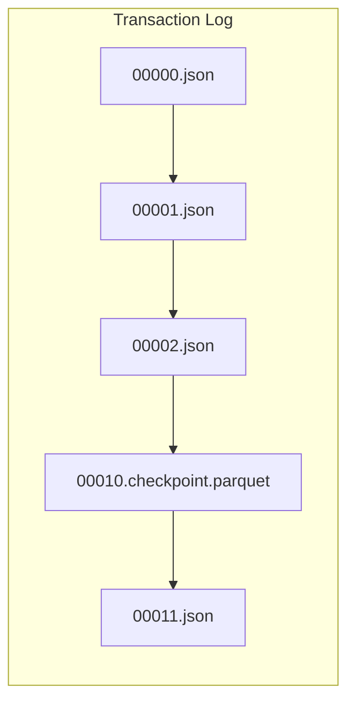
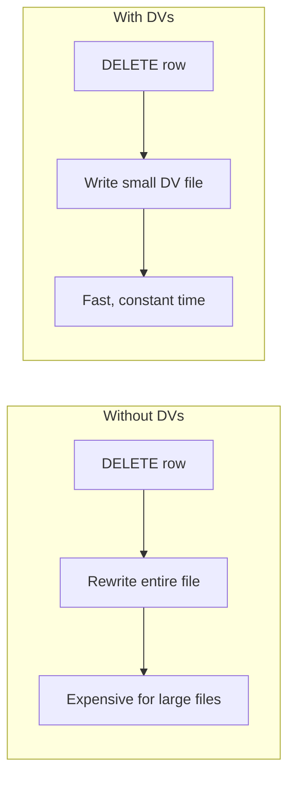

# Delta Lake Operations — Part 2

This part covers schema operations, key table properties, transaction log internals, Delta 3.0+ features (deletion vectors, predictive optimization, UniForm, identity columns, VACUUM LITE, row tracking, liquid clustering), use cases, common issues, and exam tips.

> For MERGE, OPTIMIZE, VACUUM, time travel, and table cloning, see [Part 1](./04-delta-lake-operations-part1.md).

## Schema Operations

### Add Column

```sql
ALTER TABLE table_name ADD COLUMN new_col STRING;
ALTER TABLE table_name ADD COLUMN new_col STRING AFTER existing_col;
ALTER TABLE table_name ADD COLUMNS (col1 STRING, col2 INT);
```

### Rename Column

```sql
ALTER TABLE table_name RENAME COLUMN old_name TO new_name;
```

### Change Column Type

```sql
-- Only widening conversions allowed (e.g., INT to BIGINT)
ALTER TABLE table_name ALTER COLUMN col_name TYPE BIGINT;
```

### Add Constraints

```sql
-- Primary key (informational, not enforced)
ALTER TABLE table_name ADD CONSTRAINT pk PRIMARY KEY (id);

-- Check constraint (enforced)
ALTER TABLE table_name ADD CONSTRAINT chk_amount CHECK (amount > 0);

-- Not null constraint
ALTER TABLE table_name ALTER COLUMN col_name SET NOT NULL;

-- Drop constraint
ALTER TABLE table_name DROP CONSTRAINT constraint_name;
```

## Key Table Properties

| Property | Description | Default |
|----------|-------------|---------|
| `delta.enableChangeDataFeed` | Enable Change Data Feed | false |
| `delta.autoOptimize.optimizeWrite` | Optimize file sizes on write | false |
| `delta.autoOptimize.autoCompact` | Auto-compact after writes | false |
| `delta.logRetentionDuration` | Transaction log retention | 30 days |
| `delta.deletedFileRetentionDuration` | Deleted file retention | 7 days |
| `delta.minReaderVersion` | Minimum reader protocol | varies |
| `delta.minWriterVersion` | Minimum writer protocol | varies |

## Transaction Log

The transaction log (`_delta_log/`) is the source of truth for Delta tables.



- JSON files record each transaction
- Checkpoint files (every 10 commits) for faster reads
- Enables ACID transactions and time travel

## Delta Lake 3.0+ Features

These modern features are increasingly important for the exam.

### Deletion Vectors

Deletion vectors mark rows as deleted without rewriting entire data files, significantly improving DELETE, UPDATE, and MERGE performance.



| Aspect | Without DVs | With DVs |
|--------|-------------|----------|
| DELETE/UPDATE | Rewrite entire file | Write small DV file |
| Performance | Slow for large files | Fast, constant time |
| Space reclaim | Immediate | On VACUUM |
| File count | Fewer files | More small DV files |

#### Enabling Deletion Vectors

```sql
-- Enable on new table
CREATE TABLE table_name (
    id INT,
    name STRING
) USING DELTA
TBLPROPERTIES ('delta.enableDeletionVectors' = 'true');

-- Enable on existing table
ALTER TABLE table_name
SET TBLPROPERTIES ('delta.enableDeletionVectors' = 'true');
```

```python
# Check if DVs are enabled

spark.sql("DESCRIBE DETAIL table_name").select("properties").show(truncate=False)
```

**Exam Tip**: Deletion vectors are enabled by default on Databricks Runtime 14.x+ for new tables.

### Predictive Optimization

Databricks automatically analyzes table access patterns and runs OPTIMIZE and VACUUM operations.

```sql
-- Enable at table level
ALTER TABLE table_name
SET TBLPROPERTIES ('delta.enablePredictiveOptimization' = 'true');
```

| Feature | Behavior |
|---------|----------|
| Auto OPTIMIZE | Runs based on write patterns |
| Auto VACUUM | Runs based on file age and access |
| Workload analysis | Recommends clustering columns |
| Cost | Included in serverless compute |

**When to use**: Enable for tables with frequent small writes that need regular optimization without manual scheduling.

### Delta UniForm (Universal Format)

UniForm enables reading Delta tables as Apache Iceberg or Apache Hudi without data conversion.

```sql
-- Enable UniForm for Iceberg compatibility
CREATE TABLE table_name (
    id INT,
    name STRING
) USING DELTA
TBLPROPERTIES ('delta.universalFormat.enabledFormats' = 'iceberg');

-- Enable on existing table
ALTER TABLE table_name
SET TBLPROPERTIES ('delta.universalFormat.enabledFormats' = 'iceberg');

-- Enable both Iceberg and Hudi
ALTER TABLE table_name
SET TBLPROPERTIES ('delta.universalFormat.enabledFormats' = 'iceberg,hudi');
```

| Format | Use Case | Compatibility |
|--------|----------|---------------|
| Iceberg | Snowflake, Trino, Presto, Spark | Iceberg v2 |
| Hudi | Existing Hudi ecosystems | Hudi 0.14+ |

**Trade-offs**:

- Additional metadata storage overhead
- Slight write latency increase
- Enables cross-platform data sharing

### Identity Columns

Auto-generate unique sequential IDs for new rows (Delta 3.3+).

```sql
-- GENERATED ALWAYS - system controls all values
CREATE TABLE orders (
    order_id BIGINT GENERATED ALWAYS AS IDENTITY,
    customer_id INT,
    amount DOUBLE
) USING DELTA;

-- GENERATED BY DEFAULT - allows manual override
CREATE TABLE orders (
    order_id BIGINT GENERATED BY DEFAULT AS IDENTITY (START WITH 1000 INCREMENT BY 1),
    customer_id INT,
    amount DOUBLE
) USING DELTA;
```

| Option | Behavior |
|--------|----------|
| `GENERATED ALWAYS` | System generates all values, manual insert fails |
| `GENERATED BY DEFAULT` | System generates if not provided, allows override |
| `START WITH` | Initial value |
| `INCREMENT BY` | Step between values |

**Use cases**: Surrogate keys, audit sequences, replacing sequences from source systems.

### VACUUM LITE

Faster file cleanup using transaction log analysis (Delta 3.3+).

```sql
-- VACUUM LITE uses transaction log for faster cleanup
VACUUM table_name LITE;

-- Still supports retention
VACUUM table_name LITE RETAIN 168 HOURS;
```

| Aspect | Standard VACUUM | VACUUM LITE |
|--------|-----------------|-------------|
| Performance | Slower (file listing) | 5-10x faster |
| Method | Lists all files | Uses transaction log |
| Best for | Occasional cleanup | Frequent cleanup |

### Row Tracking

Track row-level lineage across table versions (Delta 3.2+).

```sql
-- Enable row tracking on new table
CREATE TABLE table_name (...)
USING DELTA
TBLPROPERTIES ('delta.enableRowTracking' = 'true');

-- Enable on existing table (requires backfill)
ALTER TABLE table_name
SET TBLPROPERTIES ('delta.enableRowTracking' = 'true');
```

Row tracking adds hidden columns:

- `_row_id` - Stable identifier for each row
- `_row_commit_version` - Version when row was last modified

**Use cases**: Audit trails, CDC verification, debugging data lineage.

### Liquid Clustering Deep Dive

Expanding on Liquid Clustering for modern workloads:

#### Migration from ZORDER

```sql
-- Step 1: Check current ZORDER usage
DESCRIBE HISTORY table_name;

-- Step 2: Enable Liquid Clustering (replaces ZORDER)
ALTER TABLE table_name CLUSTER BY (col1, col2);

-- Step 3: Trigger initial clustering
OPTIMIZE table_name;
```

#### Liquid Clustering vs ZORDER vs Partitioning

| Feature | Partitioning | ZORDER | Liquid Clustering |
|---------|--------------|--------|-------------------|
| Column cardinality | Low | High | Any |
| Column changes | Requires rewrite | Requires rewrite | Incremental |
| Optimization | N/A | Manual OPTIMIZE | Automatic |
| Skipping | Partition pruning | Data skipping | Data skipping |
| Best for | Date, region | Customer ID, SKU | Evolving queries |

```sql
-- Liquid Clustering with OPTIMIZE still works
OPTIMIZE table_name;  -- Applies clustering

-- Check clustering columns
DESCRIBE DETAIL table_name;
```

## Use Cases

| Scenario | Recommended Operation | Why? |
|----------|-----------------------|------|
| **GDPR Compliance (Right to be Forgotten)** | `DELETE` + `VACUUM` | Removes PII from current table and history (physical deletion). |
| **Daily Full Refresh** | `overwrite` or `replaceWhere` | Efficiently replaces data without deleting table schema/history. |
| **Slow Filter Queries** | `OPTIMIZE` + `ZORDER` | Co-locates data to enable efficient data skipping. |
| **Handling Late Arriving Data** | `MERGE` | Updates existing records or inserts new ones based on keys. |

## Common Issues & Errors

### "Multiple matches" in MERGE

**Scenario:** Source table has duplicate keys matching a single target row.

**Fix:** Deduplicate the source data before running MERGE.

### Time Travel Fails ("File not found")

**Scenario:** Trying to query an old version after VACUUM has run.

**Fix:** Increase retention duration if longer history is needed, but accept higher storage costs.

### ZORDER Effectiveness Low

**Scenario:** Z-ordering on too many columns (e.g., > 5) or low-cardinality columns.

**Fix:** Limit ZORDER to 1-4 high-cardinality columns frequently used in WHERE clauses.

### VACUUM 0 Hours Data Loss

**Scenario:** User disabled safety check and ran `VACUUM RETAIN 0 HOURS`.

**Fix:** **Irreversible**. Recover from deep clone or backup if available. Never do this in production.

## Exam Tips

1. **VACUUM default is 168 hours (7 days)** - This is frequently tested
2. **MERGE WHEN MATCHED** can have multiple conditions with different actions
3. **ZORDER** columns should be high cardinality and used in WHERE clauses
4. **Time travel** requires files to exist - VACUUM removes old files
5. **Shallow clone** shares data files; **deep clone** copies them
6. **Auto Optimize** has two settings: `optimizeWrite` and `autoCompact`
7. **RESTORE** creates a new version, doesn't delete history
8. **Deletion vectors** are default on DBR 14.x+ - faster DELETE/UPDATE/MERGE
9. **Liquid Clustering** replaces ZORDER for evolving query patterns
10. **UniForm** enables reading Delta as Iceberg/Hudi for cross-platform sharing
11. **Predictive Optimization** auto-schedules OPTIMIZE and VACUUM

## Best Practices

- Run OPTIMIZE on partitions with many small files
- Use ZORDER on 1-4 high-cardinality filter columns
- Schedule VACUUM to run regularly but keep 7+ days retention
- Use shallow clones for testing, deep clones for backups
- Enable auto optimize for streaming or frequent small writes
- Compute statistics after large data loads for better query plans

## Key Takeaways

- **Deletion Vectors** (enabled by default on DBR 14.x+) mark rows as deleted by writing a small DV file instead of rewriting entire data files, significantly improving DELETE, UPDATE, and MERGE performance
- **Liquid Clustering** (`CLUSTER BY`) replaces ZORDER for evolving query patterns; it is incremental, does not require specifying low-cardinality columns, and allows column changes without full rewrites
- **Delta UniForm** (`delta.universalFormat.enabledFormats = 'iceberg'`) allows external engines (Snowflake, Trino, Presto) to read a Delta table as Iceberg without data conversion
- **Predictive Optimization** auto-schedules OPTIMIZE and VACUUM based on table access patterns, eliminating the need for manual maintenance jobs
- **VACUUM LITE** uses the transaction log rather than file listing for cleanup, making it 5–10x faster than standard VACUUM
- **Identity columns** (`GENERATED ALWAYS AS IDENTITY` vs `GENERATED BY DEFAULT AS IDENTITY`) auto-generate sequential surrogate keys; `ALWAYS` prevents manual inserts, `BY DEFAULT` allows overrides
- **Delta transaction log** checkpoints are created every 10 commits and speed up table reads; the log is the source of truth for ACID transactions and time travel
- **Column type widening** via `ALTER TABLE … ALTER COLUMN … TYPE` is limited to safe widening conversions (e.g., INT → BIGINT); narrowing conversions are not allowed

## Related Topics

- [Change Data Capture](../03-data-transformation-cleansing-quality/01-change-data-capture-part1.md) - MERGE generates CDF records
- [Data Deduplication](../03-data-transformation-cleansing-quality/02-data-deduplication.md) - MERGE for dedup patterns
- [Delta Lake Commands Cheat Sheet](../../../shared/cheat-sheets/delta-lake-commands.md)

## Official Documentation

- [Delta Lake MERGE](https://docs.databricks.com/delta/merge.html)
- [Delta Lake OPTIMIZE](https://docs.databricks.com/delta/optimize.html)
- [Delta Lake VACUUM](https://docs.databricks.com/delta/vacuum.html)
- [Delta Lake Time Travel](https://docs.databricks.com/delta/history.html)

---

**[← Previous: Delta Lake Operations — Part 1](./04-delta-lake-operations-part1.md) | [↑ Back to Data Processing](./README.md) | [Next: Data Deduplication](../03-data-transformation-cleansing-quality/02-data-deduplication.md) →**
