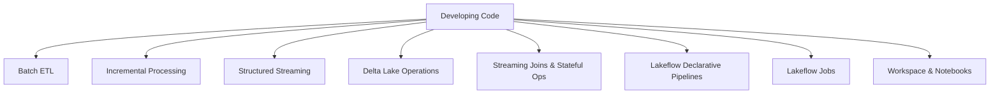

# Developing Code for Data Processing (22 % of Exam)

The **highest-weighted** domain in the November 30, 2025 blueprint. Covers writing and optimising Python and SQL for batch and streaming workloads, Delta Lake operations, Lakeflow Declarative Pipelines, Lakeflow Jobs, and the workspace/notebook tooling that hosts the code.

## Topics Overview

## Section Contents

| File | Topic | Priority |
| :--- | :--- | :--- |
| [01-batch-etl-pipelines-part1.md](./01-batch-etl-pipelines-part1.md) | ETL design patterns, DataFrame transformations, joins, aggregations | High |
| [01-batch-etl-pipelines-part2.md](./01-batch-etl-pipelines-part2.md) | Performance optimisation, error handling, use cases, exam tips | High |
| [02-incremental-processing.md](./02-incremental-processing.md) | Incremental loads, checkpoint management | High |
| [03-structured-streaming-part1.md](./03-structured-streaming-part1.md) | Streaming fundamentals, triggers, output modes, watermarking | High |
| [03-structured-streaming-part2.md](./03-structured-streaming-part2.md) | Stream-static joins, stateful operations, state store, exam tips | High |
| [04-delta-lake-operations-part1.md](./04-delta-lake-operations-part1.md) | MERGE, OPTIMIZE, VACUUM, ZORDER, time travel, table cloning | High |
| [04-delta-lake-operations-part2.md](./04-delta-lake-operations-part2.md) | Schema operations, table properties, Delta 3.0+ features, exam tips | High |
| [05-streaming-joins-stateful.md](./05-streaming-joins-stateful.md) | Stream-stream joins, stateful ops, watermarking, deduplication | High |
| [06-declarative-pipelines.md](./06-declarative-pipelines.md) | Lakeflow Declarative Pipelines syntax, materialized views, streaming tables | High |
| [07-lakeflow-jobs-part1.md](./07-lakeflow-jobs-part1.md) | Lakeflow Jobs basics, tasks, dependencies, parameters | High |
| [07-lakeflow-jobs-part2.md](./07-lakeflow-jobs-part2.md) | Job triggers, advanced patterns, monitoring, exam tips | High |
| [08-workspace-and-notebooks.md](./08-workspace-and-notebooks.md) | Workspace organisation, notebook patterns, magic commands | Medium |

## Key Concepts to Master

| Concept | Why it matters |
| :--- | :--- |
| **Idempotent writes** | Re-running the same code must produce the same output (critical for retries) |
| **Checkpointing** | Streaming queries persist state to durable storage for fault tolerance |
| **Watermarking** | Bounds how long state is kept for late-arriving data in streaming joins/aggregations |
| **Delta MERGE** | Single-statement upsert that handles inserts, updates, and deletes atomically |
| **Lakeflow Declarative Pipelines** | Declarative ETL framework (formerly Delta Live Tables) — define the *what*, not the *how* |
| **Lakeflow Jobs** | Orchestration layer (formerly Databricks Workflows) for scheduling notebooks, pipelines, and Python wheels |

## Related Resources

- [Spark Fundamentals (shared)](../../../shared/fundamentals/spark-fundamentals.md)
- [Delta Lake Basics (shared)](../../../shared/fundamentals/delta-lake-basics.md)
- [Streaming Fundamentals (shared)](../../../shared/fundamentals/streaming-fundamentals.md)
- [DLT / Lakeflow Declarative Pipelines cheat sheet (shared)](../../../shared/cheat-sheets/lakeflow-declarative-pipelines-quick-ref.md)
- [PySpark API cheat sheet (shared)](../../../shared/cheat-sheets/pyspark-api-quick-ref.md)

---

**[↑ Back to DE Professional](../README.md) | [Next: Cost & Performance Optimization →](../02-cost-and-performance-optimization/README.md)** *(first domain — no previous)*
