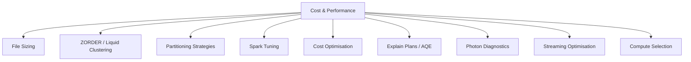

# Cost & Performance Optimization (13 % of Exam)

Second-largest domain in the November 30, 2025 blueprint. Covers Delta file sizing, ZORDER and liquid clustering, partitioning strategies, Spark tuning, AQE, Photon, query plans, compute selection, and the cost-control levers that come with each.

## Topics Overview

## Section Contents

| File | Topic | Priority |
| :--- | :--- | :--- |
| [01-file-sizing.md](./01-file-sizing.md) | Target file sizes, autocompaction, OPTIMIZE | High |
| [02-zorder-indexing.md](./02-zorder-indexing.md) | Z-ORDER vs liquid clustering, data skipping | High |
| [03-partitioning-strategies.md](./03-partitioning-strategies.md) | Partition selection, cardinality, liquid clustering | High |
| [04-spark-tuning.md](./04-spark-tuning.md) | Shuffle partitions, AQE, broadcast joins | High |
| [05-cost-optimization.md](./05-cost-optimization.md) | Compute right-sizing, autoscaling, job vs all-purpose | High |
| [06-explain-plans-aqe.md](./06-explain-plans-aqe.md) | Reading EXPLAIN output, AQE optimisations | High |
| [07-photon-diagnostics-optimization-part1.md](./07-photon-diagnostics-optimization-part1.md) | Photon fundamentals, when it accelerates, when it doesn't | High |
| [07-photon-diagnostics-optimization-part2.md](./07-photon-diagnostics-optimization-part2.md) | Diagnosing Photon misses, exam tips | High |
| [08-streaming-optimization.md](./08-streaming-optimization.md) | Trigger tuning, state store sizing, back-pressure | Medium |
| [09-databricks-compute.md](./09-databricks-compute.md) | Cluster types, instance pools, runtime selection | High |

## Key Concepts to Master

| Concept | Why it matters |
| :--- | :--- |
| **Optimal file size** | Files too small → many tasks + metadata overhead; too large → poor parallelism. Target ≈ 128 MB–1 GB depending on workload |
| **Z-ORDER vs Liquid Clustering** | Z-ORDER is a re-write; liquid clustering is adaptive and the modern default for new Delta tables |
| **Adaptive Query Execution (AQE)** | Spark dynamically re-optimises plans after each stage based on actual statistics |
| **Photon** | Vectorised C++ engine — accelerates many but not all operators; check Spark UI for "Photon Adaptive" badges |
| **Job vs All-Purpose Compute** | Job clusters are cheaper per DBU and shut down after the job — use for production pipelines |
| **Liquid clustering replaces partitioning** | For new tables, prefer liquid clustering over partition columns when cardinality is moderate or unknown |

## Related Resources

- [Performance Optimization cheat sheet (shared)](../../../shared/cheat-sheets/performance-optimization.md)
- [Spark Configurations cheat sheet (shared)](../../../shared/cheat-sheets/spark-configurations.md)
- [Performance Troubleshooting appendix (shared)](../../../shared/appendix/performance-troubleshooting.md)

---

**[← Previous: Developing Code](../01-developing-code-for-data-processing/README.md) | [↑ Back to DE Professional](../README.md) | [Next: Data Transformation, Cleansing, Quality →](../03-data-transformation-cleansing-quality/README.md)**
