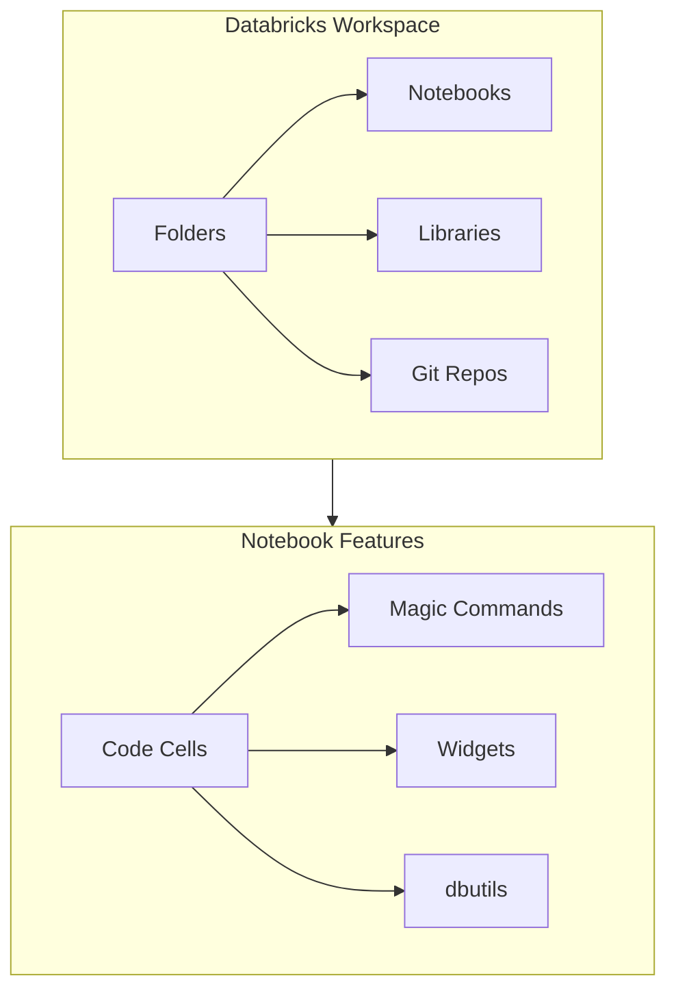
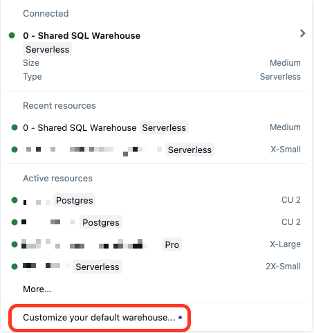
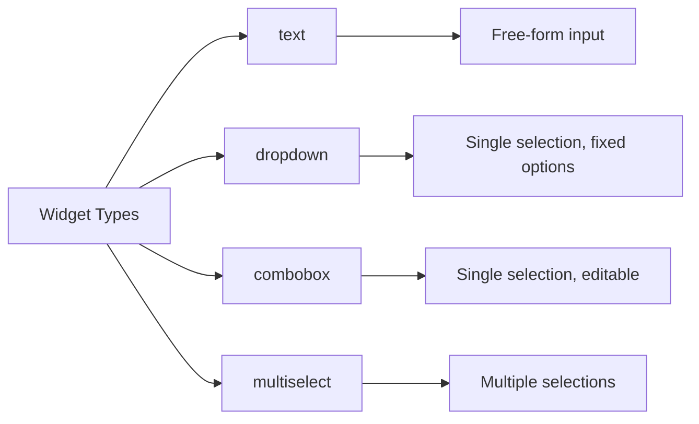
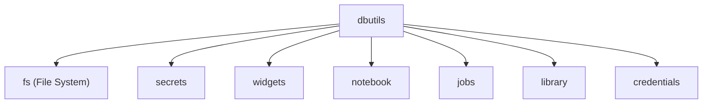
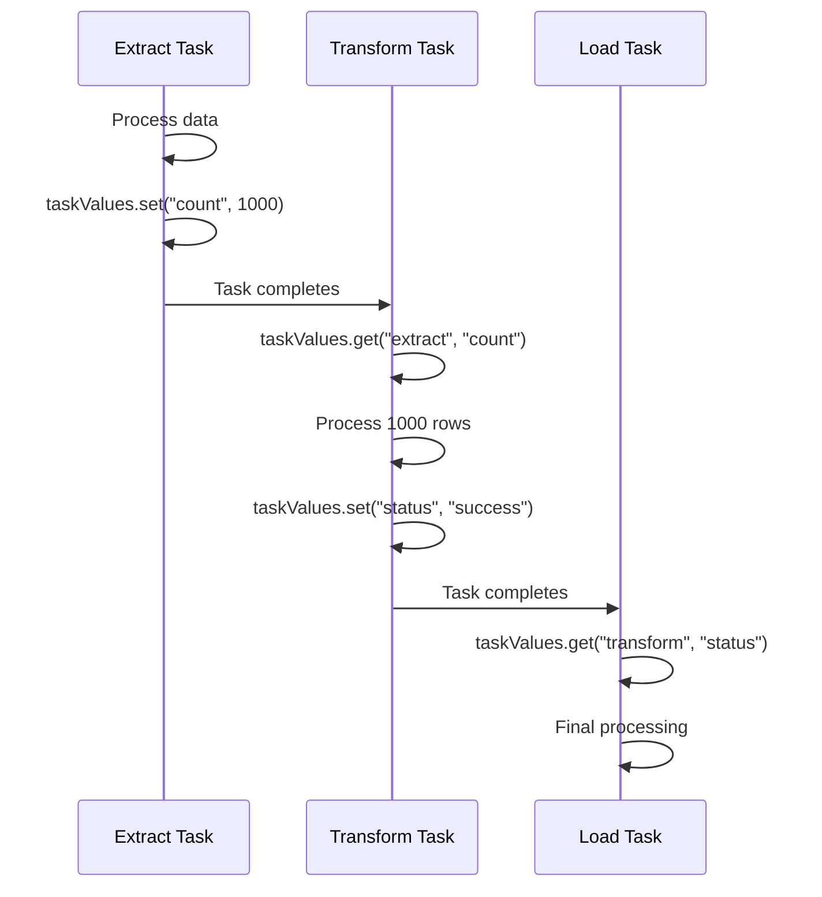
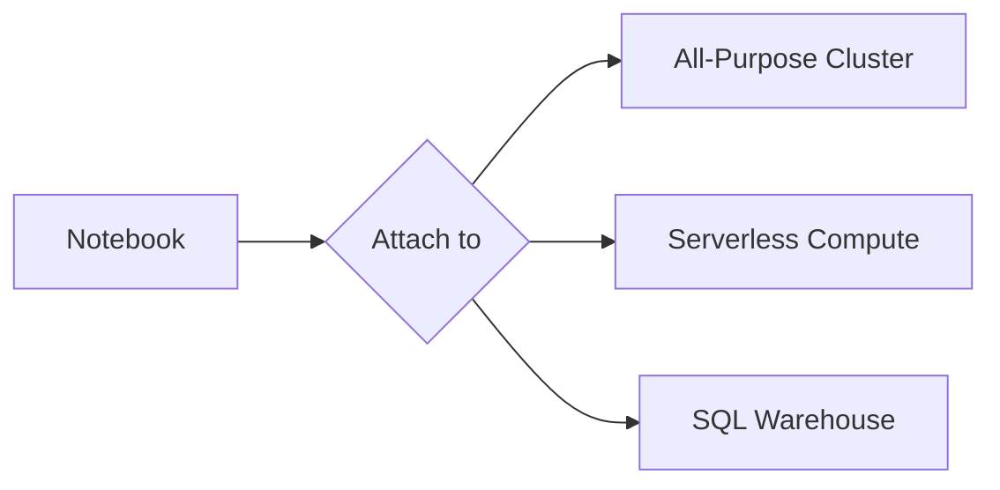
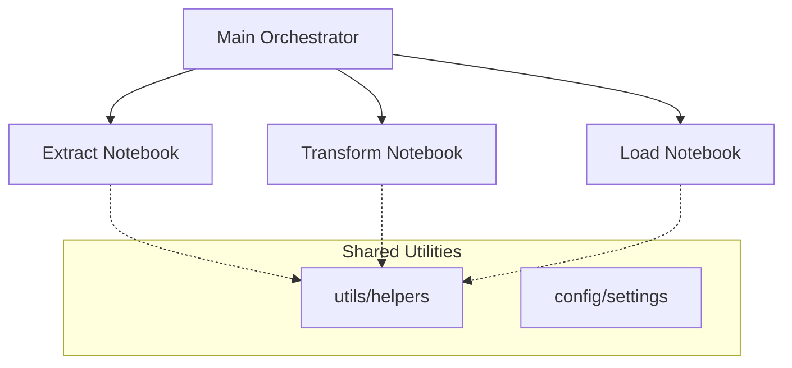

# Workspace and Notebooks

Databricks notebooks are the primary interface for interactive data engineering. Understanding notebook features, magic commands, widgets, and dbutils is essential for building production pipelines.

## Overview



## Workspace Organization

### Workspace Structure

```text
/Workspace/
├── Users/
│   └── user@company.com/           # Personal user folders
│       ├── notebooks/
│       └── projects/
├── Shared/                         # Shared across organization
│   ├── common_functions/
│   └── templates/
├── Repos/                          # Git-connected repositories
│   └── project-name/
└── Applications/                   # Databricks Apps (if enabled)
```

### Workspace vs DBFS Paths

| Path Type | Format | Access | Use Case |
| :--- | :--- | :--- | :--- |
| Workspace | `/Workspace/Users/...` | Notebooks, files | Code, configs |
| DBFS | `dbfs:/...` or `/dbfs/...` | Data files | Data storage |
| Unity Catalog Volumes | `/Volumes/catalog/schema/volume/` | Governed data | Managed files |

```python
# Read file from workspace

with open("/Workspace/Users/user@company.com/config.json", "r") as f:
    config = json.load(f)

# Read file from DBFS

df = spark.read.format("csv").load("dbfs:/data/input.csv")

# Read from Unity Catalog Volume

df = spark.read.format("parquet").load("/Volumes/main/default/raw_data/")
```

## Notebook Languages

### Default Languages

Notebooks have a default language set at creation:

| Language | Extension | Use Case |
| :--- | :--- | :--- |
| Python | `.py` | General purpose, ML, ETL |
| SQL | `.sql` | Data analysis, queries |
| Scala | `.scala` | Performance-critical code |
| R | `.r` | Statistical analysis |

### Magic Commands

Magic commands allow switching languages within a notebook.

```python
# Default cell runs in notebook's default language

df = spark.read.table("my_table")
```

```sql
%sql
-- Switch to SQL for this cell
SELECT * FROM my_table LIMIT 10
```

```scala
%scala
// Switch to Scala for this cell
val df = spark.read.table("my_table")
```

### Complete Magic Commands Reference

| Command | Purpose | Example |
| :--- | :--- | :--- |
| `%python` | Run Python code | `%python print("Hello")` |
| `%sql` | Run SQL queries | `%sql SELECT * FROM table` |
| `%scala` | Run Scala code | `%scala val x = 1` |
| `%r` | Run R code | `%r print("Hello")` |
| `%md` | Render Markdown | `%md # Header` |
| `%run` | Execute another notebook | `%run ./utils/helpers` |
| `%fs` | DBFS file operations | `%fs ls /data/` |
| `%sh` | Shell commands | `%sh ls -la` |
| `%pip` | Install Python packages | `%pip install pandas` |

### The %run Command

`%run` executes another notebook in the same context, making its variables and functions available.

```python
# In /Workspace/Users/user/utils/helpers

def clean_data(df):
    return df.dropna().dropDuplicates()

ENVIRONMENT = "production"
```

```python
# In main notebook

%run ./utils/helpers

# Now clean_data() and ENVIRONMENT are available

cleaned_df = clean_data(raw_df)
print(ENVIRONMENT)  # "production"
```

**%run Characteristics:**

| Feature | Behavior |
| :--- | :--- |
| Variable scope | Runs in same context - variables are shared |
| Relative paths | Relative to current notebook location |
| Parameters | Use widgets for parameterization (no direct args) |
| Return values | Cannot return values directly |
| Error handling | Errors propagate to calling notebook |

```python
# Pass parameters via widgets

%run ./etl_pipeline

# In etl_pipeline notebook:
# dbutils.widgets.text("date", "2024-01-01")
# date = dbutils.widgets.get("date")

```

### The %fs Command

`%fs` provides quick DBFS operations without Python/Scala code.

```bash
%fs ls /data/bronze/

%fs head /data/sample.csv

%fs cp /source/file.csv /dest/file.csv

%fs rm /data/temp/ --recurse
```

| Operation | Command | Description |
| :--- | :--- | :--- |
| List files | `%fs ls /path/` | List directory contents |
| View file | `%fs head /path/file` | Show first 64KB of file |
| Copy | `%fs cp /src /dest` | Copy file or directory |
| Move | `%fs mv /src /dest` | Move file or directory |
| Remove | `%fs rm /path` | Delete file |
| Remove dir | `%fs rm /path --recurse` | Delete directory recursively |
| Make dir | `%fs mkdirs /path` | Create directory |

## Widgets



*Databricks SQL dashboard with dynamic parameters for interactive filtering.*

Widgets provide parameterization for notebooks, enabling reusable pipelines.

### Widget Types



### Creating Widgets

```python
# Text widget - free-form input

dbutils.widgets.text("start_date", "2024-01-01", "Start Date")

# Dropdown widget - single selection from list

dbutils.widgets.dropdown("environment", "dev", ["dev", "staging", "prod"], "Environment")

# Combobox widget - editable dropdown

dbutils.widgets.combobox("table_name", "customers", ["customers", "orders", "products"], "Table")

# Multiselect widget - multiple selections

dbutils.widgets.multiselect("regions", "US", ["US", "EU", "APAC"], "Regions")
```

### Getting Widget Values

```python
# Get single value

start_date = dbutils.widgets.get("start_date")
environment = dbutils.widgets.get("environment")

# Get multiselect values (returns comma-separated string)

regions = dbutils.widgets.get("regions")  # "US,EU"
region_list = regions.split(",")  # ["US", "EU"]
```

### Managing Widgets

```python
# Remove a specific widget

dbutils.widgets.remove("start_date")

# Remove all widgets from notebook

dbutils.widgets.removeAll()
```

### Widget Scope and Jobs

| Context | Widget Behavior |
|---------|-----------------|
| Interactive | Widget UI appears at top of notebook |
| Job run | Parameters passed via job configuration |
| %run | Widgets inherited from parent notebook |

```python

# When running as job, parameters override widget defaults
# Job configuration:
# {
#   "notebook_task": {
#     "notebook_path": "/path/to/notebook",
#     "base_parameters": {
#       "start_date": "2024-06-01",
#       "environment": "prod"
#     }
#   }
# }

```

### SQL Widgets

Widgets can be used directly in SQL cells:

```sql
-- Create widget in SQL
CREATE WIDGET TEXT start_date DEFAULT '2024-01-01';
CREATE WIDGET DROPDOWN env DEFAULT 'dev' CHOICES ['dev', 'staging', 'prod'];

-- Use widget in query
SELECT * FROM events
WHERE event_date >= '${start_date}'
AND environment = '${env}';
```

```sql
-- Get all widget values
SELECT getArgument('start_date') AS start_date;

-- Remove widgets
REMOVE WIDGET start_date;
```

## dbutils (Databricks Utilities)

`dbutils` is a utility library providing helper functions for file operations, secrets, widgets, and more.

### dbutils Modules



### dbutils.fs - File System Operations

```python
# List files

files = dbutils.fs.ls("/data/bronze/")
for file in files:
    print(f"{file.name} - {file.size} bytes")

# Check if path exists

def path_exists(path):
    try:
        dbutils.fs.ls(path)
        return True
    except Exception:
        return False

# Copy files

dbutils.fs.cp("/source/data.csv", "/dest/data.csv")
dbutils.fs.cp("/source/folder/", "/dest/folder/", recurse=True)

# Move files

dbutils.fs.mv("/old/path.csv", "/new/path.csv")

# Remove files

dbutils.fs.rm("/data/temp.csv")
dbutils.fs.rm("/data/temp_folder/", recurse=True)

# Create directory

dbutils.fs.mkdirs("/data/new_folder/")

# Read file head (first 64KB)

content = dbutils.fs.head("/data/sample.txt", maxBytes=1000)

# Write text file (not recommended for large data)

dbutils.fs.put("/data/output.txt", "Hello World", overwrite=True)
```

### File System Operations Comparison

| Operation | dbutils.fs | %fs magic | Spark |
|-----------|------------|-----------|-------|
| List | `dbutils.fs.ls()` | `%fs ls` | N/A |
| Copy | `dbutils.fs.cp()` | `%fs cp` | N/A |
| Move | `dbutils.fs.mv()` | `%fs mv` | N/A |
| Delete | `dbutils.fs.rm()` | `%fs rm` | N/A |
| Read data | N/A | N/A | `spark.read.format()` |
| Write data | N/A | N/A | `df.write.format()` |

### dbutils.secrets - Secret Management

```python
# List available secret scopes

scopes = dbutils.secrets.listScopes()
for scope in scopes:
    print(scope.name)

# List secrets in a scope (names only, not values)

secrets = dbutils.secrets.list("my-scope")
for secret in secrets:
    print(secret.key)

# Get secret value

password = dbutils.secrets.get(scope="my-scope", key="db-password")
api_key = dbutils.secrets.get(scope="azure-kv", key="api-key")

# Secrets are redacted in logs

print(password)  # Prints [REDACTED] in notebook output
```

**Secret Scope Types:**

| Type | Backend | Use Case |
|------|---------|----------|
| Databricks-backed | Databricks | Simple, managed secrets |
| Azure Key Vault | Azure Key Vault | Enterprise Azure integration |
| AWS Secrets Manager | AWS | Enterprise AWS integration |

### dbutils.notebook - Notebook Orchestration

```python
# Run another notebook and get return value

result = dbutils.notebook.run(
    path="/Workspace/Users/user/etl/process_data",
    timeout_seconds=3600,
    arguments={"date": "2024-01-01", "env": "prod"}
)
print(f"Notebook returned: {result}")

# Exit notebook with return value

dbutils.notebook.exit("Success: Processed 1000 rows")

# In calling notebook, result contains the exit value

```

**dbutils.notebook.run vs %run:**

| Feature | dbutils.notebook.run | %run |
|---------|---------------------|------|
| Return value | Yes (string) | No |
| Separate context | Yes (isolated) | No (shared) |
| Timeout | Configurable | None |
| Arguments | Pass directly | Use widgets |
| Error handling | Returns error | Raises exception |
| Parallel execution | Yes (via threading) | No |

### Parallel Notebook Execution

```python
from concurrent.futures import ThreadPoolExecutor

def run_notebook(params):
    return dbutils.notebook.run(
        path="/etl/process_region",
        timeout_seconds=3600,
        arguments=params
    )

# Run notebooks in parallel

regions = [
    {"region": "US", "date": "2024-01-01"},
    {"region": "EU", "date": "2024-01-01"},
    {"region": "APAC", "date": "2024-01-01"}
]

with ThreadPoolExecutor(max_workers=3) as executor:
    results = list(executor.map(run_notebook, regions))

for result in results:
    print(result)
```

### dbutils.jobs - Job Task Values

Task values enable passing data between tasks in a job.

```python
# Set task value (in upstream task)

dbutils.jobs.taskValues.set(key="row_count", value=1000)
dbutils.jobs.taskValues.set(key="status", value="success")
dbutils.jobs.taskValues.set(key="metrics", value={"processed": 1000, "failed": 5})

# Get task value (in downstream task)
# Specify the task name that set the value

row_count = dbutils.jobs.taskValues.get(
    taskKey="extract_task",
    key="row_count",
    default=0
)

# Get complex value

metrics = dbutils.jobs.taskValues.get(
    taskKey="extract_task",
    key="metrics",
    default={}
)
```



### dbutils.library - Library Management

```python
# Restart Python interpreter (clears all variables)

dbutils.library.restartPython()

# Install library (deprecated - use %pip instead)
# dbutils.library.install("pypi-package")  # Not recommended

```

**Best Practice:** Use `%pip` for package installation:

```python
%pip install requests==2.28.0 pandas==2.0.0

# Restart Python after installing

dbutils.library.restartPython()
```

## Notebook Permissions

### Permission Levels

| Permission | Capabilities |
|------------|--------------|
| No Permission | Cannot see notebook |
| Can Read | View notebook content |
| Can Run | Execute notebook (requires compute) |
| Can Edit | Modify notebook content |
| Can Manage | Full control including permissions |

### Setting Permissions

```python

# Permissions are managed via UI or REST API
# Example REST API call to set permissions:
# POST /api/2.0/permissions/notebooks/{notebook_id}
# {
#   "access_control_list": [
#     {"user_name": "user@company.com", "permission_level": "CAN_EDIT"},
#     {"group_name": "data-engineers", "permission_level": "CAN_RUN"}
#   ]
# }

```

## Notebook Formats

### Export Formats

| Format | Extension | Use Case |
|--------|-----------|----------|
| Source | `.py`, `.sql`, `.scala`, `.r` | Version control |
| DBC | `.dbc` | Archive with all cells |
| HTML | `.html` | Sharing results |
| Jupyter | `.ipynb` | Jupyter compatibility |

### Export/Import via CLI

```bash
# Export notebook as source file

databricks workspace export /Users/user/notebook /local/path/notebook.py --format SOURCE

# Export as DBC archive

databricks workspace export /Users/user/notebook /local/path/notebook.dbc --format DBC

# Import notebook

databricks workspace import /local/path/notebook.py /Users/user/notebook --language PYTHON
```

## Compute Attachment

### Attaching to Compute



| Compute Type | Languages | Best For |
|--------------|-----------|----------|
| All-Purpose Cluster | Python, SQL, Scala, R | Development, ML |
| Serverless Compute | Python, SQL | Quick development |
| SQL Warehouse | SQL only | BI, SQL analytics |

## Use Cases

### Interactive Development

| Scenario | Recommended Approach |
|----------|---------------------|
| Exploring data | SQL cells with `%sql` magic |
| Building pipelines | Python with widgets for parameters |
| Sharing results | Export to HTML or dashboard |
| Code reuse | `%run` for shared utilities |

### Production Pipelines

| Scenario | Recommended Approach |
|----------|---------------------|
| Parameterized jobs | Widgets with job parameters |
| Orchestration | `dbutils.notebook.run` or Workflows |
| Secret handling | `dbutils.secrets.get` |
| Task communication | `dbutils.jobs.taskValues` |

### Multi-Notebook Architecture



```python
# Main orchestrator notebook

%run ./config/settings
%run ./utils/helpers

# Sequential execution with error handling

try:
    result = dbutils.notebook.run("./etl/extract", 3600, {"date": process_date})
    print(f"Extract: {result}")

    result = dbutils.notebook.run("./etl/transform", 3600, {"date": process_date})
    print(f"Transform: {result}")

    result = dbutils.notebook.run("./etl/load", 3600, {"date": process_date})
    print(f"Load: {result}")

except Exception as e:
    print(f"Pipeline failed: {e}")
    dbutils.notebook.exit(f"FAILED: {e}")

dbutils.notebook.exit("SUCCESS")
```

## Common Issues & Errors

### Widget Not Found Error

**Scenario:** Accessing widget that doesn't exist.

```python
# Error: InputWidgetNotDefined: No widget named 'missing_widget' defined

value = dbutils.widgets.get("missing_widget")
```

**Fix:** Create widget first or use try-except:

```python
try:
    value = dbutils.widgets.get("missing_widget")
except Exception:
    value = "default_value"
```

### %run Path Not Found

**Scenario:** Incorrect relative path in %run.

```python
# Error: Notebook not found: ./utils/helpers

%run ./utils/helpers
```

**Fix:** Verify path is relative to current notebook location or use absolute path:

```python
%run /Workspace/Users/user/project/utils/helpers
```

### dbutils.notebook.run Timeout

**Scenario:** Child notebook exceeds timeout.

```python
# Error: Run timed out after 3600 seconds

result = dbutils.notebook.run("/path/to/slow_notebook", timeout_seconds=3600)
```

**Fix:** Increase timeout or optimize notebook:

```python
result = dbutils.notebook.run("/path/to/notebook", timeout_seconds=7200)
```

### Secret Scope Access Denied

**Scenario:** User doesn't have permission to secret scope.

```python
# Error: User does not have READ permission on secret scope

secret = dbutils.secrets.get("restricted-scope", "key")
```

**Fix:** Request access to secret scope from admin.

### Task Value Not Found

**Scenario:** Getting task value that wasn't set or from wrong task.

```python
# Returns default if task/key not found

value = dbutils.jobs.taskValues.get(
    taskKey="wrong_task_name",
    key="count",
    default=-1  # Always provide a default
)
```

## Exam Tips

1. **%run vs dbutils.notebook.run** - Know the differences: shared context vs isolated, return values, timeouts
2. **Widget types** - text (free-form), dropdown (fixed), combobox (editable), multiselect (multiple)
3. **Widget in jobs** - Parameters in job config override widget defaults
4. **Secret scopes** - Databricks-backed vs Key Vault backed, secrets always redacted in output
5. **Task values** - Must specify task name when getting values, only works in job context
6. **Magic commands** - `%run` executes in same context, `%fs` for quick file ops
7. **Workspace paths** - `/Workspace/` for code, `dbfs:/` for data, `/Volumes/` for Unity Catalog
8. **Notebook permissions** - Can Read, Can Run, Can Edit, Can Manage hierarchy
9. **%pip vs dbutils.library** - Prefer `%pip` for package installation
10. **Parallel notebooks** - Use ThreadPoolExecutor with dbutils.notebook.run

## Key Takeaways

- **`%run` vs `dbutils.notebook.run`**: `%run` executes in the same context (variables shared, no return value, no timeout); `dbutils.notebook.run` executes in an isolated context with a configurable timeout and a string return value
- **Widget types**: `text` (free-form), `dropdown` (fixed list, single select), `combobox` (editable dropdown), `multiselect` (comma-separated result); in job runs, job parameters override widget defaults
- **`dbutils.jobs.taskValues`**: set values in upstream tasks with `taskValues.set(key, value)` and retrieve them in downstream tasks with `taskValues.get(taskKey="task_name", key="key", default=...)`; only works in job context, not interactive
- **Secret scopes**: Databricks-backed (managed internally) vs Azure Key Vault-backed (enterprise); secret values are always redacted in notebook output; `dbutils.secrets.list()` returns key names only, never values
- **Workspace paths**: `/Workspace/...` for notebooks and code files; `dbfs:/...` (Spark) or `/dbfs/...` (Python) for data files; `/Volumes/catalog/schema/volume/` for Unity Catalog governed files
- **Magic commands**: `%sql` / `%python` / `%scala` for language switching; `%fs` for DBFS operations; `%pip` for package installation (preferred over `dbutils.library`); `%sh` for shell commands
- **Parallel notebook execution**: use `ThreadPoolExecutor` with `dbutils.notebook.run` to run independent child notebooks concurrently, then aggregate results
- **Notebook permissions hierarchy**: No Permission < Can Read < Can Run < Can Edit < Can Manage

## Related Topics

- [Databricks CLI — Part 1](02-databricks-cli-part1.md) - Command line management
- [REST API](03-rest-api-part1.md) - Programmatic workspace access
- [Secret Management](../04-security-governance/04-secret-management.md) - Secure credential storage

## Official Documentation

- [Databricks Notebooks](https://docs.databricks.com/notebooks/index.html)
- [dbutils Reference](https://docs.databricks.com/dev-tools/databricks-utils.html)
- [Notebook Widgets](https://docs.databricks.com/notebooks/widgets.html)
- [Notebook Workflows](https://docs.databricks.com/notebooks/notebook-workflows.html)

---

**[↑ Back to Databricks Tooling](./README.md) | [Next: Databricks CLI — Part 1](./02-databricks-cli-part1.md) →**
