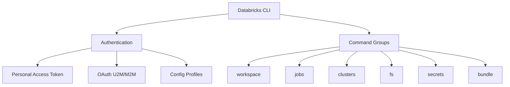
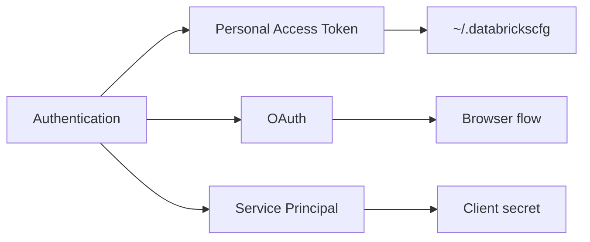

# Databricks CLI — Part 1

The Databricks CLI provides command-line access to Databricks workspaces for automation, CI/CD pipelines, and administrative tasks.

## Overview



## Installation

### Install Methods

```bash
# macOS with Homebrew

brew tap databricks/tap
brew install databricks

# Linux/macOS with curl

curl -fsSL https://raw.githubusercontent.com/databricks/setup-cli/main/install.sh | sh

# Windows with winget

winget install Databricks.DatabricksCLI

# Python pip (legacy CLI v0.x - not recommended)

pip install databricks-cli
```

### Verify Installation

```bash
# Check version

databricks --version

# Show help

databricks --help
```

### CLI Versions

| Version | Status | Features |
| :--- | :--- | :--- |
| CLI v0.x | Legacy | Basic commands, PAT only |
| CLI v2.x | Current | OAuth, Bundles, enhanced commands |

## Authentication

### Authentication Methods



### Personal Access Token (PAT)

```bash
# Configure with PAT

databricks configure --token

# Enter workspace URL and token when prompted
# Databricks Host: https://adb-1234567890.12.azuredatabricks.net
# Personal Access Token: dapi1234567890abcdef

```

### Configuration File

The CLI stores credentials in `~/.databrickscfg`:

```ini
# ~/.databrickscfg

[DEFAULT]
host = https://adb-1234567890.12.azuredatabricks.net
token = dapi1234567890abcdef

[production]
host = https://adb-0987654321.21.azuredatabricks.net
token = dapi0987654321fedcba

[development]
host = https://adb-1111111111.11.azuredatabricks.net
token = dapi1111111111aaaaaa
```

### Using Profiles

```bash
# Use specific profile

databricks workspace list --profile production

# Set default profile via environment variable

export DATABRICKS_CONFIG_PROFILE=production
databricks workspace list

# Override with environment variables

export DATABRICKS_HOST=https://adb-xxx.azuredatabricks.net
export DATABRICKS_TOKEN=dapi123456789
```

### OAuth Authentication (M2M)

For service principals and automated workflows:

```bash
# Configure OAuth with service principal

databricks configure --oauth

# Environment variables for service principal

export DATABRICKS_HOST=https://adb-xxx.azuredatabricks.net
export DATABRICKS_CLIENT_ID=your-client-id
export DATABRICKS_CLIENT_SECRET=your-client-secret
```

### Authentication Precedence

| Priority | Method | Source |
| :--- | :--- | :--- |
| 1 | Environment variables | `DATABRICKS_HOST`, `DATABRICKS_TOKEN` |
| 2 | Profile flag | `--profile production` |
| 3 | Config profile env | `DATABRICKS_CONFIG_PROFILE` |
| 4 | DEFAULT profile | `~/.databrickscfg [DEFAULT]` |

## Workspace Commands

### List Workspace Contents

```bash
# List root workspace

databricks workspace list /

# List user folder

databricks workspace list /Users/user@company.com/

# List with details (long format)

databricks workspace list / --output json
```

### Export Notebooks

```bash
# Export single notebook as source

databricks workspace export /Users/user/notebook ./local/notebook.py --format SOURCE

# Export as DBC archive

databricks workspace export /Users/user/notebook ./local/notebook.dbc --format DBC

# Export entire folder recursively

databricks workspace export-dir /Users/user/project/ ./local/project/ --overwrite
```

### Import Notebooks

```bash
# Import Python notebook

databricks workspace import ./local/notebook.py /Users/user/notebook --language PYTHON

# Import SQL notebook

databricks workspace import ./local/query.sql /Users/user/query --language SQL

# Import folder recursively

databricks workspace import-dir ./local/project/ /Users/user/project/ --overwrite
```

### Workspace Export Formats

| Format | Flag | Extension | Use Case |
| :--- | :--- | :--- | :--- |
| SOURCE | `--format SOURCE` | `.py`, `.sql`, `.scala` | Version control |
| HTML | `--format HTML` | `.html` | Sharing |
| JUPYTER | `--format JUPYTER` | `.ipynb` | Jupyter |
| DBC | `--format DBC` | `.dbc` | Archive |

### Delete Workspace Items

```bash
# Delete notebook

databricks workspace delete /Users/user/old_notebook

# Delete folder recursively

databricks workspace delete /Users/user/old_folder --recursive
```

### Create Directory

```bash
databricks workspace mkdirs /Users/user/new_project/notebooks
```

## File System (DBFS) Commands

### List Files

```bash
# List DBFS root

databricks fs ls dbfs:/

# List with details

databricks fs ls dbfs:/data/bronze/ --long

# Output as JSON

databricks fs ls dbfs:/data/ --output json
```

### Copy Files

```bash
# Upload local file to DBFS

databricks fs cp ./local/data.csv dbfs:/data/input/data.csv

# Upload directory recursively

databricks fs cp ./local/folder/ dbfs:/data/folder/ --recursive --overwrite

# Download from DBFS

databricks fs cp dbfs:/data/output.csv ./local/output.csv

# Download directory

databricks fs cp dbfs:/data/results/ ./local/results/ --recursive
```

### Move and Delete

```bash
# Move/rename file

databricks fs mv dbfs:/old/path.csv dbfs:/new/path.csv

# Delete file

databricks fs rm dbfs:/data/temp.csv

# Delete directory recursively

databricks fs rm dbfs:/data/temp_folder/ --recursive
```

### Create Directory

```bash
databricks fs mkdirs dbfs:/data/new_folder/
```

### View File Contents

```bash
# View file (first 64KB)

databricks fs cat dbfs:/data/sample.txt
```

## Jobs Commands

### List Jobs

```bash
# List all jobs

databricks jobs list

# List with pagination

databricks jobs list --limit 50 --offset 0

# Output as JSON

databricks jobs list --output json
```

### Get Job Details

```bash
# Get job by ID

databricks jobs get --job-id 123456

# Get job by name

databricks jobs get --job-id $(databricks jobs list --output json | jq -r '.jobs[] | select(.settings.name=="my-job") | .job_id')
```

### Create Job

```bash
# Create job from JSON file

databricks jobs create --json-file job_config.json

# Create job from inline JSON

databricks jobs create --json '{
  "name": "My ETL Job",
  "tasks": [{
    "task_key": "etl_task",
    "notebook_task": {
      "notebook_path": "/Users/user/etl_notebook"
    },
    "existing_cluster_id": "1234-567890-abcdef"
  }]
}'
```

### Job Configuration Example

```json
{
  "name": "Daily ETL Pipeline",
  "tasks": [
    {
      "task_key": "extract",
      "notebook_task": {
        "notebook_path": "/Workspace/Jobs/extract",
        "base_parameters": {
          "date": "{{job.start_time.iso_date}}"
        }
      },
      "new_cluster": {
        "spark_version": "14.3.x-scala2.12",
        "num_workers": 2,
        "node_type_id": "Standard_DS3_v2"
      }
    },
    {
      "task_key": "transform",
      "depends_on": [{"task_key": "extract"}],
      "notebook_task": {
        "notebook_path": "/Workspace/Jobs/transform"
      },
      "existing_cluster_id": "1234-567890-abcdef"
    }
  ],
  "schedule": {
    "quartz_cron_expression": "0 0 8 * * ?",
    "timezone_id": "America/New_York"
  },
  "email_notifications": {
    "on_failure": ["team@company.com"]
  }
}
```

### Run Job

```bash
# Run job immediately

databricks jobs run-now --job-id 123456

# Run with parameter overrides

databricks jobs run-now --job-id 123456 --notebook-params '{"date": "2024-01-15"}'

# Submit one-time run (no saved job)

databricks jobs submit --json-file run_config.json
```

### Manage Job Runs

```bash
# List runs for a job

databricks runs list --job-id 123456

# Get run details

databricks runs get --run-id 789012

# Cancel run

databricks runs cancel --run-id 789012

# Get run output

databricks runs get-output --run-id 789012
```

### Update and Delete Jobs

```bash
# Update job (reset entire config)

databricks jobs reset --job-id 123456 --json-file updated_config.json

# Update job (partial update)

databricks jobs update --job-id 123456 --json '{"name": "New Job Name"}'

# Delete job

databricks jobs delete --job-id 123456
```

---

> **Continue reading:** [Part 2 — Cluster, Secrets, Bundle Commands & Exam Prep](./02-databricks-cli-part2.md)

---

**[← Previous: Workspace and Notebooks](./01-workspace-and-notebooks.md) | [↑ Back to Databricks Tooling](./README.md) | [Next: Databricks CLI — Part 2](./02-databricks-cli-part2.md) →**
