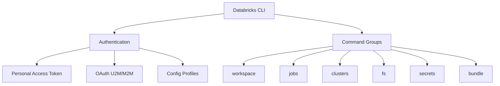
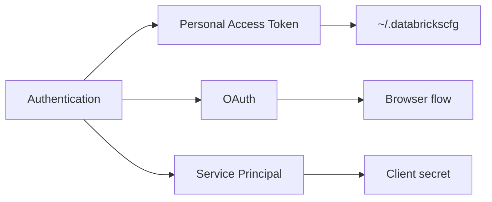

# Databricks CLI

The Databricks CLI provides command-line access to Databricks workspaces for automation, CI/CD pipelines, and administrative tasks.

## Overview



## Installation

### Install Methods

```bash
# macOS with Homebrew
brew tap databricks/tap
brew install databricks

# Linux/macOS with curl
curl -fsSL https://raw.githubusercontent.com/databricks/setup-cli/main/install.sh | sh

# Windows with winget
winget install Databricks.DatabricksCLI

# Python pip (legacy CLI v0.x - not recommended)
pip install databricks-cli
```

### Verify Installation

```bash
# Check version
databricks --version

# Show help
databricks --help
```

### CLI Versions

| Version | Status | Features |
| :--- | :--- | :--- |
| CLI v0.x | Legacy | Basic commands, PAT only |
| CLI v2.x | Current | OAuth, Bundles, enhanced commands |

## Authentication

### Authentication Methods



### Personal Access Token (PAT)

```bash
# Configure with PAT
databricks configure --token

# Enter workspace URL and token when prompted
# Databricks Host: https://adb-1234567890.12.azuredatabricks.net
# Personal Access Token: dapi1234567890abcdef
```

### Configuration File

The CLI stores credentials in `~/.databrickscfg`:

```ini
# ~/.databrickscfg
[DEFAULT]
host = https://adb-1234567890.12.azuredatabricks.net
token = dapi1234567890abcdef

[production]
host = https://adb-0987654321.21.azuredatabricks.net
token = dapi0987654321fedcba

[development]
host = https://adb-1111111111.11.azuredatabricks.net
token = dapi1111111111aaaaaa
```

### Using Profiles

```bash
# Use specific profile
databricks workspace list --profile production

# Set default profile via environment variable
export DATABRICKS_CONFIG_PROFILE=production
databricks workspace list

# Override with environment variables
export DATABRICKS_HOST=https://adb-xxx.azuredatabricks.net
export DATABRICKS_TOKEN=dapi123456789
```

### OAuth Authentication (M2M)

For service principals and automated workflows:

```bash
# Configure OAuth with service principal
databricks configure --oauth

# Environment variables for service principal
export DATABRICKS_HOST=https://adb-xxx.azuredatabricks.net
export DATABRICKS_CLIENT_ID=your-client-id
export DATABRICKS_CLIENT_SECRET=your-client-secret
```

### Authentication Precedence

| Priority | Method | Source |
| :--- | :--- | :--- |
| 1 | Environment variables | `DATABRICKS_HOST`, `DATABRICKS_TOKEN` |
| 2 | Profile flag | `--profile production` |
| 3 | Config profile env | `DATABRICKS_CONFIG_PROFILE` |
| 4 | DEFAULT profile | `~/.databrickscfg [DEFAULT]` |

## Workspace Commands

### List Workspace Contents

```bash
# List root workspace
databricks workspace list /

# List user folder
databricks workspace list /Users/user@company.com/

# List with details (long format)
databricks workspace list / --output json
```

### Export Notebooks

```bash
# Export single notebook as source
databricks workspace export /Users/user/notebook ./local/notebook.py --format SOURCE

# Export as DBC archive
databricks workspace export /Users/user/notebook ./local/notebook.dbc --format DBC

# Export entire folder recursively
databricks workspace export-dir /Users/user/project/ ./local/project/ --overwrite
```

### Import Notebooks

```bash
# Import Python notebook
databricks workspace import ./local/notebook.py /Users/user/notebook --language PYTHON

# Import SQL notebook
databricks workspace import ./local/query.sql /Users/user/query --language SQL

# Import folder recursively
databricks workspace import-dir ./local/project/ /Users/user/project/ --overwrite
```

### Workspace Export Formats

| Format | Flag | Extension | Use Case |
| :--- | :--- | :--- | :--- |
| SOURCE | `--format SOURCE` | `.py`, `.sql`, `.scala` | Version control |
| HTML | `--format HTML` | `.html` | Sharing |
| JUPYTER | `--format JUPYTER` | `.ipynb` | Jupyter |
| DBC | `--format DBC` | `.dbc` | Archive |

### Delete Workspace Items

```bash
# Delete notebook
databricks workspace delete /Users/user/old_notebook

# Delete folder recursively
databricks workspace delete /Users/user/old_folder --recursive
```

### Create Directory

```bash
databricks workspace mkdirs /Users/user/new_project/notebooks
```

## File System (DBFS) Commands

### List Files

```bash
# List DBFS root
databricks fs ls dbfs:/

# List with details
databricks fs ls dbfs:/data/bronze/ --long

# Output as JSON
databricks fs ls dbfs:/data/ --output json
```

### Copy Files

```bash
# Upload local file to DBFS
databricks fs cp ./local/data.csv dbfs:/data/input/data.csv

# Upload directory recursively
databricks fs cp ./local/folder/ dbfs:/data/folder/ --recursive --overwrite

# Download from DBFS
databricks fs cp dbfs:/data/output.csv ./local/output.csv

# Download directory
databricks fs cp dbfs:/data/results/ ./local/results/ --recursive
```

### Move and Delete

```bash
# Move/rename file
databricks fs mv dbfs:/old/path.csv dbfs:/new/path.csv

# Delete file
databricks fs rm dbfs:/data/temp.csv

# Delete directory recursively
databricks fs rm dbfs:/data/temp_folder/ --recursive
```

### Create Directory

```bash
databricks fs mkdirs dbfs:/data/new_folder/
```

### View File Contents

```bash
# View file (first 64KB)
databricks fs cat dbfs:/data/sample.txt
```

## Jobs Commands

### List Jobs

```bash
# List all jobs
databricks jobs list

# List with pagination
databricks jobs list --limit 50 --offset 0

# Output as JSON
databricks jobs list --output json
```

### Get Job Details

```bash
# Get job by ID
databricks jobs get --job-id 123456

# Get job by name
databricks jobs get --job-id $(databricks jobs list --output json | jq -r '.jobs[] | select(.settings.name=="my-job") | .job_id')
```

### Create Job

```bash
# Create job from JSON file
databricks jobs create --json-file job_config.json

# Create job from inline JSON
databricks jobs create --json '{
  "name": "My ETL Job",
  "tasks": [{
    "task_key": "etl_task",
    "notebook_task": {
      "notebook_path": "/Users/user/etl_notebook"
    },
    "existing_cluster_id": "1234-567890-abcdef"
  }]
}'
```

### Job Configuration Example

```json
{
  "name": "Daily ETL Pipeline",
  "tasks": [
    {
      "task_key": "extract",
      "notebook_task": {
        "notebook_path": "/Workspace/Jobs/extract",
        "base_parameters": {
          "date": "{{job.start_time.iso_date}}"
        }
      },
      "new_cluster": {
        "spark_version": "14.3.x-scala2.12",
        "num_workers": 2,
        "node_type_id": "Standard_DS3_v2"
      }
    },
    {
      "task_key": "transform",
      "depends_on": [{"task_key": "extract"}],
      "notebook_task": {
        "notebook_path": "/Workspace/Jobs/transform"
      },
      "existing_cluster_id": "1234-567890-abcdef"
    }
  ],
  "schedule": {
    "quartz_cron_expression": "0 0 8 * * ?",
    "timezone_id": "America/New_York"
  },
  "email_notifications": {
    "on_failure": ["team@company.com"]
  }
}
```

### Run Job

```bash
# Run job immediately
databricks jobs run-now --job-id 123456

# Run with parameter overrides
databricks jobs run-now --job-id 123456 --notebook-params '{"date": "2024-01-15"}'

# Submit one-time run (no saved job)
databricks jobs submit --json-file run_config.json
```

### Manage Job Runs

```bash
# List runs for a job
databricks runs list --job-id 123456

# Get run details
databricks runs get --run-id 789012

# Cancel run
databricks runs cancel --run-id 789012

# Get run output
databricks runs get-output --run-id 789012
```

### Update and Delete Jobs

```bash
# Update job (reset entire config)
databricks jobs reset --job-id 123456 --json-file updated_config.json

# Update job (partial update)
databricks jobs update --job-id 123456 --json '{"name": "New Job Name"}'

# Delete job
databricks jobs delete --job-id 123456
```

## Cluster Commands

### List Clusters

```bash
# List all clusters
databricks clusters list

# Output as JSON
databricks clusters list --output json
```

### Cluster Operations

```bash
# Get cluster details
databricks clusters get --cluster-id 1234-567890-abcdef

# Start cluster
databricks clusters start --cluster-id 1234-567890-abcdef

# Restart cluster
databricks clusters restart --cluster-id 1234-567890-abcdef

# Terminate cluster
databricks clusters delete --cluster-id 1234-567890-abcdef

# Permanently delete cluster
databricks clusters permanent-delete --cluster-id 1234-567890-abcdef
```

### Create Cluster

```bash
# Create cluster from JSON
databricks clusters create --json '{
  "cluster_name": "my-cluster",
  "spark_version": "14.3.x-scala2.12",
  "node_type_id": "Standard_DS3_v2",
  "num_workers": 2,
  "autotermination_minutes": 60
}'
```

### Edit Cluster

```bash
# Edit existing cluster
databricks clusters edit --json '{
  "cluster_id": "1234-567890-abcdef",
  "num_workers": 4,
  "autotermination_minutes": 120
}'
```

## Secrets Commands

### Secret Scopes

```bash
# List all secret scopes
databricks secrets list-scopes

# Create Databricks-backed scope
databricks secrets create-scope --scope my-scope

# Create scope with specific ACL
databricks secrets create-scope --scope my-scope --initial-manage-principal users

# Delete scope
databricks secrets delete-scope --scope my-scope
```

### Manage Secrets

```bash
# List secrets in scope (names only, not values)
databricks secrets list --scope my-scope

# Create/update secret
databricks secrets put --scope my-scope --key db-password --string-value "secret123"

# Create secret from file
databricks secrets put --scope my-scope --key ssh-key --binary-file ./id_rsa

# Delete secret
databricks secrets delete --scope my-scope --key db-password
```

### Secret ACLs

```bash
# List ACLs for scope
databricks secrets list-acls --scope my-scope

# Grant access
databricks secrets put-acl --scope my-scope --principal user@company.com --permission READ

# Revoke access
databricks secrets delete-acl --scope my-scope --principal user@company.com
```

| Permission | Capabilities |
|------------|--------------|
| READ | Read secrets |
| WRITE | Read and write secrets |
| MANAGE | Full control including ACLs |

## Bundle Commands (DAB)

Databricks Asset Bundles (DAB) enable infrastructure-as-code for Databricks resources.

### Initialize Bundle

```bash
# Create new bundle from template
databricks bundle init

# Initialize in existing directory
databricks bundle init --template default-python ./my-project
```

### Bundle Workflow

```bash
# Validate bundle configuration
databricks bundle validate

# Deploy to target environment
databricks bundle deploy

# Deploy to specific target
databricks bundle deploy --target production

# Run a resource from bundle
databricks bundle run my-job

# Destroy deployed resources
databricks bundle destroy
```

### Bundle Configuration (databricks.yml)

```yaml
bundle:
  name: my-etl-project

workspace:
  host: https://adb-1234567890.12.azuredatabricks.net

resources:
  jobs:
    daily_etl:
      name: "Daily ETL Job"
      tasks:
        - task_key: extract
          notebook_task:
            notebook_path: ./notebooks/extract.py

targets:
  development:
    mode: development
    default: true
    workspace:
      host: https://dev.azuredatabricks.net

  production:
    mode: production
    workspace:
      host: https://prod.azuredatabricks.net
    resources:
      jobs:
        daily_etl:
          schedule:
            quartz_cron_expression: "0 0 8 * * ?"
            timezone_id: "America/New_York"
```

### Bundle Commands Summary

| Command | Purpose |
|---------|---------|
| `bundle init` | Create new bundle |
| `bundle validate` | Check configuration |
| `bundle deploy` | Deploy resources |
| `bundle run` | Execute resource |
| `bundle destroy` | Remove deployed resources |
| `bundle sync` | Sync files to workspace |

## Unity Catalog Commands

### List Catalogs and Schemas

```bash
# List catalogs
databricks unity-catalog catalogs list

# List schemas in catalog
databricks unity-catalog schemas list --catalog-name main

# List tables in schema
databricks unity-catalog tables list --catalog-name main --schema-name default
```

### Manage Permissions

```bash
# Get table permissions
databricks unity-catalog permissions tables get --full-name main.default.my_table

# Grant permissions
databricks unity-catalog permissions tables update --full-name main.default.my_table --json '{
  "changes": [{
    "principal": "user@company.com",
    "add": ["SELECT", "MODIFY"]
  }]
}'
```

## Output Formats

### JSON Output

```bash
# Get JSON output for parsing
databricks jobs list --output json | jq '.jobs[].settings.name'

# Pretty print JSON
databricks clusters get --cluster-id xxx --output json | jq '.'
```

### Table Output (Default)

```bash
# Default table format
databricks jobs list
```

## Common Patterns

### CI/CD Pipeline Integration

```bash
#!/bin/bash
# Deploy pipeline script

set -e

# Configure authentication
export DATABRICKS_HOST=${{ secrets.DATABRICKS_HOST }}
export DATABRICKS_TOKEN=${{ secrets.DATABRICKS_TOKEN }}

# Validate bundle
databricks bundle validate

# Deploy to staging
databricks bundle deploy --target staging

# Run tests
databricks bundle run integration-tests --target staging

# Deploy to production (manual approval required)
databricks bundle deploy --target production
```

### Backup Workspace

```bash
#!/bin/bash
# Backup all notebooks

BACKUP_DIR="./backup/$(date +%Y%m%d)"
mkdir -p $BACKUP_DIR

# Export shared notebooks
databricks workspace export-dir /Shared/ $BACKUP_DIR/Shared/ --overwrite

# Export user notebooks
for user in $(databricks workspace list /Users/ --output json | jq -r '.[].path'); do
    databricks workspace export-dir "$user" "$BACKUP_DIR$user" --overwrite
done
```

### Migrate Jobs Between Workspaces

```bash
#!/bin/bash
# Export job from source, import to target

# Export from source
DATABRICKS_CONFIG_PROFILE=source databricks jobs get --job-id 123 --output json > job.json

# Remove job_id and created_time for import
jq 'del(.job_id, .created_time)' job.json > job_clean.json

# Import to target
DATABRICKS_CONFIG_PROFILE=target databricks jobs create --json-file job_clean.json
```

## Common Issues & Errors

### 1. Authentication Failed

**Scenario:** Invalid or expired token.

```bash
# Error: INVALID_PARAMETER_VALUE: Invalid access token
```

**Fix:** Regenerate PAT and reconfigure:

```bash
databricks configure --token
```

### 2. Profile Not Found

**Scenario:** Specified profile doesn't exist in config.

```bash
# Error: cannot find profile "nonexistent" in ~/.databrickscfg
```

**Fix:** Check profile name matches config file or create profile.

### 3. Permission Denied on Workspace

**Scenario:** User lacks permission for workspace operation.

```bash
# Error: PERMISSION_DENIED: User does not have permission
```

**Fix:** Request appropriate workspace permissions from admin.

### 4. Cluster Not Found

**Scenario:** Cluster ID is invalid or cluster was deleted.

```bash
# Error: RESOURCE_DOES_NOT_EXIST: Cluster xxx does not exist
```

**Fix:** Verify cluster ID with `databricks clusters list`.

### 5. Rate Limiting

**Scenario:** Too many API requests.

```bash
# Error: 429 Too Many Requests
```

**Fix:** Add delays between requests or batch operations.

## Exam Tips

1. **Authentication order** - Environment variables > profile flag > config file
2. **Profile syntax** - Use `--profile name` or `DATABRICKS_CONFIG_PROFILE`
3. **Workspace paths** - Always start with `/` for absolute paths
4. **Export formats** - SOURCE for version control, DBC for archives
5. **Jobs API** - `run-now` triggers existing job, `submit` creates one-time run
6. **Secret scopes** - `create-scope` for new, `put` to add secrets
7. **Bundle commands** - validate → deploy → run workflow
8. **DBFS paths** - Use `dbfs:/` prefix for fs commands
9. **JSON output** - Use `--output json` for scripting and automation
10. **Cluster states** - Know PENDING, RUNNING, TERMINATED, ERROR states

## Related Topics

- [REST API](03-rest-api.md) - Programmatic API access
- [Asset Bundles](../06-testing-deployment/01-asset-bundles.md) - Infrastructure as code
- [CI/CD Integration](../06-testing-deployment/02-cicd-integration.md) - Pipeline automation

## Official Documentation

- [Databricks CLI Reference](https://docs.databricks.com/dev-tools/cli/index.html)
- [CLI Authentication](https://docs.databricks.com/dev-tools/cli/authentication.html)
- [Databricks Asset Bundles](https://docs.databricks.com/dev-tools/bundles/index.html)
