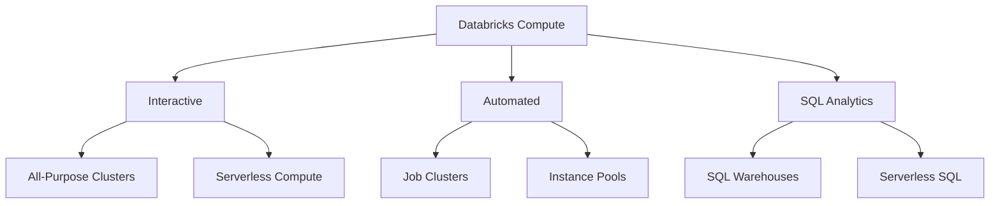
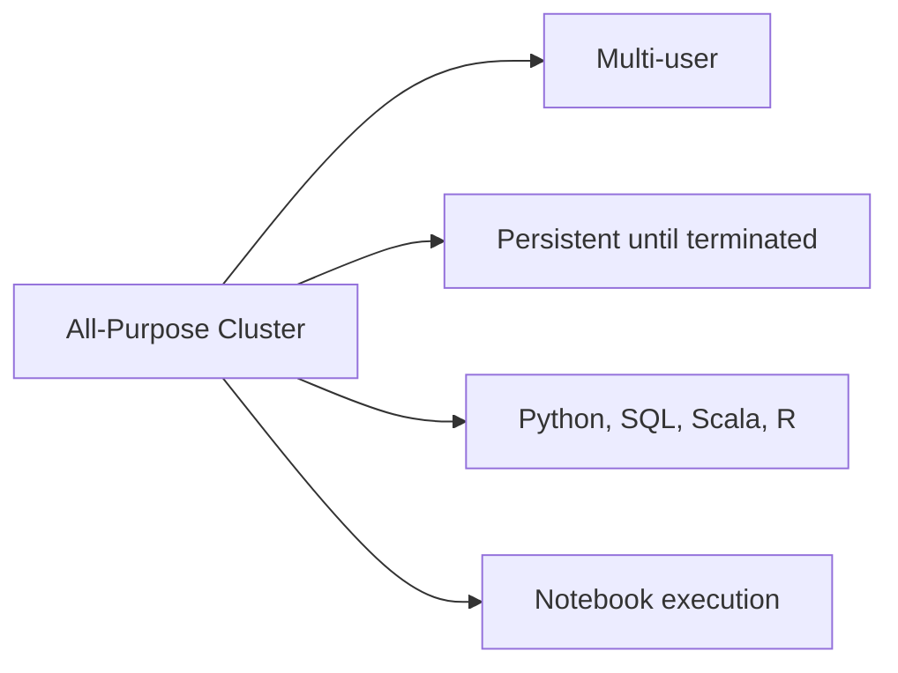
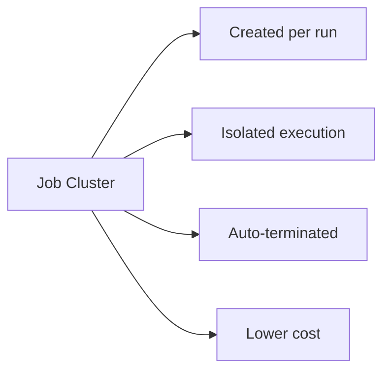
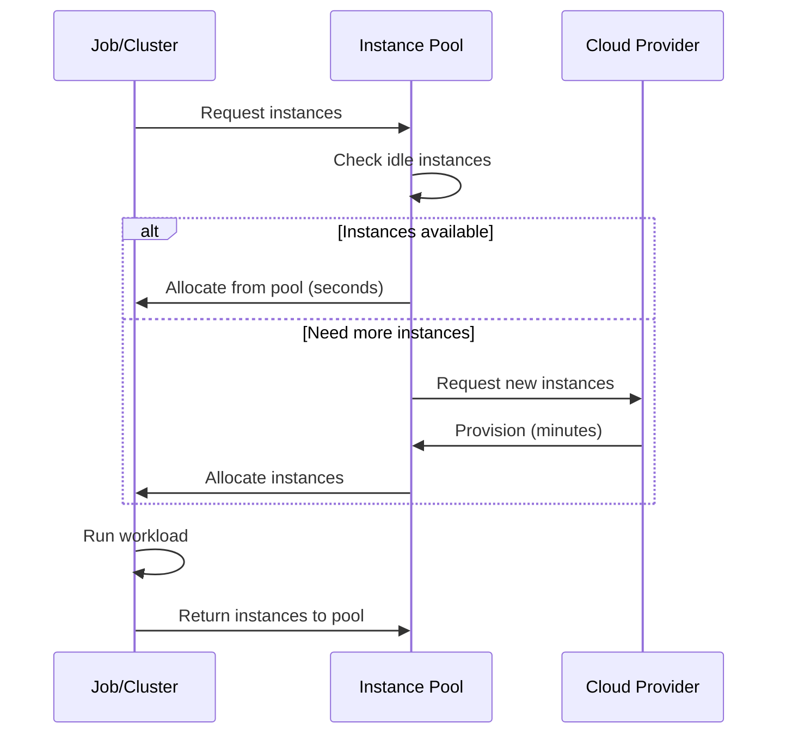
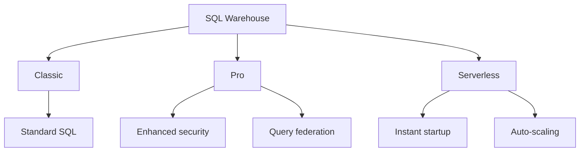
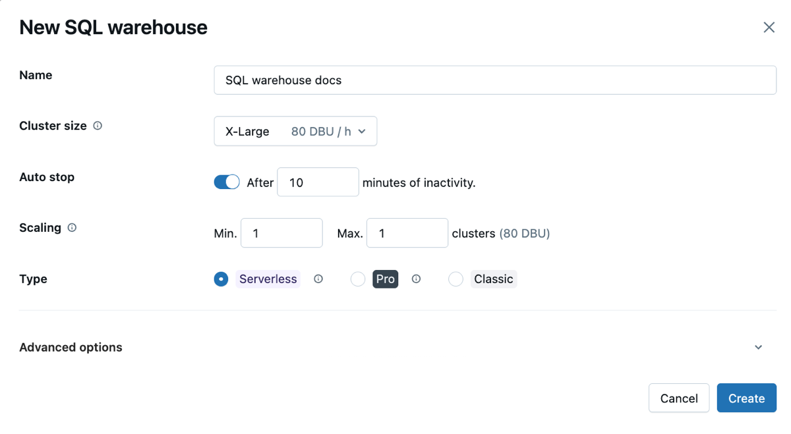
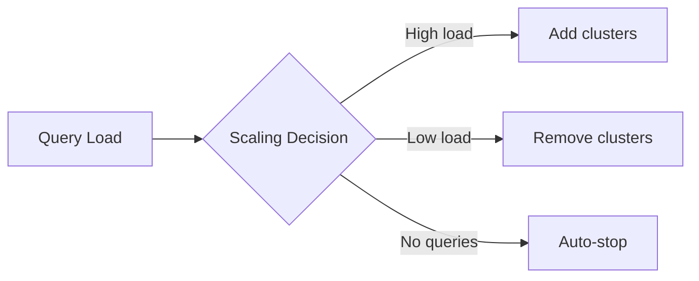
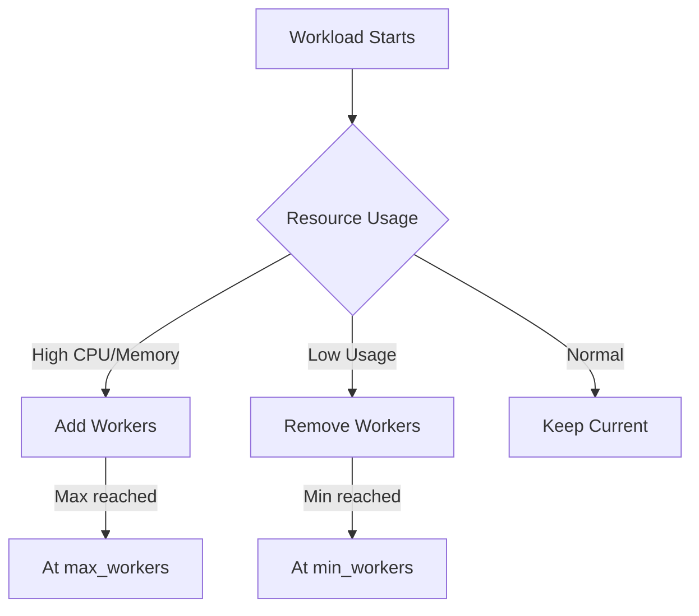
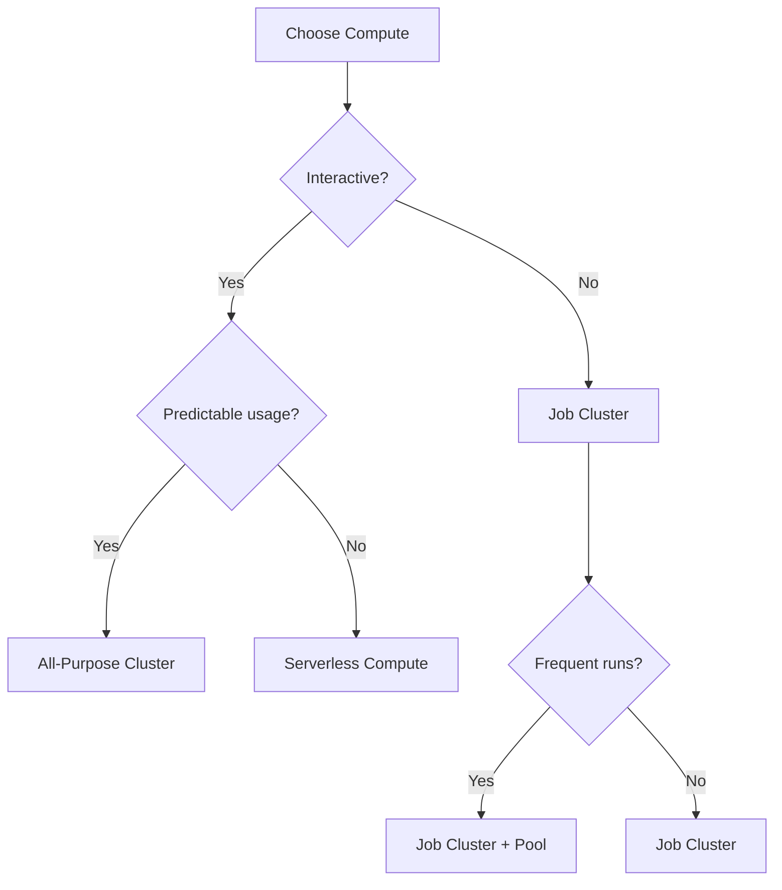

# Databricks Compute

Understanding Databricks compute options is essential for building cost-effective, performant data pipelines. Choose the right compute type based on workload characteristics.

## Overview



## Compute Types Comparison

| Type | Use Case | Cost | Startup Time | Best For |
| :--- | :--- | :--- | :--- | :--- |
| All-Purpose Clusters | Interactive development | Higher | 5-10 minutes | Notebooks, exploration |
| Job Clusters | Production jobs | Lower | 5-10 minutes | Scheduled workloads |
| Serverless Compute | Quick development | Pay-per-use | Seconds | Ad-hoc queries |
| Instance Pools | Reduce startup time | Moderate | Seconds | Frequent cluster creation |
| SQL Warehouse | SQL analytics | Per-query | Minutes | BI, dashboards |
| Serverless SQL | SQL analytics | Per-query | Seconds | BI, ad-hoc SQL |

## All-Purpose Clusters

All-purpose clusters are designed for interactive workloads and collaborative development.

### Characteristics



| Feature | Behavior |
| :--- | :--- |
| Persistence | Stays running until manually terminated or auto-terminated |
| Users | Multiple users can attach notebooks |
| Languages | Supports Python, SQL, Scala, R |
| Cost model | Pay while running (even if idle) |
| Auto-termination | Configurable (default 120 minutes) |

### Creating All-Purpose Clusters

```python
# Via SDK

from databricks.sdk import WorkspaceClient

w = WorkspaceClient()

cluster = w.clusters.create(
    cluster_name="dev-cluster",
    spark_version="14.3.x-scala2.12",
    node_type_id="Standard_DS3_v2",
    num_workers=2,
    autotermination_minutes=60,
    spark_conf={
        "spark.speculation": "true",
        "spark.databricks.delta.preview.enabled": "true"
    },
    custom_tags={
        "team": "data-engineering",
        "environment": "development"
    }
).result()

print(f"Cluster ID: {cluster.cluster_id}")
```

```sql
-- Via SQL (for serverless SQL or existing cluster)
-- Clusters are typically created via UI or API, not SQL
```

### Auto-Termination

```python
# Configure auto-termination

w.clusters.edit(
    cluster_id="xxx",
    autotermination_minutes=30  # Terminate after 30 mins idle
)

# Disable auto-termination (not recommended for cost)

w.clusters.edit(
    cluster_id="xxx",
    autotermination_minutes=0  # Never auto-terminate
)
```

| Setting | Behavior |
| :--- | :--- |
| `autotermination_minutes=0` | Never auto-terminate |
| `autotermination_minutes=60` | Terminate after 60 mins idle |
| Default | 120 minutes |

## Job Clusters

Job clusters are created for specific job runs and terminated after completion.

### Characteristics



| Feature | Behavior |
| :--- | :--- |
| Lifecycle | Created when job starts, terminated when job ends |
| Isolation | Dedicated to single job run |
| Cost model | Pay only during job execution |
| Configuration | Defined in job specification |
| Reuse | Cannot be reused between runs |

### Job Cluster Configuration

```python
from databricks.sdk import WorkspaceClient
from databricks.sdk.service.jobs import Task, NotebookTask

w = WorkspaceClient()

job = w.jobs.create(
    name="Daily ETL",
    tasks=[
        Task(
            task_key="etl_task",
            notebook_task=NotebookTask(
                notebook_path="/Jobs/etl_pipeline"
            ),
            new_cluster={  # Job cluster definition
                "spark_version": "14.3.x-scala2.12",
                "node_type_id": "Standard_DS3_v2",
                "num_workers": 4,
                "spark_conf": {
                    "spark.sql.shuffle.partitions": "200"
                }
            }
        )
    ]
)
```

### Job Cluster vs Existing Cluster

```python
# Using job cluster (recommended for production)

task_with_new_cluster = Task(
    task_key="task1",
    new_cluster={
        "spark_version": "14.3.x-scala2.12",
        "num_workers": 2,
        "node_type_id": "Standard_DS3_v2"
    },
    notebook_task=NotebookTask(notebook_path="/Jobs/task1")
)

# Using existing all-purpose cluster (for development)

task_with_existing_cluster = Task(
    task_key="task1",
    existing_cluster_id="1234-567890-abc",
    notebook_task=NotebookTask(notebook_path="/Jobs/task1")
)
```

| Approach | Pros | Cons |
| :--- | :--- | :--- |
| Job Cluster | Isolated, cost-effective, consistent | Startup overhead |
| Existing Cluster | Faster start, shared resources | Resource contention, higher cost |

## Instance Pools

Instance pools maintain a set of idle instances ready for quick allocation.

### How Pools Work



### Pool Configuration

```python
from databricks.sdk import WorkspaceClient

w = WorkspaceClient()

pool = w.instance_pools.create(
    instance_pool_name="etl-pool",
    node_type_id="Standard_DS3_v2",
    min_idle_instances=2,  # Always keep 2 instances ready
    max_capacity=10,       # Maximum instances in pool
    idle_instance_autotermination_minutes=30,  # Terminate idle after 30 mins
    preloaded_spark_versions=["14.3.x-scala2.12"]  # Pre-install Spark
)

print(f"Pool ID: {pool.instance_pool_id}")
```

### Using Pools with Clusters

```python
# All-purpose cluster using pool

cluster = w.clusters.create(
    cluster_name="dev-cluster",
    spark_version="14.3.x-scala2.12",
    instance_pool_id="pool-123",  # Use pool for workers
    driver_instance_pool_id="pool-123",  # Use pool for driver
    num_workers=2
)

# Job cluster using pool

job = w.jobs.create(
    name="Pooled Job",
    tasks=[Task(
        task_key="task1",
        new_cluster={
            "spark_version": "14.3.x-scala2.12",
            "instance_pool_id": "pool-123",
            "driver_instance_pool_id": "pool-123",
            "num_workers": 4
        },
        notebook_task=NotebookTask(notebook_path="/Jobs/task1")
    )]
)
```

### Pool Best Practices

| Setting | Recommendation | Reason |
| :--- | :--- | :--- |
| `min_idle_instances` | 1-2 | Balance cost vs startup time |
| `max_capacity` | Based on peak usage | Prevent over-provisioning |
| `idle_instance_autotermination_minutes` | 15-30 | Reduce idle costs |
| `preloaded_spark_versions` | Your common versions | Faster startup |

## Serverless Compute

Serverless compute provides instant compute without cluster management.

### Serverless for Notebooks


| Feature | Behavior |
| :--- | :--- |
| Startup time | Seconds (not minutes) |
| Languages | Python, SQL |
| Scaling | Automatic |
| Cost | Pay per compute usage |
| Management | No cluster configuration needed |

### Enabling Serverless

```python

# Serverless is enabled at workspace level
# Attach notebook to "Serverless" compute option in UI

```

### Serverless Limitations

| Supported | Not Supported |
| :--- | :--- |
| Python | Scala |
| SQL | R |
| Spark DataFrames | Low-level RDD operations |
| Most Spark APIs | Custom JARs |
| Delta Lake | Some advanced Spark configs |

## SQL Warehouses

SQL warehouses are optimized for SQL analytics and BI workloads.

### Warehouse Types



| Type | Features | Best For |
| :--- | :--- | :--- |
| Classic | Standard SQL, Photon | Cost-sensitive workloads |
| Pro | + Query federation, enhanced security | Enterprise features |
| Serverless | Instant start, auto-scale, no management | Ad-hoc queries, variable load |

### Creating SQL Warehouse



*SQL Warehouse creation form showing cluster size, auto-stop, and scaling settings.*

```python
from databricks.sdk import WorkspaceClient
from databricks.sdk.service.sql import EndpointInfo

w = WorkspaceClient()

warehouse = w.warehouses.create(
    name="analytics-warehouse",
    cluster_size="Small",  # 2X-Small, X-Small, Small, Medium, Large, X-Large, 2X-Large, 3X-Large, 4X-Large
    min_num_clusters=1,
    max_num_clusters=4,
    auto_stop_mins=30,
    enable_photon=True,
    warehouse_type="PRO",  # CLASSIC, PRO
    spot_instance_policy="COST_OPTIMIZED"  # COST_OPTIMIZED, RELIABILITY_OPTIMIZED
).result()

print(f"Warehouse ID: {warehouse.id}")
```

### Warehouse Sizing

| Size | Cluster DBU/hour | Use Case |
| :--- | :--- | :--- |
| 2X-Small | 2 | Light queries |
| X-Small | 4 | Development |
| Small | 8 | Small team |
| Medium | 16 | Medium workloads |
| Large | 32 | Heavy analytics |
| X-Large+ | 64+ | Enterprise scale |

### Auto-Scaling

```python
# Configure scaling

warehouse = w.warehouses.edit(
    id="warehouse-id",
    min_num_clusters=1,   # Minimum clusters running
    max_num_clusters=10,  # Maximum concurrent clusters
    auto_stop_mins=15     # Stop after 15 mins idle
)
```



## Photon Engine

Photon is Databricks' native vectorized query engine for accelerated SQL and DataFrame operations.

### Photon Benefits

| Workload | Speedup | Notes |
| :--- | :--- | :--- |
| Aggregations | 2-8x | SIMD vectorization |
| Joins | 2-5x | Optimized hash joins |
| Scans | 2-4x | Columnar processing |
| Filters | 2-5x | Predicate pushdown |

### Enabling Photon

```python
# On clusters

cluster = w.clusters.create(
    cluster_name="photon-cluster",
    spark_version="14.3.x-photon-scala2.12",  # Use Photon runtime
    runtime_engine="PHOTON",  # Explicitly enable
    # ...
)

# On SQL warehouses (enabled by default)

warehouse = w.warehouses.create(
    name="photon-warehouse",
    enable_photon=True,  # Enable Photon
    # ...
)
```

### Photon Limitations

| Accelerated | Not Accelerated |
| :--- | :--- |
| SQL queries | Python UDFs |
| DataFrame operations | Scala UDFs |
| Delta Lake operations | Complex nested types |
| Parquet/ORC reads | Some window functions |

## Cluster Policies

Cluster policies enforce configuration standards and cost controls.

### Policy Structure

```json
{
  "spark_version": {
    "type": "fixed",
    "value": "14.3.x-scala2.12"
  },
  "node_type_id": {
    "type": "allowlist",
    "values": ["Standard_DS3_v2", "Standard_DS4_v2"]
  },
  "num_workers": {
    "type": "range",
    "minValue": 1,
    "maxValue": 10
  },
  "autotermination_minutes": {
    "type": "fixed",
    "value": 60,
    "hidden": true
  },
  "custom_tags.team": {
    "type": "fixed",
    "value": "data-engineering"
  }
}
```

### Policy Types

| Type | Behavior | Example |
| :--- | :--- | :--- |
| `fixed` | Cannot be changed | Specific Spark version |
| `allowlist` | Must be from list | Approved instance types |
| `blocklist` | Cannot be from list | Expensive instances |
| `range` | Within min/max | 1-10 workers |
| `unlimited` | No restriction | Any value allowed |

### Creating Policies

```python
import json

policy = w.cluster_policies.create(
    name="Standard ETL Policy",
    definition=json.dumps({
        "spark_version": {"type": "fixed", "value": "14.3.x-scala2.12"},
        "node_type_id": {
            "type": "allowlist",
            "values": ["Standard_DS3_v2", "Standard_DS4_v2"]
        },
        "num_workers": {"type": "range", "minValue": 1, "maxValue": 20},
        "autotermination_minutes": {"type": "fixed", "value": 60}
    })
)
```

### Using Policies

```python
# Create cluster with policy

cluster = w.clusters.create(
    cluster_name="policy-cluster",
    policy_id="policy-123",  # Apply policy
    num_workers=4  # Must comply with policy
)
```

## Autoscaling

### Cluster Autoscaling

```python
# Enable autoscaling

cluster = w.clusters.create(
    cluster_name="autoscale-cluster",
    spark_version="14.3.x-scala2.12",
    node_type_id="Standard_DS3_v2",
    autoscale={
        "min_workers": 2,
        "max_workers": 10
    }
)
```

### Autoscaling Behavior



| Metric | Scale Up Trigger | Scale Down Trigger |
| :--- | :--- | :--- |
| Pending tasks | High queue | Empty queue |
| Executor memory | >90% used | <30% used |
| Shuffle | Spilling to disk | Under-utilized |

### Optimized Autoscaling

```python
# Enhanced autoscaling (Databricks-specific)

cluster = w.clusters.create(
    cluster_name="optimized-autoscale",
    spark_version="14.3.x-scala2.12",
    node_type_id="Standard_DS3_v2",
    autoscale={
        "min_workers": 1,
        "max_workers": 8
    },
    spark_conf={
        "spark.databricks.cluster.scaling.optimized.enabled": "true"
    }
)
```

## Spot Instances

Use spot/preemptible instances for cost savings.

### Spot Configuration

```python
# AWS spot instances

cluster = w.clusters.create(
    cluster_name="spot-cluster",
    spark_version="14.3.x-scala2.12",
    node_type_id="m5.xlarge",
    num_workers=4,
    aws_attributes={
        "first_on_demand": 1,  # Driver on-demand
        "availability": "SPOT_WITH_FALLBACK",
        "spot_bid_price_percent": 100
    }
)

# Azure spot instances

cluster = w.clusters.create(
    cluster_name="spot-cluster",
    spark_version="14.3.x-scala2.12",
    node_type_id="Standard_DS3_v2",
    num_workers=4,
    azure_attributes={
        "first_on_demand": 1,
        "availability": "SPOT_WITH_FALLBACK_AZURE",
        "spot_bid_max_price": -1  # Use current price
    }
)
```

### Spot Availability Options

| Option | Behavior | Risk |
| :--- | :--- | :--- |
| `SPOT` | All spot instances | Higher interruption risk |
| `SPOT_WITH_FALLBACK` | Spot preferred, on-demand fallback | Lower risk, higher potential cost |
| `ON_DEMAND` | All on-demand | No interruption, highest cost |

## Cluster Permissions

### Permission Levels

| Permission | Capabilities |
| :--- | :--- |
| No Permission | Cannot see cluster |
| Can Attach To | Attach notebooks |
| Can Restart | Attach + restart cluster |
| Can Manage | Full control |

### Setting Permissions

```python
from databricks.sdk.service.iam import AccessControlList, AccessControlRequest

w.permissions.set(
    object_type="clusters",
    object_id="cluster-id",
    access_control_list=[
        AccessControlRequest(
            user_name="user@company.com",
            permission_level="CAN_ATTACH_TO"
        ),
        AccessControlRequest(
            group_name="data-engineers",
            permission_level="CAN_RESTART"
        )
    ]
)
```

## Use Cases

### Development Workflow

| Stage | Compute Type | Rationale |
| :--- | :--- | :--- |
| Exploration | Serverless or small all-purpose | Quick iteration |
| Development | All-purpose cluster | Persistent environment |
| Testing | Job cluster | Isolated, reproducible |
| Production | Job cluster with pool | Fast startup, cost-effective |

### Cost Optimization Decision Tree



## Common Issues & Errors

### Cluster Startup Timeout

**Scenario:** Cluster takes too long to start.

**Fix:** Use instance pools or check cloud quotas.

### Out of Memory

**Scenario:** Executor or driver OOM errors.

**Fix:** Increase instance size or add workers:

```python
# Increase driver memory

spark_conf = {
    "spark.driver.memory": "8g"
}
```

### Spot Instance Interruption

**Scenario:** Spot instances preempted during job.

**Fix:** Use `SPOT_WITH_FALLBACK` or set first_on_demand:

```python
aws_attributes = {
    "first_on_demand": 2,  # Keep driver + 1 worker on-demand
    "availability": "SPOT_WITH_FALLBACK"
}
```

### Policy Violation

**Scenario:** Cluster creation blocked by policy.

**Fix:** Adjust cluster config to comply with policy or request policy change.

### Quota Exceeded

**Scenario:** Cannot create cluster due to cloud quota.

**Fix:** Request quota increase from cloud provider or terminate unused resources.

## Exam Tips

1. **Job vs All-Purpose** - Job clusters are isolated and cost-effective for production
2. **Pools** - Reduce startup time from minutes to seconds
3. **Serverless** - Instant startup, Python/SQL only, no Scala/R
4. **Photon** - Accelerates SQL/DataFrame ops, not UDFs
5. **Auto-termination** - Default 120 mins, set 0 to disable
6. **Autoscaling** - Based on pending tasks and resource usage
7. **Spot instances** - Use first_on_demand for driver reliability
8. **Cluster permissions** - Can Attach To < Can Restart < Can Manage
9. **Policies** - fixed, allowlist, range, unlimited types
10. **SQL Warehouse sizes** - Know Small = 8 DBU/hour baseline

## Key Takeaways

- **Job clusters vs all-purpose clusters**: job clusters are created per run, isolated, and auto-terminated — lower cost and recommended for production; all-purpose clusters persist and are shared across users — better for interactive development
- **Instance pools** keep a set of pre-provisioned idle instances that reduce cluster startup from minutes to seconds; clusters reference a pool via `instance_pool_id`
- **Serverless compute** starts in seconds and supports Python and SQL only; Scala and R are not supported, and low-level RDD operations and custom JARs are unavailable
- **Photon** accelerates SQL queries and DataFrame operations (joins, aggregations, scans, filters) via vectorized C++ execution but does not accelerate Python or Scala UDFs
- **Auto-termination default is 120 minutes**; setting `autotermination_minutes=0` disables it (not recommended for cost management)
- **Cluster policy types**: `fixed` (enforced value), `allowlist` (must be in list), `blocklist` (must not be in list), `range` (min/max), `unlimited` (unrestricted)
- **SQL Warehouse types**: Classic (standard), Pro (query federation, enhanced security), Serverless (instant startup, auto-scale, no management overhead)
- **Spot instance availability**: `SPOT` (all spot, higher interruption risk), `SPOT_WITH_FALLBACK` (spot preferred with on-demand fallback), `ON_DEMAND` (no interruption, highest cost)

## Related Topics

- [Workspace and Notebooks](01-workspace-and-notebooks.md) - Compute attachment
- [Performance Optimization](../08-performance-optimization/README.md) - Tuning compute
- [Cost Optimization](../08-performance-optimization/04-cost-optimization.md) - Reducing spend

## Official Documentation

- [Compute Overview](https://docs.databricks.com/compute/index.html)
- [Cluster Configuration](https://docs.databricks.com/clusters/configure.html)
- [Instance Pools](https://docs.databricks.com/clusters/instance-pools/index.html)
- [SQL Warehouses](https://docs.databricks.com/sql/admin/sql-endpoints.html)
- [Photon](https://docs.databricks.com/runtime/photon.html)

---

**[← Previous: Databricks REST API — Part 2 (Permissions, SQL, Error Handling & Use Cases)](./03-rest-api-part2.md) | [↑ Back to Databricks Tooling](./README.md) | [Next: DBFS and Mounts](./05-dbfs-and-mounts.md) →**
