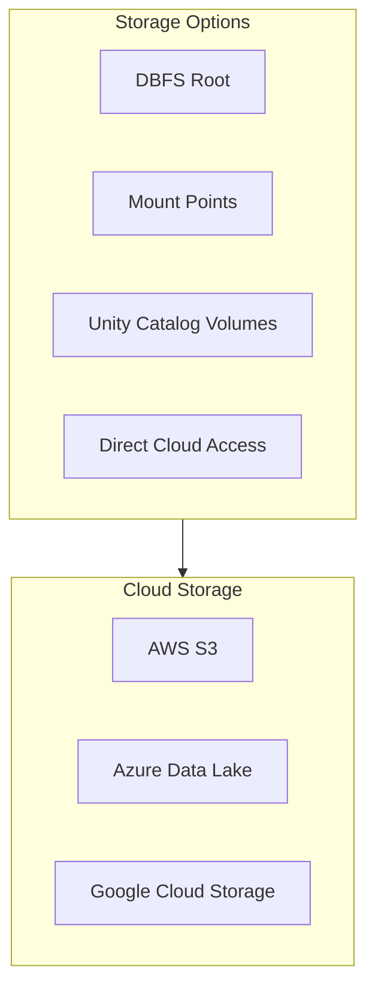
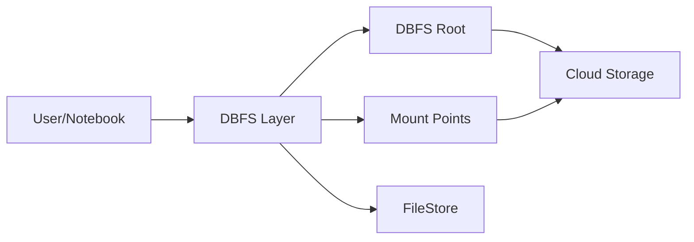
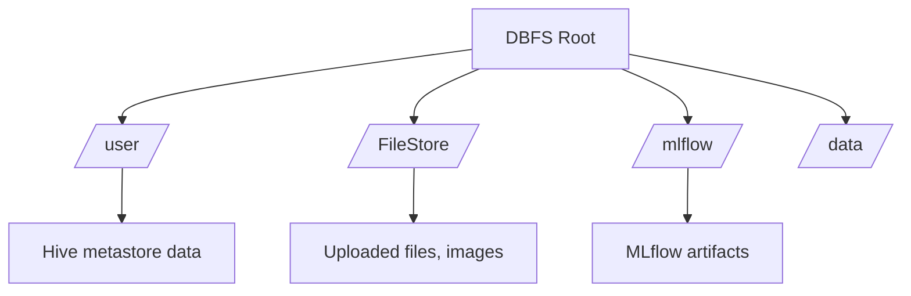
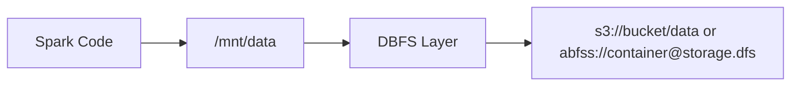
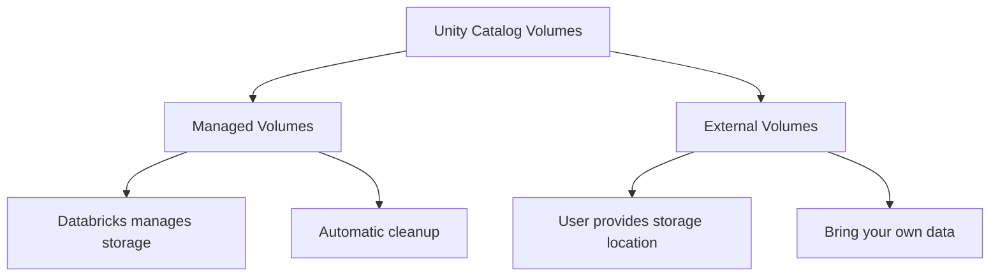
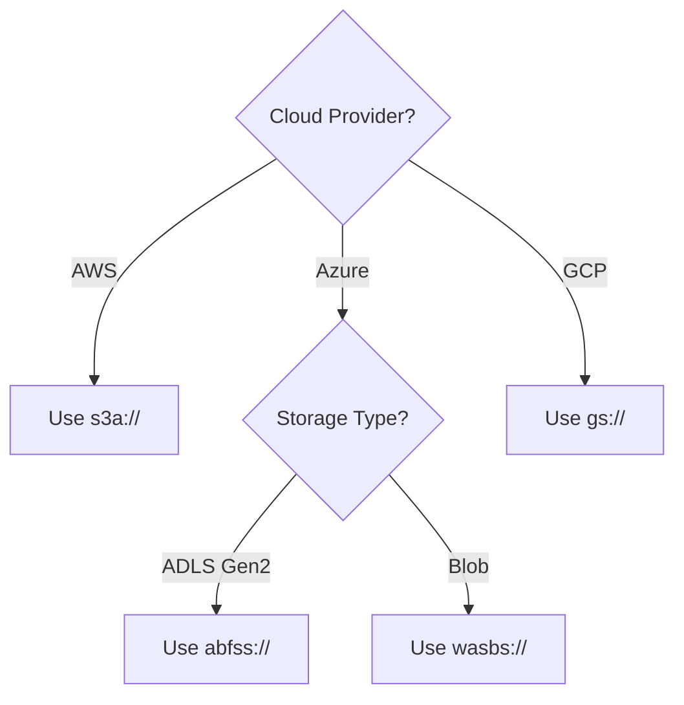
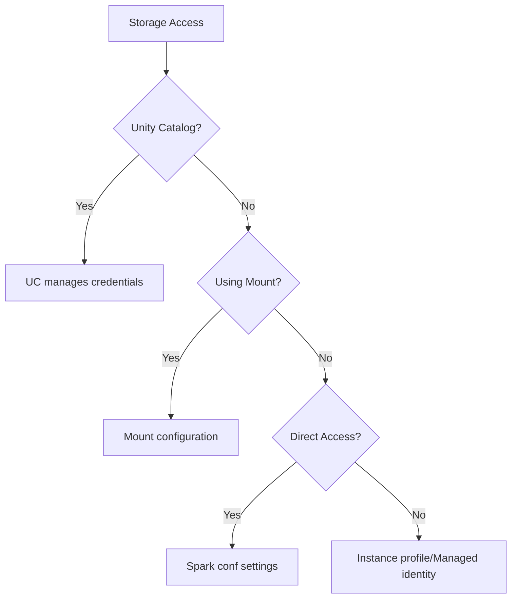
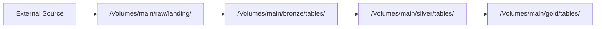

# DBFS and Cloud Storage

Understanding Databricks File System (DBFS) and cloud storage integration is essential for managing data in Databricks pipelines.

## Overview



## DBFS (Databricks File System)

DBFS is a distributed file system mounted into a Databricks workspace.

### DBFS Architecture



### DBFS Path Formats

| Format | Context | Example |
| :--- | :--- | :--- |
| `dbfs:/` | Spark APIs | `dbfs:/data/input.csv` |
| `/dbfs/` | Local file APIs | `/dbfs/data/input.csv` |
| `file:/` | Local driver filesystem | `file:/tmp/local.csv` |

```python
# Spark APIs use dbfs:/ prefix

df = spark.read.format("csv").load("dbfs:/data/input.csv")

# Python file APIs use /dbfs/ path

with open("/dbfs/data/config.json", "r") as f:
    config = json.load(f)

# Equivalent operations
# These read the same file:

spark.read.text("dbfs:/data/sample.txt")  # Spark
open("/dbfs/data/sample.txt", "r")         # Python
```

### DBFS Root Storage

DBFS root is the default storage location for workspace data.



| Path | Purpose | Notes |
| :--- | :--- | :--- |
| `/user/hive/warehouse/` | Hive metastore tables | Legacy location |
| `/FileStore/` | Uploaded files, images | Accessible via URL |
| `/FileStore/tables/` | Uploaded data files | For small files |
| `/mlflow/` | MLflow artifacts | Experiment tracking |
| `/tmp/` | Temporary files | Auto-cleaned |

### DBFS Operations

```python
# List files

files = dbutils.fs.ls("dbfs:/data/")
for f in files:
    print(f"{f.name} - {f.size} bytes - isDir: {f.isDir()}")

# Check if path exists

def path_exists(path):
    try:
        dbutils.fs.ls(path)
        return True
    except Exception:
        return False

# Create directory

dbutils.fs.mkdirs("dbfs:/data/new_folder/")

# Copy files

dbutils.fs.cp("dbfs:/source/file.csv", "dbfs:/dest/file.csv")
dbutils.fs.cp("dbfs:/source/", "dbfs:/dest/", recurse=True)

# Move files

dbutils.fs.mv("dbfs:/old/path.csv", "dbfs:/new/path.csv")

# Delete files

dbutils.fs.rm("dbfs:/data/temp.csv")
dbutils.fs.rm("dbfs:/data/temp_folder/", recurse=True)

# Read file content (first 64KB)

content = dbutils.fs.head("dbfs:/data/sample.txt", maxBytes=1024)

# Write small text file

dbutils.fs.put("dbfs:/data/output.txt", "Hello World", overwrite=True)
```

### FileStore

FileStore is a special DBFS location accessible via web URLs.

```python
# Upload file to FileStore

dbutils.fs.cp("dbfs:/data/image.png", "dbfs:/FileStore/images/image.png")

# Access via URL
# https://<workspace-url>/files/images/image.png

# Display image in notebook

displayHTML('')
```

| FileStore Path | URL Path |
| :--- | :--- |
| `dbfs:/FileStore/images/logo.png` | `/files/images/logo.png` |
| `dbfs:/FileStore/tables/data.csv` | `/files/tables/data.csv` |

## Mount Points (Legacy)

Mount points map cloud storage to DBFS paths. **Note:** Mounts are considered legacy; use Unity Catalog Volumes for new workloads.

### Mount Architecture



### AWS S3 Mounts

```python
# Mount S3 bucket with instance profile (recommended)

dbutils.fs.mount(
    source="s3a://my-bucket/data",
    mount_point="/mnt/s3-data"
)

# Mount with access keys (not recommended for production)

access_key = dbutils.secrets.get("aws", "access-key")
secret_key = dbutils.secrets.get("aws", "secret-key")

dbutils.fs.mount(
    source="s3a://my-bucket/data",
    mount_point="/mnt/s3-data",
    extra_configs={
        "fs.s3a.access.key": access_key,
        "fs.s3a.secret.key": secret_key
    }
)
```

### Azure Data Lake Storage Mounts

```python
# Mount ADLS Gen2 with service principal

configs = {
    "fs.azure.account.auth.type": "OAuth",
    "fs.azure.account.oauth.provider.type": "org.apache.hadoop.fs.azurebfs.oauth2.ClientCredsTokenProvider",
    "fs.azure.account.oauth2.client.id": dbutils.secrets.get("azure", "client-id"),
    "fs.azure.account.oauth2.client.secret": dbutils.secrets.get("azure", "client-secret"),
    "fs.azure.account.oauth2.client.endpoint": "https://login.microsoftonline.com/<tenant-id>/oauth2/token"
}

dbutils.fs.mount(
    source="abfss://container@storageaccount.dfs.core.windows.net/",
    mount_point="/mnt/adls-data",
    extra_configs=configs
)

# Mount with SAS token

configs = {
    "fs.azure.sas.<container>.<storage-account>.blob.core.windows.net":
        dbutils.secrets.get("azure", "sas-token")
}

dbutils.fs.mount(
    source="wasbs://container@storageaccount.blob.core.windows.net/",
    mount_point="/mnt/blob-data",
    extra_configs=configs
)
```

### GCS Mounts

```python
# Mount Google Cloud Storage

dbutils.fs.mount(
    source="gs://my-bucket/data",
    mount_point="/mnt/gcs-data"
)
```

### Managing Mounts

```python
# List all mounts

mounts = dbutils.fs.mounts()
for mount in mounts:
    print(f"{mount.mountPoint} -> {mount.source}")

# Check if mount exists

def mount_exists(mount_point):
    return any(m.mountPoint == mount_point for m in dbutils.fs.mounts())

# Unmount

dbutils.fs.unmount("/mnt/s3-data")

# Refresh mounts (after external changes)

dbutils.fs.refreshMounts()
```

### Mount Best Practices

| Do | Don't |
| :--- | :--- |
| Use secrets for credentials | Hardcode credentials |
| Use instance profiles/managed identity | Use access keys in code |
| Document mount points | Create ad-hoc mounts |
| Consider Unity Catalog Volumes | Create new mounts in 2024+ |

## Unity Catalog Volumes (Recommended)

Unity Catalog Volumes provide governed access to cloud storage.

### Volume Types



| Type | Storage | Governance | Use Case |
| :--- | :--- | :--- | :--- |
| Managed | Databricks-managed | Full | Generated data, outputs |
| External | Your cloud storage | Full | Existing data, landing zones |

### Creating Volumes

```sql
-- Create managed volume
CREATE VOLUME main.default.my_volume;

-- Create external volume
CREATE EXTERNAL VOLUME main.default.landing_zone
LOCATION 's3://my-bucket/landing/';

-- Create external volume (Azure)
CREATE EXTERNAL VOLUME main.default.landing_zone
LOCATION 'abfss://container@storage.dfs.core.windows.net/landing/';
```

### Volume Paths

```python

# Volume paths use /Volumes/ prefix
# Format: /Volumes/<catalog>/<schema>/<volume>/

# Read from volume

df = spark.read.format("csv").load("/Volumes/main/default/landing_zone/data.csv")

# Write to volume

df.write.format("parquet").save("/Volumes/main/default/my_volume/output/")

# Python file operations

with open("/Volumes/main/default/my_volume/config.json", "r") as f:
    config = json.load(f)

# List volume contents

files = dbutils.fs.ls("/Volumes/main/default/my_volume/")
```

### Volume Operations

```sql
-- List volumes in schema
SHOW VOLUMES IN main.default;

-- Describe volume
DESCRIBE VOLUME main.default.my_volume;

-- Drop volume
DROP VOLUME main.default.my_volume;
```

### Volume vs Mount Comparison

| Feature | Mounts | Unity Catalog Volumes |
| :--- | :--- | :--- |
| Governance | No | Yes (UC permissions) |
| Audit logging | Limited | Full |
| Access control | Workspace-level | Fine-grained |
| Path format | `/mnt/...` | `/Volumes/catalog/schema/volume/` |
| Recommended | Legacy | New workloads |

## Direct Cloud Access

Access cloud storage directly without mounts or volumes.

### AWS S3 Direct Access

```python
# With instance profile (attached to cluster)

df = spark.read.format("parquet").load("s3://bucket/path/")

# With temporary credentials

spark.conf.set("fs.s3a.access.key", access_key)
spark.conf.set("fs.s3a.secret.key", secret_key)
df = spark.read.format("parquet").load("s3a://bucket/path/")

# Using assume role

spark.conf.set("fs.s3a.aws.credentials.provider",
    "org.apache.hadoop.fs.s3a.auth.AssumedRoleCredentialProvider")
spark.conf.set("fs.s3a.assumed.role.arn", "arn:aws:iam::123456789:role/my-role")
```

### Azure Direct Access

```python
# With service principal

spark.conf.set(f"fs.azure.account.auth.type.{storage_account}.dfs.core.windows.net", "OAuth")
spark.conf.set(f"fs.azure.account.oauth.provider.type.{storage_account}.dfs.core.windows.net",
    "org.apache.hadoop.fs.azurebfs.oauth2.ClientCredsTokenProvider")
spark.conf.set(f"fs.azure.account.oauth2.client.id.{storage_account}.dfs.core.windows.net",
    client_id)
spark.conf.set(f"fs.azure.account.oauth2.client.secret.{storage_account}.dfs.core.windows.net",
    dbutils.secrets.get("azure", "client-secret"))
spark.conf.set(f"fs.azure.account.oauth2.client.endpoint.{storage_account}.dfs.core.windows.net",
    f"https://login.microsoftonline.com/{tenant_id}/oauth2/token")

df = spark.read.format("parquet").load(f"abfss://container@{storage_account}.dfs.core.windows.net/path/")

# With SAS token

spark.conf.set(f"fs.azure.sas.{container}.{storage_account}.blob.core.windows.net",
    dbutils.secrets.get("azure", "sas-token"))
df = spark.read.format("parquet").load(f"wasbs://{container}@{storage_account}.blob.core.windows.net/path/")
```

### GCS Direct Access

```python
# With service account (attached to cluster)

df = spark.read.format("parquet").load("gs://bucket/path/")

# With service account key file

spark.conf.set("google.cloud.auth.service.account.enable", "true")
spark.conf.set("google.cloud.auth.service.account.json.keyfile", "/path/to/keyfile.json")
```

## Storage Protocols

### Protocol Comparison

| Protocol | Cloud | Format | Use Case |
| :--- | :--- | :--- | :--- |
| `s3://` | AWS | Legacy S3 | Older compatibility |
| `s3a://` | AWS | Optimized S3 | Recommended for AWS |
| `wasb://` | Azure Blob | Legacy | Blob storage |
| `wasbs://` | Azure Blob | Legacy + SSL | Blob storage |
| `abfs://` | Azure ADLS Gen2 | Optimized | Recommended for Azure |
| `abfss://` | Azure ADLS Gen2 | Optimized + SSL | Recommended for Azure |
| `gs://` | GCP | GCS | Google Cloud |

### Choosing the Right Protocol



## Access Patterns

### Credential Hierarchy



### Recommended Access Pattern by Use Case

| Use Case | Recommended Approach |
| :--- | :--- |
| New workloads | Unity Catalog Volumes |
| Legacy pipelines | Existing mounts |
| External data | External Volumes |
| Cross-cloud | External Volumes with storage credentials |
| Ad-hoc access | Direct access with secrets |

## Data Movement Patterns

### Copy Between Locations

```python
# Copy between DBFS locations

dbutils.fs.cp("dbfs:/source/", "dbfs:/dest/", recurse=True)

# Copy from cloud to DBFS

dbutils.fs.cp("s3://bucket/data/", "dbfs:/local-copy/", recurse=True)

# Copy using Spark (for large data)

df = spark.read.format("parquet").load("s3://source-bucket/data/")
df.write.format("parquet").save("abfss://container@storage/dest/")
```

### Upload/Download with REST API

```python
# For small files, use REST API

import requests
import base64

# Upload to DBFS

url = f"{workspace_url}/api/2.0/dbfs/put"
data = base64.b64encode(file_content).decode()
response = requests.post(url, headers=headers, json={
    "path": "/data/file.txt",
    "contents": data,
    "overwrite": True
})
```

## Use Cases

### Landing Zone Pattern



```python
# Landing zone with external volume

landing_path = "/Volumes/main/raw/landing/"

# Process new files

new_files = dbutils.fs.ls(landing_path)
for file in new_files:
    if file.name.endswith(".csv"):
        df = spark.read.format("csv").option("header", "true").load(file.path)
        df.write.format("delta").mode("append").saveAsTable("main.bronze.raw_data")

        # Archive processed file
        dbutils.fs.mv(file.path, f"/Volumes/main/raw/archive/{file.name}")
```

### Multi-Cloud Data Access

```python
# Read from AWS

aws_df = spark.read.format("parquet").load("/Volumes/aws/raw/data/")

# Read from Azure

azure_df = spark.read.format("parquet").load("/Volumes/azure/raw/data/")

# Combine data

combined = aws_df.unionByName(azure_df)
combined.write.format("delta").saveAsTable("main.combined.all_data")
```

## Common Issues & Errors

### Permission Denied on DBFS

**Scenario:** Cannot access DBFS path.

**Fix:** Check cluster IAM role or storage permissions.

### Mount Point Already Exists

**Scenario:** Mount fails because path exists.

```python
# Error: Directory already mounted

```

**Fix:** Unmount first or use different mount point:

```python
if mount_exists("/mnt/data"):
    dbutils.fs.unmount("/mnt/data")
dbutils.fs.mount(source="...", mount_point="/mnt/data")
```

### Credential Not Found

**Scenario:** Direct access fails due to missing credentials.

**Fix:** Set Spark configuration or use Unity Catalog:

```python
# Check if config is set

spark.conf.get("fs.s3a.access.key", "NOT_SET")
```

### Path Format Mismatch

**Scenario:** Mixing `/dbfs/` and `dbfs:/` incorrectly.

```python
# Wrong: Using /dbfs/ with Spark

df = spark.read.csv("/dbfs/data/file.csv")  # Error

# Correct: Use dbfs:/ with Spark

df = spark.read.csv("dbfs:/data/file.csv")

# Correct: Use /dbfs/ with Python

with open("/dbfs/data/file.csv") as f: ...
```

### Volume Not Found

**Scenario:** Unity Catalog volume path not accessible.

**Fix:** Check catalog/schema permissions and volume existence:

```sql
SHOW VOLUMES IN main.default;
DESCRIBE VOLUME main.default.my_volume;
```

## Exam Tips

1. **DBFS paths** - `dbfs:/` for Spark, `/dbfs/` for Python file APIs
2. **Mount deprecation** - Mounts are legacy; volumes are recommended
3. **Volume types** - Managed (Databricks stores) vs External (your storage)
4. **Volume path format** - `/Volumes/<catalog>/<schema>/<volume>/`
5. **FileStore** - Special DBFS location accessible via web URLs
6. **Protocol choice** - s3a:// for AWS, abfss:// for Azure ADLS Gen2
7. **Credential precedence** - UC > Instance profile > Spark conf > Mount config
8. **DBFS root** - Contains /user/hive/warehouse, /FileStore, /tmp
9. **refreshMounts()** - Needed after external mount changes
10. **Direct access** - Requires explicit credential configuration

## Key Takeaways

- **DBFS path formats**: use `dbfs:/...` with Spark APIs (`spark.read`, `df.write`); use `/dbfs/...` with Python file I/O (`open()`); never mix these — using `/dbfs/` with Spark or `dbfs:/` with Python file APIs causes errors
- **Mount points are legacy**: `dbutils.fs.mount()` is deprecated for new workloads; Unity Catalog Volumes (`/Volumes/catalog/schema/volume/`) are the recommended replacement with full governance and audit logging
- **Volume types**: Managed volumes are stored in Databricks-controlled storage and auto-cleaned on drop; External volumes point to user-owned cloud storage and are not cleaned on drop
- **Volume path format**: `/Volumes/<catalog>/<schema>/<volume>/path` — works for both Spark APIs and Python file I/O
- **FileStore** (`dbfs:/FileStore/`) is a special DBFS location accessible via HTTP URL (`/files/...`); use it for images and small files to embed in notebooks
- **Cloud storage protocols**: prefer `s3a://` (AWS), `abfss://` (Azure ADLS Gen2 with SSL), `gs://` (GCP); avoid legacy `s3://`, `wasb://`, `abfs://`
- **DBFS root key directories**: `/user/hive/warehouse/` (Hive metastore tables), `/FileStore/` (web-accessible files), `/mlflow/` (MLflow artifacts), `/tmp/` (auto-cleaned temp files)
- **Credential precedence** for cloud storage access: Unity Catalog external location credentials > cluster instance profile / managed identity > Spark configuration > mount configuration

## Related Topics

- [Unity Catalog](../04-security-governance/01-unity-catalog.md) - Governance for volumes
- [Secret Management](../04-security-governance/04-secret-management.md) - Storing credentials
- [Auto Loader](../01-data-processing/04-auto-loader.md) - File ingestion from cloud storage

## Official Documentation

- [DBFS](https://docs.databricks.com/dbfs/index.html)
- [Unity Catalog Volumes](https://docs.databricks.com/volumes/index.html)
- [Mount Cloud Storage](https://docs.databricks.com/dbfs/mounts.html)
- [External Locations](https://docs.databricks.com/data-governance/unity-catalog/manage-external-locations-and-credentials.html)

---

**[← Previous: Databricks Compute](./04-databricks-compute.md) | [↑ Back to Databricks Tooling](./README.md)**
