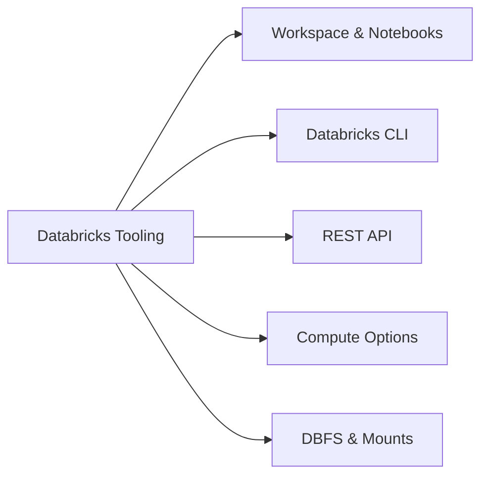
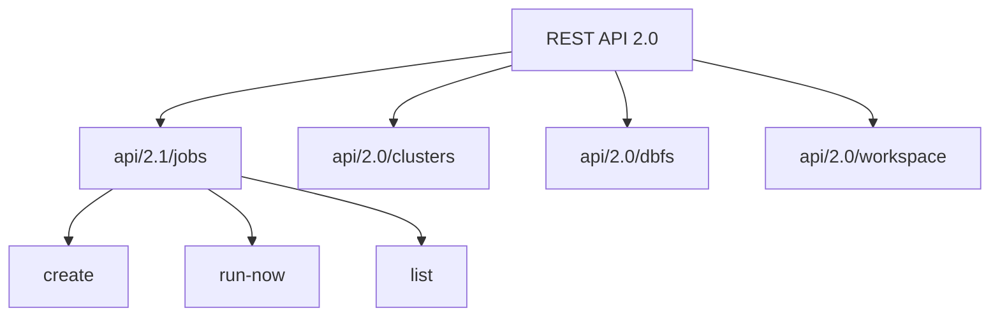

# Databricks Tooling (20% of Exam)

Understanding the Databricks platform tools and interfaces is essential for production data engineering.

## Topics Overview

## Section Contents

| File | Topic | Priority |
| :--- | :--- | :--- |
| [01-workspace-and-notebooks.md](01-workspace-and-notebooks.md) | Notebook features, widgets, magic commands | High |
| [02-databricks-cli-part1.md](02-databricks-cli-part1.md) | CLI installation, authentication, workspace, DBFS & jobs commands | Medium |
| [02-databricks-cli-part2.md](02-databricks-cli-part2.md) | Cluster, secrets, bundle, Unity Catalog commands & exam prep | Medium |
| [03-rest-api-part1.md](03-rest-api-part1.md) | Jobs API 2.1, Clusters API, DBFS API, Workspace API, Secrets API | High |
| [03-rest-api-part2.md](03-rest-api-part2.md) | Permissions API, SQL Statements, error handling, rate limits, use cases | High |
| [04-databricks-compute.md](04-databricks-compute.md) | Cluster types, serverless, pools | High |
| [05-dbfs-and-mounts.md](05-dbfs-and-mounts.md) | DBFS operations, cloud storage mounts | Medium |

## Key Concepts to Master

### Compute Types Comparison

| Type | Use Case | Cost | Startup |
| :--- | :--- | :--- | :--- |
| All-Purpose Clusters | Interactive development | Higher | Minutes |
| Job Clusters | Production jobs | Lower | Minutes |
| Serverless Compute | SQL analytics | Pay-per-query | Seconds |
| Instance Pools | Reduce startup time | Moderate | Seconds |

### Notebook Magic Commands

| Command | Purpose |
| :--- | :--- |
| `%python` | Switch to Python |
| `%sql` | Switch to SQL |
| `%scala` | Switch to Scala |
| `%run` | Run another notebook |
| `%fs` | DBFS file operations |
| `%sh` | Shell commands |

### Widget Types

| Widget | Usage |
| :--- | :--- |
| `text` | Free-form text input |
| `dropdown` | Single selection from list |
| `combobox` | Editable dropdown |
| `multiselect` | Multiple selections |

## REST API Key Endpoints

## Exam Tips

1. **Jobs API 2.0** - Know the difference between `run-now` and `submit`
2. **Cluster permissions** - Can Attach To, Can Restart, Can Manage
3. **Notebook permissions** - Can Read, Can Run, Can Edit, Can Manage
4. **Widget scope** - Understand notebook-level vs job-level parameters
5. **DBFS paths** - `/dbfs/` mount point vs `dbfs:/` URI scheme

## Practice Focus Areas

- [ ] Create and manage jobs via REST API
- [ ] Configure cluster policies
- [ ] Use widgets for parameterized notebooks
- [ ] Mount cloud storage securely
- [ ] Manage workspace with CLI

---

**[← Back to Certification](../README.md)**
