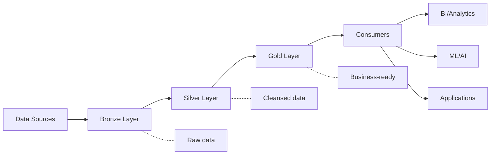
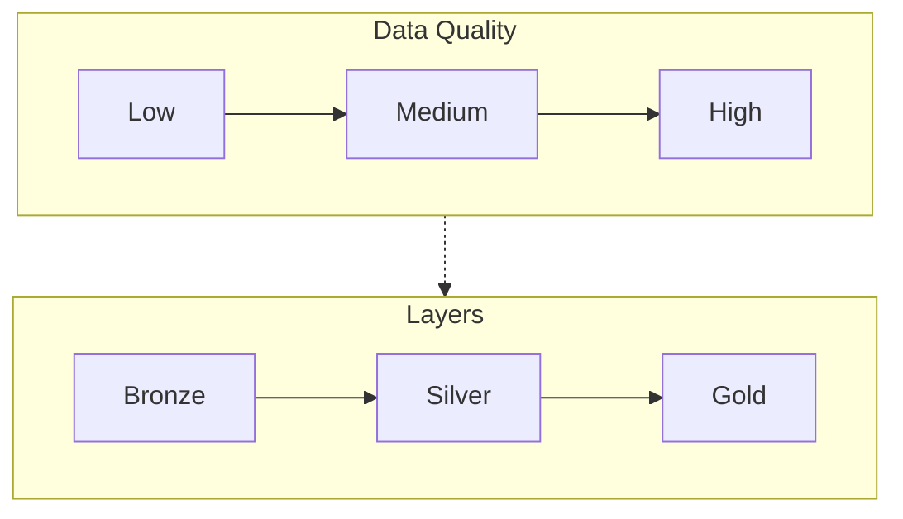
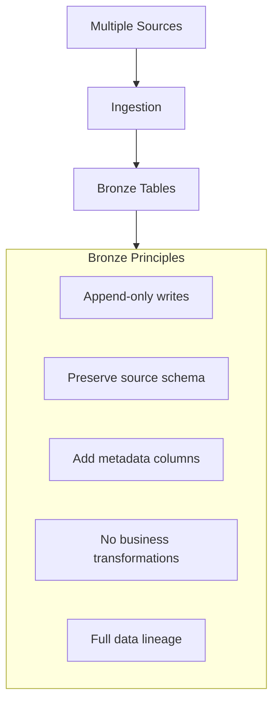
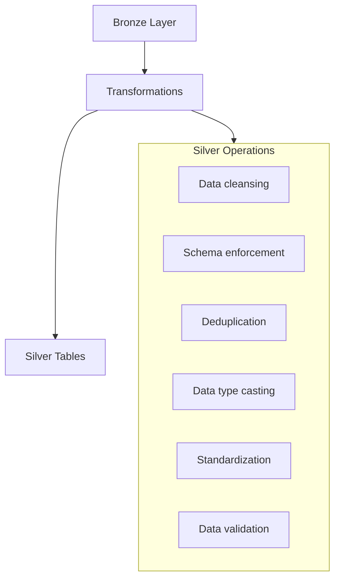
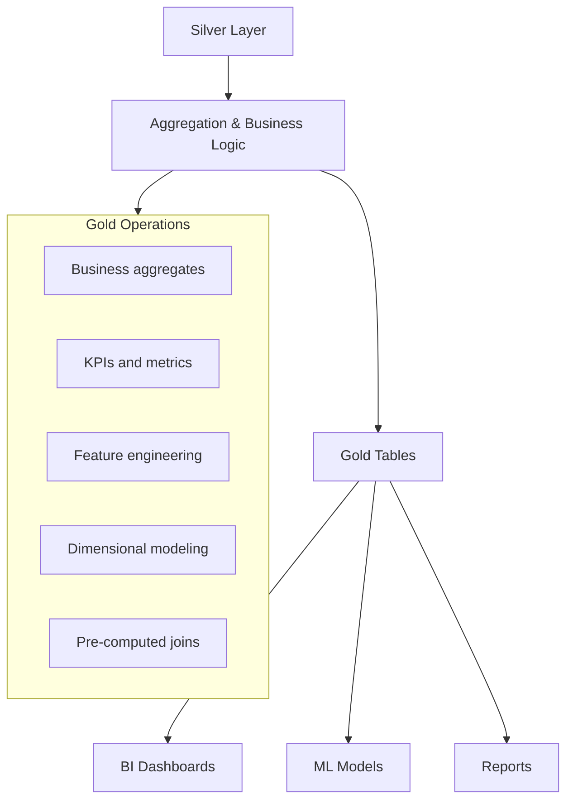
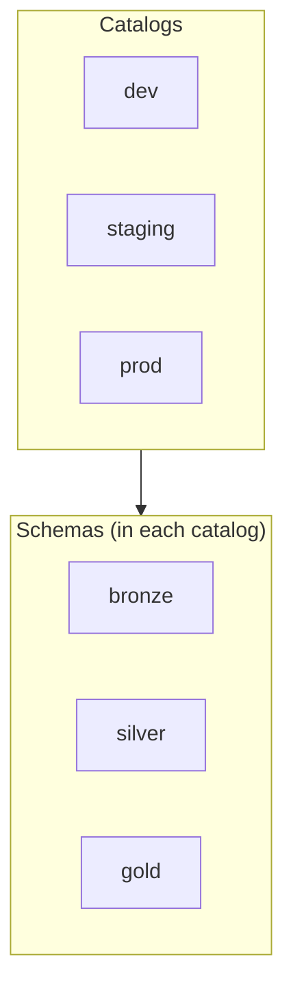
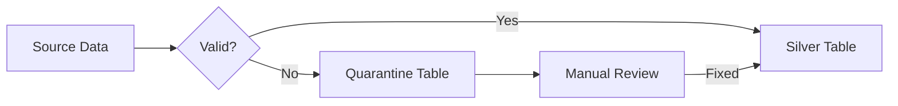

# Medallion Architecture

The medallion architecture (also known as multi-hop architecture) is a data design pattern for organizing data in a lakehouse. It progressively improves data quality across Bronze, Silver, and Gold layers.

## Overview



## Layer Characteristics

### Comparison Table

| Aspect | Bronze | Silver | Gold |
| :--- | :--- | :--- | :--- |
| Data Quality | Raw, as-is | Cleansed, validated | Curated, business-ready |
| Schema | Flexible (schema-on-read) | Enforced | Strict, documented |
| Update Pattern | Append-only | Merge/Upsert | Aggregated |
| Deduplication | None | Yes | Yes |
| Data Types | Often strings | Properly typed | Optimized |
| Transformations | Minimal | Cleaning, standardization | Business logic |
| Retention | Long (audit) | Medium-Long | Based on requirements |
| Users | Data engineers | Data engineers, analysts | Analysts, scientists, apps |

### Data Quality Progression



## Bronze Layer

The Bronze layer captures raw data exactly as received from source systems.

### Bronze Layer Principles



### Bronze Table Design

```python
from pyspark.sql.functions import current_timestamp, input_file_name, lit

# Read raw data with minimal transformation

raw_df = spark.read.format("json").load("/Volumes/raw/landing/customers/")

# Add ingestion metadata (standard Bronze practice)

bronze_df = (raw_df
    .withColumn("_ingested_at", current_timestamp())
    .withColumn("_source_file", input_file_name())
    .withColumn("_source_system", lit("crm_api")))

# Write to Bronze layer (append-only)

(bronze_df.write
    .format("delta")
    .mode("append")
    .option("mergeSchema", "true")
    .saveAsTable("bronze.customers_raw"))
```

```sql
-- Bronze table with metadata columns
CREATE TABLE bronze.customers_raw (
    -- Source columns (preserved as-is)
    customer_id STRING,
    name STRING,
    email STRING,
    raw_data STRING,  -- Store entire payload for complex sources

    -- Metadata columns
    _ingested_at TIMESTAMP,
    _source_file STRING,
    _source_system STRING,
    _batch_id STRING
)
USING DELTA
PARTITIONED BY (_ingested_at::date);
```

### Auto Loader for Bronze Ingestion

```python
# Auto Loader for incremental Bronze ingestion

df = (spark.readStream
    .format("cloudFiles")
    .option("cloudFiles.format", "json")
    .option("cloudFiles.schemaLocation", "/checkpoints/customers/_schema")
    .option("cloudFiles.inferColumnTypes", "true")
    .option("cloudFiles.schemaEvolutionMode", "addNewColumns")
    .load("/Volumes/raw/landing/customers/"))

# Add metadata and write to Bronze

(df.withColumn("_ingested_at", current_timestamp())
  .withColumn("_source_file", input_file_name())
  .writeStream
  .format("delta")
  .option("checkpointLocation", "/checkpoints/customers/_checkpoint")
  .option("mergeSchema", "true")
  .trigger(availableNow=True)
  .toTable("bronze.customers_raw"))
```

### Bronze Layer Best Practices

| Practice | Rationale |
| :--- | :--- |
| Append-only writes | Preserves complete history for replay |
| Schema-on-read | Handle source schema changes gracefully |
| Add ingestion metadata | Enable debugging and lineage tracking |
| Store raw payloads | Allow reprocessing with different logic |
| Enable schema evolution | Accommodate new source fields |
| Partition by ingestion date | Efficient retention management |

## Silver Layer

The Silver layer contains cleansed, validated, and deduplicated data.

### Silver Layer Principles



### Silver Table Design

```python
from pyspark.sql.functions import col, when, regexp_replace, lower, trim

# Read from Bronze

bronze_df = spark.read.table("bronze.customers_raw")

# Clean and transform to Silver

silver_df = (bronze_df
    .dropDuplicates(["customer_id"])
    .withColumn("customer_id", col("customer_id").cast("int"))
    .withColumn("email", lower(trim(col("email"))))
    .withColumn("name", trim(col("name")))
    .withColumn("is_valid_email",
        col("email").rlike("^[a-zA-Z0-9._%+-]+@[a-zA-Z0-9.-]+\\.[a-zA-Z]{2,}$"))
    .filter(col("customer_id").isNotNull())
    .select(
        "customer_id",
        "name",
        "email",
        "is_valid_email",
        "_source_system",
        "_ingested_at"
    ))

# Write to Silver with MERGE for idempotency

silver_df.createOrReplaceTempView("bronze_updates")

spark.sql("""
    MERGE INTO silver.customers AS target
    USING bronze_updates AS source
    ON target.customer_id = source.customer_id
    WHEN MATCHED THEN UPDATE SET *
    WHEN NOT MATCHED THEN INSERT *
""")
```

```sql
-- Silver table with enforced schema and constraints
CREATE TABLE silver.customers (
    customer_id INT NOT NULL,
    name STRING NOT NULL,
    email STRING,
    is_valid_email BOOLEAN,
    _source_system STRING,
    _ingested_at TIMESTAMP,

    -- Constraints for data quality
    CONSTRAINT valid_customer_id CHECK (customer_id > 0)
)
USING DELTA
TBLPROPERTIES (
    'delta.columnMapping.mode' = 'name',
    'delta.minReaderVersion' = '2',
    'delta.minWriterVersion' = '5'
);
```

### Silver MERGE Pattern

```python
from delta.tables import DeltaTable

# Incremental Silver update with MERGE

def update_silver_customers(bronze_df):
    # Clean and prepare data
    updates_df = (bronze_df
        .dropDuplicates(["customer_id"])
        .withColumn("customer_id", col("customer_id").cast("int"))
        .filter(col("customer_id").isNotNull()))

    # Get Silver table
    silver_table = DeltaTable.forName(spark, "silver.customers")

    # MERGE updates
    (silver_table.alias("target")
        .merge(
            updates_df.alias("source"),
            "target.customer_id = source.customer_id"
        )
        .whenMatchedUpdateAll()
        .whenNotMatchedInsertAll()
        .execute())
```

### Silver Layer Best Practices

| Practice | Rationale |
|----------|-----------|
| Enforce schema | Catch data quality issues early |
| Use MERGE for updates | Ensure idempotent processing |
| Add constraints | Validate data at write time |
| Deduplicate records | Single source of truth |
| Proper data types | Enable efficient queries |
| Maintain audit columns | Track data lineage |

## Gold Layer

The Gold layer contains business-level aggregates and consumption-ready datasets.

### Gold Layer Principles



### Gold Table Design

```python
from pyspark.sql.functions import sum, count, avg, max, date_trunc

# Read from Silver

customers = spark.read.table("silver.customers")
orders = spark.read.table("silver.orders")

# Create Gold aggregate table

customer_metrics = (customers.join(orders, "customer_id")
    .groupBy("customer_id", "name", "email")
    .agg(
        count("order_id").alias("total_orders"),
        sum("order_amount").alias("lifetime_value"),
        avg("order_amount").alias("avg_order_value"),
        max("order_date").alias("last_order_date")
    ))

# Write to Gold layer

(customer_metrics.write
    .format("delta")
    .mode("overwrite")
    .saveAsTable("gold.customer_metrics"))
```

```sql
-- Gold table for customer metrics
CREATE OR REPLACE TABLE gold.customer_metrics AS
SELECT
    c.customer_id,
    c.name,
    c.email,
    COUNT(o.order_id) AS total_orders,
    SUM(o.order_amount) AS lifetime_value,
    AVG(o.order_amount) AS avg_order_value,
    MAX(o.order_date) AS last_order_date,
    CASE
        WHEN SUM(o.order_amount) > 10000 THEN 'Platinum'
        WHEN SUM(o.order_amount) > 5000 THEN 'Gold'
        WHEN SUM(o.order_amount) > 1000 THEN 'Silver'
        ELSE 'Bronze'
    END AS customer_tier
FROM silver.customers c
LEFT JOIN silver.orders o ON c.customer_id = o.customer_id
GROUP BY c.customer_id, c.name, c.email;

-- Daily sales metrics (fact table pattern)
CREATE OR REPLACE TABLE gold.daily_sales_metrics AS
SELECT
    DATE_TRUNC('day', order_date) AS order_date,
    region,
    product_category,
    COUNT(DISTINCT customer_id) AS unique_customers,
    COUNT(order_id) AS total_orders,
    SUM(order_amount) AS total_revenue,
    AVG(order_amount) AS avg_order_value
FROM silver.orders
GROUP BY 1, 2, 3;
```

### Dimensional Modeling in Gold

```sql
-- Dimension table
CREATE TABLE gold.dim_customer (
    customer_key BIGINT GENERATED ALWAYS AS IDENTITY,
    customer_id INT,
    name STRING,
    email STRING,
    customer_tier STRING,
    is_current BOOLEAN,
    effective_date DATE,
    end_date DATE
)
USING DELTA;

-- Fact table
CREATE TABLE gold.fact_orders (
    order_key BIGINT GENERATED ALWAYS AS IDENTITY,
    customer_key BIGINT,
    product_key BIGINT,
    date_key INT,
    order_id STRING,
    order_amount DECIMAL(18,2),
    quantity INT
)
USING DELTA;

-- Date dimension
CREATE TABLE gold.dim_date (
    date_key INT,
    full_date DATE,
    day_of_week INT,
    day_name STRING,
    month INT,
    month_name STRING,
    quarter INT,
    year INT,
    is_weekend BOOLEAN,
    is_holiday BOOLEAN
)
USING DELTA;
```

### Gold Layer Best Practices

| Practice | Rationale |
|----------|-----------|
| Pre-aggregate data | Fast query performance |
| Apply business logic | Consistent business rules |
| Create star schemas | Efficient BI queries |
| Optimize for reads | Primary use is consumption |
| Document calculations | Business user transparency |
| Schedule refreshes | Data freshness requirements |

## Multi-Hop Processing with DLT

Delta Live Tables (DLT) simplifies medallion architecture implementation.

```python
import dlt
from pyspark.sql.functions import col, current_timestamp, input_file_name

# Bronze Layer

@dlt.table(
    comment="Raw customer data from CRM"
)
def bronze_customers():
    return (
        spark.readStream
        .format("cloudFiles")
        .option("cloudFiles.format", "json")
        .option("cloudFiles.schemaLocation", "/checkpoints/customers/_schema")
        .load("/Volumes/raw/landing/customers/")
        .withColumn("_ingested_at", current_timestamp())
        .withColumn("_source_file", input_file_name())
    )

# Silver Layer

@dlt.table(
    comment="Cleansed customer data"
)
@dlt.expect("valid_customer_id", "customer_id IS NOT NULL")
@dlt.expect_or_drop("valid_email", "email RLIKE '^[a-zA-Z0-9._%+-]+@'")
def silver_customers():
    return (
        dlt.read_stream("bronze_customers")
        .withColumn("customer_id", col("customer_id").cast("int"))
        .withColumn("email", lower(trim(col("email"))))
        .dropDuplicates(["customer_id"])
    )

# Gold Layer

@dlt.table(
    comment="Customer metrics for analytics"
)
def gold_customer_metrics():
    customers = dlt.read("silver_customers")
    orders = dlt.read("silver_orders")

    return (
        customers.join(orders, "customer_id")
        .groupBy("customer_id", "name", "email")
        .agg(
            count("order_id").alias("total_orders"),
            sum("order_amount").alias("lifetime_value")
        )
    )
```

## Unity Catalog Organization

### Recommended Catalog Structure



```sql
-- Create catalog structure
CREATE CATALOG IF NOT EXISTS prod;

CREATE SCHEMA IF NOT EXISTS prod.bronze;
CREATE SCHEMA IF NOT EXISTS prod.silver;
CREATE SCHEMA IF NOT EXISTS prod.gold;

-- Create Bronze table
CREATE TABLE prod.bronze.customers_raw (...)
USING DELTA;

-- Create Silver table
CREATE TABLE prod.silver.customers (...)
USING DELTA;

-- Create Gold table
CREATE TABLE prod.gold.customer_metrics (...)
USING DELTA;
```

### Alternative: Domain-Based Organization

```sql
-- Domain-based organization
CREATE CATALOG IF NOT EXISTS prod;

-- By domain
CREATE SCHEMA IF NOT EXISTS prod.sales_bronze;
CREATE SCHEMA IF NOT EXISTS prod.sales_silver;
CREATE SCHEMA IF NOT EXISTS prod.sales_gold;

CREATE SCHEMA IF NOT EXISTS prod.marketing_bronze;
CREATE SCHEMA IF NOT EXISTS prod.marketing_silver;
CREATE SCHEMA IF NOT EXISTS prod.marketing_gold;
```

## Error Handling Patterns

### Quarantine Pattern



```python
# Separate valid and invalid records

bronze_df = spark.read.table("bronze.customers_raw")

# Define validation rules

valid_df = bronze_df.filter(
    (col("customer_id").isNotNull()) &
    (col("email").rlike("^[a-zA-Z0-9._%+-]+@"))
)

invalid_df = bronze_df.filter(
    (col("customer_id").isNull()) |
    (~col("email").rlike("^[a-zA-Z0-9._%+-]+@"))
).withColumn("_error_reason",
    when(col("customer_id").isNull(), "null_customer_id")
    .when(~col("email").rlike("^[a-zA-Z0-9._%+-]+@"), "invalid_email")
    .otherwise("unknown")
)

# Write valid records to Silver

valid_df.write.mode("append").saveAsTable("silver.customers")

# Write invalid records to quarantine

invalid_df.write.mode("append").saveAsTable("silver.customers_quarantine")
```

## Data Lineage

### Tracking Lineage Across Layers

```python
# Add lineage tracking columns

def add_lineage(df, source_table, transform_name):
    return (df
        .withColumn("_source_table", lit(source_table))
        .withColumn("_transform_name", lit(transform_name))
        .withColumn("_transform_timestamp", current_timestamp()))

# Bronze to Silver

bronze_df = spark.read.table("bronze.customers_raw")
silver_df = clean_customers(bronze_df)
silver_df = add_lineage(silver_df, "bronze.customers_raw", "clean_customers")
silver_df.write.mode("append").saveAsTable("silver.customers")

# Silver to Gold

customers = spark.read.table("silver.customers")
gold_df = create_customer_metrics(customers)
gold_df = add_lineage(gold_df, "silver.customers", "create_customer_metrics")
gold_df.write.mode("overwrite").saveAsTable("gold.customer_metrics")
```

## Use Cases

### Retail Analytics

| Layer | Tables | Purpose |
|-------|--------|---------|
| Bronze | `transactions_raw`, `inventory_raw`, `customers_raw` | Raw POS, inventory feeds |
| Silver | `transactions`, `inventory`, `customers` | Cleansed, deduplicated |
| Gold | `daily_sales`, `customer_segments`, `inventory_alerts` | KPIs, ML features |

### IoT Data Pipeline

| Layer | Tables | Purpose |
|-------|--------|---------|
| Bronze | `sensor_readings_raw` | All sensor events |
| Silver | `sensor_readings` | Validated, normalized readings |
| Gold | `device_health_scores`, `anomaly_alerts` | Aggregates, ML predictions |

## Common Issues & Errors

### Schema Drift in Bronze

**Scenario:** New columns appear in source data.

**Fix:** Enable schema evolution:

```python
.option("mergeSchema", "true")
```

### Duplicate Records in Silver

**Scenario:** MERGE creates duplicates due to late-arriving data.

**Fix:** Use proper deduplication window:

```python
window = Window.partitionBy("customer_id").orderBy(col("_ingested_at").desc())
deduped = df.withColumn("rn", row_number().over(window)).filter("rn = 1")
```

### Stale Gold Aggregates

**Scenario:** Gold tables not reflecting latest Silver data.

**Fix:** Schedule Gold refreshes appropriately or use streaming tables.

### Cross-Layer Inconsistency

**Scenario:** Silver and Gold tables out of sync.

**Fix:** Use DLT for dependency management or implement proper orchestration.

## Exam Tips

1. **Layer purposes** - Bronze (raw), Silver (cleansed), Gold (aggregated)
2. **Bronze patterns** - Append-only, preserve source schema, add metadata
3. **Silver patterns** - MERGE for updates, enforce schema, deduplicate
4. **Gold patterns** - Pre-aggregate, business logic, optimize for queries
5. **DLT alignment** - Bronze → Silver → Gold maps to streaming/materialized tables
6. **Quarantine pattern** - Separate invalid records for later processing
7. **Schema evolution** - Use `mergeSchema` in Bronze, enforce in Silver
8. **Partition strategy** - By date in Bronze, by business key in Silver/Gold
9. **Catalog organization** - Consider layer-based or domain-based schemas
10. **Lineage tracking** - Add metadata columns for debugging

## Key Takeaways

- **Bronze layer principles**: append-only writes, preserve source schema, add metadata columns (`_ingested_at`, `_source_file`, `_source_system`), no business transformations, enable schema evolution with `mergeSchema=true`
- **Silver layer principles**: enforce schema with NOT NULL constraints and CHECK constraints, deduplicate records using `row_number()` or MERGE, use MERGE for idempotent upserts from Bronze
- **Gold layer patterns**: pre-aggregate for query performance, apply consistent business logic, build star schemas (fact + dimension tables) optimized for read-heavy consumption
- **Quarantine pattern**: separate valid from invalid records during Silver processing; route invalid rows to a quarantine table with an `_error_reason` column for later remediation
- **DLT maps cleanly to medallion**: Bronze = streaming ingestion with Auto Loader, Silver = expectations + dedup + MERGE, Gold = aggregation tables
- **Unity Catalog organization**: use catalogs per environment (dev/staging/prod) with schemas per layer (bronze/silver/gold), or domain-based schemas (sales_bronze, sales_silver, etc.)
- **Schema drift in Bronze**: handled with `mergeSchema=true` and Auto Loader `schemaEvolutionMode=addNewColumns`; schema enforcement belongs in Silver
- **Partition strategy by layer**: Bronze partitioned by ingestion date for retention management; Silver/Gold partitioned by business date or business key

## Related Topics

- [Delta Lake Fundamentals](02-delta-lake-fundamentals.md) - Underlying technology
- [Schema Management](03-schema-management.md) - Schema evolution across layers
- [Lakeflow Pipelines](../07-lakeflow-pipelines/01-declarative-pipelines.md) - DLT for medallion

## Official Documentation

- [Medallion Architecture](https://docs.databricks.com/lakehouse/medallion.html)
- [Delta Live Tables](https://docs.databricks.com/delta-live-tables/index.html)
- [Data Engineering Best Practices](https://docs.databricks.com/lakehouse/data-engineering.html)

---

**[↑ Back to Data Modeling](./README.md) | [Next: Delta Lake Fundamentals](./02-delta-lake-fundamentals.md) →**
