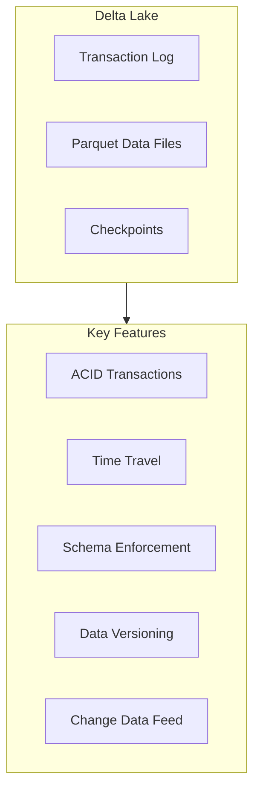
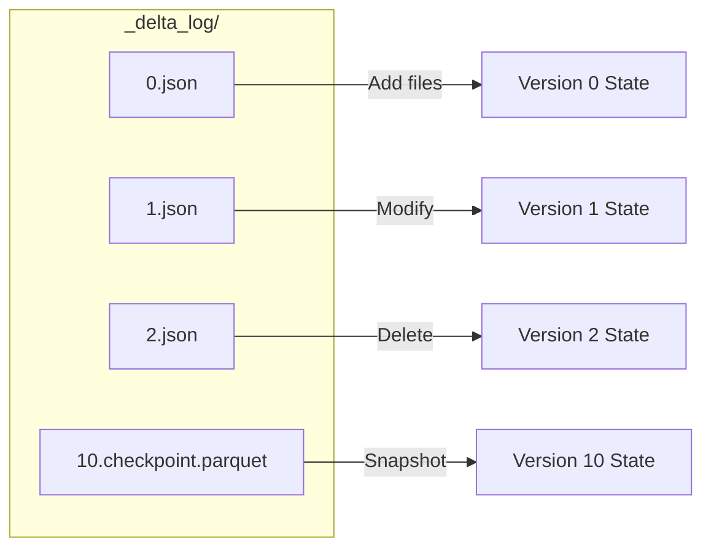
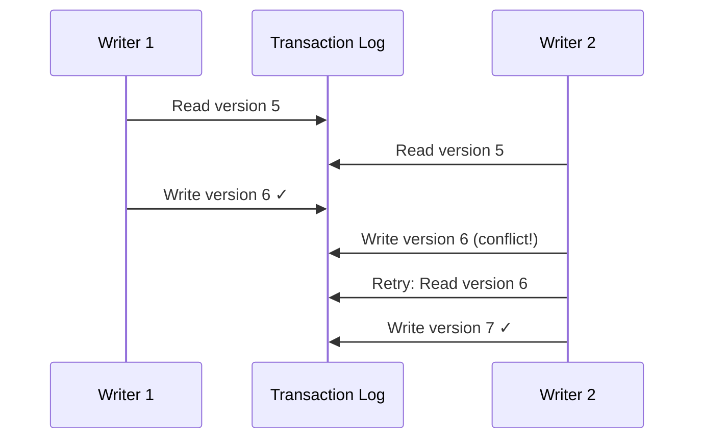
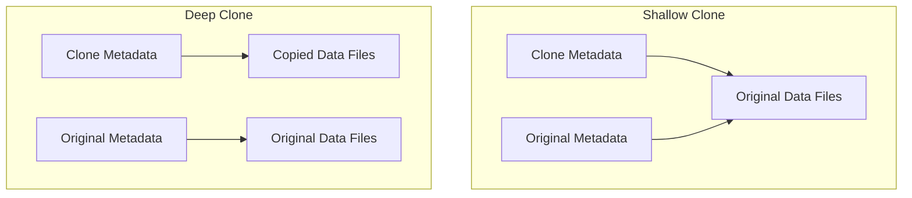

# Delta Lake Fundamentals

Delta Lake is an open-source storage layer that brings ACID transactions, scalable metadata handling, and data versioning to data lakes.

## Overview



## Delta Lake Architecture

### Table Structure

```text
delta_table/
├── _delta_log/                 # Transaction log directory
│   ├── 00000000000000000000.json
│   ├── 00000000000000000001.json
│   ├── 00000000000000000002.json
│   ├── ...
│   └── 00000000000000000010.checkpoint.parquet
├── part-00000-xxx.snappy.parquet
├── part-00001-xxx.snappy.parquet
└── part-00002-xxx.snappy.parquet
```

### Transaction Log



| Component | Purpose |
| :--- | :--- |
| JSON log files | Individual transaction records |
| Checkpoint files | Aggregated state snapshots (every 10 versions) |
| Parquet data files | Actual data storage |

## Creating Delta Tables

### SQL Syntax

```sql
-- Create managed Delta table
CREATE TABLE main.default.customers (
    customer_id INT,
    name STRING,
    email STRING,
    created_at TIMESTAMP
)
USING DELTA;

-- Create table with partitioning
CREATE TABLE main.default.orders (
    order_id STRING,
    customer_id INT,
    order_date DATE,
    amount DECIMAL(18,2)
)
USING DELTA
PARTITIONED BY (order_date);

-- Create external Delta table
CREATE TABLE main.default.external_data
USING DELTA
LOCATION 's3://bucket/path/to/delta/';

-- Create table with properties
CREATE TABLE main.default.events (
    event_id STRING,
    event_type STRING,
    event_data STRING,
    event_time TIMESTAMP
)
USING DELTA
TBLPROPERTIES (
    'delta.autoOptimize.optimizeWrite' = 'true',
    'delta.autoOptimize.autoCompact' = 'true',
    'delta.logRetentionDuration' = 'interval 30 days',
    'delta.deletedFileRetentionDuration' = 'interval 7 days'
);
```

### DataFrame API

```python
# Create Delta table from DataFrame

df.write.format("delta").saveAsTable("main.default.customers")

# Create with options

(df.write
    .format("delta")
    .mode("overwrite")
    .option("overwriteSchema", "true")
    .partitionBy("order_date")
    .saveAsTable("main.default.orders"))

# Save to path (external table)

(df.write
    .format("delta")
    .mode("overwrite")
    .save("/Volumes/main/default/data/customers"))
```

## ACID Transactions

Delta Lake provides full ACID transaction support.

### ACID Properties

| Property | Description | Delta Implementation |
| :--- | :--- | :--- |
| Atomicity | All or nothing | Transaction log ensures complete writes |
| Consistency | Valid state transitions | Schema enforcement, constraints |
| Isolation | Concurrent transactions don't interfere | Optimistic concurrency control |
| Durability | Committed changes are permanent | Cloud storage + transaction log |

### Transaction Isolation

```python

# Serializable isolation level (default)
# Concurrent writes are handled with optimistic concurrency

# Writer 1

df1.write.format("delta").mode("append").save("/path/to/table")

# Writer 2 (concurrent)

df2.write.format("delta").mode("append").save("/path/to/table")

# Both succeed if no conflicts, or one retries

```

### Conflict Resolution



## Time Travel

Query and restore previous versions of data.

### Query by Version

```sql
-- Query specific version
SELECT * FROM main.default.customers VERSION AS OF 5;

-- Query specific timestamp
SELECT * FROM main.default.customers TIMESTAMP AS OF '2024-01-15 10:00:00';

-- Using @ syntax
SELECT * FROM main.default.customers@v5;
SELECT * FROM main.default.customers@20240115100000;
```

### DataFrame Time Travel

```python
# Read specific version

df = (spark.read.format("delta")
    .option("versionAsOf", 5)
    .load("/path/to/table"))

# Read specific timestamp

df = (spark.read.format("delta")
    .option("timestampAsOf", "2024-01-15 10:00:00")
    .load("/path/to/table"))
```

### View Table History

```sql
-- View all table history
DESCRIBE HISTORY main.default.customers;

-- View recent history
DESCRIBE HISTORY main.default.customers LIMIT 10;
```

```python
from delta.tables import DeltaTable

delta_table = DeltaTable.forName(spark, "main.default.customers")
history_df = delta_table.history()
history_df.show()
```

### History Output Columns

| Column | Description |
|--------|-------------|
| version | Version number |
| timestamp | When operation occurred |
| operation | Type of operation (WRITE, MERGE, DELETE, etc.) |
| operationParameters | Parameters used in operation |
| operationMetrics | Metrics like rows affected |
| userIdentity | Who performed the operation |

### Restore Table

```sql
-- Restore to specific version
RESTORE TABLE main.default.customers TO VERSION AS OF 5;

-- Restore to specific timestamp
RESTORE TABLE main.default.customers TO TIMESTAMP AS OF '2024-01-15 10:00:00';
```

```python
# Restore using DeltaTable

delta_table = DeltaTable.forName(spark, "main.default.customers")
delta_table.restoreToVersion(5)
# or

delta_table.restoreToTimestamp("2024-01-15 10:00:00")
```

## Table Cloning

### Shallow Clone

Creates metadata copy that references original data files.

```sql
-- Shallow clone (metadata only, shares data files)
CREATE TABLE main.default.customers_clone
SHALLOW CLONE main.default.customers;

-- Clone specific version
CREATE TABLE main.default.customers_snapshot
SHALLOW CLONE main.default.customers VERSION AS OF 10;
```

```python
from delta.tables import DeltaTable

# Shallow clone

(DeltaTable.forName(spark, "main.default.customers")
    .clone("/path/to/clone", isShallow=True))
```

### Deep Clone

Creates full copy of data and metadata.

```sql
-- Deep clone (full copy)
CREATE TABLE main.default.customers_backup
DEEP CLONE main.default.customers;

-- Deep clone to external location
CREATE TABLE main.default.customers_archive
DEEP CLONE main.default.customers
LOCATION 's3://archive-bucket/customers/';
```

```python
# Deep clone

(DeltaTable.forName(spark, "main.default.customers")
    .clone("/path/to/clone", isShallow=False))
```

### Clone Comparison

| Feature | Shallow Clone | Deep Clone |
|---------|---------------|------------|
| Data copied | No (references original) | Yes (full copy) |
| Storage cost | Minimal | Same as original |
| Independence | Dependent on source files | Fully independent |
| Use case | Testing, quick snapshots | Backups, migration |
| Time to create | Fast | Depends on data size |
| Source changes | May affect clone | No effect |



## Delta Table Properties

### Common Properties

```sql
-- Set table properties
ALTER TABLE main.default.customers SET TBLPROPERTIES (
    'delta.autoOptimize.optimizeWrite' = 'true',
    'delta.autoOptimize.autoCompact' = 'true'
);

-- View table properties
SHOW TBLPROPERTIES main.default.customers;

-- Remove property
ALTER TABLE main.default.customers UNSET TBLPROPERTIES ('delta.autoOptimize.optimizeWrite');
```

### Key Properties Reference

| Property | Default | Description |
|----------|---------|-------------|
| `delta.autoOptimize.optimizeWrite` | false | Coalesce small files on write |
| `delta.autoOptimize.autoCompact` | false | Run OPTIMIZE after writes |
| `delta.logRetentionDuration` | 30 days | How long to keep transaction log |
| `delta.deletedFileRetentionDuration` | 7 days | How long to keep deleted files |
| `delta.enableChangeDataFeed` | false | Enable Change Data Feed |
| `delta.columnMapping.mode` | none | Enable column mapping (name/id) |
| `delta.minReaderVersion` | 1 | Minimum reader protocol version |
| `delta.minWriterVersion` | 2 | Minimum writer protocol version |

## DML Operations

### INSERT

```sql
-- Insert values
INSERT INTO main.default.customers VALUES
    (1, 'John Doe', 'john@example.com', current_timestamp()),
    (2, 'Jane Smith', 'jane@example.com', current_timestamp());

-- Insert from query
INSERT INTO main.default.customers
SELECT * FROM staging.customers WHERE is_new = true;

-- Insert overwrite (replace all data)
INSERT OVERWRITE main.default.customers
SELECT * FROM source_customers;

-- Insert overwrite specific partitions
INSERT OVERWRITE main.default.orders
PARTITION (order_date = '2024-01-15')
SELECT order_id, customer_id, amount
FROM staging.orders
WHERE order_date = '2024-01-15';
```

### UPDATE

```sql
-- Update with condition
UPDATE main.default.customers
SET email = 'updated@example.com'
WHERE customer_id = 1;

-- Update with subquery
UPDATE main.default.customers
SET status = 'premium'
WHERE customer_id IN (
    SELECT customer_id FROM main.default.orders
    WHERE total_amount > 10000
);
```

### DELETE

```sql
-- Delete with condition
DELETE FROM main.default.customers
WHERE customer_id = 1;

-- Delete based on join
DELETE FROM main.default.customers
WHERE customer_id IN (
    SELECT customer_id FROM main.default.inactive_customers
);
```

### MERGE (Upsert)

```sql
-- MERGE for upsert
MERGE INTO main.default.customers AS target
USING staging.customers AS source
ON target.customer_id = source.customer_id
WHEN MATCHED AND source.is_deleted = true THEN DELETE
WHEN MATCHED THEN UPDATE SET
    target.name = source.name,
    target.email = source.email,
    target.updated_at = current_timestamp()
WHEN NOT MATCHED THEN INSERT (customer_id, name, email, created_at)
VALUES (source.customer_id, source.name, source.email, current_timestamp());
```

```python
from delta.tables import DeltaTable

delta_table = DeltaTable.forName(spark, "main.default.customers")

(delta_table.alias("target")
    .merge(
        source_df.alias("source"),
        "target.customer_id = source.customer_id"
    )
    .whenMatchedDelete(condition="source.is_deleted = true")
    .whenMatchedUpdate(set={
        "name": "source.name",
        "email": "source.email",
        "updated_at": "current_timestamp()"
    })
    .whenNotMatchedInsert(values={
        "customer_id": "source.customer_id",
        "name": "source.name",
        "email": "source.email",
        "created_at": "current_timestamp()"
    })
    .execute())
```

## Table Maintenance

### OPTIMIZE

Compacts small files into larger ones.

```sql
-- Optimize entire table
OPTIMIZE main.default.customers;

-- Optimize specific partitions
OPTIMIZE main.default.orders WHERE order_date >= '2024-01-01';

-- Optimize with ZORDER (data skipping)
OPTIMIZE main.default.orders
ZORDER BY (customer_id);

-- Optimize with multiple ZORDER columns
OPTIMIZE main.default.events
ZORDER BY (event_type, user_id);
```

### VACUUM

Removes old files no longer referenced by table.

```sql
-- Vacuum with default retention (7 days)
VACUUM main.default.customers;

-- Vacuum with specific retention
VACUUM main.default.customers RETAIN 168 HOURS;  -- 7 days

-- Dry run (shows files that would be deleted)
VACUUM main.default.customers DRY RUN;
```

```python
from delta.tables import DeltaTable

delta_table = DeltaTable.forName(spark, "main.default.customers")

# Vacuum with 7 days retention

delta_table.vacuum(168)  # hours

# Vacuum with retention less than default (requires override)

spark.conf.set("spark.databricks.delta.retentionDurationCheck.enabled", "false")
delta_table.vacuum(0)  # Be careful - breaks time travel!
```

### Maintenance Best Practices

| Operation | Frequency | Notes |
|-----------|-----------|-------|
| OPTIMIZE | Daily/Weekly | Based on write frequency |
| VACUUM | Weekly | After OPTIMIZE |
| ZORDER | With OPTIMIZE | On frequently filtered columns |
| ANALYZE | After major loads | Update statistics |

## Constraints

### NOT NULL Constraint

```sql
-- Add NOT NULL during creation
CREATE TABLE main.default.customers (
    customer_id INT NOT NULL,
    name STRING NOT NULL,
    email STRING
);

-- Alter existing column
ALTER TABLE main.default.customers ALTER COLUMN email SET NOT NULL;
```

### CHECK Constraints

```sql
-- Add check constraint
ALTER TABLE main.default.customers
ADD CONSTRAINT valid_email CHECK (email LIKE '%@%');

-- Add multiple constraints
ALTER TABLE main.default.orders
ADD CONSTRAINT positive_amount CHECK (amount > 0);

ALTER TABLE main.default.orders
ADD CONSTRAINT valid_status CHECK (status IN ('pending', 'completed', 'cancelled'));

-- Drop constraint
ALTER TABLE main.default.customers DROP CONSTRAINT valid_email;

-- Show constraints
DESCRIBE DETAIL main.default.customers;
```

### Primary Key and Foreign Key (Informational)

```sql
-- Primary key (informational, not enforced)
ALTER TABLE main.default.customers
ADD CONSTRAINT pk_customers PRIMARY KEY (customer_id);

-- Foreign key (informational, not enforced)
ALTER TABLE main.default.orders
ADD CONSTRAINT fk_orders_customers
FOREIGN KEY (customer_id) REFERENCES main.default.customers(customer_id);
```

**Note:** Primary key and foreign key constraints are informational only in Delta Lake. They're used by query optimizers but not enforced on write.

## Generated Columns

```sql
-- Create table with generated column
CREATE TABLE main.default.orders (
    order_id STRING,
    order_date DATE,
    order_year INT GENERATED ALWAYS AS (YEAR(order_date)),
    order_month INT GENERATED ALWAYS AS (MONTH(order_date)),
    price DECIMAL(10,2),
    quantity INT,
    total DECIMAL(12,2) GENERATED ALWAYS AS (price * quantity)
);

-- Generated columns are computed automatically
INSERT INTO main.default.orders (order_id, order_date, price, quantity)
VALUES ('ORD001', '2024-01-15', 99.99, 5);

-- Query includes generated values
SELECT * FROM main.default.orders;
-- order_year = 2024, order_month = 1, total = 499.95
```

## Identity Columns

```sql
-- Auto-incrementing ID column
CREATE TABLE main.default.events (
    event_id BIGINT GENERATED ALWAYS AS IDENTITY,
    event_type STRING,
    event_data STRING
);

-- With custom start and increment
CREATE TABLE main.default.transactions (
    txn_id BIGINT GENERATED ALWAYS AS IDENTITY (START WITH 1000 INCREMENT BY 1),
    amount DECIMAL(18,2)
);

-- GENERATED BY DEFAULT allows manual override
CREATE TABLE main.default.customers (
    customer_id BIGINT GENERATED BY DEFAULT AS IDENTITY,
    name STRING
);

-- Can insert specific ID
INSERT INTO main.default.customers (customer_id, name) VALUES (999, 'Manual ID');
```

## Column Mapping

Enable renaming/dropping columns without rewriting data.

```sql
-- Enable column mapping
ALTER TABLE main.default.customers SET TBLPROPERTIES (
    'delta.columnMapping.mode' = 'name',
    'delta.minReaderVersion' = '2',
    'delta.minWriterVersion' = '5'
);

-- Now can rename columns
ALTER TABLE main.default.customers RENAME COLUMN name TO full_name;

-- Can drop columns
ALTER TABLE main.default.customers DROP COLUMN temp_column;
```

| Mode | Description |
|------|-------------|
| `none` | Default, no mapping |
| `name` | Map by column name (enables rename/drop) |
| `id` | Map by internal ID (most flexible) |

## Use Cases

### Data Quality Enforcement

```sql
-- Table with comprehensive constraints
CREATE TABLE main.default.validated_orders (
    order_id STRING NOT NULL,
    customer_id INT NOT NULL,
    order_date DATE NOT NULL,
    status STRING NOT NULL,
    amount DECIMAL(18,2) NOT NULL,

    -- Constraints
    CONSTRAINT pk_order PRIMARY KEY (order_id),
    CONSTRAINT fk_customer FOREIGN KEY (customer_id) REFERENCES customers(customer_id),
    CONSTRAINT valid_amount CHECK (amount > 0),
    CONSTRAINT valid_status CHECK (status IN ('pending', 'processing', 'shipped', 'delivered'))
)
USING DELTA;
```

### Audit and Compliance

```python
# Query for audit trail

history = spark.sql("DESCRIBE HISTORY main.default.sensitive_data")

# Find who made changes

changes = history.filter(
    (col("operation") == "UPDATE") &
    (col("timestamp") >= "2024-01-01")
).select("version", "timestamp", "userIdentity", "operationMetrics")
```

## Common Issues & Errors

### Time Travel Version Not Found

**Scenario:** Requested version no longer available.

**Fix:** Check retention settings and adjust:

```sql
ALTER TABLE main.default.customers SET TBLPROPERTIES (
    'delta.logRetentionDuration' = 'interval 60 days'
);
```

### VACUUM Breaks Time Travel

**Scenario:** Time travel fails after VACUUM.

**Fix:** Never vacuum below `deletedFileRetentionDuration`:

```python
# Safe vacuum (respects retention)

delta_table.vacuum()  # Uses default 168 hours

# Never do this in production:
# spark.conf.set("spark.databricks.delta.retentionDurationCheck.enabled", "false")
# delta_table.vacuum(0)

```

### Shallow Clone Source Modified

**Scenario:** Shallow clone fails because source files were vacuumed.

**Fix:** Use deep clone for long-term snapshots, or ensure source retention exceeds clone lifetime.

### Constraint Violation

**Scenario:** Write fails due to constraint.

```sql
-- Error: CHECK constraint valid_amount violated
INSERT INTO orders VALUES ('ORD001', 1, -50);
```

**Fix:** Validate data before write or handle constraint errors.

## Exam Tips

1. **ACID** - Delta provides serializable isolation by default
2. **Time travel** - Use VERSION AS OF or TIMESTAMP AS OF syntax
3. **Shallow vs Deep clone** - Shallow shares files, deep copies everything
4. **OPTIMIZE** - Compacts files, ZORDER improves data skipping
5. **VACUUM** - Default 7-day retention, breaks time travel if too aggressive
6. **Constraints** - CHECK enforced, PK/FK informational only
7. **Column mapping** - Required for rename/drop column operations
8. **Generated columns** - Computed automatically, stored physically
9. **Identity columns** - ALWAYS vs BY DEFAULT for auto-increment
10. **Transaction log** - JSON files + checkpoints every 10 versions

## Key Takeaways

- **Transaction log structure**: the `_delta_log/` directory stores JSON commit files (one per transaction) plus checkpoint Parquet files every 10 versions; readers replay the log to reconstruct current table state
- **ACID isolation**: Delta Lake uses optimistic concurrency control — concurrent writers both attempt to commit; the second writer detects a conflict, retries by reading the updated version, and then commits
- **Time travel syntax**: `VERSION AS OF <n>` or `TIMESTAMP AS OF '<ts>'` (SQL) and `.option("versionAsOf", n)` / `.option("timestampAsOf", "<ts>")` (Python); `@v<n>` shorthand also works
- **Shallow vs deep clone**: `SHALLOW CLONE` copies metadata only and shares original Parquet files (fast, dependent on source retention); `DEEP CLONE` copies both metadata and data files (independent, safe for backups)
- **VACUUM default retention**: 7 days (168 hours); running VACUUM below the `deletedFileRetentionDuration` breaks time travel for those versions; override requires `retentionDurationCheck.enabled = false`
- **Constraints**: `NOT NULL` and `CHECK` constraints are enforced on every write; `PRIMARY KEY` and `FOREIGN KEY` are informational only (used by the optimizer, not enforced)
- **Column mapping**: required to `RENAME COLUMN` or `DROP COLUMN` without rewriting data; enable with `TBLPROPERTIES ('delta.columnMapping.mode' = 'name')` plus reader/writer version upgrades
- **Identity vs generated columns**: `GENERATED ALWAYS AS IDENTITY` auto-increments and disallows manual inserts; `GENERATED BY DEFAULT AS IDENTITY` allows manual value override; generated expression columns are computed and stored physically

## Related Topics

- [Schema Management](03-schema-management.md) - Schema evolution details
- [SCD Patterns](04-scd-patterns.md) - Using MERGE for slowly changing dimensions
- [Delta Lake Operations](../01-data-processing/06-delta-lake-operations-part1.md) - Advanced operations

## Official Documentation

- [Delta Lake Documentation](https://docs.delta.io/)
- [Databricks Delta Lake Guide](https://docs.databricks.com/delta/index.html)
- [Delta Lake Table Properties](https://docs.databricks.com/delta/table-properties.html)
- [Delta Lake Constraints](https://docs.databricks.com/tables/constraints.html)

---

**[← Previous: Medallion Architecture](./01-medallion-architecture.md) | [↑ Back to Data Modeling](./README.md) | [Next: Schema Management](./03-schema-management.md) →**
