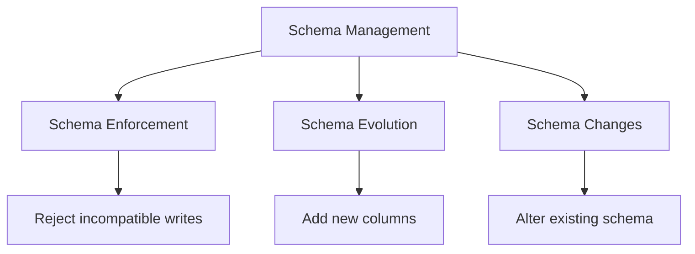
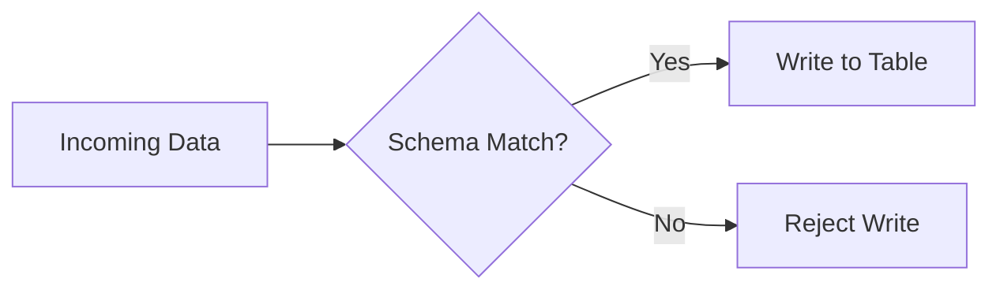

# Schema Management

Schema management in Delta Lake encompasses schema enforcement, schema evolution, and schema changes. Understanding these concepts is critical for building robust data pipelines.

## Overview



## Schema Enforcement

Schema enforcement prevents writes that don't match the table schema.

### How Schema Enforcement Works



### Enforcement Rules

| Scenario | Result |
| :--- | :--- |
| Extra columns in data | Rejected (unless evolution enabled) |
| Missing columns in data | Filled with NULL (if nullable) |
| Wrong data types | Rejected |
| Correct schema | Accepted |

### Schema Enforcement Example

```python
# Create table with specific schema

spark.sql("""
    CREATE TABLE main.default.customers (
        customer_id INT,
        name STRING,
        email STRING
    ) USING DELTA
""")

# This succeeds - exact match

df_valid = spark.createDataFrame([
    (1, "John", "john@example.com")
], ["customer_id", "name", "email"])

df_valid.write.format("delta").mode("append").saveAsTable("main.default.customers")

# This fails - extra column

df_extra = spark.createDataFrame([
    (2, "Jane", "jane@example.com", "555-1234")
], ["customer_id", "name", "email", "phone"])

# Error: A schema mismatch detected when writing to the Delta table

df_extra.write.format("delta").mode("append").saveAsTable("main.default.customers")

# This succeeds - missing nullable column fills with NULL

df_missing = spark.createDataFrame([
    (3, "Bob")
], ["customer_id", "name"])

df_missing.write.format("delta").mode("append").saveAsTable("main.default.customers")
# email column will be NULL

```

## Schema Evolution

Schema evolution allows automatic schema changes when writing data.

### Enable Schema Evolution

```python
# Option 1: Per-write option

(df.write
    .format("delta")
    .mode("append")
    .option("mergeSchema", "true")
    .saveAsTable("main.default.customers"))

# Option 2: Spark configuration (session-wide)

spark.conf.set("spark.databricks.delta.schema.autoMerge.enabled", "true")
df.write.format("delta").mode("append").saveAsTable("main.default.customers")
```

```sql
-- SQL equivalent
SET spark.databricks.delta.schema.autoMerge.enabled = true;

INSERT INTO main.default.customers
SELECT * FROM new_data_with_extra_columns;
```

### Schema Evolution Operations

| Operation | `mergeSchema` | `overwriteSchema` |
| :--- | :--- | :--- |
| Add new column | ✓ | ✓ |
| Widen data type (e.g., INT→LONG) | ✓ | ✓ |
| Change column type | ✗ | ✓ |
| Remove column | ✗ | ✓ |
| Rename column | ✗ | ✓ (loses data) |
| Reorder columns | ✓ | ✓ |

### mergeSchema Examples

```python

# Original schema: customer_id INT, name STRING, email STRING

# Add new column - succeeds with mergeSchema

df_new_column = spark.createDataFrame([
    (4, "Alice", "alice@example.com", "555-9876")
], ["customer_id", "name", "email", "phone"])

(df_new_column.write
    .format("delta")
    .mode("append")
    .option("mergeSchema", "true")
    .saveAsTable("main.default.customers"))

# Table now has: customer_id, name, email, phone
# Existing rows have NULL for phone

```

### overwriteSchema

Use `overwriteSchema` for complete schema replacement:

```python
# Completely replace schema (dangerous - loses data!)

df_new_schema = spark.createDataFrame([
    ("C001", "John Doe", "Premium")
], ["customer_code", "full_name", "tier"])

(df_new_schema.write
    .format("delta")
    .mode("overwrite")
    .option("overwriteSchema", "true")
    .saveAsTable("main.default.customers"))

# Table now has completely different schema
# All previous data is replaced

```

### Auto Loader Schema Evolution

```python
# Auto Loader with schema evolution

df = (spark.readStream
    .format("cloudFiles")
    .option("cloudFiles.format", "json")
    .option("cloudFiles.schemaLocation", "/checkpoints/_schema")
    .option("cloudFiles.inferColumnTypes", "true")
    .option("cloudFiles.schemaEvolutionMode", "addNewColumns")
    .load("/landing/data/"))

# Write with mergeSchema

(df.writeStream
    .format("delta")
    .option("checkpointLocation", "/checkpoints/_checkpoint")
    .option("mergeSchema", "true")
    .toTable("bronze.events"))
```

### Schema Evolution Modes for Auto Loader

| Mode | Behavior |
| :--- | :--- |
| `addNewColumns` | Add new columns, fail on other changes |
| `failOnNewColumns` | Fail on any schema change |
| `rescue` | Add new columns, put unexpected data in `_rescued_data` |
| `none` | Use fixed schema, ignore changes |

## Column Mapping

Column mapping enables advanced schema changes without rewriting data.

### Enable Column Mapping

```sql
-- Enable column mapping
ALTER TABLE main.default.customers SET TBLPROPERTIES (
    'delta.columnMapping.mode' = 'name',
    'delta.minReaderVersion' = '2',
    'delta.minWriterVersion' = '5'
);
```

### Column Mapping Modes

| Mode | Description | Use Case |
|------|-------------|----------|
| `none` | Default, no mapping | Simple tables |
| `name` | Map by column name | Enable rename/drop |
| `id` | Map by internal ID | Maximum flexibility |

### Operations Enabled by Column Mapping

```sql
-- With column mapping enabled:

-- Rename column (preserves data)
ALTER TABLE main.default.customers
RENAME COLUMN name TO full_name;

-- Drop column (marks as deleted, doesn't rewrite)
ALTER TABLE main.default.customers
DROP COLUMN temp_column;

-- Change column type (some changes)
ALTER TABLE main.default.customers
ALTER COLUMN customer_id TYPE BIGINT;
```

### Without Column Mapping

```sql
-- Without column mapping, these operations fail:
-- Error: Cannot rename column
ALTER TABLE main.default.customers RENAME COLUMN name TO full_name;

-- Workaround: Create new table with desired schema
CREATE TABLE main.default.customers_v2 AS
SELECT customer_id, name AS full_name, email FROM main.default.customers;
```

## ALTER TABLE Operations

### Add Columns

```sql
-- Add single column
ALTER TABLE main.default.customers
ADD COLUMN phone STRING;

-- Add multiple columns
ALTER TABLE main.default.customers
ADD COLUMNS (
    phone STRING,
    address STRING,
    city STRING
);

-- Add column with comment
ALTER TABLE main.default.customers
ADD COLUMN phone STRING COMMENT 'Customer phone number';

-- Add column with position
ALTER TABLE main.default.customers
ADD COLUMN phone STRING AFTER email;

ALTER TABLE main.default.customers
ADD COLUMN priority INT FIRST;
```

### Change Column

```sql
-- Change data type (with column mapping or compatible types)
ALTER TABLE main.default.customers
ALTER COLUMN customer_id TYPE BIGINT;

-- Change nullability
ALTER TABLE main.default.customers
ALTER COLUMN email SET NOT NULL;

ALTER TABLE main.default.customers
ALTER COLUMN email DROP NOT NULL;

-- Add/change column comment
ALTER TABLE main.default.customers
ALTER COLUMN email COMMENT 'Primary email address';
```

### Rename Column

```sql
-- Requires column mapping enabled
ALTER TABLE main.default.customers
RENAME COLUMN name TO full_name;
```

### Drop Column

```sql
-- Requires column mapping enabled
ALTER TABLE main.default.customers
DROP COLUMN temp_column;

-- Drop multiple columns
ALTER TABLE main.default.customers
DROP COLUMNS (temp1, temp2);
```

### Type Widening

Delta Lake allows widening numeric types:

| From | To (Allowed) |
|------|--------------|
| BYTE | SHORT, INT, LONG, DECIMAL |
| SHORT | INT, LONG, DECIMAL |
| INT | LONG, DECIMAL |
| FLOAT | DOUBLE |

```sql
-- Valid type widening
ALTER TABLE main.default.orders
ALTER COLUMN quantity TYPE BIGINT;  -- INT to BIGINT

-- Invalid type narrowing (fails)
ALTER TABLE main.default.orders
ALTER COLUMN quantity TYPE TINYINT;  -- BIGINT to TINYINT fails
```

## Schema Validation Patterns

### Pre-Write Validation

```python
from pyspark.sql.types import StructType, StructField, IntegerType, StringType

# Define expected schema

expected_schema = StructType([
    StructField("customer_id", IntegerType(), nullable=False),
    StructField("name", StringType(), nullable=False),
    StructField("email", StringType(), nullable=True)
])

# Validate incoming data

def validate_schema(df, expected):
    """Validate DataFrame schema matches expected schema."""
    actual_fields = {f.name: f for f in df.schema.fields}
    expected_fields = {f.name: f for f in expected.fields}

    errors = []

    # Check for missing required columns
    for name, field in expected_fields.items():
        if name not in actual_fields:
            if not field.nullable:
                errors.append(f"Missing required column: {name}")

    # Check data types
    for name, field in expected_fields.items():
        if name in actual_fields:
            if actual_fields[name].dataType != field.dataType:
                errors.append(f"Type mismatch for {name}: expected {field.dataType}, got {actual_fields[name].dataType}")

    return errors

# Usage

errors = validate_schema(incoming_df, expected_schema)
if errors:
    raise ValueError(f"Schema validation failed: {errors}")
```

### Schema Comparison

```python
def compare_schemas(source_df, target_table):
    """Compare source DataFrame schema with target table."""
    target_df = spark.table(target_table)

    source_cols = set(source_df.columns)
    target_cols = set(target_df.columns)

    added = source_cols - target_cols
    removed = target_cols - source_cols
    common = source_cols & target_cols

    type_changes = []
    for col in common:
        source_type = source_df.schema[col].dataType
        target_type = target_df.schema[col].dataType
        if source_type != target_type:
            type_changes.append((col, target_type, source_type))

    return {
        "added_columns": added,
        "removed_columns": removed,
        "type_changes": type_changes
    }
```

## Schema in Streaming

### Streaming Schema Enforcement

```python
# Streaming with schema enforcement

df = (spark.readStream
    .schema(expected_schema)  # Enforce schema on read
    .format("json")
    .load("/landing/data/"))

# Write without mergeSchema - strict enforcement

(df.writeStream
    .format("delta")
    .option("checkpointLocation", "/checkpoints/")
    .toTable("bronze.events"))
```

### Handling Schema Changes in Streaming

```python
# Option 1: Use rescue column for unexpected data

df = (spark.readStream
    .format("cloudFiles")
    .option("cloudFiles.format", "json")
    .option("cloudFiles.schemaLocation", "/checkpoints/_schema")
    .option("cloudFiles.schemaEvolutionMode", "rescue")
    .load("/landing/data/"))

# Unexpected fields go to _rescued_data column

(df.writeStream
    .format("delta")
    .option("checkpointLocation", "/checkpoints/_cp")
    .option("mergeSchema", "true")
    .toTable("bronze.events"))

# Option 2: Fail on schema changes and alert

df = (spark.readStream
    .format("cloudFiles")
    .option("cloudFiles.format", "json")
    .option("cloudFiles.schemaLocation", "/checkpoints/_schema")
    .option("cloudFiles.schemaEvolutionMode", "failOnNewColumns")
    .load("/landing/data/"))
```

## Schema Drift Handling

### Pattern: Schema Drift Detection

```python
def detect_schema_drift(current_df, reference_table):
    """Detect if incoming data has schema drift from reference table."""
    reference_df = spark.table(reference_table)

    current_cols = set(current_df.columns)
    reference_cols = set(reference_df.columns)

    new_columns = current_cols - reference_cols
    missing_columns = reference_cols - current_cols

    if new_columns:
        print(f"New columns detected: {new_columns}")
        # Log, alert, or handle as needed

    if missing_columns:
        print(f"Missing columns: {missing_columns}")
        # Log, alert, or handle as needed

    return len(new_columns) > 0 or len(missing_columns) > 0

# Usage

if detect_schema_drift(incoming_df, "silver.customers"):
    # Handle drift - merge schema, reject, or alert
    pass
```

### Pattern: Flexible Schema with Variant Type

```sql
-- Store semi-structured data with flexible schema
CREATE TABLE bronze.events_raw (
    event_id STRING,
    event_time TIMESTAMP,
    event_data VARIANT  -- Semi-structured data type
);

-- Query VARIANT column
SELECT
    event_id,
    event_data:user_id::INT AS user_id,
    event_data:action::STRING AS action,
    event_data:metadata.browser::STRING AS browser
FROM bronze.events_raw;
```

## DLT Schema Management

### Schema Hints in DLT

```python
import dlt
from pyspark.sql.types import StructType, StructField, StringType, IntegerType

# Explicit schema

@dlt.table(
    comment="Customers with enforced schema",
    schema=StructType([
        StructField("customer_id", IntegerType(), nullable=False),
        StructField("name", StringType(), nullable=False),
        StructField("email", StringType(), nullable=True)
    ])
)
def silver_customers():
    return dlt.read_stream("bronze_customers")

# Or use schema hints

@dlt.table(
    comment="Customers with inferred schema"
)
def silver_customers():
    return (
        dlt.read_stream("bronze_customers")
        .withColumn("customer_id", col("customer_id").cast("int"))
        .withColumn("name", col("name").cast("string"))
    )
```

## Use Cases

### Handling Upstream Schema Changes

```python
def handle_upstream_changes(source_path, target_table):
    """Handle upstream schema changes gracefully."""

    # Read new data
    new_df = spark.read.format("parquet").load(source_path)

    # Get target schema
    target_df = spark.table(target_table)
    target_cols = set(target_df.columns)

    # Find new columns
    new_cols = set(new_df.columns) - target_cols

    if new_cols:
        # Log schema change
        print(f"Schema change detected: new columns {new_cols}")

        # Option 1: Add columns to target table
        for col_name in new_cols:
            col_type = new_df.schema[col_name].dataType.simpleString()
            spark.sql(f"ALTER TABLE {target_table} ADD COLUMN {col_name} {col_type}")

    # Write with mergeSchema for safety
    (new_df.write
        .format("delta")
        .mode("append")
        .option("mergeSchema", "true")
        .saveAsTable(target_table))
```

### Migration to New Schema

```python
def migrate_table_schema(old_table, new_table, transformations):
    """Migrate data from old schema to new schema."""

    # Read old table
    df = spark.table(old_table)

    # Apply transformations
    for old_col, new_col, transform in transformations:
        if transform:
            df = df.withColumn(new_col, transform(col(old_col)))
        else:
            df = df.withColumnRenamed(old_col, new_col)

    # Write to new table
    df.write.format("delta").saveAsTable(new_table)

# Usage

transformations = [
    ("name", "full_name", None),  # Simple rename
    ("customer_id", "customer_id", lambda c: c.cast("bigint")),  # Type change
    ("created_at", "created_date", lambda c: to_date(c))  # Transform
]

migrate_table_schema("old.customers", "new.customers", transformations)
```

## Common Issues & Errors

### Schema Mismatch on Write

**Scenario:** Write fails due to schema mismatch.

```python
# Error: A schema mismatch detected when writing to the Delta table

```

**Fix:** Use `mergeSchema` or adjust data to match:

```python
df.write.option("mergeSchema", "true").saveAsTable("table")
```

### Cannot Change Column Type

**Scenario:** ALTER COLUMN TYPE fails.

```sql
-- Error: Cannot change data type from STRING to INT
```

**Fix:** Enable column mapping or create new table:

```sql
ALTER TABLE table SET TBLPROPERTIES ('delta.columnMapping.mode' = 'name');
```

### Cannot Rename/Drop Column

**Scenario:** Rename or drop operation fails.

**Fix:** Enable column mapping first:

```sql
ALTER TABLE main.default.customers SET TBLPROPERTIES (
    'delta.columnMapping.mode' = 'name',
    'delta.minReaderVersion' = '2',
    'delta.minWriterVersion' = '5'
);
```

### Streaming Schema Change

**Scenario:** Streaming job fails on schema change.

**Fix:** Use `rescue` mode or restart with new schema:

```python
.option("cloudFiles.schemaEvolutionMode", "rescue")
```

## Exam Tips

1. **mergeSchema vs overwriteSchema** - merge adds columns, overwrite replaces schema
2. **Schema enforcement** - Extra columns rejected, missing nullable columns become NULL
3. **Column mapping** - Required for rename/drop column operations
4. **Type widening** - INT→LONG allowed, LONG→INT not allowed
5. **Auto Loader modes** - `addNewColumns`, `failOnNewColumns`, `rescue`, `none`
6. **ALTER TABLE ADD** - Can specify position with FIRST or AFTER
7. **NOT NULL** - Can be set/dropped with ALTER COLUMN
8. **Streaming schema** - Use checkpointLocation for schema tracking
9. **VARIANT type** - For flexible semi-structured data
10. **Schema validation** - Compare schemas before write for safety

## Key Takeaways

- **Schema enforcement rules**: extra columns in the incoming DataFrame are rejected; missing nullable columns are silently filled with NULL; wrong data types are rejected — schema enforcement is always on by default in Delta Lake
- **mergeSchema vs overwriteSchema**: `mergeSchema=true` adds new columns and widens compatible types but cannot remove or rename columns; `overwriteSchema=true` completely replaces the schema (and data) on an overwrite write
- **Column mapping requirement**: `RENAME COLUMN` and `DROP COLUMN` require `delta.columnMapping.mode = 'name'` (plus `minReaderVersion=2`, `minWriterVersion=5`); without it, those DDL statements fail
- **Type widening rules**: only safe numeric widenings are allowed (e.g., INT → LONG, FLOAT → DOUBLE); narrowing (LONG → INT) is always rejected
- **Auto Loader schema evolution modes**: `addNewColumns` silently adds new columns; `failOnNewColumns` stops the stream on any change; `rescue` routes unexpected fields to `_rescued_data`; `none` ignores source schema changes entirely
- **ALTER TABLE ADD column positioning**: `ADD COLUMN <name> <type> FIRST` or `ADD COLUMN <name> <type> AFTER <other_col>` controls insertion order
- **Streaming schema tracking**: Auto Loader requires a `cloudFiles.schemaLocation` checkpoint path to persist inferred schemas across restarts; omitting it forces re-inference on every restart
- **VARIANT type**: stores arbitrary semi-structured JSON in a single column; queried with colon-path notation (`event_data:user_id::INT`); useful when upstream schema is completely unknown

## Related Topics

- [Delta Lake Fundamentals](02-delta-lake-fundamentals.md) - Core Delta features
- [Auto Loader](../01-data-processing/04-auto-loader.md) - Schema inference and evolution
- [Structured Streaming](../01-data-processing/03-structured-streaming-part1.md) - Streaming schema handling

## Official Documentation

- [Delta Lake Schema Enforcement](https://docs.databricks.com/delta/schema-enforcement.html)
- [Delta Lake Schema Evolution](https://docs.databricks.com/delta/update-schema.html)
- [Column Mapping](https://docs.databricks.com/delta/column-mapping.html)
- [ALTER TABLE](https://docs.databricks.com/sql/language-manual/sql-ref-syntax-ddl-alter-table.html)

---

**[← Previous: Delta Lake Fundamentals](./02-delta-lake-fundamentals.md) | [↑ Back to Data Modeling](./README.md) | [Next: SCD Patterns](./04-scd-patterns.md) →**
