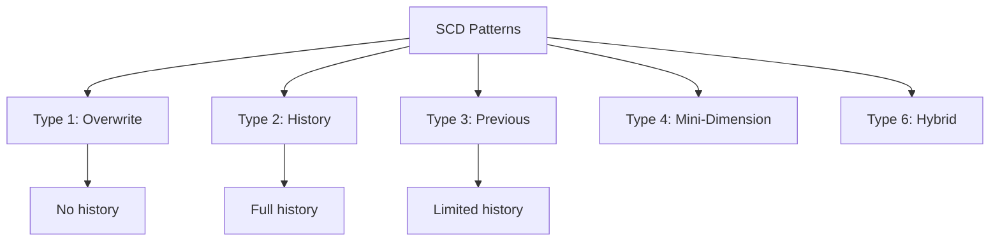
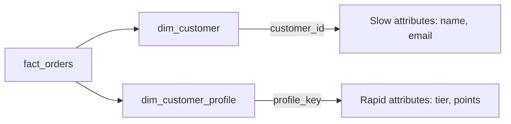

# Slowly Changing Dimension (SCD) Patterns

Slowly Changing Dimensions (SCDs) are data warehousing techniques for managing dimension data that changes over time. Understanding SCD patterns is essential for building accurate historical analytics.

## Overview



## SCD Type Comparison

| Type | History Preserved | Storage | Complexity | Use Case |
| :--- | :--- | :--- | :--- | :--- |
| Type 1 | None | Low | Simple | Corrections, non-critical changes |
| Type 2 | Full | High | Medium | Complete audit trail |
| Type 3 | Limited (1 previous) | Medium | Low | Track only previous value |
| Type 4 | Full (separate table) | High | High | Rapidly changing attributes |
| Type 6 | Full + Current | Highest | Highest | Blend of Type 1, 2, 3 |

## SCD Type 1: Overwrite

Type 1 simply overwrites the existing value with the new value. No history is maintained.

### Type 1 Schema

```sql
CREATE TABLE dim_customer (
    customer_id INT PRIMARY KEY,
    name STRING,
    email STRING,
    city STRING,
    tier STRING,
    updated_at TIMESTAMP
)
USING DELTA;
```

### Type 1 Implementation

```sql
-- Type 1 using MERGE
MERGE INTO dim_customer AS target
USING staging_customer AS source
ON target.customer_id = source.customer_id
WHEN MATCHED THEN UPDATE SET
    target.name = source.name,
    target.email = source.email,
    target.city = source.city,
    target.tier = source.tier,
    target.updated_at = current_timestamp()
WHEN NOT MATCHED THEN INSERT (
    customer_id, name, email, city, tier, updated_at
) VALUES (
    source.customer_id, source.name, source.email,
    source.city, source.tier, current_timestamp()
);
```

```python
from delta.tables import DeltaTable

delta_table = DeltaTable.forName(spark, "dim_customer")

(delta_table.alias("target")
    .merge(
        staging_df.alias("source"),
        "target.customer_id = source.customer_id"
    )
    .whenMatchedUpdate(set={
        "name": "source.name",
        "email": "source.email",
        "city": "source.city",
        "tier": "source.tier",
        "updated_at": "current_timestamp()"
    })
    .whenNotMatchedInsertAll()
    .execute())
```

### Type 1 - Before and After

```text
Before:
| customer_id | name     | city       | tier   |
|-------------|----------|------------|--------|
| 1           | John Doe | New York   | Silver |

Change: John moves to Boston

After (Type 1):
| customer_id | name     | city       | tier   |
|-------------|----------|------------|--------|
| 1           | John Doe | Boston     | Silver |

History of "New York" is LOST
```

### When to Use Type 1

- Data corrections (fixing typos)
- Non-critical attribute changes
- When history isn't required for reporting
- Source system doesn't provide history

## SCD Type 2: Full History

Type 2 maintains complete history by inserting new rows for each change.

### Type 2 Schema

```sql
CREATE TABLE dim_customer_type2 (
    surrogate_key BIGINT GENERATED ALWAYS AS IDENTITY,
    customer_id INT,
    name STRING,
    email STRING,
    city STRING,
    tier STRING,
    is_current BOOLEAN,
    effective_date DATE,
    end_date DATE,
    updated_at TIMESTAMP
)
USING DELTA;

-- Add index on business key + is_current for performance
-- CREATE INDEX idx_customer_current ON dim_customer_type2(customer_id, is_current);
```

### Type 2 Implementation with MERGE

```sql
-- Step 1: Identify changed records and expire them
MERGE INTO dim_customer_type2 AS target
USING (
    SELECT
        s.customer_id,
        s.name,
        s.email,
        s.city,
        s.tier
    FROM staging_customer s
    INNER JOIN dim_customer_type2 d
        ON s.customer_id = d.customer_id
        AND d.is_current = true
    WHERE s.name != d.name
       OR s.email != d.email
       OR s.city != d.city
       OR s.tier != d.tier
) AS changes
ON target.customer_id = changes.customer_id
    AND target.is_current = true
WHEN MATCHED THEN UPDATE SET
    target.is_current = false,
    target.end_date = current_date() - 1,
    target.updated_at = current_timestamp();

-- Step 2: Insert new current records
INSERT INTO dim_customer_type2 (
    customer_id, name, email, city, tier,
    is_current, effective_date, end_date, updated_at
)
SELECT
    s.customer_id,
    s.name,
    s.email,
    s.city,
    s.tier,
    true AS is_current,
    current_date() AS effective_date,
    '9999-12-31' AS end_date,
    current_timestamp() AS updated_at
FROM staging_customer s
LEFT JOIN dim_customer_type2 d
    ON s.customer_id = d.customer_id
    AND d.is_current = true
WHERE d.customer_id IS NULL  -- New customers
   OR s.name != d.name  -- Changed customers
   OR s.email != d.email
   OR s.city != d.city
   OR s.tier != d.tier;
```

### Type 2 - Single MERGE Pattern

```python
from delta.tables import DeltaTable
from pyspark.sql.functions import col, lit, current_date, current_timestamp, when

def scd_type2_merge(spark, source_df, target_table, business_key, tracked_columns):
    """
    Implement SCD Type 2 using MERGE.

    Args:
        source_df: DataFrame with new/changed records
        target_table: Target Delta table name
        business_key: Column name for business key
        tracked_columns: List of columns to track for changes
    """
    delta_table = DeltaTable.forName(spark, target_table)

    # Build change detection condition
    change_conditions = " OR ".join([
        f"source.{col} != target.{col}" for col in tracked_columns
    ])

    # Create staging view with flags
    source_df.createOrReplaceTempView("source_data")

    staged = spark.sql(f"""
        SELECT
            s.*,
            CASE
                WHEN t.{business_key} IS NULL THEN 'INSERT'
                WHEN {change_conditions.replace('source.', 's.').replace('target.', 't.')} THEN 'UPDATE'
                ELSE 'NO_CHANGE'
            END AS merge_action
        FROM source_data s
        LEFT JOIN {target_table} t
            ON s.{business_key} = t.{business_key}
            AND t.is_current = true
    """)

    # Expire changed records
    spark.sql(f"""
        MERGE INTO {target_table} AS target
        USING (
            SELECT {business_key} FROM source_data
            WHERE merge_action = 'UPDATE'
        ) AS expired
        ON target.{business_key} = expired.{business_key}
            AND target.is_current = true
        WHEN MATCHED THEN UPDATE SET
            is_current = false,
            end_date = current_date() - interval 1 day,
            updated_at = current_timestamp()
    """)

    # Insert new and changed records
    columns = ", ".join(tracked_columns)
    spark.sql(f"""
        INSERT INTO {target_table}
        ({business_key}, {columns}, is_current, effective_date, end_date, updated_at)
        SELECT
            {business_key}, {columns},
            true AS is_current,
            current_date() AS effective_date,
            DATE'9999-12-31' AS end_date,
            current_timestamp() AS updated_at
        FROM staged
        WHERE merge_action IN ('INSERT', 'UPDATE')
    """)
```

### Type 2 - Before and After

```text
Before:
| sk | customer_id | city     | is_current | effective | end_date   |
|----|-------------|----------|------------|-----------|------------|
| 1  | 1           | New York | true       | 2023-01-01| 9999-12-31 |

Change: John moves to Boston on 2024-01-15

After (Type 2):
| sk | customer_id | city     | is_current | effective | end_date   |
|----|-------------|----------|------------|-----------|------------|
| 1  | 1           | New York | false      | 2023-01-01| 2024-01-14 |
| 2  | 1           | Boston   | true       | 2024-01-15| 9999-12-31 |

Full history is PRESERVED
```

### Querying Type 2 Dimensions

```sql
-- Current state
SELECT * FROM dim_customer_type2
WHERE is_current = true;

-- Historical point-in-time
SELECT * FROM dim_customer_type2
WHERE effective_date <= '2023-06-15'
  AND end_date >= '2023-06-15';

-- Full history for a customer
SELECT * FROM dim_customer_type2
WHERE customer_id = 1
ORDER BY effective_date;

-- Join fact table with dimension at transaction time
SELECT
    f.order_id,
    f.order_date,
    f.amount,
    d.city AS city_at_order_time
FROM fact_orders f
JOIN dim_customer_type2 d
    ON f.customer_id = d.customer_id
    AND f.order_date BETWEEN d.effective_date AND d.end_date;
```

## SCD Type 3: Previous Value

Type 3 adds columns to track the previous value of specific attributes.

### Type 3 Schema

```sql
CREATE TABLE dim_customer_type3 (
    customer_id INT PRIMARY KEY,
    name STRING,
    email STRING,
    current_city STRING,
    previous_city STRING,
    city_change_date DATE,
    current_tier STRING,
    previous_tier STRING,
    tier_change_date DATE,
    updated_at TIMESTAMP
)
USING DELTA;
```

### Type 3 Implementation

```sql
MERGE INTO dim_customer_type3 AS target
USING staging_customer AS source
ON target.customer_id = source.customer_id
WHEN MATCHED AND target.current_city != source.city THEN UPDATE SET
    target.previous_city = target.current_city,
    target.current_city = source.city,
    target.city_change_date = current_date(),
    target.updated_at = current_timestamp()
WHEN MATCHED AND target.current_tier != source.tier THEN UPDATE SET
    target.previous_tier = target.current_tier,
    target.current_tier = source.tier,
    target.tier_change_date = current_date(),
    target.updated_at = current_timestamp()
WHEN NOT MATCHED THEN INSERT (
    customer_id, name, email, current_city, current_tier, updated_at
) VALUES (
    source.customer_id, source.name, source.email,
    source.city, source.tier, current_timestamp()
);
```

### Type 3 - Before and After

```text
Before:
| customer_id | current_city | previous_city | city_change_date |
|-------------|--------------|---------------|------------------|
| 1           | New York     | NULL          | NULL             |

Change: John moves to Boston

After (Type 3):
| customer_id | current_city | previous_city | city_change_date |
|-------------|--------------|---------------|------------------|
| 1           | Boston       | New York      | 2024-01-15       |

Only ONE previous value is tracked
```

## SCD Type 4: Mini-Dimension

Type 4 separates rapidly changing attributes into a separate dimension table.

### Type 4 Schema

```sql
-- Main dimension (slowly changing attributes)
CREATE TABLE dim_customer (
    customer_id INT PRIMARY KEY,
    name STRING,
    email STRING,
    registration_date DATE
)
USING DELTA;

-- Mini-dimension (rapidly changing attributes)
CREATE TABLE dim_customer_profile (
    profile_key BIGINT GENERATED ALWAYS AS IDENTITY,
    customer_id INT,
    city STRING,
    tier STRING,
    loyalty_points INT,
    is_current BOOLEAN,
    effective_date DATE,
    end_date DATE
)
USING DELTA;

-- Fact table references both
CREATE TABLE fact_orders (
    order_id STRING,
    customer_id INT,
    profile_key BIGINT,  -- Links to mini-dimension
    order_date DATE,
    amount DECIMAL(18,2)
)
USING DELTA;
```

### Type 4 - Diagram



## SCD Type 6: Hybrid (1 + 2 + 3)

Type 6 combines Types 1, 2, and 3 for maximum flexibility.

### Type 6 Schema

```sql
CREATE TABLE dim_customer_type6 (
    surrogate_key BIGINT GENERATED ALWAYS AS IDENTITY,
    customer_id INT,
    name STRING,

    -- Type 3 columns (current + previous)
    current_city STRING,
    previous_city STRING,

    -- Additional Type 2 historical tracking
    is_current BOOLEAN,
    effective_date DATE,
    end_date DATE,

    updated_at TIMESTAMP
)
USING DELTA;
```

### Type 6 Implementation

```sql
-- Type 6: Maintain both history rows AND current value columns

-- Step 1: Update all historical rows with new current values (Type 1 aspect)
UPDATE dim_customer_type6
SET current_city = (
    SELECT city FROM staging_customer s
    WHERE s.customer_id = dim_customer_type6.customer_id
)
WHERE customer_id IN (SELECT customer_id FROM staging_customer);

-- Step 2: Expire current rows for changed records (Type 2 aspect)
UPDATE dim_customer_type6
SET
    is_current = false,
    end_date = current_date() - 1
WHERE is_current = true
  AND customer_id IN (
    SELECT s.customer_id
    FROM staging_customer s
    JOIN dim_customer_type6 d
      ON s.customer_id = d.customer_id AND d.is_current = true
    WHERE s.city != d.current_city
  );

-- Step 3: Insert new rows (Type 2 aspect)
INSERT INTO dim_customer_type6 (
    customer_id, name, current_city, previous_city,
    is_current, effective_date, end_date
)
SELECT
    s.customer_id,
    s.name,
    s.city AS current_city,
    d.current_city AS previous_city,  -- Type 3 aspect
    true,
    current_date(),
    '9999-12-31'
FROM staging_customer s
JOIN dim_customer_type6 d
    ON s.customer_id = d.customer_id
WHERE s.city != d.current_city
  AND d.effective_date = (
    SELECT MAX(effective_date)
    FROM dim_customer_type6
    WHERE customer_id = s.customer_id
  );
```

## DLT APPLY CHANGES for SCD Type 2

Delta Live Tables provides built-in SCD Type 2 support.

```python
import dlt

# Source data

@dlt.view
def customers_cdc():
    return (spark.readStream.format("cloudFiles")
        .option("cloudFiles.format", "json")
        .load("/landing/customers_cdc/"))

# SCD Type 2 with APPLY CHANGES

dlt.create_streaming_table("dim_customer_scd2")

dlt.apply_changes(
    target="dim_customer_scd2",
    source="customers_cdc",
    keys=["customer_id"],
    sequence_by=col("updated_at"),
    stored_as_scd_type=2,
    columns=["name", "email", "city", "tier"]
)

# Resulting table has:
# - __START_AT: Effective date
# - __END_AT: End date
# - All source columns

```

### DLT SCD Type 1

```python
dlt.create_streaming_table("dim_customer_scd1")

dlt.apply_changes(
    target="dim_customer_scd1",
    source="customers_cdc",
    keys=["customer_id"],
    sequence_by=col("updated_at"),
    stored_as_scd_type=1  # Type 1: Overwrite
)
```

## Handling Deletes in SCD

### Soft Deletes in Type 2

```sql
-- Mark as deleted instead of removing
MERGE INTO dim_customer_type2 AS target
USING deleted_customers AS source
ON target.customer_id = source.customer_id
    AND target.is_current = true
WHEN MATCHED THEN UPDATE SET
    target.is_current = false,
    target.end_date = current_date() - 1,
    target.is_deleted = true,
    target.deleted_at = current_timestamp();
```

### DLT with Deletes

```python
dlt.apply_changes(
    target="dim_customer_scd2",
    source="customers_cdc",
    keys=["customer_id"],
    sequence_by=col("updated_at"),
    stored_as_scd_type=2,
    apply_as_deletes=expr("operation = 'DELETE'"),
    apply_as_truncates=expr("operation = 'TRUNCATE'")
)
```

## Performance Considerations

### Indexing Type 2 Tables

```sql
-- Optimize for common query patterns
-- Note: Delta Lake doesn't have traditional indexes, use ZORDER instead

OPTIMIZE dim_customer_type2
ZORDER BY (customer_id, is_current);

-- Or use liquid clustering
ALTER TABLE dim_customer_type2
CLUSTER BY (customer_id, is_current);
```

### Partitioning Type 2 Tables

```sql
-- Partition by is_current for current-state queries
CREATE TABLE dim_customer_type2 (
    ...
)
USING DELTA
PARTITIONED BY (is_current);

-- Or partition by effective date for time-based queries
CREATE TABLE dim_customer_type2 (
    ...
    effective_year INT GENERATED ALWAYS AS (YEAR(effective_date))
)
USING DELTA
PARTITIONED BY (effective_year);
```

## Use Cases

### Choosing SCD Type

| Scenario | Recommended Type | Rationale |
|----------|------------------|-----------|
| Correcting data errors | Type 1 | No need to preserve mistakes |
| Regulatory compliance | Type 2 | Full audit trail required |
| "What was the value last month?" | Type 3 | Simple previous value tracking |
| Customer tier changes | Type 2 | Analyze tier progression |
| Rapidly changing attributes | Type 4 | Separate from stable dimensions |
| Complex analytics needs | Type 6 | Maximum flexibility |

## Common Issues & Errors

### Duplicate Surrogate Keys

**Scenario:** Multiple current records for same business key.

**Fix:** Add constraint or validate:

```sql
-- Check for duplicates
SELECT customer_id, COUNT(*) as cnt
FROM dim_customer_type2
WHERE is_current = true
GROUP BY customer_id
HAVING COUNT(*) > 1;

-- Fix: Keep latest, expire others
WITH ranked AS (
    SELECT *, ROW_NUMBER() OVER (
        PARTITION BY customer_id
        ORDER BY effective_date DESC
    ) as rn
    FROM dim_customer_type2
    WHERE is_current = true
)
UPDATE dim_customer_type2
SET is_current = false, end_date = current_date() - 1
WHERE surrogate_key IN (
    SELECT surrogate_key FROM ranked WHERE rn > 1
);
```

### Incorrect End Dates

**Scenario:** Gap or overlap in effective date ranges.

**Fix:** Validate date ranges:

```sql
-- Check for gaps
SELECT t1.customer_id, t1.end_date, t2.effective_date
FROM dim_customer_type2 t1
JOIN dim_customer_type2 t2
    ON t1.customer_id = t2.customer_id
    AND t1.end_date + 1 != t2.effective_date
    AND t1.is_current = false
    AND t2.surrogate_key > t1.surrogate_key;
```

### Performance Issues on Large Type 2 Tables

**Scenario:** Queries on Type 2 dimension are slow.

**Fix:** Optimize query patterns:

```python
# Filter early on is_current

current_df = spark.table("dim_customer_type2").filter("is_current = true")

# Use broadcast for small dimensions

from pyspark.sql.functions import broadcast
result = fact_df.join(broadcast(current_df), "customer_id")
```

## Exam Tips

1. **Type 1** - Overwrites, no history, simple UPDATE
2. **Type 2** - Full history, surrogate key, is_current flag + effective dates
3. **Type 3** - Previous value column, limited history
4. **Type 4** - Separate mini-dimension for rapidly changing attributes
5. **Type 6** - Hybrid of 1, 2, 3 for maximum flexibility
6. **MERGE** - Primary mechanism for SCD implementation in Delta Lake
7. **DLT APPLY CHANGES** - Built-in SCD support with `stored_as_scd_type`
8. **End date convention** - Often `9999-12-31` for current records
9. **Point-in-time query** - `effective_date <= date AND end_date >= date`
10. **Surrogate vs Natural key** - Type 2 requires surrogate key for uniqueness

## Key Takeaways

- **SCD Type 1**: overwrites the existing row with new values; no history is preserved; implemented with a MERGE that only has `WHEN MATCHED THEN UPDATE` and `WHEN NOT MATCHED THEN INSERT`
- **SCD Type 2**: preserves full history by inserting a new row on each change; requires a surrogate key (often an identity column), `is_current BOOLEAN`, `effective_date`, and `end_date` (convention: `9999-12-31` for active rows)
- **SCD Type 2 point-in-time query**: `WHERE effective_date <= '<as_of_date>' AND end_date >= '<as_of_date>'` retrieves the dimension value that was active at a given point in time
- **SCD Type 3**: adds `previous_<attr>` columns to track only the immediately prior value; limited to one change of history per tracked attribute
- **SCD Type 4**: extracts rapidly changing attributes into a separate mini-dimension table; the fact table holds a foreign key to the mini-dimension at transaction time
- **SCD Type 6**: hybrid of Types 1 + 2 + 3; stores full Type 2 history rows AND carries a `current_<attr>` column (Type 1 update) and a `previous_<attr>` column (Type 3) on every row
- **DLT APPLY CHANGES**: `dlt.apply_changes(..., stored_as_scd_type=2)` generates Type 2 history automatically; the resulting table adds `__START_AT` and `__END_AT` metadata columns; `stored_as_scd_type=1` does a simple upsert
- **MERGE as primary SCD mechanism**: MERGE is the standard DML for all SCD types in Delta Lake; two-step MERGE (expire then insert) is common for Type 2 to avoid ambiguous row matching

## Related Topics

- [Delta Lake Fundamentals](02-delta-lake-fundamentals.md) - MERGE operations
- [Medallion Architecture](01-medallion-architecture.md) - Where dimensions fit
- [Apply Changes API](../07-lakeflow-pipelines/03-apply-changes-api.md) - DLT SCD support

## Official Documentation

- [Delta Lake MERGE](https://docs.databricks.com/delta/merge.html)
- [DLT APPLY CHANGES](https://docs.databricks.com/delta-live-tables/cdc.html)
- [Slowly Changing Dimensions](https://docs.databricks.com/delta-live-tables/slowly-changing-dimensions.html)

---

**[← Previous: Schema Management](./03-schema-management.md) | [↑ Back to Data Modeling](./README.md) | [Next: Partitioning Strategies](./05-partitioning-strategies.md) →**
