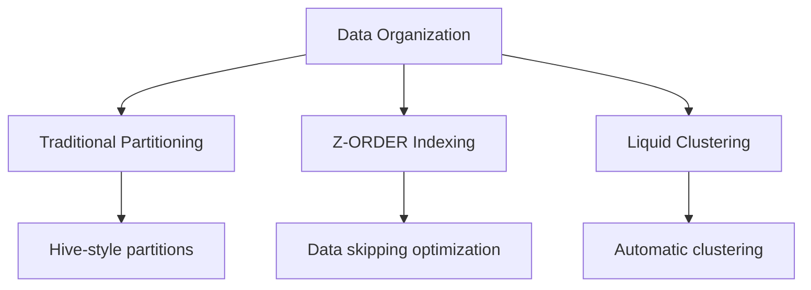
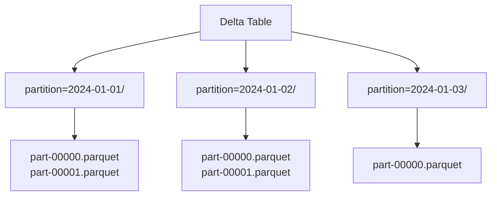
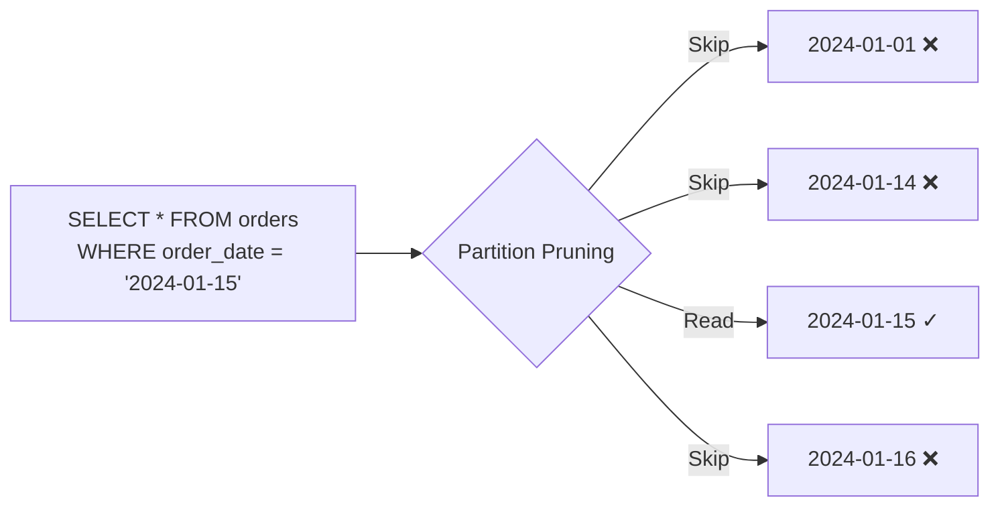
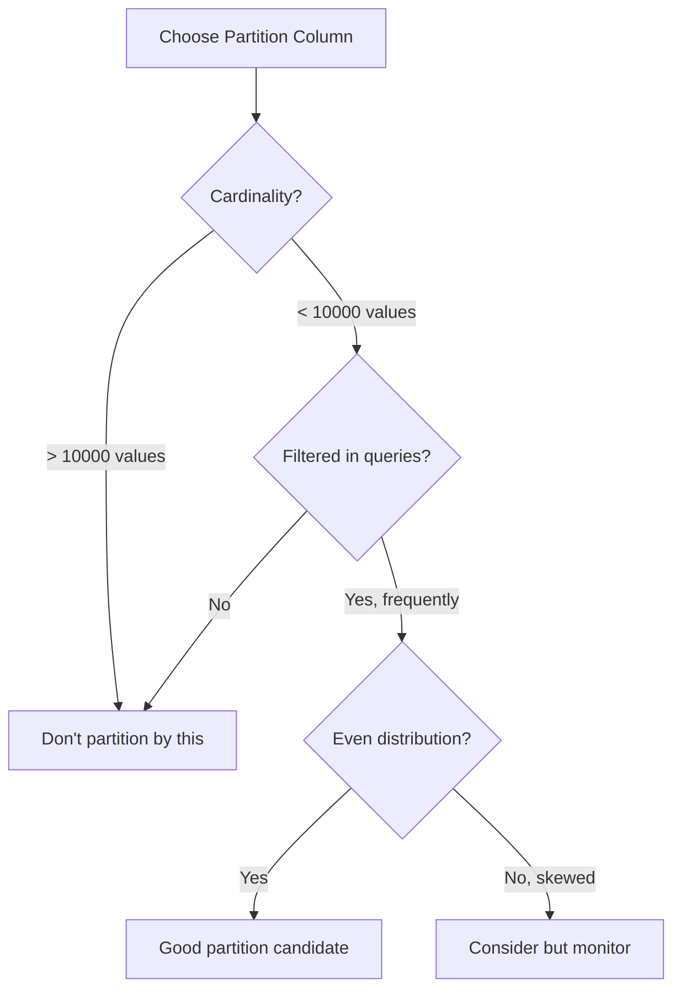
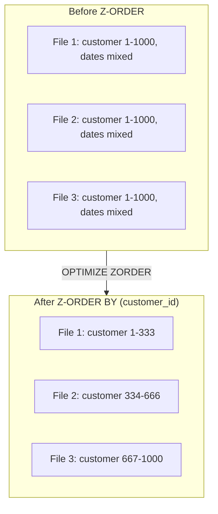
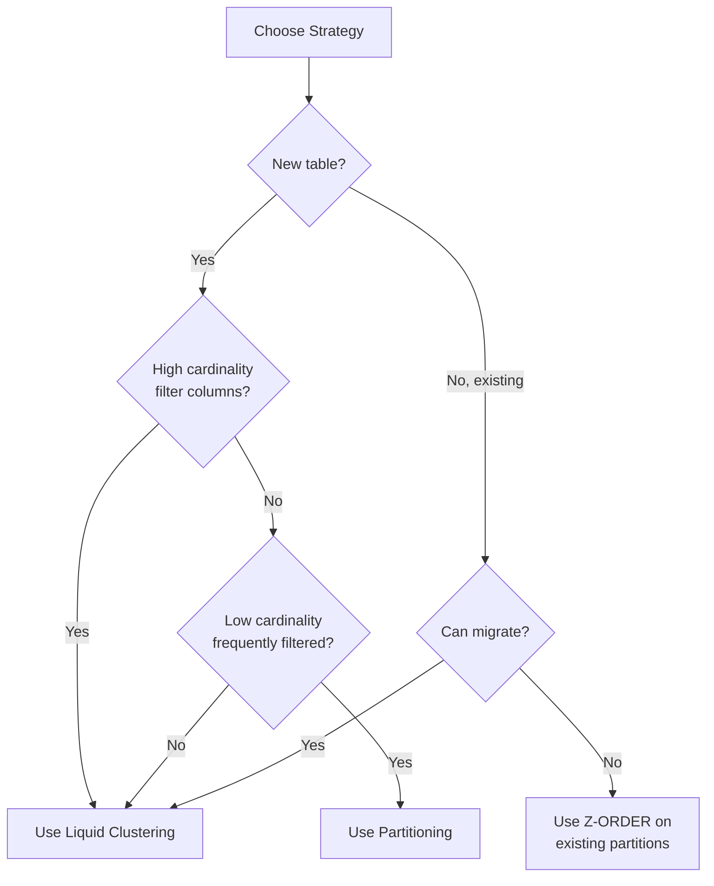
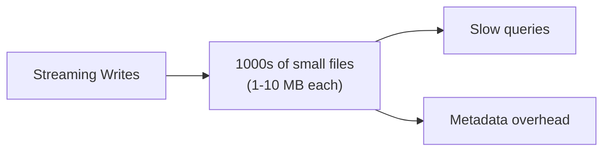

# Partitioning Strategies

Effective partitioning is critical for query performance and data management in Delta Lake. Understanding when to partition, how to choose partition columns, and modern alternatives like liquid clustering is essential.

## Overview



## Traditional Partitioning

### How Partitioning Works



### Directory Structure

```text
delta_table/
├── _delta_log/
├── date=2024-01-01/
│   ├── part-00000-xxx.snappy.parquet
│   └── part-00001-xxx.snappy.parquet
├── date=2024-01-02/
│   ├── part-00000-xxx.snappy.parquet
│   └── part-00001-xxx.snappy.parquet
└── date=2024-01-03/
    └── part-00000-xxx.snappy.parquet
```

### Creating Partitioned Tables

```sql
-- SQL: Create partitioned table
CREATE TABLE main.default.orders (
    order_id STRING,
    customer_id INT,
    order_date DATE,
    amount DECIMAL(18,2)
)
USING DELTA
PARTITIONED BY (order_date);

-- Multiple partition columns
CREATE TABLE main.default.events (
    event_id STRING,
    event_type STRING,
    user_id INT,
    event_data STRING,
    event_date DATE,
    region STRING
)
USING DELTA
PARTITIONED BY (event_date, region);
```

```python
# DataFrame API: Write with partitioning

(df.write
    .format("delta")
    .partitionBy("order_date")
    .mode("overwrite")
    .saveAsTable("main.default.orders"))

# Multiple partition columns

(df.write
    .format("delta")
    .partitionBy("event_date", "region")
    .mode("overwrite")
    .saveAsTable("main.default.events"))
```

## Partition Pruning

Partition pruning automatically skips irrelevant partitions during query execution.

### How Pruning Works



### Effective Pruning Patterns

```sql
-- Equality filter - PRUNING OCCURS ✓
SELECT * FROM orders WHERE order_date = '2024-01-15';

-- Range filter - PRUNING OCCURS ✓
SELECT * FROM orders WHERE order_date BETWEEN '2024-01-01' AND '2024-01-31';

-- IN list - PRUNING OCCURS ✓
SELECT * FROM orders WHERE order_date IN ('2024-01-15', '2024-01-16');

-- Function on partition column - NO PRUNING ✗
SELECT * FROM orders WHERE YEAR(order_date) = 2024;

-- Expression on partition column - NO PRUNING ✗
SELECT * FROM orders WHERE order_date + INTERVAL 1 DAY = '2024-01-16';
```

### Pruning Patterns Summary

| Filter Pattern | Pruning? | Example |
| :--- | :--- | :--- |
| Equality `=` | Yes | `date = '2024-01-15'` |
| Comparison `<, >, <=, >=` | Yes | `date >= '2024-01-01'` |
| BETWEEN | Yes | `date BETWEEN '2024-01-01' AND '2024-01-31'` |
| IN list | Yes | `date IN ('2024-01-15', '2024-01-16')` |
| Function on column | No | `YEAR(date) = 2024` |
| Expression | No | `date + 1 = '2024-01-16'` |
| OR with non-partition | Partial | `date = '2024-01-15' OR amount > 100` |

## Choosing Partition Columns

### Selection Criteria

| Criterion | Good Partition Column | Bad Partition Column |
| :--- | :--- | :--- |
| Cardinality | Low to medium (100-10000) | Very high (millions) |
| Query patterns | Frequently filtered | Rarely filtered |
| Data distribution | Even across values | Highly skewed |
| Granularity | Date, region, category | Timestamp, user_id |

### Decision Flow



### Good Partition Column Examples

```sql
-- Date-based partitioning (most common)
PARTITIONED BY (order_date)  -- Daily
PARTITIONED BY (order_month) -- Monthly (derived column)

-- Region/geography
PARTITIONED BY (country_code)
PARTITIONED BY (region)

-- Category/type
PARTITIONED BY (product_category)
PARTITIONED BY (event_type)
```

### Bad Partition Column Examples

```sql
-- Too high cardinality (millions of small files)
PARTITIONED BY (user_id)        -- Avoid
PARTITIONED BY (transaction_id) -- Avoid
PARTITIONED BY (event_timestamp) -- Avoid

-- Rarely filtered
PARTITIONED BY (internal_flag)  -- Avoid if not queried
```

## Generated Partition Columns

Create derived columns for partitioning.

```sql
-- Generate partition column from timestamp
CREATE TABLE main.default.events (
    event_id STRING,
    event_time TIMESTAMP,
    event_data STRING,
    event_date DATE GENERATED ALWAYS AS (CAST(event_time AS DATE))
)
USING DELTA
PARTITIONED BY (event_date);

-- Generate year/month columns
CREATE TABLE main.default.orders (
    order_id STRING,
    order_timestamp TIMESTAMP,
    amount DECIMAL(18,2),
    order_year INT GENERATED ALWAYS AS (YEAR(order_timestamp)),
    order_month INT GENERATED ALWAYS AS (MONTH(order_timestamp))
)
USING DELTA
PARTITIONED BY (order_year, order_month);
```

```python
# Add partition column before writing

from pyspark.sql.functions import year, month, to_date

df_with_partition = (df
    .withColumn("order_date", to_date("order_timestamp"))
    .withColumn("order_year", year("order_timestamp")))

(df_with_partition.write
    .format("delta")
    .partitionBy("order_year", "order_month")
    .saveAsTable("main.default.orders"))
```

## Dynamic Partition Overwrite

Overwrite only partitions present in the DataFrame.

```python
# Enable dynamic partition overwrite

spark.conf.set("spark.sql.sources.partitionOverwriteMode", "dynamic")

# Only overwrites partitions in the DataFrame

(df.write
    .format("delta")
    .mode("overwrite")
    .partitionBy("order_date")
    .saveAsTable("main.default.orders"))

# Using replaceWhere for explicit partition overwrite

(df.write
    .format("delta")
    .mode("overwrite")
    .option("replaceWhere", "order_date >= '2024-01-01' AND order_date < '2024-02-01'")
    .saveAsTable("main.default.orders"))
```

```sql
-- SQL equivalent
INSERT OVERWRITE main.default.orders
PARTITION (order_date)
SELECT * FROM staging_orders;

-- Explicit partition overwrite
INSERT OVERWRITE main.default.orders
PARTITION (order_date = '2024-01-15')
SELECT order_id, customer_id, amount
FROM staging_orders
WHERE order_date = '2024-01-15';
```

## Z-ORDER Optimization

Z-ORDER co-locates related data for efficient data skipping.

### How Z-ORDER Works



### Z-ORDER Syntax

```sql
-- Z-ORDER by single column
OPTIMIZE main.default.orders
ZORDER BY (customer_id);

-- Z-ORDER by multiple columns
OPTIMIZE main.default.events
ZORDER BY (user_id, event_type);

-- Z-ORDER specific partitions
OPTIMIZE main.default.orders
WHERE order_date >= '2024-01-01'
ZORDER BY (customer_id);
```

### Z-ORDER Best Practices

| Guideline | Recommendation |
|-----------|----------------|
| Number of columns | 1-4 columns (effectiveness decreases) |
| Column selection | High cardinality columns used in filters |
| Order matters | Put most selective column first |
| With partitioning | Use Z-ORDER on non-partition filter columns |
| Frequency | Run after significant data changes |

### Z-ORDER Column Selection

```sql
-- Good: High cardinality, frequently filtered
OPTIMIZE orders ZORDER BY (customer_id);  -- Often filtered by customer
OPTIMIZE events ZORDER BY (user_id, session_id);  -- User analysis queries

-- Less effective: Low cardinality
OPTIMIZE orders ZORDER BY (status);  -- Only a few distinct values

-- Combine with partitioning
-- Table partitioned by order_date
-- Z-ORDER by customer_id for customer-based queries
OPTIMIZE orders WHERE order_date = '2024-01-15' ZORDER BY (customer_id);
```

## Liquid Clustering

Liquid clustering is the modern replacement for partitioning + Z-ORDER.

### Liquid Clustering Benefits

| Feature | Partitioning + Z-ORDER | Liquid Clustering |
|---------|----------------------|-------------------|
| Initial setup | Choose at table creation | Choose at table creation |
| Change columns | Requires table rebuild | Just ALTER TABLE |
| Incremental clustering | Manual OPTIMIZE | Automatic |
| Small file problem | Can occur | Handled automatically |
| Write performance | Manual optimization | Optimized writes |

### Enable Liquid Clustering

```sql
-- Create new table with liquid clustering
CREATE TABLE main.default.orders (
    order_id STRING,
    customer_id INT,
    order_date DATE,
    amount DECIMAL(18,2)
)
USING DELTA
CLUSTER BY (customer_id, order_date);

-- Convert existing table to liquid clustering
ALTER TABLE main.default.orders
CLUSTER BY (customer_id, order_date);

-- Remove clustering
ALTER TABLE main.default.orders
CLUSTER BY NONE;

-- Change clustering columns (easy with liquid clustering!)
ALTER TABLE main.default.orders
CLUSTER BY (region, order_date);
```

### Liquid Clustering with Auto-Compaction

```sql
-- Enable auto-optimization for liquid clustering
ALTER TABLE main.default.orders SET TBLPROPERTIES (
    'delta.autoOptimize.optimizeWrite' = 'true',
    'delta.autoOptimize.autoCompact' = 'true'
);
```

### Triggering Clustering

```sql
-- Manual trigger (similar to OPTIMIZE)
OPTIMIZE main.default.orders;

-- Clustering happens automatically with:
-- 1. Writes when auto-optimize is enabled
-- 2. OPTIMIZE commands
-- 3. Background maintenance (Databricks-managed)
```

### When to Use Liquid Clustering

| Scenario | Recommendation |
|----------|----------------|
| New tables | Use liquid clustering |
| Uncertain query patterns | Use liquid clustering (easy to change) |
| Very large tables (PB+) | Still consider traditional partitioning |
| Need exact partition control | Use traditional partitioning |
| Streaming workloads | Liquid clustering works well |

## Partitioning vs Z-ORDER vs Liquid Clustering

### Comparison Matrix

| Aspect | Partitioning | Z-ORDER | Liquid Clustering |
|--------|--------------|---------|-------------------|
| Data organization | Physical directories | Within files | Within files |
| Filter efficiency | Partition pruning | Data skipping | Data skipping |
| Cardinality support | Low-medium | High | High |
| Column changes | Table rebuild | Re-OPTIMIZE | ALTER TABLE |
| Maintenance | Manual | Manual OPTIMIZE | Automatic |
| Streaming support | Good | Manual maintenance | Good |

### Decision Guide



## Small File Problem

### Problem Description



### Solutions

```sql
-- Solution 1: Auto-optimize (recommended)
ALTER TABLE main.default.orders SET TBLPROPERTIES (
    'delta.autoOptimize.optimizeWrite' = 'true',
    'delta.autoOptimize.autoCompact' = 'true'
);

-- Solution 2: Periodic OPTIMIZE
OPTIMIZE main.default.orders;

-- Solution 3: Repartition before write
-- (manual control over file count)
```

```python
# Control file size with repartition

(df.repartition(10)
    .write
    .format("delta")
    .mode("append")
    .saveAsTable("main.default.orders"))

# Target file size

spark.conf.set("spark.databricks.delta.optimizeWrite.fileSize", "128mb")
```

### Target File Sizes

| Scenario | Target File Size |
|----------|-----------------|
| General workloads | 128 MB - 1 GB |
| Frequent small queries | 64 MB - 128 MB |
| Large scan workloads | 256 MB - 1 GB |
| Streaming | 64 MB - 128 MB |

## Partition Evolution

### Changing Partition Scheme

Traditional partitioning cannot be changed without recreating the table:

```python

# Cannot change partition columns directly
# Must recreate table

# Step 1: Create new table with desired partitioning

spark.sql("""
    CREATE TABLE main.default.orders_new
    USING DELTA
    PARTITIONED BY (order_month)
    AS SELECT
        *,
        DATE_TRUNC('month', order_date) AS order_month
    FROM main.default.orders
""")

# Step 2: Rename tables

spark.sql("ALTER TABLE main.default.orders RENAME TO main.default.orders_old")
spark.sql("ALTER TABLE main.default.orders_new RENAME TO main.default.orders")

# Step 3: Drop old table (after validation)
# spark.sql("DROP TABLE main.default.orders_old")

```

### Liquid Clustering Evolution

```sql
-- Easy with liquid clustering!
ALTER TABLE main.default.orders
CLUSTER BY (region, order_month);

-- Previous clustering columns are changed
-- Existing data will be re-clustered on next OPTIMIZE
```

## Use Cases

### Time-Series Data

```sql
-- Partition by date, Z-ORDER by device
CREATE TABLE main.default.sensor_data (
    device_id STRING,
    reading_time TIMESTAMP,
    value DOUBLE,
    reading_date DATE GENERATED ALWAYS AS (CAST(reading_time AS DATE))
)
USING DELTA
PARTITIONED BY (reading_date);

-- Queries filter by date range and device
OPTIMIZE sensor_data ZORDER BY (device_id);
```

### E-commerce Orders

```sql
-- Liquid clustering for flexible queries
CREATE TABLE main.default.orders (
    order_id STRING,
    customer_id INT,
    order_date DATE,
    region STRING,
    amount DECIMAL(18,2)
)
USING DELTA
CLUSTER BY (order_date, customer_id, region);

-- Supports queries by date, customer, or region
```

### Log Analytics

```sql
-- High volume, filter by time and service
CREATE TABLE main.default.application_logs (
    log_id STRING,
    service_name STRING,
    log_level STRING,
    message STRING,
    log_time TIMESTAMP,
    log_date DATE GENERATED ALWAYS AS (CAST(log_time AS DATE))
)
USING DELTA
PARTITIONED BY (log_date)
TBLPROPERTIES (
    'delta.autoOptimize.optimizeWrite' = 'true'
);

OPTIMIZE application_logs ZORDER BY (service_name, log_level);
```

## Common Issues & Errors

### Too Many Small Partitions

**Scenario:** Partitioning by high-cardinality column creates millions of small files.

**Fix:** Choose lower cardinality partition column or use liquid clustering:

```sql
-- Instead of partitioning by timestamp
-- Partition by date or month
PARTITIONED BY (event_date)

-- Or use liquid clustering
CLUSTER BY (event_timestamp)
```

### Partition Pruning Not Working

**Scenario:** Query scans all partitions despite filter.

**Fix:** Check filter pushdown:

```sql
-- Doesn't prune
SELECT * FROM orders WHERE YEAR(order_date) = 2024;

-- Does prune
SELECT * FROM orders WHERE order_date >= '2024-01-01' AND order_date < '2025-01-01';
```

### Skewed Partitions

**Scenario:** One partition has much more data than others.

**Fix:** Repartition or handle hot partitions:

```python
# Adaptive write for skewed data

spark.conf.set("spark.sql.adaptive.enabled", "true")
spark.conf.set("spark.sql.adaptive.skewJoin.enabled", "true")
```

### Z-ORDER Not Effective

**Scenario:** Z-ORDER doesn't improve query performance.

**Fix:** Verify column selection and run OPTIMIZE:

```sql
-- Check if OPTIMIZE has been run
DESCRIBE HISTORY main.default.orders;

-- Ensure Z-ORDER columns match query filters
OPTIMIZE orders ZORDER BY (customer_id);  -- If filtering by customer
```

## Exam Tips

1. **Partition pruning** - Only works with direct column filters, not functions
2. **Z-ORDER** - Use for high cardinality columns, 1-4 columns max
3. **Liquid clustering** - Modern replacement, easy to change columns
4. **Small file problem** - Use auto-optimize or periodic OPTIMIZE
5. **Dynamic partition overwrite** - Only overwrites partitions in DataFrame
6. **Generated columns** - Use for derived partition columns
7. **Cardinality** - Low-medium for partitioning, high for Z-ORDER/clustering
8. **replaceWhere** - Explicit partition overwrite option
9. **File size target** - 128 MB - 1 GB for most workloads
10. **Partition evolution** - Traditional requires rebuild, liquid uses ALTER

## Key Takeaways

- **Partition pruning conditions**: equality (`=`), range (`<`, `>`, `BETWEEN`), and `IN` filters on the partition column enable pruning; applying a function to the column (e.g., `YEAR(date)`) defeats pruning entirely
- **Partition column cardinality**: low to medium cardinality (hundreds to ~10,000 distinct values) is ideal; high-cardinality columns (user_id, transaction_id, timestamp) create millions of small files and hurt performance
- **Z-ORDER mechanics**: `OPTIMIZE ... ZORDER BY (col)` co-locates rows with similar values in the same files; this enables Delta data skipping using per-file min/max statistics; effectiveness diminishes beyond 4 columns
- **Liquid clustering vs partitioning**: Liquid Clustering (`CLUSTER BY`) replaces partitioning + Z-ORDER; clustering columns can be changed with a simple `ALTER TABLE ... CLUSTER BY` without rebuilding the table
- **Dynamic partition overwrite**: `spark.sql.sources.partitionOverwriteMode = dynamic` causes `mode("overwrite")` to replace only the partitions present in the DataFrame, leaving other partitions untouched
- **replaceWhere**: `.option("replaceWhere", "<condition>")` on a write restricts the overwrite to matching partitions; a more explicit alternative to dynamic partition overwrite
- **Small file problem**: streaming and frequent small writes create many small files; solutions are `optimizeWrite=true` (coalesce on write), `autoCompact=true` (compact after write), periodic `OPTIMIZE`, or switching to Liquid Clustering
- **Target file size**: 128 MB–1 GB for most workloads; streaming targets 64–128 MB; files outside this range degrade either metadata overhead (too small) or read parallelism (too large)

## Related Topics

- [Delta Lake Fundamentals](02-delta-lake-fundamentals.md) - OPTIMIZE and VACUUM
- [Performance Optimization](../08-performance-optimization/README.md) - Query tuning
- [Z-Order Indexing](../08-performance-optimization/02-zorder-indexing.md) - Deep dive

## Official Documentation

- [Delta Lake Partitioning](https://docs.databricks.com/delta/best-practices.html#choose-the-right-partition-column)
- [Z-Ordering](https://docs.databricks.com/delta/optimizations/file-mgmt.html#z-ordering-multi-dimensional-clustering)
- [Liquid Clustering](https://docs.databricks.com/delta/clustering.html)
- [Auto Optimize](https://docs.databricks.com/delta/optimizations/auto-optimize.html)

---

**[← Previous: SCD Patterns](./04-scd-patterns.md) | [↑ Back to Data Modeling](./README.md)**
