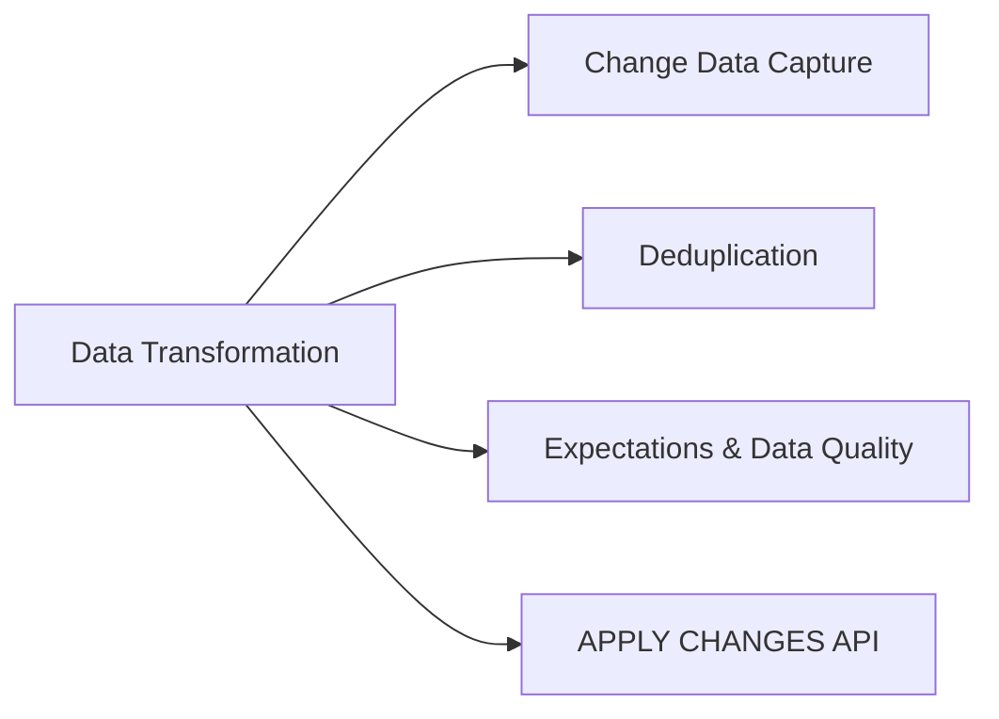

# Data Transformation, Cleansing, and Quality (10 % of Exam)

Covers CDC patterns, deduplication, Lakeflow Declarative Pipelines `expectations`, and the `APPLY CHANGES INTO` API used to land cleaned data into Silver and Gold layers.

## Topics Overview

## Section Contents

| File | Topic | Priority |
| :--- | :--- | :--- |
| [01-change-data-capture-part1.md](./01-change-data-capture-part1.md) | Delta CDF, CDC patterns with Lakeflow Pipelines, SCD patterns | High |
| [01-change-data-capture-part2.md](./01-change-data-capture-part2.md) | CDC best practices, pipeline patterns, row tracking, exam tips | High |
| [02-data-deduplication.md](./02-data-deduplication.md) | Deduplication strategies, idempotent writes | High |
| [03-expectations-data-quality.md](./03-expectations-data-quality.md) | `expect`, `expect_or_drop`, `expect_or_fail`, monitoring quality | High |
| [04-apply-changes-api.md](./04-apply-changes-api.md) | `APPLY CHANGES INTO` (formerly `APPLY CHANGES`), SCD Type 1 / 2 with declarative pipelines | High |

## Key Concepts to Master

| Concept | Why it matters |
| :--- | :--- |
| **Change Data Feed (CDF)** | Built-in change tracking on Delta tables — every row insert/update/delete is queryable |
| **Idempotent writes via `txnAppId` + `txnVersion`** | Ensures duplicate batch writes are deduped by Delta automatically |
| **Expectations** | Pipeline-level data quality predicates that drop, fail, or warn on violations |
| **APPLY CHANGES INTO** | Declarative SCD Type 1 / 2 with sequence-by columns — the production-grade alternative to hand-written MERGE |
| **CDC vs CDF** | CDC = pattern (capture changes from a source); CDF = Delta feature (read changes from a Delta table) |

## Related Resources

- [Delta Lake cheat sheet (shared)](../../../shared/cheat-sheets/delta-lake-commands.md)
- [Lakeflow Declarative Pipelines / Lakeflow Declarative Pipelines cheat sheet (shared)](../../../shared/cheat-sheets/lakeflow-declarative-pipelines-quick-ref.md)

---

**[← Previous: Cost & Performance Optimization](../02-cost-and-performance-optimization/README.md) | [↑ Back to DE Professional](../README.md) | [Next: Monitoring and Alerting →](../04-monitoring-and-alerting/README.md)**
