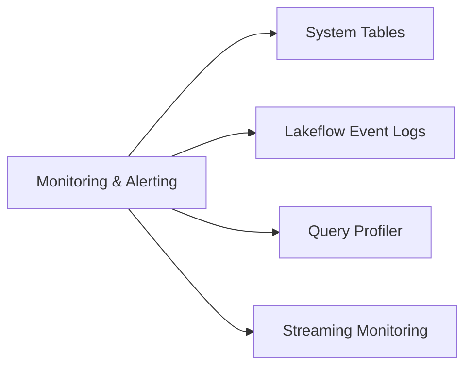

# Monitoring and Alerting (10 % of Exam)

Observability *and* alerting for Lakeflow Jobs, Lakeflow Declarative Pipelines, and Databricks SQL — using **system tables**, the **Lakeflow event log**, the **query profiler**, structured-streaming progress metrics, **SQL Alerts**, and **Lakeflow Jobs notifications** (email + webhook).

## Topics Overview

## Section Contents

| File | Topic | Priority |
| :--- | :--- | :--- |
| [01-system-tables.md](./01-system-tables.md) | `system.access`, `system.compute`, `system.billing` — querying audit, lineage, usage | High |
| [02-lakeflow-event-logs.md](./02-lakeflow-event-logs.md) | Pipeline event log: expectations, flow progress, data quality events | High |
| [03-query-profiler.md](./03-query-profiler.md) | Databricks SQL query profiler, reading task timelines | High |
| [04-streaming-monitoring-optimization.md](./04-streaming-monitoring-optimization.md) | StreamingQueryListener, back-pressure, state-store monitoring, troubleshooting | High |

## Key Concepts to Master

| Concept | Why it matters |
| :--- | :--- |
| **System tables** | Unity Catalog tables in `system.*` schemas that expose audit, access, compute, billing, and lineage events |
| **Lakeflow event log** | Append-only Delta table per pipeline that records every operator event, including expectations |
| **Query profiler** | DBSQL-native graphical profiler — shows shuffle, spill, time per stage |
| **Lakeflow Jobs notifications** | Email / webhook alerts on job-level success/failure, run duration, repair attempts — configured per job, delivered via the Jobs UI or Jobs API |
| **SQL Alerts** | Databricks SQL alerts trigger on query-result thresholds (e.g., row count > N, value < threshold) — used for data-quality and freshness checks against Delta tables |
| **Databricks CLI / REST API for monitoring** | The `databricks` CLI and Jobs REST API expose run state, task results, and event-log queries from outside the workspace — useful for external dashboards and on-call tooling |
| **System table latency** | Most system tables refresh within minutes; some up to ~1 hour — plan dashboards accordingly |

## Related Resources

- [Unity Catalog cheat sheet (shared)](../../../shared/cheat-sheets/unity-catalog-quick-ref.md)
- [Performance Troubleshooting appendix (shared)](../../../shared/appendix/performance-troubleshooting.md)

---

**[← Previous: Data Transformation](../03-data-transformation-cleansing-quality/README.md) | [↑ Back to DE Professional](../README.md) | [Next: Ensuring Data Security and Compliance →](../05-ensuring-data-security-and-compliance/README.md)**
