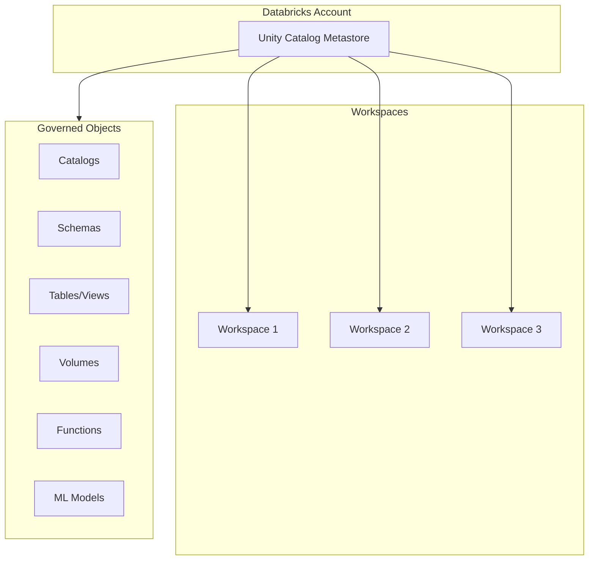
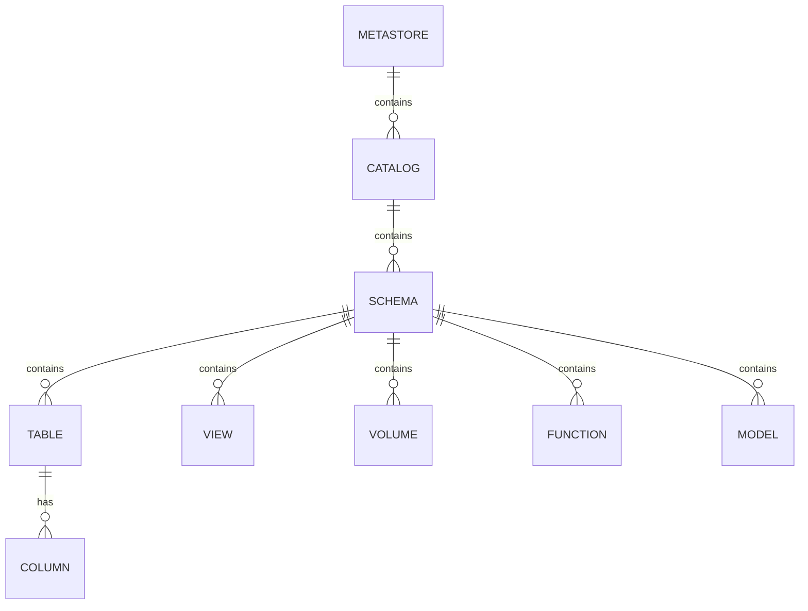
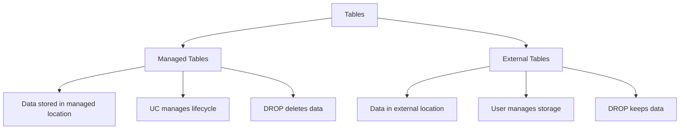
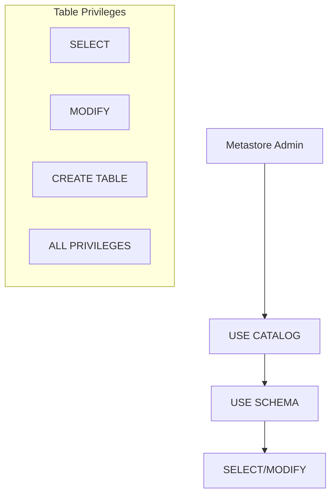

# Unity Catalog

Unity Catalog is Databricks' unified governance solution for data and AI assets. It provides centralized access control, auditing, lineage, and data discovery across workspaces.

## Overview



## Unity Catalog Architecture

### Hierarchy



### Three-Level Namespace

All objects are referenced using a three-part name:

```sql
catalog_name.schema_name.object_name

-- Examples
main.default.customers
prod.sales.orders
dev.analytics.daily_metrics
```

| Level | Purpose | Examples |
| :--- | :--- | :--- |
| Catalog | Top-level container, often by environment or domain | `prod`, `dev`, `staging`, `sales`, `marketing` |
| Schema | Logical grouping (like database) | `raw`, `bronze`, `silver`, `gold`, `default` |
| Object | Tables, views, volumes, functions, models | `customers`, `orders`, `daily_revenue` |

## Metastore

The metastore is the top-level container for all Unity Catalog objects.

### Metastore Characteristics

| Aspect | Description |
| :--- | :--- |
| Scope | One per region per account |
| Storage | Managed storage location in cloud |
| Attachment | Attached to one or more workspaces |
| Admin | Metastore admin role has full control |

### Creating and Managing Metastore

```sql
-- Metastore is created via account console or API
-- Cannot be created via SQL

-- View metastore information
SELECT * FROM system.information_schema.metastores;

-- View current metastore
SELECT current_metastore();
```

### Metastore Admin Capabilities

- Create and manage catalogs
- Assign catalog ownership
- Create storage credentials and external locations
- Manage metastore-level settings
- Assign workspace access to catalogs

## Catalogs

Catalogs are the primary container for organizing data assets.

### Creating Catalogs

```sql
-- Create catalog
CREATE CATALOG IF NOT EXISTS prod;

-- Create catalog with comment
CREATE CATALOG dev
COMMENT 'Development environment catalog';

-- Create catalog with managed location
CREATE CATALOG staging
MANAGED LOCATION 's3://my-bucket/staging/';

-- View catalogs
SHOW CATALOGS;

-- Describe catalog
DESCRIBE CATALOG prod;

-- Drop catalog (must be empty)
DROP CATALOG IF EXISTS temp_catalog;

-- Force drop catalog with contents
DROP CATALOG IF EXISTS temp_catalog CASCADE;
```

### Catalog Best Practices

| Pattern | Example | Use Case |
| :--- | :--- | :--- |
| By environment | `prod`, `dev`, `staging` | Environment isolation |
| By domain | `sales`, `marketing`, `finance` | Business domain separation |
| By team | `data_engineering`, `data_science` | Team ownership |
| Hybrid | `prod_sales`, `dev_marketing` | Combined approach |

## Schemas

Schemas (also called databases) group related tables and objects.

### Creating Schemas

```sql
-- Set current catalog
USE CATALOG prod;

-- Create schema
CREATE SCHEMA IF NOT EXISTS sales;

-- Create schema with comment
CREATE SCHEMA bronze
COMMENT 'Raw data landing zone';

-- Create schema with managed location
CREATE SCHEMA gold
MANAGED LOCATION 's3://my-bucket/prod/gold/';

-- View schemas in current catalog
SHOW SCHEMAS;

-- View schemas in specific catalog
SHOW SCHEMAS IN prod;

-- Describe schema
DESCRIBE SCHEMA prod.sales;

-- Drop schema
DROP SCHEMA IF EXISTS temp_schema;
DROP SCHEMA IF EXISTS temp_schema CASCADE;
```

### Default Schema

Each catalog has a `default` schema created automatically:

```sql
-- These are equivalent
SELECT * FROM prod.default.customers;

USE CATALOG prod;
USE SCHEMA default;
SELECT * FROM customers;
```

## Tables

### Table Types



### Creating Tables

```sql
-- Managed table (default)
CREATE TABLE prod.sales.orders (
    order_id STRING,
    customer_id INT,
    order_date DATE,
    amount DECIMAL(18,2)
)
USING DELTA;

-- External table
CREATE TABLE prod.raw.external_data (
    id INT,
    data STRING
)
USING DELTA
LOCATION 's3://external-bucket/data/';

-- Create table from query
CREATE TABLE prod.gold.daily_revenue AS
SELECT
    order_date,
    SUM(amount) as total_revenue
FROM prod.silver.orders
GROUP BY order_date;
```

### Table Properties

```sql
-- View table details
DESCRIBE TABLE EXTENDED prod.sales.orders;

-- View table properties
SHOW TBLPROPERTIES prod.sales.orders;

-- Set table properties
ALTER TABLE prod.sales.orders SET TBLPROPERTIES (
    'delta.autoOptimize.optimizeWrite' = 'true'
);

-- Add table comment
COMMENT ON TABLE prod.sales.orders IS 'Sales orders fact table';
```

### Managed vs External Tables

| Aspect | Managed Table | External Table |
| :--- | :--- | :--- |
| Storage location | Unity Catalog managed | User-specified location |
| Data lifecycle | Managed by UC | User managed |
| DROP behavior | Deletes data | Keeps data |
| Creation | No LOCATION clause | LOCATION clause required |
| Best for | Most use cases | Existing data, shared storage |

## Views

### Creating Views

```sql
-- Standard view
CREATE VIEW prod.gold.customer_summary AS
SELECT
    customer_id,
    COUNT(*) as order_count,
    SUM(amount) as total_spent
FROM prod.silver.orders
GROUP BY customer_id;

-- Replace existing view
CREATE OR REPLACE VIEW prod.gold.customer_summary AS
SELECT
    customer_id,
    COUNT(*) as order_count,
    SUM(amount) as total_spent,
    MAX(order_date) as last_order
FROM prod.silver.orders
GROUP BY customer_id;

-- Materialized view (DLT only)
-- See Lakeflow Pipelines section
```

### Dynamic Views for Security

```sql
-- Row-level security using current_user()
CREATE VIEW prod.sales.my_orders AS
SELECT *
FROM prod.sales.orders
WHERE sales_rep = current_user();

-- Column masking
CREATE VIEW prod.sales.orders_masked AS
SELECT
    order_id,
    customer_id,
    order_date,
    CASE
        WHEN is_account_group_member('finance') THEN amount
        ELSE NULL
    END as amount
FROM prod.sales.orders;
```

## Volumes

Volumes provide governed access to non-tabular data (files).

### Volume Types

| Type | Storage | Use Case |
| :--- | :--- | :--- |
| Managed | UC managed location | Generated files, outputs |
| External | User cloud storage | Landing zones, existing files |

### Creating Volumes

```sql
-- Managed volume
CREATE VOLUME prod.raw.landing_zone;

-- External volume
CREATE EXTERNAL VOLUME prod.raw.external_files
LOCATION 's3://my-bucket/external/';

-- List volumes
SHOW VOLUMES IN prod.raw;

-- Describe volume
DESCRIBE VOLUME prod.raw.landing_zone;
```

### Using Volumes

```python
# Volume paths

volume_path = "/Volumes/prod/raw/landing_zone/"

# Read from volume

df = spark.read.format("csv").load(f"{volume_path}data.csv")

# Write to volume

df.write.format("parquet").save(f"{volume_path}output/")

# File operations

dbutils.fs.ls(volume_path)
dbutils.fs.cp(f"{volume_path}file.csv", f"{volume_path}archive/file.csv")
```

## Storage Credentials and External Locations

### Storage Credentials

Storage credentials define how to authenticate to cloud storage.

```sql
-- Create storage credential (admin only)
CREATE STORAGE CREDENTIAL my_s3_credential
WITH (
    AWS_IAM_ROLE = 'arn:aws:iam::123456789:role/databricks-access'
);

-- For Azure
CREATE STORAGE CREDENTIAL my_azure_credential
WITH (
    AZURE_MANAGED_IDENTITY = '/subscriptions/.../resourceGroups/.../providers/Microsoft.ManagedIdentity/...'
);

-- List storage credentials
SHOW STORAGE CREDENTIALS;
```

### External Locations

External locations map cloud storage paths to Unity Catalog.

```sql
-- Create external location
CREATE EXTERNAL LOCATION my_landing_zone
URL 's3://my-bucket/landing/'
WITH (STORAGE CREDENTIAL my_s3_credential);

-- Grant access to external location
GRANT READ FILES, WRITE FILES ON EXTERNAL LOCATION my_landing_zone TO `data-engineers`;

-- List external locations
SHOW EXTERNAL LOCATIONS;
```

## Permission Model

### Privilege Hierarchy



### Common Privileges

| Privilege | Object | Description |
| :--- | :--- | :--- |
| `USE CATALOG` | Catalog | Navigate to catalog |
| `USE SCHEMA` | Schema | Navigate to schema |
| `SELECT` | Table/View | Read data |
| `MODIFY` | Table | INSERT, UPDATE, DELETE |
| `CREATE TABLE` | Schema | Create tables in schema |
| `CREATE SCHEMA` | Catalog | Create schemas in catalog |
| `CREATE VOLUME` | Schema | Create volumes in schema |
| `READ VOLUME` | Volume | Read files from volume |
| `WRITE VOLUME` | Volume | Write files to volume |
| `EXECUTE` | Function | Execute function |
| `ALL PRIVILEGES` | Any | Full access |

### Granting Permissions

```sql
-- Grant USE CATALOG
GRANT USE CATALOG ON CATALOG prod TO `data-analysts`;

-- Grant USE SCHEMA
GRANT USE SCHEMA ON SCHEMA prod.gold TO `data-analysts`;

-- Grant SELECT on table
GRANT SELECT ON TABLE prod.gold.revenue TO `data-analysts`;

-- Grant SELECT on all tables in schema
GRANT SELECT ON SCHEMA prod.gold TO `data-analysts`;

-- Grant multiple privileges
GRANT SELECT, MODIFY ON TABLE prod.silver.orders TO `data-engineers`;

-- Grant with GRANT OPTION (can grant to others)
GRANT SELECT ON TABLE prod.gold.revenue TO `team-lead` WITH GRANT OPTION;

-- Grant ALL PRIVILEGES
GRANT ALL PRIVILEGES ON SCHEMA prod.silver TO `data-engineers`;
```

### Revoking Permissions

```sql
-- Revoke SELECT
REVOKE SELECT ON TABLE prod.gold.revenue FROM `data-analysts`;

-- Revoke all privileges
REVOKE ALL PRIVILEGES ON SCHEMA prod.silver FROM `data-engineers`;
```

### Viewing Permissions

```sql
-- Show grants on object
SHOW GRANTS ON TABLE prod.gold.revenue;

-- Show grants for principal
SHOW GRANTS TO `data-analysts`;

-- Show grants on schema
SHOW GRANTS ON SCHEMA prod.gold;
```

## Ownership

### Object Ownership

Every object has an owner with full control.

```sql
-- View owner
DESCRIBE TABLE EXTENDED prod.sales.orders;

-- Change owner
ALTER TABLE prod.sales.orders SET OWNER TO `data-engineering-team`;

-- Change schema owner
ALTER SCHEMA prod.sales SET OWNER TO `sales-team`;

-- Change catalog owner
ALTER CATALOG prod SET OWNER TO `platform-team`;
```

### Owner Privileges

| Owner Can | Description |
| :--- | :--- |
| Grant/revoke permissions | Control who can access |
| Drop object | Delete the object |
| Alter object | Modify properties |
| Transfer ownership | Assign new owner |

## Groups and Users

### Identity Management

```sql
-- Create group (account admin)
-- Done via account console or SCIM

-- Add user to group (account admin)
-- Done via account console or SCIM

-- Use groups in grants
GRANT SELECT ON TABLE prod.gold.revenue TO `data-analysts`;

-- Check group membership
SELECT is_account_group_member('data-analysts');

-- Get current user
SELECT current_user();
```

### Group-Based Access Pattern

```sql
-- Create role-based access
GRANT USE CATALOG ON CATALOG prod TO `analysts`;
GRANT USE SCHEMA ON SCHEMA prod.gold TO `analysts`;
GRANT SELECT ON SCHEMA prod.gold TO `analysts`;

GRANT USE CATALOG ON CATALOG prod TO `engineers`;
GRANT USE SCHEMA ON SCHEMA prod.silver TO `engineers`;
GRANT SELECT, MODIFY ON SCHEMA prod.silver TO `engineers`;
GRANT CREATE TABLE ON SCHEMA prod.silver TO `engineers`;
```

## Information Schema

Unity Catalog provides system tables for metadata queries.

```sql
-- List all catalogs
SELECT * FROM system.information_schema.catalogs;

-- List all schemas
SELECT * FROM system.information_schema.schemata
WHERE catalog_name = 'prod';

-- List all tables
SELECT * FROM system.information_schema.tables
WHERE table_schema = 'gold';

-- List all columns
SELECT * FROM system.information_schema.columns
WHERE table_name = 'orders';

-- List all privileges
SELECT * FROM system.information_schema.table_privileges
WHERE table_name = 'orders';
```

## Lineage

Unity Catalog automatically tracks data lineage.

```sql
-- Query lineage (via UI or API)
-- Lineage is visible in Catalog Explorer

-- Lineage captures:
-- - Table to table dependencies
-- - Column-level lineage
-- - Notebook/job that created data
```

```python

# Access lineage via REST API
# GET /api/2.1/unity-catalog/lineage/table-lineage

```

## Migration from Hive Metastore

### Comparison

| Aspect | Hive Metastore | Unity Catalog |
| :--- | :--- | :--- |
| Scope | Workspace-level | Account-level |
| Governance | Limited | Comprehensive |
| Lineage | None | Automatic |
| Access control | Basic ACLs | Fine-grained |
| Data sharing | Not supported | Delta Sharing |

### Migration Approaches

```sql
-- Upgrade managed table in place
ALTER TABLE hive_metastore.default.my_table
SET TBLPROPERTIES ('upgraded_to' = 'prod.bronze.my_table');

-- Copy data to UC table
CREATE TABLE prod.bronze.my_table AS
SELECT * FROM hive_metastore.default.my_table;

-- Create external table pointing to same location
CREATE TABLE prod.bronze.my_table
USING DELTA
LOCATION 'dbfs:/user/hive/warehouse/my_table';
```

## Use Cases

### Multi-Environment Setup

```sql
-- Create environment catalogs
CREATE CATALOG dev;
CREATE CATALOG staging;
CREATE CATALOG prod;

-- Same schema structure across environments
CREATE SCHEMA dev.sales;
CREATE SCHEMA staging.sales;
CREATE SCHEMA prod.sales;

-- Environment-specific permissions
GRANT ALL PRIVILEGES ON CATALOG dev TO `developers`;
GRANT SELECT ON CATALOG staging TO `developers`;
GRANT SELECT ON SCHEMA prod.gold TO `analysts`;
```

### Data Mesh Pattern

```sql
-- Domain-based catalogs
CREATE CATALOG sales_domain;
CREATE CATALOG marketing_domain;
CREATE CATALOG finance_domain;

-- Each domain manages their own data
GRANT ALL PRIVILEGES ON CATALOG sales_domain TO `sales-data-team`;
GRANT ALL PRIVILEGES ON CATALOG marketing_domain TO `marketing-data-team`;

-- Cross-domain read access
GRANT USE CATALOG, USE SCHEMA, SELECT ON CATALOG sales_domain TO `marketing-data-team`;
```

## Common Issues & Errors

### Permission Denied

**Scenario:** User cannot access table.

**Fix:** Grant required privileges:

```sql
-- Check what's missing
SHOW GRANTS TO `user@company.com`;

-- Grant catalog access
GRANT USE CATALOG ON CATALOG prod TO `user@company.com`;

-- Grant schema access
GRANT USE SCHEMA ON SCHEMA prod.gold TO `user@company.com`;

-- Grant table access
GRANT SELECT ON TABLE prod.gold.revenue TO `user@company.com`;
```

### Cannot Create External Table

**Scenario:** External location not configured.

**Fix:** Create external location first:

```sql
-- Create storage credential and external location
-- Then create table
CREATE TABLE prod.raw.external_data
USING DELTA
LOCATION 's3://bucket/path/';
```

### Catalog Not Visible

**Scenario:** User cannot see catalog.

**Fix:** Grant USE CATALOG:

```sql
GRANT USE CATALOG ON CATALOG prod TO `data-team`;
```

## Exam Tips

1. **Three-level namespace** - Always `catalog.schema.object`
2. **Managed vs External** - Managed tables have UC-managed storage and lifecycle
3. **Permission hierarchy** - Need USE CATALOG and USE SCHEMA before table access
4. **Metastore scope** - One per region per account
5. **Ownership** - Owner has full control, can transfer ownership
6. **Storage credentials** - Required for external locations
7. **Volumes** - For non-tabular file access with governance
8. **Groups** - Use groups for scalable access management
9. **Information schema** - Query metadata via `system.information_schema`
10. **Lineage** - Automatic, visible in Catalog Explorer

## Key Takeaways

- **Three-level namespace**: every Unity Catalog object is referenced as `catalog.schema.object`; the metastore is one level above the catalog and is scoped to one per cloud region per account
- **Managed vs external tables**: managed tables store data in the UC-controlled location and `DROP TABLE` deletes the data; external tables store data at a user-specified `LOCATION` and `DROP TABLE` keeps the data
- **Permission hierarchy**: to access a table, a user must have `USE CATALOG` on the catalog, `USE SCHEMA` on the schema, and then the relevant privilege (e.g., `SELECT`) on the table — missing any level causes permission denied
- **Volume types**: managed volumes store files in the UC-managed location; external volumes point to a user-controlled cloud path; both are accessed via `/Volumes/<catalog>/<schema>/<volume>/` paths
- **Storage credentials and external locations**: a storage credential holds the cloud authentication (IAM role / managed identity); an external location maps a cloud storage URL to a credential; external tables and volumes require a matching external location
- **Dynamic views for row/column security**: `current_user()` and `is_account_group_member()` in view `WHERE` / `CASE` clauses enforce user-specific data access without modifying the underlying table
- **Ownership model**: every UC object has exactly one owner with full control (grant, alter, drop, transfer); ownership is different from privileges and can be transferred with `ALTER ... SET OWNER TO`
- **Information schema**: `system.information_schema.tables`, `.columns`, `.table_privileges`, `.schemata` provide SQL-standard metadata and are permission-filtered (users only see what they have access to)

## Related Topics

- [Access Control](02-access-control.md) - Row/column level security
- [Data Sharing](./03-data-sharing.md) - Delta Sharing
- [Secret Management](04-secret-management.md) - Secure credentials

## Official Documentation

- [Unity Catalog](https://docs.databricks.com/data-governance/unity-catalog/index.html)
- [Unity Catalog Best Practices](https://docs.databricks.com/data-governance/unity-catalog/best-practices.html)
- [Privileges](https://docs.databricks.com/data-governance/unity-catalog/manage-privileges/privileges.html)
- [Volumes](https://docs.databricks.com/volumes/index.html)

---

**[↑ Back to Security & Governance](./README.md) | [Next: Access Control](./02-access-control.md) →**
