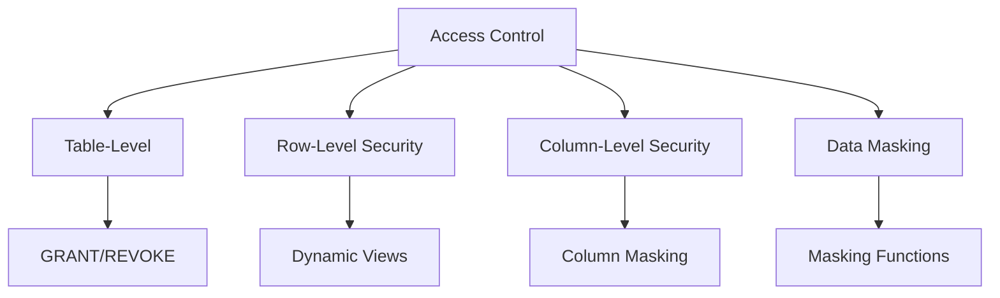
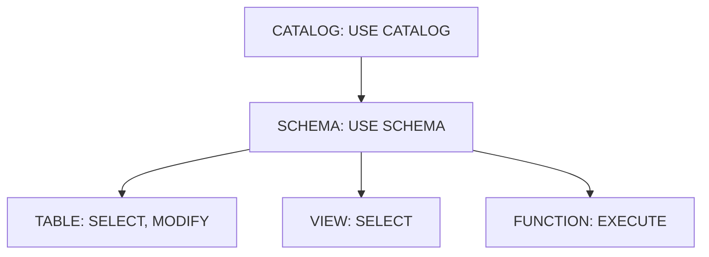

# Access Control

Access control in Databricks encompasses table-level permissions, row-level security, column-level security, and data masking. Understanding these patterns is essential for implementing secure data platforms.

## Overview



## Table-Level Access Control

### Privilege Types

| Privilege | Description | Applies To |
| :--- | :--- | :--- |
| SELECT | Read data | Tables, Views |
| MODIFY | Insert, Update, Delete | Tables |
| CREATE TABLE | Create tables | Schemas |
| CREATE VIEW | Create views | Schemas |
| ALL PRIVILEGES | Full access | Any securable |

### Granting Privileges

```sql
-- Grant SELECT on specific table
GRANT SELECT ON TABLE prod.gold.customers TO `analysts`;

-- Grant SELECT on all tables in schema
GRANT SELECT ON SCHEMA prod.gold TO `analysts`;

-- Grant with inheritance (all current and future tables)
GRANT SELECT ON SCHEMA prod.gold TO `analysts`;

-- Grant multiple privileges
GRANT SELECT, MODIFY ON TABLE prod.silver.orders TO `data-engineers`;

-- Grant to user
GRANT SELECT ON TABLE prod.gold.revenue TO `user@company.com`;

-- Grant to group
GRANT SELECT ON TABLE prod.gold.revenue TO `finance-team`;

-- Grant to service principal
GRANT SELECT ON TABLE prod.gold.revenue TO `sp-etl-pipeline`;
```

### Revoking Privileges

```sql
-- Revoke specific privilege
REVOKE SELECT ON TABLE prod.gold.customers FROM `analysts`;

-- Revoke all privileges
REVOKE ALL PRIVILEGES ON TABLE prod.gold.customers FROM `analysts`;

-- Revoke from schema
REVOKE SELECT ON SCHEMA prod.gold FROM `analysts`;
```

### Viewing Privileges

```sql
-- Show grants on table
SHOW GRANTS ON TABLE prod.gold.customers;

-- Show grants on schema
SHOW GRANTS ON SCHEMA prod.gold;

-- Show grants for principal
SHOW GRANTS TO `analysts`;

-- Show grants for current user
SHOW GRANTS TO `current_user`;
```

### Grant Hierarchy



Users need access at each level to reach objects:

```sql
-- Full access chain for analysts
GRANT USE CATALOG ON CATALOG prod TO `analysts`;
GRANT USE SCHEMA ON SCHEMA prod.gold TO `analysts`;
GRANT SELECT ON TABLE prod.gold.customers TO `analysts`;
```

## Row-Level Security

Row-level security restricts which rows users can access.

### Dynamic Views Pattern

```sql
-- Create view that filters based on user
CREATE OR REPLACE VIEW prod.secure.my_customers AS
SELECT *
FROM prod.gold.customers
WHERE region = (
    SELECT region FROM prod.admin.user_regions
    WHERE username = current_user()
);

-- Grant access to view only
GRANT SELECT ON VIEW prod.secure.my_customers TO `regional-analysts`;
-- Do NOT grant access to underlying table
```

### Using current_user()

```sql
-- Filter by user's assigned data
CREATE OR REPLACE VIEW prod.secure.my_sales AS
SELECT *
FROM prod.gold.sales
WHERE sales_rep_email = current_user();

-- Filter by manager hierarchy
CREATE OR REPLACE VIEW prod.secure.team_sales AS
SELECT s.*
FROM prod.gold.sales s
JOIN prod.admin.manager_hierarchy h
    ON s.sales_rep_id = h.employee_id
WHERE h.manager_email = current_user()
   OR s.sales_rep_email = current_user();
```

### Using is_account_group_member()

```sql
-- Different access based on group membership
CREATE OR REPLACE VIEW prod.secure.orders AS
SELECT
    order_id,
    customer_id,
    order_date,
    CASE
        WHEN is_account_group_member('executives') THEN amount
        WHEN is_account_group_member('managers') THEN
            CASE WHEN amount > 10000 THEN NULL ELSE amount END
        ELSE NULL
    END AS amount,
    region
FROM prod.gold.orders
WHERE
    is_account_group_member('executives')
    OR (is_account_group_member('regional-managers') AND region = 'US')
    OR (is_account_group_member('analysts') AND order_date >= current_date() - 365);
```

### Row-Level Security with Mapping Table

```sql
-- Create mapping table for user-data access
CREATE TABLE prod.admin.user_data_access (
    username STRING,
    allowed_region STRING,
    allowed_department STRING
);

-- Insert access rules
INSERT INTO prod.admin.user_data_access VALUES
    ('alice@company.com', 'US', 'Sales'),
    ('alice@company.com', 'US', 'Marketing'),
    ('bob@company.com', 'EU', 'Sales');

-- Create secure view
CREATE OR REPLACE VIEW prod.secure.department_data AS
SELECT d.*
FROM prod.gold.department_data d
JOIN prod.admin.user_data_access a
    ON d.region = a.allowed_region
    AND d.department = a.allowed_department
WHERE a.username = current_user();
```

## Column-Level Security

Column-level security controls which columns users can see.

### Column Masking in Views

```sql
-- Hide sensitive columns
CREATE OR REPLACE VIEW prod.secure.customers AS
SELECT
    customer_id,
    name,
    -- Mask email for non-privileged users
    CASE
        WHEN is_account_group_member('customer-support') THEN email
        ELSE CONCAT(LEFT(email, 2), '***@***.com')
    END AS email,
    -- Completely hide SSN
    CASE
        WHEN is_account_group_member('compliance') THEN ssn
        ELSE NULL
    END AS ssn,
    city,
    state
FROM prod.gold.customers;
```

### Column Masking Functions

```sql
-- Create reusable masking function
CREATE OR REPLACE FUNCTION prod.functions.mask_email(email STRING)
RETURNS STRING
RETURN CASE
    WHEN is_account_group_member('full-access') THEN email
    ELSE REGEXP_REPLACE(email, '(.{2}).*@', '$1***@')
END;

-- Use function in view
CREATE OR REPLACE VIEW prod.secure.contacts AS
SELECT
    contact_id,
    name,
    prod.functions.mask_email(email) AS email,
    phone
FROM prod.gold.contacts;
```

### Common Masking Patterns

```sql
-- Email masking: john.doe@company.com -> jo***@***.com
REGEXP_REPLACE(email, '(.{2}).*@.*', '$1***@***.com')

-- Phone masking: 555-123-4567 -> ***-***-4567
CONCAT('***-***-', RIGHT(phone, 4))

-- SSN masking: 123-45-6789 -> ***-**-6789
CONCAT('***-**-', RIGHT(ssn, 4))

-- Credit card: 4111-1111-1111-1111 -> ****-****-****-1111
CONCAT('****-****-****-', RIGHT(card_number, 4))

-- Full name: John Doe -> J*** D**
CONCAT(LEFT(first_name, 1), '*** ', LEFT(last_name, 1), '**')

-- Null sensitive columns
CASE WHEN is_account_group_member('authorized') THEN sensitive_col ELSE NULL END
```

## Row and Column Filters (Unity Catalog)

Unity Catalog supports declarative row and column filters on tables.

### Row Filters

```sql
-- Add row filter to table
ALTER TABLE prod.gold.orders
SET ROW FILTER prod.functions.region_filter ON (region);

-- Create the filter function
CREATE OR REPLACE FUNCTION prod.functions.region_filter(region STRING)
RETURNS BOOLEAN
RETURN (
    is_account_group_member('global-access')
    OR region IN (
        SELECT allowed_region
        FROM prod.admin.user_regions
        WHERE username = current_user()
    )
);

-- Remove row filter
ALTER TABLE prod.gold.orders DROP ROW FILTER;
```

### Column Masks

```sql
-- Add column mask to table
ALTER TABLE prod.gold.customers
ALTER COLUMN ssn SET MASK prod.functions.mask_ssn;

-- Create the mask function
CREATE OR REPLACE FUNCTION prod.functions.mask_ssn(ssn STRING)
RETURNS STRING
RETURN CASE
    WHEN is_account_group_member('compliance') THEN ssn
    ELSE CONCAT('***-**-', RIGHT(ssn, 4))
END;

-- Remove column mask
ALTER TABLE prod.gold.customers ALTER COLUMN ssn DROP MASK;
```

### Benefits of Declarative Filters

| Aspect | Views | Row/Column Filters |
| :--- | :--- | :--- |
| Applied at | Query time | Table level |
| Bypassing | Users query underlying table | Cannot bypass |
| Maintenance | Multiple views needed | Single definition |
| Performance | Depends on view complexity | Optimized |

## Access Control Patterns

### Environment-Based Access

```sql
-- Development: full access
GRANT ALL PRIVILEGES ON CATALOG dev TO `developers`;

-- Staging: read + limited write
GRANT USE CATALOG ON CATALOG staging TO `developers`;
GRANT SELECT ON SCHEMA staging.bronze TO `developers`;
GRANT SELECT, MODIFY ON SCHEMA staging.silver TO `developers`;

-- Production: read-only for most
GRANT USE CATALOG ON CATALOG prod TO `developers`;
GRANT SELECT ON SCHEMA prod.gold TO `developers`;

-- Production write access only for ETL
GRANT MODIFY ON SCHEMA prod.silver TO `etl-service-principal`;
```

### Role-Based Access Control (RBAC)

```sql
-- Define roles as groups
-- analysts, data-engineers, data-scientists, admins

-- Analysts: read gold layer
GRANT USE CATALOG ON CATALOG prod TO `analysts`;
GRANT USE SCHEMA ON SCHEMA prod.gold TO `analysts`;
GRANT SELECT ON SCHEMA prod.gold TO `analysts`;

-- Data Engineers: full silver/gold access
GRANT USE CATALOG ON CATALOG prod TO `data-engineers`;
GRANT ALL PRIVILEGES ON SCHEMA prod.bronze TO `data-engineers`;
GRANT ALL PRIVILEGES ON SCHEMA prod.silver TO `data-engineers`;
GRANT SELECT ON SCHEMA prod.gold TO `data-engineers`;

-- Data Scientists: read + create in sandbox
GRANT USE CATALOG ON CATALOG prod TO `data-scientists`;
GRANT SELECT ON SCHEMA prod.gold TO `data-scientists`;
GRANT ALL PRIVILEGES ON SCHEMA prod.sandbox TO `data-scientists`;
```

### Least Privilege Pattern

```sql
-- Step 1: Revoke default access
REVOKE ALL PRIVILEGES ON CATALOG prod FROM `users`;

-- Step 2: Grant minimum required access
GRANT USE CATALOG ON CATALOG prod TO `app-users`;
GRANT USE SCHEMA ON SCHEMA prod.gold TO `app-users`;
GRANT SELECT ON TABLE prod.gold.products TO `app-users`;
-- Only specific tables, not entire schema
```

## Data Access Auditing

### Audit Logs

Unity Catalog automatically logs all access.

```sql
-- Query audit logs (system table)
SELECT
    event_time,
    user_identity.email AS user_email,
    action_name,
    request_params.full_name_arg AS object_name
FROM system.access.audit
WHERE action_name IN ('getTable', 'selectFromTable')
    AND event_date >= current_date() - 7
ORDER BY event_time DESC;
```

### Common Audit Queries

```sql
-- Who accessed a specific table?
SELECT DISTINCT
    user_identity.email,
    COUNT(*) as access_count
FROM system.access.audit
WHERE request_params.full_name_arg = 'prod.gold.customers'
    AND action_name = 'selectFromTable'
    AND event_date >= current_date() - 30
GROUP BY user_identity.email;

-- What tables did a user access?
SELECT DISTINCT
    request_params.full_name_arg AS table_name,
    MIN(event_time) AS first_access,
    MAX(event_time) AS last_access,
    COUNT(*) AS access_count
FROM system.access.audit
WHERE user_identity.email = 'analyst@company.com'
    AND action_name = 'selectFromTable'
    AND event_date >= current_date() - 30
GROUP BY request_params.full_name_arg;

-- Permission changes
SELECT
    event_time,
    user_identity.email AS changed_by,
    action_name,
    request_params
FROM system.access.audit
WHERE action_name IN ('grant', 'revoke', 'updatePermissions')
ORDER BY event_time DESC;
```

## Service Principal Access

### Creating Service Principal Access

```sql
-- Grant access to service principal
GRANT USE CATALOG ON CATALOG prod TO `sp-etl-pipeline`;
GRANT USE SCHEMA ON SCHEMA prod.bronze TO `sp-etl-pipeline`;
GRANT SELECT, MODIFY ON SCHEMA prod.bronze TO `sp-etl-pipeline`;

-- Service principal for read-only access
GRANT USE CATALOG ON CATALOG prod TO `sp-bi-dashboard`;
GRANT USE SCHEMA ON SCHEMA prod.gold TO `sp-bi-dashboard`;
GRANT SELECT ON SCHEMA prod.gold TO `sp-bi-dashboard`;
```

### Service Principal Best Practices

| Practice | Description |
| :--- | :--- |
| Separate principals | Different SP for different purposes |
| Minimal privileges | Only grant what's needed |
| Regular rotation | Rotate secrets periodically |
| Audit access | Monitor SP activity in audit logs |

## Use Cases

- **Multi-Tenant Data Platforms**: Isolating department data using declarative row-level filters (e.g., Sales can only see their designated region's rows) without duplicating data into multiple tables.
- **Regulatory Compliance**: Hiding PII columns like emails or SSNs from standard analysts using column masking, while still allowing compliance officers to view the unmasked data.
- **Delegated Administration**: Using the `MANAGE` privilege to allow team leads to manage access to their own schemas without granting them full ownership rights.

## Common Issues & Errors

### User Can't See Tables

**Scenario:** User has SELECT but can't see tables.

**Fix:** Grant USE CATALOG and USE SCHEMA:

```sql
GRANT USE CATALOG ON CATALOG prod TO `user@company.com`;
GRANT USE SCHEMA ON SCHEMA prod.gold TO `user@company.com`;
```

### View Security Bypass

**Scenario:** User queries underlying table directly.

**Fix:** Only grant access to view, revoke table access:

```sql
REVOKE SELECT ON TABLE prod.gold.customers FROM `analysts`;
GRANT SELECT ON VIEW prod.secure.customers TO `analysts`;
```

### Function Not Executing

**Scenario:** Masking function not working.

**Fix:** Grant EXECUTE on function:

```sql
GRANT EXECUTE ON FUNCTION prod.functions.mask_email TO `analysts`;
```

### Row Filter Performance

**Scenario:** Row filter causes slow queries.

**Fix:** Optimize filter function, ensure mapping tables are small and indexed.

## Exam Tips

1. **Privilege hierarchy** - Need USE CATALOG → USE SCHEMA → table privilege
2. **current_user()** - Returns current user's email for row filtering
3. **is_account_group_member()** - Check group membership in views/functions
4. **Dynamic views** - Primary method for row/column security
5. **Declarative filters** - ALTER TABLE with ROW FILTER/MASK
6. **Audit logs** - system.access.audit for access tracking
7. **Grant inheritance** - Schema grants apply to all tables within
8. **View security** - Grant view access, revoke table access
9. **Service principals** - Use for automated pipelines
10. **Masking functions** - Reusable column masking logic

## Key Takeaways

- **Privilege access chain**: a user needs `USE CATALOG` → `USE SCHEMA` → table privilege (e.g., `SELECT`) to query a table; granting `SELECT` without `USE CATALOG`/`USE SCHEMA` results in a permission denied error
- **Dynamic views for RLS**: create a view with a `WHERE` clause using `current_user()` or `is_account_group_member()`; grant `SELECT` on the view and revoke direct access to the underlying table
- **current_user() vs is_account_group_member()**: `current_user()` returns the user's email for per-user filtering; `is_account_group_member('group')` checks group membership for role-based filtering inside views and masking functions
- **Declarative row/column filters**: `ALTER TABLE ... SET ROW FILTER <function> ON (<col>)` and `ALTER TABLE ... ALTER COLUMN <col> SET MASK <function>` attach filters directly to the table — cannot be bypassed by querying the table directly (unlike views)
- **Column masking patterns**: use `REGEXP_REPLACE`, `CONCAT`, `LEFT`, `RIGHT`, and `NULL` to reveal only last-4-digits, initials, or nothing depending on group membership
- **MANAGE privilege**: grants the ability to grant/revoke permissions on an object without being the owner; more powerful than data privileges for governance delegation
- **Audit log table**: `system.access.audit` records all UC access events; filter by `service_name = 'unityCatalog'`, `action_name`, and `event_date` for compliance queries
- **Schema-level grants**: `GRANT SELECT ON SCHEMA prod.gold TO analysts` applies to all current tables in the schema, not automatically to future tables created after the grant

## Related Topics

- [Unity Catalog](01-unity-catalog.md) - Governance foundation
- [Data Sharing](./03-data-sharing.md) - Sharing with external parties
- [Secret Management](04-secret-management.md) - Credential security

## Official Documentation

- [Privileges in Unity Catalog](https://docs.databricks.com/data-governance/unity-catalog/manage-privileges/privileges.html)
- [Row and Column Filters](https://docs.databricks.com/data-governance/unity-catalog/row-and-column-filters.html)
- [Dynamic Views](https://docs.databricks.com/data-governance/unity-catalog/create-views.html)
- [Audit Logs](https://docs.databricks.com/administration-guide/account-settings/audit-logs.html)

---

**[← Previous: Unity Catalog](./01-unity-catalog.md) | [↑ Back to Security & Governance](./README.md) | [Next: Data Sharing](./03-data-sharing.md) →**
