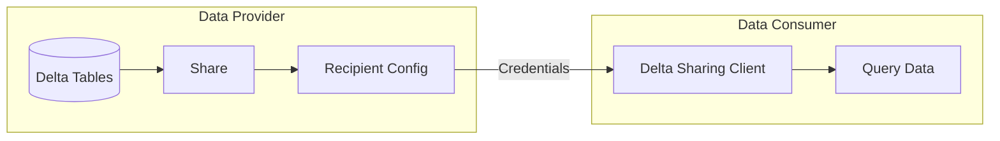
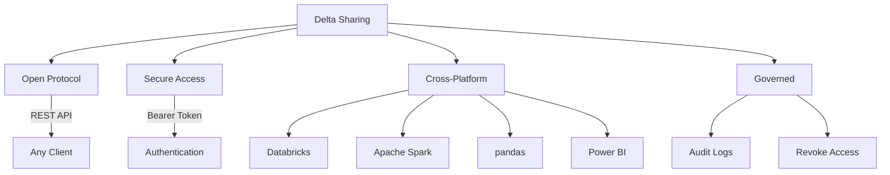
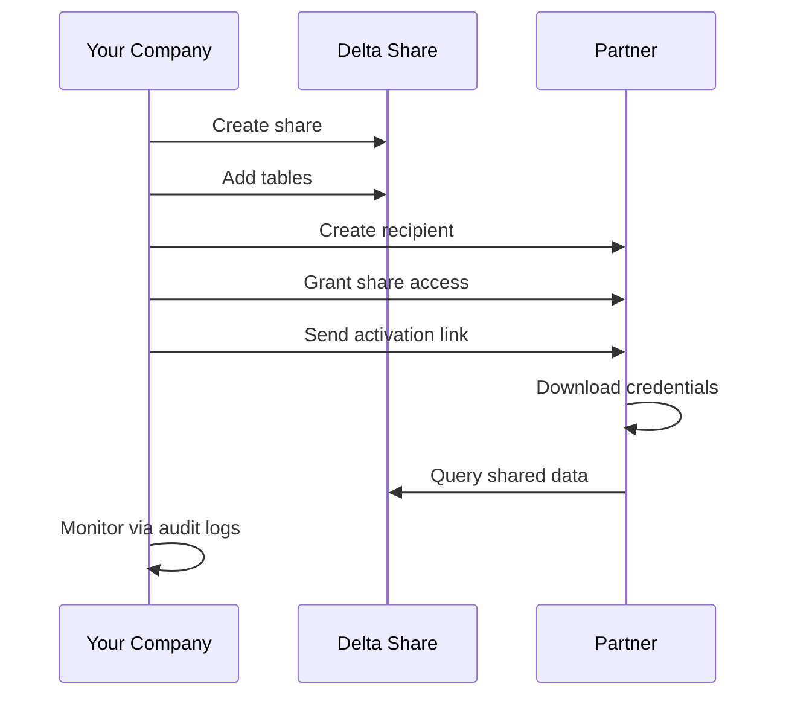
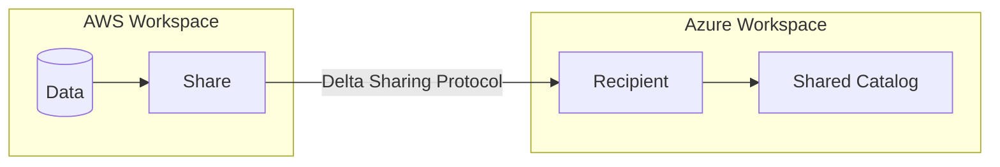

# Data Sharing

Delta Sharing is an open protocol for secure data sharing across organizations and platforms. It enables sharing data without copying, while maintaining governance and audit capabilities.

## Overview



## Delta Sharing Architecture

### Components

| Component | Description |
| :--- | :--- |
| Share | Named collection of tables/schemas to share |
| Recipient | Entity authorized to access shares |
| Provider | Organization sharing data |
| Consumer | Organization receiving shared data |

### Protocol Features



## Creating Shares

### Basic Share Creation

```sql
-- Create a share
CREATE SHARE customer_data_share;

-- Create share with comment
CREATE SHARE sales_insights
COMMENT 'Monthly sales data for partners';

-- List shares
SHOW SHARES;

-- Describe share
DESCRIBE SHARE customer_data_share;
```

### Adding Tables to Shares

```sql
-- Add table to share
ALTER SHARE customer_data_share
ADD TABLE prod.gold.customers;

-- Add table with alias (recipients see different name)
ALTER SHARE customer_data_share
ADD TABLE prod.gold.customers AS customers_v2;

-- Add multiple tables
ALTER SHARE customer_data_share
ADD TABLE prod.gold.orders;

ALTER SHARE customer_data_share
ADD TABLE prod.gold.products;

-- Add entire schema
ALTER SHARE customer_data_share
ADD SCHEMA prod.gold;

-- Add table with partition filter (share subset)
ALTER SHARE regional_data
ADD TABLE prod.gold.sales
WITH PARTITION (region = 'US');

-- Remove table from share
ALTER SHARE customer_data_share
REMOVE TABLE prod.gold.orders;
```

### Share with History (Change Data Feed)

```sql
-- Enable history sharing for CDC
ALTER SHARE customer_data_share
ADD TABLE prod.gold.customers
WITH HISTORY;

-- Recipients can query changes
-- SELECT * FROM customers_shared VERSION AS OF 5;
-- SELECT * FROM table_changes('customers_shared', 1, 5);
```

## Managing Recipients

### Creating Recipients

```sql
-- Create recipient (Databricks-to-Databricks)
CREATE RECIPIENT partner_analytics
USING ID 'aws:us-west-2:12345678-1234-1234-1234-123456789012';

-- Create recipient with comment
CREATE RECIPIENT acme_corp
COMMENT 'Acme Corporation data science team'
USING ID 'azure:eastus:abc12345-1234-1234-1234-123456789012';

-- Create recipient for non-Databricks (open sharing)
CREATE RECIPIENT external_partner;
-- This generates a credential file for download
```

### Sharing Credentials

```sql
-- Get activation link for open sharing recipient
DESCRIBE RECIPIENT external_partner;
-- Returns activation_link for credential download

-- Rotate recipient token
ALTER RECIPIENT external_partner ROTATE TOKEN;
```

### Granting Share Access

```sql
-- Grant share to recipient
GRANT SELECT ON SHARE customer_data_share TO RECIPIENT partner_analytics;

-- Grant multiple shares
GRANT SELECT ON SHARE customer_data_share TO RECIPIENT acme_corp;
GRANT SELECT ON SHARE sales_insights TO RECIPIENT acme_corp;

-- List recipient grants
SHOW GRANTS TO RECIPIENT partner_analytics;

-- Revoke access
REVOKE SELECT ON SHARE customer_data_share FROM RECIPIENT partner_analytics;
```

### Viewing Recipients

```sql
-- List all recipients
SHOW RECIPIENTS;

-- Describe recipient
DESCRIBE RECIPIENT partner_analytics;

-- Show shares granted to recipient
SHOW GRANTS TO RECIPIENT partner_analytics;
```

## Consuming Shared Data

### Databricks-to-Databricks

```sql
-- Create catalog from share (provider shares with your workspace)
CREATE CATALOG shared_customer_data
USING SHARE provider_name.customer_data_share;

-- Query shared data like normal tables
SELECT * FROM shared_customer_data.default.customers;

-- List shared catalogs
SHOW CATALOGS;
```

### Using Credentials File (Open Sharing)

```python

# Install delta-sharing library
# pip install delta-sharing

import delta_sharing

# Load the credential file

profile_path = "/path/to/config.share"

# List available shares

shares = delta_sharing.list_shares(profile_path)

# List tables in share

tables = delta_sharing.list_all_tables(profile_path)

# Load table as pandas DataFrame

df = delta_sharing.load_as_pandas(f"{profile_path}#share_name.schema_name.table_name")

# Load as Spark DataFrame

df = delta_sharing.load_as_spark(f"{profile_path}#share_name.schema_name.table_name")
```

### Credential File Format

```json
{
  "shareCredentialsVersion": 1,
  "endpoint": "https://sharing.databricks.com/delta-sharing/",
  "bearerToken": "xxxxxxxxxxxxxxxx"
}
```

### Power BI Integration

```text
1. Download credential file from provider
2. In Power BI:
   - Get Data → Delta Sharing
   - Provide credential file path
   - Select tables to import
```

## Sharing Patterns

### Partner Data Exchange



```sql
-- Provider setup
CREATE SHARE partner_exchange;

ALTER SHARE partner_exchange
ADD TABLE prod.gold.public_metrics;

ALTER SHARE partner_exchange
ADD TABLE prod.gold.benchmarks;

CREATE RECIPIENT partner_company;

GRANT SELECT ON SHARE partner_exchange TO RECIPIENT partner_company;

-- Get activation link
DESCRIBE RECIPIENT partner_company;
```

### Internal Team Sharing

```sql
-- Share across workspaces in same account
CREATE SHARE team_shared_data;

ALTER SHARE team_shared_data
ADD SCHEMA prod.gold;

-- Create recipient for other workspace
CREATE RECIPIENT data_science_ws
USING ID 'databricks:workspace:12345';

GRANT SELECT ON SHARE team_shared_data TO RECIPIENT data_science_ws;
```

### Filtered Sharing (Multi-Tenant)

```sql
-- Share different partitions to different recipients
CREATE SHARE us_customer_data;
ALTER SHARE us_customer_data
ADD TABLE prod.gold.customers
WITH PARTITION (country = 'US');

CREATE SHARE eu_customer_data;
ALTER SHARE eu_customer_data
ADD TABLE prod.gold.customers
WITH PARTITION (country IN ('DE', 'FR', 'GB'));

-- Different recipients for each region
GRANT SELECT ON SHARE us_customer_data TO RECIPIENT us_partner;
GRANT SELECT ON SHARE eu_customer_data TO RECIPIENT eu_partner;
```

## Share Governance

### Auditing Share Access

```sql
-- Query audit logs for sharing activity
SELECT
    event_time,
    user_identity.email,
    action_name,
    request_params.share_name,
    request_params.recipient_name,
    response.status_code
FROM system.access.audit
WHERE service_name = 'unityCatalog'
    AND action_name LIKE '%Share%'
ORDER BY event_time DESC;

-- Track recipient queries
SELECT
    event_time,
    request_params.recipient_name,
    request_params.share_name,
    request_params.table_name
FROM system.access.audit
WHERE action_name = 'deltaSharingQueryTable'
ORDER BY event_time DESC;
```

### Managing Share Lifecycle

```sql
-- Disable recipient access temporarily
ALTER RECIPIENT partner_analytics SET OWNER TO `admin-group`;
-- Then revoke specific share access

-- Re-enable access
GRANT SELECT ON SHARE customer_data_share TO RECIPIENT partner_analytics;

-- Permanently remove recipient
DROP RECIPIENT partner_analytics;

-- Drop share (removes all recipient access)
DROP SHARE customer_data_share;
```

### Share Versioning

```sql
-- Share with history enables version queries
ALTER SHARE customer_data_share
ADD TABLE prod.gold.customers
WITH HISTORY;

-- Recipient can query historical versions
-- (In recipient's environment)
SELECT * FROM shared_catalog.schema.customers VERSION AS OF 10;

-- Query changes between versions
SELECT * FROM table_changes('shared_catalog.schema.customers', 5, 10);
```

## Marketplace (Databricks Marketplace)

### Publishing to Marketplace

```sql
-- Create listing (via UI primarily)
-- 1. Create share with tables
-- 2. Create listing in Marketplace
-- 3. Set listing visibility (public/private)
-- 4. Add documentation and terms
```

### Consuming from Marketplace

```sql
-- Browse and request access via UI
-- Once approved, create catalog from listing

-- Query marketplace data
SELECT * FROM marketplace_catalog.schema.table_name;
```

## Cross-Cloud Sharing

### Sharing Across Clouds



```sql
-- AWS provider creates share
CREATE SHARE cross_cloud_data;
ALTER SHARE cross_cloud_data ADD TABLE prod.analytics.metrics;

-- Create recipient with Azure identifier
CREATE RECIPIENT azure_team
USING ID 'azure:eastus:workspace-id';

GRANT SELECT ON SHARE cross_cloud_data TO RECIPIENT azure_team;

-- Azure consumer creates catalog
CREATE CATALOG aws_shared_data
USING SHARE aws_account.cross_cloud_data;
```

## Security Considerations

### Share Access Security

| Aspect | Implementation |
| :--- | :--- |
| Authentication | Bearer token (auto-rotated) |
| Authorization | GRANT/REVOKE at share level |
| Network | HTTPS only |
| Audit | Full audit logging |
| Data | Never copied, read from source |

### Best Practices

```sql
-- Use partition filters to limit data exposure
ALTER SHARE partner_share
ADD TABLE prod.gold.transactions
WITH PARTITION (year = 2024);

-- Create views for additional filtering
CREATE VIEW prod.gold.sharable_customers AS
SELECT customer_id, name, city, state
FROM prod.gold.customers
WHERE consent_to_share = true;

ALTER SHARE partner_share
ADD TABLE prod.gold.sharable_customers;

-- Regular access review
SHOW GRANTS TO RECIPIENT partner_analytics;
```

## Use Cases

### Data Monetization

```sql
-- Create tiered data products
CREATE SHARE basic_tier;
ALTER SHARE basic_tier ADD TABLE prod.gold.public_aggregates;

CREATE SHARE premium_tier;
ALTER SHARE premium_tier ADD TABLE prod.gold.public_aggregates;
ALTER SHARE premium_tier ADD TABLE prod.gold.detailed_metrics WITH HISTORY;

-- Different pricing per tier
GRANT SELECT ON SHARE basic_tier TO RECIPIENT customer_basic;
GRANT SELECT ON SHARE premium_tier TO RECIPIENT customer_premium;
```

### Regulatory Reporting

```sql
-- Share compliance data with regulators
CREATE SHARE regulatory_reports;

ALTER SHARE regulatory_reports
ADD TABLE prod.compliance.annual_report;

ALTER SHARE regulatory_reports
ADD TABLE prod.compliance.quarterly_metrics
WITH PARTITION (quarter = '2024-Q1');

CREATE RECIPIENT federal_regulator;
GRANT SELECT ON SHARE regulatory_reports TO RECIPIENT federal_regulator;
```

## Common Issues & Errors

### Recipient Cannot Access Share

**Scenario:** Recipient gets authentication error.

**Fix:** Verify recipient configuration and grant:

```sql
-- Check recipient status
DESCRIBE RECIPIENT partner_analytics;

-- Verify grant exists
SHOW GRANTS TO RECIPIENT partner_analytics;

-- Re-grant if needed
GRANT SELECT ON SHARE customer_data_share TO RECIPIENT partner_analytics;
```

### Table Not Visible in Share

**Scenario:** Table added to share but recipient can't see it.

**Fix:** Verify table is properly added:

```sql
-- Check share contents
DESCRIBE SHARE customer_data_share;

-- Verify table was added
SHOW ALL IN SHARE customer_data_share;

-- Re-add table if needed
ALTER SHARE customer_data_share ADD TABLE prod.gold.customers;
```

### Credential File Expired

**Scenario:** Open sharing recipient's token expired.

**Fix:** Rotate token:

```sql
ALTER RECIPIENT external_partner ROTATE TOKEN;
-- Send new activation link to recipient
DESCRIBE RECIPIENT external_partner;
```

### Partition Filter Not Working

**Scenario:** Recipient sees all data despite partition filter.

**Fix:** Verify partition column and values:

```sql
-- Check partition specification
DESCRIBE SHARE regional_data;

-- Re-add with correct partition
ALTER SHARE regional_data REMOVE TABLE prod.gold.sales;
ALTER SHARE regional_data
ADD TABLE prod.gold.sales
WITH PARTITION (region = 'US');
```

## Exam Tips

1. **Delta Sharing protocol** - Open protocol, REST API, cross-platform
2. **Share components** - Share contains tables, recipient accesses shares
3. **Recipient types** - Databricks (cloud ID) or open sharing (credential file)
4. **GRANT syntax** - GRANT SELECT ON SHARE ... TO RECIPIENT ...
5. **Partition filtering** - Share subsets with WITH PARTITION clause
6. **History sharing** - WITH HISTORY enables time travel for recipients
7. **Audit logs** - All sharing activity logged in system.access.audit
8. **No data copy** - Data stays at source, accessed via protocol
9. **Token rotation** - ALTER RECIPIENT ... ROTATE TOKEN
10. **Cross-cloud** - Works across AWS, Azure, GCP

## Key Takeaways

- **Delta Sharing is an open protocol**: data never moves — the consumer reads directly from the provider's storage via a REST API using a bearer token; no data duplication occurs
- **Share components**: a Share is a named collection of tables/schemas; a Recipient is an entity authorized to access a share; access is granted with `GRANT SELECT ON SHARE <share> TO RECIPIENT <recipient>`
- **Recipient types**: Databricks-to-Databricks sharing uses a cloud identifier (`USING ID`); open sharing for non-Databricks clients generates a credential `.share` JSON file with a bearer token
- **Partition filtering in shares**: `ALTER SHARE ... ADD TABLE ... WITH PARTITION (col = 'value')` restricts the recipient to only seeing the matching partition — used for multi-tenant or regional data isolation
- **History sharing**: `ALTER SHARE ... ADD TABLE ... WITH HISTORY` lets recipients query historical versions and change data feed (`VERSION AS OF`, `table_changes()`)
- **Consumer workflow (Databricks-to-Databricks)**: consumer creates a catalog from the share with `CREATE CATALOG ... USING SHARE provider.share_name` and then queries it like any other catalog
- **Token rotation**: `ALTER RECIPIENT ... ROTATE TOKEN` regenerates the bearer token for open sharing recipients; useful for security rotation without removing and recreating the recipient
- **Audit trail**: sharing activity is logged in `system.access.audit` with `action_name LIKE '%Share%'` and `action_name = 'deltaSharingQueryTable'` for recipient query tracking

## Related Topics

- [Unity Catalog](01-unity-catalog.md) - Governance foundation
- [Access Control](02-access-control.md) - Internal access patterns
- [Secret Management](04-secret-management.md) - Credential security

## Official Documentation

- [Delta Sharing](https://docs.databricks.com/data-sharing/index.html)
- [Create and Manage Shares](https://docs.databricks.com/data-sharing/create-share.html)
- [Create and Manage Recipients](https://docs.databricks.com/data-sharing/create-recipient.html)
- [Delta Sharing Protocol](https://github.com/delta-io/delta-sharing)

---

**[← Previous: Access Control](./02-access-control.md) | [↑ Back to Security & Governance](./README.md) | [Next: Secret Management](./04-secret-management.md) →**
