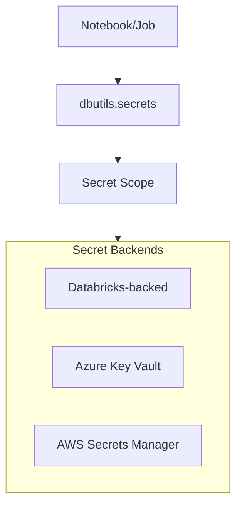

# Secret Management

Secure credential management is essential for production data pipelines. Databricks provides secret scopes to store and access sensitive information like passwords, API keys, and connection strings without exposing them in code.

## Overview



## Secret Scope Types

| Type | Backend | Management | Best For |
| :--- | :--- | :--- | :--- |
| Databricks-backed | Databricks internal storage | Databricks CLI/API | Quick setup, simple use cases |
| Azure Key Vault-backed | Azure Key Vault | Azure portal + Databricks | Enterprise Azure, centralized secrets |
| AWS Secrets Manager | AWS Secrets Manager | AWS console + Databricks | Enterprise AWS, centralized secrets |

## Databricks-Backed Scopes

### Creating Scopes

```bash
# Create scope via CLI

databricks secrets create-scope --scope my-scope

# Create scope with initial manage principal

databricks secrets create-scope --scope team-secrets --initial-manage-principal users
```

```python
# Via REST API

import requests

response = requests.post(
    f"{workspace_url}/api/2.0/secrets/scopes/create",
    headers={"Authorization": f"Bearer {token}"},
    json={"scope": "my-scope"}
)
```

### Managing Secrets

```bash
# Add/update secret

databricks secrets put --scope my-scope --key db-password --string-value "secret123"

# Add secret from file

databricks secrets put --scope my-scope --key ssh-key --binary-file ./id_rsa

# List secrets in scope (shows keys only, not values)

databricks secrets list --scope my-scope

# Delete secret

databricks secrets delete --scope my-scope --key db-password

# Delete scope

databricks secrets delete-scope --scope my-scope
```

### Scope ACLs

```bash
# List ACLs for scope

databricks secrets list-acls --scope my-scope

# Grant access

databricks secrets put-acl --scope my-scope --principal user@company.com --permission READ
databricks secrets put-acl --scope my-scope --principal data-engineers --permission WRITE

# Revoke access

databricks secrets delete-acl --scope my-scope --principal user@company.com
```

| Permission | Capabilities |
| :--- | :--- |
| READ | Get secret values |
| WRITE | Create/update secrets + READ |
| MANAGE | Full control including ACLs |

## Azure Key Vault-Backed Scopes

### Setup Requirements

1. Azure Key Vault with secrets
2. Databricks service principal with Key Vault access
3. Key Vault-backed scope in Databricks

### Creating Key Vault Scope

```bash
# Via CLI

databricks secrets create-scope \
    --scope azure-kv-scope \
    --scope-backend-type AZURE_KEYVAULT \
    --resource-id /subscriptions/<subscription-id>/resourceGroups/<rg>/providers/Microsoft.KeyVault/vaults/<vault-name> \
    --dns-name https://<vault-name>.vault.azure.net/

# The scope automatically syncs with Key Vault

```

### Key Vault Configuration

```text
Azure Key Vault Setup:
1. Create Key Vault in Azure portal
2. Add secrets to Key Vault
3. Grant Databricks managed identity or service principal:
   - Key Vault Secrets User role (read secrets)
   - Or configure Access Policies with Get secret permission
4. Create scope in Databricks pointing to Key Vault
```

## AWS Secrets Manager

### Integration Pattern

```python

# AWS Secrets Manager integration via IAM role

# Option 1: Instance profile with Secrets Manager access
# Cluster has IAM role that can access Secrets Manager

import boto3
import json

def get_secret(secret_name, region_name="us-east-1"):
    client = boto3.client("secretsmanager", region_name=region_name)
    response = client.get_secret_value(SecretId=secret_name)

    if "SecretString" in response:
        return json.loads(response["SecretString"])
    else:
        return response["SecretBinary"]

# Usage

db_creds = get_secret("prod/database/credentials")
password = db_creds["password"]
```

### Databricks-backed for AWS Secrets

```bash
# Create Databricks-backed scope (recommended for Databricks-native approach)

databricks secrets create-scope --scope aws-creds

# Store AWS credentials or other secrets

databricks secrets put --scope aws-creds --key api-key
```

## Accessing Secrets in Code

### dbutils.secrets API

```python
# List available scopes

scopes = dbutils.secrets.listScopes()
for scope in scopes:
    print(scope.name)

# List secrets in scope (names only)

secrets = dbutils.secrets.list("my-scope")
for secret in secrets:
    print(secret.key)

# Get secret value

password = dbutils.secrets.get(scope="my-scope", key="db-password")
api_key = dbutils.secrets.get(scope="azure-kv", key="api-key")

# Get secret as bytes (for binary secrets)

ssh_key = dbutils.secrets.getBytes(scope="my-scope", key="ssh-key")
```

### Secret Redaction

Secrets are automatically redacted in notebook output:

```python
# Secret values are redacted

password = dbutils.secrets.get("my-scope", "db-password")
print(password)  # Output: [REDACTED]

# Even in f-strings

print(f"Password is: {password}")  # Output: Password is: [REDACTED]

# In DataFrames

df = spark.createDataFrame([(password,)], ["secret"])
df.show()  # Shows [REDACTED]
```

### When Redaction Doesn't Work

```python
# Redaction doesn't work if you transform the secret

password = dbutils.secrets.get("my-scope", "db-password")

# These may expose the secret - AVOID!

print(password[0:5])  # Partial string - NOT redacted
print(list(password))  # Converted to list - NOT redacted
print(password.encode())  # Encoded - NOT redacted
```

## Common Use Cases

### Database Connections

```python
# Get database credentials

host = dbutils.secrets.get("db-scope", "host")
port = dbutils.secrets.get("db-scope", "port")
database = dbutils.secrets.get("db-scope", "database")
username = dbutils.secrets.get("db-scope", "username")
password = dbutils.secrets.get("db-scope", "password")

# JDBC connection

jdbc_url = f"jdbc:postgresql://{host}:{port}/{database}"

df = (spark.read
    .format("jdbc")
    .option("url", jdbc_url)
    .option("dbtable", "public.customers")
    .option("user", username)
    .option("password", password)
    .load())
```

### API Authentication

```python
import requests

# Get API key from secrets

api_key = dbutils.secrets.get("api-scope", "external-api-key")

# Use in API call

headers = {"Authorization": f"Bearer {api_key}"}
response = requests.get("https://api.example.com/data", headers=headers)
```

### Cloud Storage Credentials

```python
# Set Spark config with secrets

storage_account = "mystorageaccount"
access_key = dbutils.secrets.get("azure-scope", "storage-access-key")

spark.conf.set(
    f"fs.azure.account.key.{storage_account}.blob.core.windows.net",
    access_key
)

# Now can access storage

df = spark.read.format("parquet").load(
    f"wasbs://container@{storage_account}.blob.core.windows.net/data/"
)
```

### Service Principal Credentials

```python
# Azure service principal authentication

client_id = dbutils.secrets.get("azure-scope", "sp-client-id")
client_secret = dbutils.secrets.get("azure-scope", "sp-client-secret")
tenant_id = dbutils.secrets.get("azure-scope", "tenant-id")

# Configure for ADLS Gen2

spark.conf.set("fs.azure.account.auth.type", "OAuth")
spark.conf.set("fs.azure.account.oauth.provider.type",
    "org.apache.hadoop.fs.azurebfs.oauth2.ClientCredsTokenProvider")
spark.conf.set("fs.azure.account.oauth2.client.id", client_id)
spark.conf.set("fs.azure.account.oauth2.client.secret", client_secret)
spark.conf.set("fs.azure.account.oauth2.client.endpoint",
    f"https://login.microsoftonline.com/{tenant_id}/oauth2/token")
```

## Secrets in Job Parameters

### Referencing Secrets in Jobs

```python

# In job configuration, reference secrets
# Notebook parameter: {{secrets/my-scope/db-password}}

# In notebook, access via widget or directly

password = dbutils.widgets.get("password")
# or

password = dbutils.secrets.get("my-scope", "db-password")
```

### Job Configuration Example

```json
{
  "name": "ETL Job",
  "tasks": [{
    "task_key": "extract",
    "notebook_task": {
      "notebook_path": "/Jobs/extract",
      "base_parameters": {
        "db_host": "{{secrets/db-scope/host}}",
        "db_password": "{{secrets/db-scope/password}}"
      }
    }
  }]
}
```

## Best Practices

### Scope Organization

```text
Recommended scope structure:
├── prod-database           # Production database credentials
├── dev-database            # Development database credentials
├── azure-storage           # Azure storage keys
├── api-keys               # External API keys
├── service-principals     # SP credentials
└── team-secrets           # Team-specific secrets
```

### Access Control Pattern

```bash
# Production: Limited access

databricks secrets put-acl --scope prod-database --principal etl-service-principal --permission READ
databricks secrets put-acl --scope prod-database --principal platform-admins --permission MANAGE

# Development: Broader access

databricks secrets put-acl --scope dev-database --principal developers --permission READ
databricks secrets put-acl --scope dev-database --principal developers --permission WRITE
```

### Secret Rotation

```python
def rotate_database_password(scope, key, new_password):
    """Rotate database password and update secret."""
    # 1. Update password in target system
    # (database, API, etc.)

    # 2. Update secret in Databricks
    # Via CLI: databricks secrets put --scope {scope} --key {key}

    # 3. Verify new password works
    # Test connection

    # 4. Log rotation event
    print(f"Rotated secret {scope}/{key}")
```

## Integration with Unity Catalog

### Secrets vs Unity Catalog Credentials

| Aspect | Secrets | UC Storage Credentials |
| :--- | :--- | :--- |
| Scope | Workspace-level | Account-level (Unity Catalog) |
| Use case | Application credentials | Cloud storage access |
| Management | dbutils.secrets | Unity Catalog SQL |
| Governance | Scope ACLs | UC permissions |

### When to Use Each

```python

# Use secrets for:
# - Database passwords
# - API keys
# - Custom application credentials

password = dbutils.secrets.get("app-scope", "password")

# Use Unity Catalog for:
# - Cloud storage access (external locations)
# - Governed data access

# Storage access via UC (no secrets needed)

df = spark.read.format("delta").load("/Volumes/catalog/schema/volume/data/")
```

## Monitoring and Auditing

### Audit Secret Access

```sql
-- Query audit logs for secret access
SELECT
    event_time,
    user_identity.email,
    action_name,
    request_params.scope AS scope,
    request_params.key AS secret_key,
    response.status_code
FROM system.access.audit
WHERE service_name = 'secrets'
ORDER BY event_time DESC
LIMIT 100;

-- Track who accessed specific scope
SELECT
    user_identity.email,
    COUNT(*) AS access_count,
    MAX(event_time) AS last_access
FROM system.access.audit
WHERE service_name = 'secrets'
    AND request_params.scope = 'prod-database'
    AND action_name = 'getSecret'
GROUP BY user_identity.email;
```

## Common Issues & Errors

### Secret Scope Not Found

**Scenario:** Scope doesn't exist or user lacks access.

```python
# Error: Secret scope 'nonexistent' not found

```

**Fix:** Verify scope exists and user has access:

```bash
databricks secrets list-scopes
databricks secrets list-acls --scope my-scope
```

### Permission Denied

**Scenario:** User can't read secrets.

**Fix:** Grant READ permission:

```bash
databricks secrets put-acl --scope my-scope --principal user@company.com --permission READ
```

### Secret Not Found in Scope

**Scenario:** Key doesn't exist in scope.

```python
# Error: Secret 'missing-key' not found in scope 'my-scope'

```

**Fix:** Verify secret exists:

```bash
databricks secrets list --scope my-scope
# Add if missing

databricks secrets put --scope my-scope --key missing-key
```

### Azure Key Vault Connection Failed

**Scenario:** Can't access Key Vault-backed scope.

**Fix:** Verify:

1. Key Vault exists and DNS name is correct
2. Service principal has Key Vault access
3. Network connectivity (private endpoints if applicable)

### Secret Value Accidentally Exposed

**Scenario:** Secret leaked in logs or output.

**Fix:**

1. Immediately rotate the secret
2. Review code for transformation of secret values
3. Ensure no `print(secret[0:n])` patterns

## Exam Tips

1. **Scope types** - Databricks-backed, Azure Key Vault, AWS Secrets Manager
2. **dbutils.secrets** - listScopes(), list(), get(), getBytes()
3. **Redaction** - Automatic in output, doesn't work on transformed values
4. **ACL permissions** - READ, WRITE, MANAGE
5. **Scope creation** - Via CLI or API, not SQL
6. **Key Vault integration** - Requires resource ID and DNS name
7. **Secret reference in jobs** - `{{secrets/scope/key}}` syntax
8. **Never hardcode** - Always use secrets for credentials
9. **Audit logs** - system.access.audit for secret access tracking
10. **UC vs Secrets** - UC for storage credentials, secrets for app credentials

## Key Takeaways

- **Secret scope types**: Databricks-backed scopes store secrets in Databricks internal storage (managed via CLI/API); Azure Key Vault-backed scopes proxy to Azure Key Vault (requires resource ID + DNS name); secret values can never be retrieved via CLI or SQL — only key names are listed
- **dbutils.secrets API**: `dbutils.secrets.listScopes()`, `.list(scope)`, `.get(scope, key)`, `.getBytes(scope, key)` — always call `.get()` in code, never hardcode credentials
- **Automatic redaction**: secret values retrieved via `dbutils.secrets.get()` are automatically displayed as `[REDACTED]` in notebook output; transformations on the secret string (slicing, encoding, joining to list) bypass redaction and may expose the value
- **Scope ACL permissions**: `READ` (get values), `WRITE` (create/update secrets + READ), `MANAGE` (full control including ACLs); created with `databricks secrets put-acl`
- **Scope creation**: scopes can only be created via the Databricks CLI (`databricks secrets create-scope`) or REST API — not via SQL
- **Job secret references**: secrets can be injected as job task parameters using `{{secrets/scope/key}}` syntax in the job configuration JSON
- **Secrets vs Unity Catalog credentials**: use Databricks secrets for application credentials (passwords, API keys); use UC storage credentials for cloud storage access paths — these are separate systems with different management
- **Audit trail**: secret access is logged in `system.access.audit` with `service_name = 'secrets'` and `action_name = 'getSecret'`; monitor for unusual patterns

## Related Topics

- [Unity Catalog](01-unity-catalog.md) - Storage credentials
- [Access Control](02-access-control.md) - Permission patterns
- [DBFS and Mounts](../02-databricks-tooling/05-dbfs-and-mounts.md) - Storage integration

## Official Documentation

- [Secret Management](https://docs.databricks.com/security/secrets/index.html)
- [Secret Scopes](https://docs.databricks.com/security/secrets/secret-scopes.html)
- [Azure Key Vault-backed Scopes](https://docs.databricks.com/security/secrets/secret-scopes.html#azure-key-vault-backed-scopes)
- [Databricks CLI Secrets](https://docs.databricks.com/dev-tools/cli/secrets-cli.html)

---

**[← Previous: Data Sharing](./03-data-sharing.md) | [↑ Back to Security & Governance](./README.md) | [Next: Audit Logging, Data Lineage & Network Security](./05-audit-lineage-network-security.md) →**
