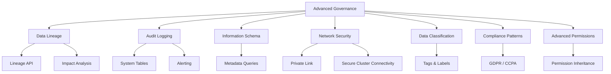
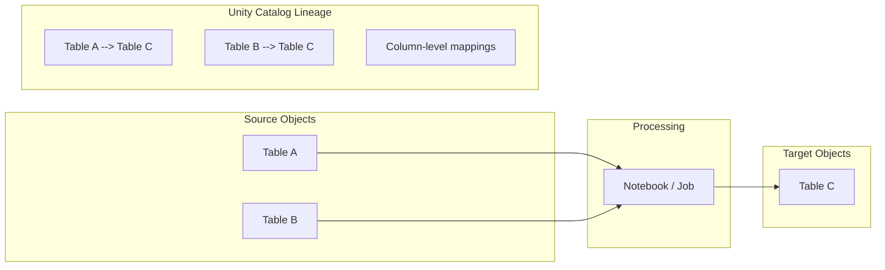
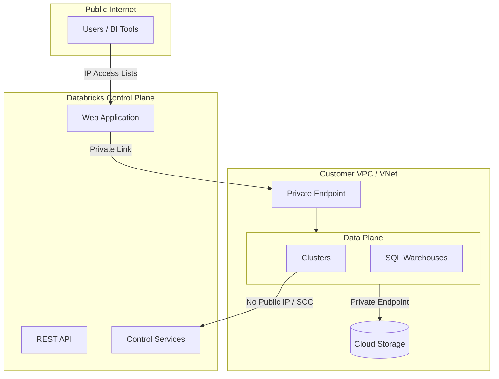

# Audit Logging, Data Lineage & Network Security

This guide covers advanced Databricks governance topics focused on observability and infrastructure security: data lineage & impact analysis, audit logging, information schema metadata queries, and network security (Private Link, Secure Cluster Connectivity).

## Overview



---

## Data Lineage and Impact Analysis

Unity Catalog automatically captures data lineage for tables, columns, notebooks, and jobs. Lineage records are created whenever data flows from one object to another through Spark queries or pipeline operations.

### How Lineage Is Captured



| Lineage Type | What Is Tracked | Automatically Captured? |
| :--- | :--- | :--- |
| Table-to-table | Which tables feed into other tables | Yes |
| Column-level | Which source columns map to target columns | Yes |
| Notebook/job | Which notebook or job produced the data | Yes |
| Cross-workspace | Lineage across workspaces sharing the same metastore | Yes |
| Dashboard | Queries powering dashboard visualizations | Yes |

### Viewing Lineage in Catalog Explorer

Lineage is visualized in the Catalog Explorer UI under the **Lineage** tab for any table or column. The graph shows upstream (sources) and downstream (consumers) in an interactive diagram.

### Lineage API (Programmatic Access)

```python
import requests

# Table lineage: get upstream and downstream tables

response = requests.get(
    f"{workspace_url}/api/2.1/unity-catalog/lineage/table-lineage",
    headers={"Authorization": f"Bearer {token}"},
    json={
        "table_name": "prod.gold.revenue"
    }
)

upstream_tables = response.json().get("upstreams", [])
downstream_tables = response.json().get("downstreams", [])

for table in upstream_tables:
    print(f"Upstream: {table['tableInfo']['name']}")

for table in downstream_tables:
    print(f"Downstream: {table['tableInfo']['name']}")
```

```python
# Column lineage: get column-level dependencies

response = requests.get(
    f"{workspace_url}/api/2.1/unity-catalog/lineage/column-lineage",
    headers={"Authorization": f"Bearer {token}"},
    json={
        "table_name": "prod.gold.revenue",
        "column_name": "total_amount"
    }
)

for col in response.json().get("upstream_cols", []):
    print(f"Source: {col['catalog']}.{col['schema']}.{col['table']}.{col['name']}")
```

### Impact Analysis

Impact analysis uses downstream lineage to understand the blast radius of a schema change (rename column, drop table, change data type).

```python
def assess_impact(workspace_url, token, table_name):
    """Identify all downstream objects affected by changes to a table."""
    response = requests.get(
        f"{workspace_url}/api/2.1/unity-catalog/lineage/table-lineage",
        headers={"Authorization": f"Bearer {token}"},
        json={"table_name": table_name}
    )

    downstreams = response.json().get("downstreams", [])
    print(f"Changing '{table_name}' affects {len(downstreams)} downstream objects:")

    for ds in downstreams:
        info = ds.get("tableInfo", {})
        print(f"  - {info.get('catalog_name')}.{info.get('schema_name')}.{info.get('name')}")
        # Also check notebook/job dependencies
        if ds.get("notebookInfos"):
            for nb in ds["notebookInfos"]:
                print(f"    Notebook: {nb.get('notebook_path')}")

# Usage

assess_impact(workspace_url, token, "prod.silver.orders")
```

### Cross-Workspace Lineage

When multiple workspaces share the same Unity Catalog metastore, lineage is tracked across workspace boundaries automatically. A pipeline in Workspace A that reads from `prod.bronze.events` and writes to `prod.silver.events_cleaned` is captured the same way regardless of which workspace runs the job.

### Column-Level Lineage

Column-level lineage tracks how individual columns are derived:

```sql
-- Example: column lineage is captured automatically
CREATE OR REPLACE TABLE prod.gold.revenue AS
SELECT
    o.order_date,
    c.region,
    SUM(o.amount) AS total_revenue  -- lineage: amount -> total_revenue
FROM prod.silver.orders o
JOIN prod.silver.customers c
    ON o.customer_id = c.customer_id
GROUP BY o.order_date, c.region;

-- In Catalog Explorer, the column "total_revenue" will show
-- lineage back to prod.silver.orders.amount
-- The column "region" will show lineage back to prod.silver.customers.region
```

---

## Audit Logging Deep Dive

The `system.access.audit` table captures all access events across workspaces and Unity Catalog. This is the primary tool for compliance monitoring and forensic investigation.

### Audit Table Structure

| Column | Type | Description |
| :--- | :--- | :--- |
| `event_time` | TIMESTAMP | When the event occurred |
| `event_date` | DATE | Partition column for efficient queries |
| `workspace_id` | LONG | Workspace where event happened |
| `service_name` | STRING | Service category (e.g., `unityCatalog`, `clusters`, `secrets`) |
| `action_name` | STRING | Specific action (e.g., `getTable`, `createTable`, `grant`) |
| `user_identity` | STRUCT | Contains `email` and other identity fields |
| `request_params` | MAP | Parameters of the request (table name, etc.) |
| `response` | STRUCT | Contains `status_code` and `error_message` |
| `audit_level` | STRING | `ACCOUNT_LEVEL` or `WORKSPACE_LEVEL` |
| `account_id` | STRING | Databricks account ID |
| `source_ip_address` | STRING | IP address of the requester |

### Audit Event Categories

| Category | Service Name | Example Actions |
| :--- | :--- | :--- |
| Workspace events | `workspace`, `clusters`, `jobs` | Login, cluster create, job run |
| Account events | `accounts`, `iam` | User provisioning, group management |
| Unity Catalog events | `unityCatalog` | getTable, createTable, grant, revoke |
| Secret events | `secrets` | getSecret, createScope |
| SQL Warehouse events | `databrickssql` | Query execution, warehouse start/stop |

### Common Audit Queries

#### Who Accessed PII Tables?

```sql
-- Identify all users who accessed tables tagged or known to contain PII
SELECT
    event_date,
    user_identity.email AS user_email,
    action_name,
    request_params.full_name_arg AS table_name,
    source_ip_address,
    response.status_code
FROM system.access.audit
WHERE action_name IN ('getTable', 'selectFromTable', 'commandSubmit')
    AND request_params.full_name_arg IN (
        'prod.sensitive.customers_pii',
        'prod.sensitive.employee_records',
        'prod.sensitive.payment_info'
    )
    AND event_date >= current_date() - 30
ORDER BY event_time DESC;
```

#### Which Users Created or Deleted Tables?

```sql
-- Track table creation and deletion events
SELECT
    event_time,
    user_identity.email AS user_email,
    action_name,
    request_params.full_name_arg AS table_name,
    request_params.table_type AS table_type,
    response.status_code
FROM system.access.audit
WHERE action_name IN ('createTable', 'deleteTable', 'dropTable')
    AND event_date >= current_date() - 90
ORDER BY event_time DESC;
```

#### Failed Access Attempts

```sql
-- Detect potential unauthorized access attempts
SELECT
    event_date,
    user_identity.email AS user_email,
    action_name,
    request_params.full_name_arg AS target_object,
    response.status_code,
    response.error_message,
    source_ip_address,
    COUNT(*) AS failure_count
FROM system.access.audit
WHERE response.status_code >= 400
    AND service_name = 'unityCatalog'
    AND event_date >= current_date() - 7
GROUP BY ALL
HAVING failure_count >= 3
ORDER BY failure_count DESC;
```

#### Permission Changes Over Time

```sql
-- Audit all GRANT and REVOKE operations
SELECT
    event_time,
    user_identity.email AS changed_by,
    action_name,
    request_params.securable_type AS object_type,
    request_params.full_name_arg AS object_name,
    request_params.principal AS grantee,
    request_params.privilege AS privilege,
    response.status_code
FROM system.access.audit
WHERE action_name IN ('grant', 'revoke', 'updatePermissions')
    AND event_date >= current_date() - 30
ORDER BY event_time DESC;
```

### Audit Log Retention and Archival

| Aspect | Details |
| :--- | :--- |
| Default retention | 365 days in `system.access.audit` |
| Storage | Stored in system tables, managed by Databricks |
| Archival strategy | Copy to your own Delta table for longer retention |
| Partitioning | By `event_date` for efficient queries |

```sql
-- Archive audit logs to your own table for extended retention
CREATE TABLE IF NOT EXISTS prod.compliance.audit_archive
USING DELTA
PARTITIONED BY (event_date)
AS SELECT * FROM system.access.audit WHERE 1=0;

-- Daily archival job
INSERT INTO prod.compliance.audit_archive
SELECT *
FROM system.access.audit
WHERE event_date = current_date() - 1
    AND event_date NOT IN (
        SELECT DISTINCT event_date FROM prod.compliance.audit_archive
    );
```

### Creating Alerts on Audit Events

```sql
-- Create a view for suspicious activity (use with Databricks SQL Alerts)
CREATE OR REPLACE VIEW prod.compliance.suspicious_activity AS
SELECT
    event_time,
    user_identity.email AS user_email,
    action_name,
    request_params.full_name_arg AS object_name,
    source_ip_address,
    response.error_message
FROM system.access.audit
WHERE event_date >= current_date() - 1
    AND (
        -- Multiple failed access attempts
        (response.status_code >= 400 AND action_name LIKE '%Table%')
        -- Permission escalation
        OR action_name IN ('grant', 'updatePermissions')
        -- Sensitive table access outside business hours
        OR (
            request_params.full_name_arg LIKE '%pii%'
            AND (HOUR(event_time) < 6 OR HOUR(event_time) > 22)
        )
    );

-- Set up a Databricks SQL Alert on this view
-- Alert condition: COUNT(*) > 0
-- Notification: email or Slack webhook
```

---

## Information Schema

The `system.information_schema` provides metadata about all Unity Catalog objects. It follows the SQL standard and enables compliance reporting and programmatic governance.

### Key Information Schema Tables

| Table | Description |
| :--- | :--- |
| `catalogs` | All catalogs visible to the current user |
| `schemata` | All schemas (databases) |
| `tables` | All tables and views |
| `columns` | All columns with data types |
| `table_privileges` | Grants on tables |
| `schema_privileges` | Grants on schemas |
| `catalog_privileges` | Grants on catalogs |
| `views` | View definitions |
| `routines` | Functions and procedures |

### Querying Catalogs and Schemas

```sql
-- List all catalogs with metadata
SELECT
    catalog_name,
    catalog_owner,
    comment,
    created,
    last_altered
FROM system.information_schema.catalogs
ORDER BY catalog_name;

-- List all schemas in a catalog
SELECT
    catalog_name,
    schema_name,
    schema_owner,
    comment,
    created
FROM system.information_schema.schemata
WHERE catalog_name = 'prod'
ORDER BY schema_name;
```

### Querying Tables and Columns

```sql
-- Find all tables in the gold layer
SELECT
    table_catalog,
    table_schema,
    table_name,
    table_type,
    table_owner,
    comment,
    created,
    last_altered
FROM system.information_schema.tables
WHERE table_schema = 'gold'
    AND table_catalog = 'prod'
ORDER BY table_name;

-- Find all columns with their data types
SELECT
    table_catalog,
    table_schema,
    table_name,
    column_name,
    data_type,
    is_nullable,
    ordinal_position,
    comment
FROM system.information_schema.columns
WHERE table_catalog = 'prod'
    AND table_schema = 'gold'
    AND table_name = 'customers'
ORDER BY ordinal_position;
```

### Querying Privileges for Compliance

```sql
-- Report: Who has access to what tables?
SELECT
    grantor,
    grantee,
    table_catalog,
    table_schema,
    table_name,
    privilege_type,
    is_grantable
FROM system.information_schema.table_privileges
WHERE table_catalog = 'prod'
ORDER BY grantee, table_name;

-- Report: All schema-level privileges
SELECT
    grantor,
    grantee,
    catalog_name,
    schema_name,
    privilege_type
FROM system.information_schema.schema_privileges
WHERE catalog_name = 'prod'
ORDER BY grantee, schema_name;

-- Find tables with no explicit grants (potential orphans)
SELECT
    t.table_catalog,
    t.table_schema,
    t.table_name,
    t.table_owner
FROM system.information_schema.tables t
LEFT JOIN system.information_schema.table_privileges p
    ON t.table_catalog = p.table_catalog
    AND t.table_schema = p.table_schema
    AND t.table_name = p.table_name
WHERE p.grantee IS NULL
    AND t.table_catalog = 'prod';
```

### Object Ownership Report

```sql
-- Report: All objects and their owners
SELECT
    table_catalog AS catalog,
    table_schema AS schema,
    table_name AS object_name,
    table_type AS object_type,
    table_owner AS owner,
    created,
    last_altered
FROM system.information_schema.tables
WHERE table_catalog = 'prod'
ORDER BY table_owner, table_schema, table_name;
```

### DESCRIBE and SHOW Commands

```sql
-- DESCRIBE commands for governance
DESCRIBE CATALOG prod;
DESCRIBE SCHEMA prod.gold;
DESCRIBE TABLE EXTENDED prod.gold.customers;
DESCRIBE FUNCTION prod.functions.mask_email;

-- SHOW commands for discovery
SHOW CATALOGS;
SHOW SCHEMAS IN prod;
SHOW TABLES IN prod.gold;
SHOW VIEWS IN prod.gold;
SHOW FUNCTIONS IN prod.functions;
SHOW GRANTS ON TABLE prod.gold.customers;
SHOW GRANTS TO `data-analysts`;
```

---

## Network Security

Network security controls how data flows between Databricks, cloud provider infrastructure, and external networks. These configurations are critical for meeting compliance requirements.

### Network Architecture Overview



### Private Link / Private Endpoints

Private Link ensures traffic between the control plane and data plane travels over the cloud provider's backbone network, never crossing the public internet.

| Cloud | Service | Purpose |
| :--- | :--- | :--- |
| AWS | AWS PrivateLink | Control plane to data plane connectivity |
| Azure | Azure Private Link | Control plane to data plane, storage access |
| GCP | Private Service Connect | Control plane to data plane |

```text
Private Link Setup (High-Level):
1. Create VPC/VNet endpoint for Databricks control plane
2. Create VPC/VNet endpoint for storage (S3/ADLS/GCS)
3. Configure Databricks workspace to use private endpoints
4. Disable public network access (optional but recommended)
5. Validate connectivity from clusters to control plane
```

### Secure Cluster Connectivity (SCC / No Public IP)

SCC ensures that cluster nodes have no public IP addresses. All communication between clusters and the Databricks control plane is initiated outbound through a secure tunnel.

| Aspect | With SCC | Without SCC |
| :--- | :--- | :--- |
| Public IP on nodes | No | Yes |
| Control plane communication | Outbound tunnel | Inbound SSH |
| Network exposure | Minimal | Higher |
| Recommended for production | Yes | No |

```text
Enabling SCC:
- AWS: Enable "No Public IP" in workspace deployment
- Azure: Enabled by default on new workspaces
- GCP: Enable secure cluster connectivity in workspace settings
```

### IP Access Lists

IP access lists restrict which IP addresses can access the Databricks workspace (UI and API).

```python
# Configure IP access lists via REST API

import requests

# Add allowed IP range

response = requests.post(
    f"{account_url}/api/2.0/ip-access-lists",
    headers={"Authorization": f"Bearer {token}"},
    json={
        "label": "Corporate VPN",
        "list_type": "ALLOW",
        "ip_addresses": [
            "10.0.0.0/8",
            "172.16.0.0/12",
            "203.0.113.0/24"
        ]
    }
)

# Block specific IPs

response = requests.post(
    f"{account_url}/api/2.0/ip-access-lists",
    headers={"Authorization": f"Bearer {token}"},
    json={
        "label": "Blocked IPs",
        "list_type": "BLOCK",
        "ip_addresses": ["198.51.100.0/24"]
    }
)
```

### VPC/VNet Peering Patterns

VPC (AWS) or VNet (Azure) peering connects the Databricks data plane VPC to your own network for accessing on-premises data sources or other cloud services.

```text
VPC Peering Setup:
1. Create peering between Databricks VPC and your VPC
2. Update route tables in both VPCs
3. Configure security groups/NSGs to allow traffic
4. Validate connectivity (e.g., JDBC to on-prem database)
```

### Comparison: Network Connectivity Options

| Feature | Private Link | VPC Peering | Public Access |
| :--- | :--- | :--- | :--- |
| Traffic path | Cloud backbone | Cloud backbone | Internet |
| Control plane access | Private | Public (UI/API) | Public |
| Storage access | Private | Private | Public |
| Setup complexity | High | Medium | Low |
| Cost | Higher | Moderate | Lowest |
| Compliance (HIPAA/PCI) | Required | Acceptable | Not recommended |
| Data exfiltration risk | Lowest | Low | Highest |

### Network Architecture for Compliance

| Requirement | HIPAA | PCI-DSS | SOC 2 |
| :--- | :--- | :--- | :--- |
| Private Link | Required | Required | Recommended |
| SCC / No Public IP | Required | Required | Recommended |
| IP Access Lists | Required | Required | Required |
| Encryption at rest | Required | Required | Required |
| Encryption in transit | Required | Required | Required |
| Audit logging | Required | Required | Required |
| VPC isolation | Required | Required | Recommended |

## Use Cases

- **Forensic Investigation**: Using `system.access.audit` to determine exactly who deleted a critical table, transferred ownership, or changed permissions on a sensitive dataset.
- **Automated Compliance Reporting**: Querying the `system.information_schema.table_privileges` daily to ensure no unauthorized users have been granted `MODIFY` access to production tables.
- **Secure Enterprise Connectivity**: Implementing Secure Cluster Connectivity (SCC) and Private Link to ensure all data processing traffic remains on the cloud provider's private backbone, satisfying strict InfoSec requirements.

## Common Issues & Errors

### Missing Audit Logs for Long-Term Compliance

**Scenario:** An auditor requests access logs from 2 years ago, but the system table doesn't have them because the default retention is only 365 days.
**Fix:** Create a scheduled job that incrementally copies `system.access.audit` records to your own Delta table for long-term archival.

### Lineage Blind Spots

**Scenario:** Data lineage is not showing up in the Catalog Explorer for a specific set of tables.
**Fix:** Tables stored in the legacy `hive_metastore` do not support automatic lineage capture. Migrate the tables to Unity Catalog to enable lineage.

## Key Takeaways

- **Automatic lineage capture**: Unity Catalog records table-to-table, column-level, and notebook/job lineage for all queries run against UC-managed tables; tables in `hive_metastore` do NOT generate lineage
- **Column-level lineage**: tracked automatically when Spark queries create or overwrite UC tables; visible in Catalog Explorer under the Lineage tab and queryable via the REST API (`/api/2.1/unity-catalog/lineage/column-lineage`)
- **Impact analysis**: downstream lineage from the table lineage API shows the "blast radius" before a schema change — which tables, views, notebooks, and dashboards depend on a given table or column
- **Audit table structure**: `system.access.audit` is partitioned by `event_date` for performance; key columns are `service_name`, `action_name`, `user_identity.email`, `request_params`, and `response.status_code`; default retention is 365 days
- **Audit long-term archival**: `system.access.audit` retention cannot be extended in-place; create a scheduled job to copy records to your own Delta table for multi-year compliance retention
- **Information schema visibility**: `system.information_schema` tables are permission-filtered — users only see objects they have `USE CATALOG`/`USE SCHEMA` access to; compliance team needs explicit grants to query the full object inventory
- **Secure Cluster Connectivity (SCC)**: removes public IP addresses from cluster nodes; all control-plane communication is initiated outbound from the cluster through a secure tunnel; recommended for all production workloads
- **Private Link vs SCC**: Private Link routes traffic between the Databricks control plane and cloud storage over the cloud provider's private backbone (not the public internet); SCC removes public IPs from cluster nodes — both address different network threat surfaces

## Related Topics

- [Unity Catalog](01-unity-catalog.md) - Governance foundation
- [Access Control](02-access-control.md) - Row/column security
- [Secret Management](04-secret-management.md) - Audit of secret access
- [Data Classification, Compliance & Permissions](06-classification-compliance-permissions.md) - GDPR, tagging, advanced permissions

---

**[← Previous: Secret Management](./04-secret-management.md) | [↑ Back to Security & Governance](./README.md) | [Next: Data Classification, Compliance & Permissions](./06-classification-compliance-permissions.md) →**
