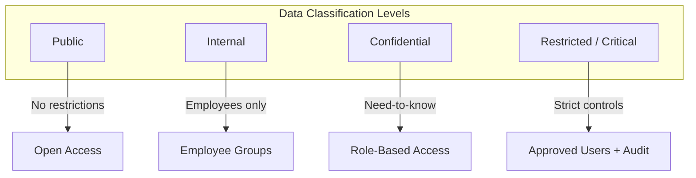
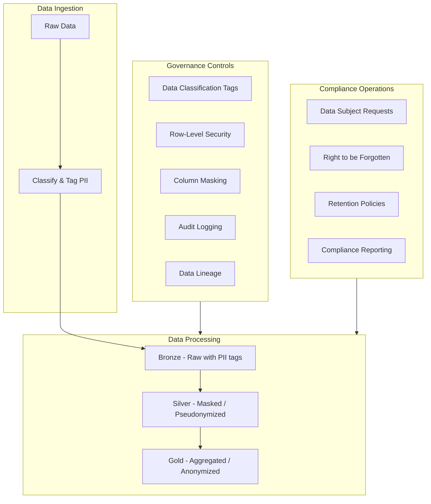
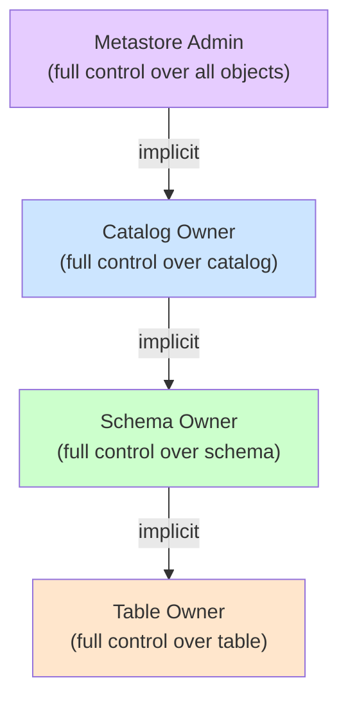
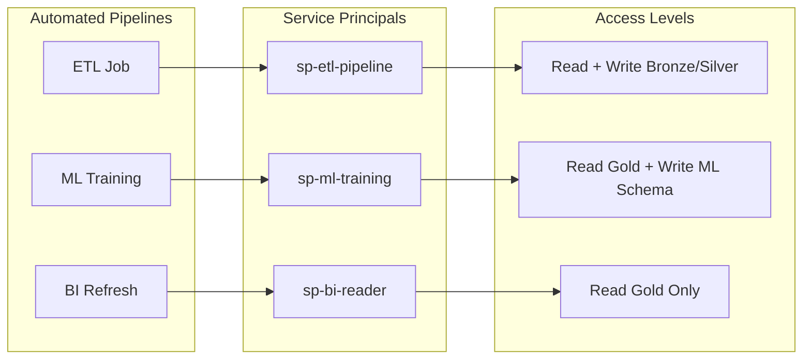

# Data Classification, Compliance & Permissions

This guide covers advanced data protection patterns: data classification & tagging, GDPR/CCPA compliance implementation, and advanced Unity Catalog permission models.

> For audit logging, lineage tracking, and network security, see [Audit Logging, Data Lineage & Network Security](./05-audit-lineage-network-security.md).

## Data Classification and Tagging

Tags on Unity Catalog objects provide a mechanism for data classification, policy enforcement, and discovery. Tags are key-value pairs attached to catalogs, schemas, tables, and columns.

### Setting Tags on Unity Catalog Objects

```sql
-- Tag a catalog
ALTER CATALOG prod SET TAGS ('environment' = 'production', 'owner_team' = 'platform');

-- Tag a schema
ALTER SCHEMA prod.sensitive SET TAGS ('data_classification' = 'confidential');

-- Tag a table
ALTER TABLE prod.gold.customers SET TAGS (
    'contains_pii' = 'true',
    'data_owner' = 'customer-team',
    'retention_days' = '730'
);

-- Tag a column
ALTER TABLE prod.gold.customers ALTER COLUMN email SET TAGS (
    'pii_type' = 'email',
    'sensitivity' = 'high'
);

ALTER TABLE prod.gold.customers ALTER COLUMN ssn SET TAGS (
    'pii_type' = 'ssn',
    'sensitivity' = 'critical',
    'mask_required' = 'true'
);

-- Remove tags
ALTER TABLE prod.gold.customers UNSET TAGS ('retention_days');
```

### Querying Tags for Compliance

```sql
-- Find all tables tagged as containing PII
SELECT
    table_catalog,
    table_schema,
    table_name,
    tag_name,
    tag_value
FROM system.information_schema.table_tags
WHERE tag_name = 'contains_pii'
    AND tag_value = 'true';

-- Find all columns tagged as sensitive
SELECT
    table_catalog,
    table_schema,
    table_name,
    column_name,
    tag_name,
    tag_value
FROM system.information_schema.column_tags
WHERE tag_name = 'sensitivity'
    AND tag_value IN ('high', 'critical');
```

### PII Classification Patterns



```sql
-- Implement classification hierarchy with tags
ALTER TABLE prod.public.product_catalog SET TAGS ('classification' = 'public');
ALTER TABLE prod.internal.employee_directory SET TAGS ('classification' = 'internal');
ALTER TABLE prod.sensitive.customer_pii SET TAGS ('classification' = 'confidential');
ALTER TABLE prod.restricted.payment_cards SET TAGS ('classification' = 'restricted');
```

### Sensitivity Labels for Columns

```sql
-- Classify columns by PII type
ALTER TABLE prod.gold.customers ALTER COLUMN first_name SET TAGS ('pii_type' = 'name');
ALTER TABLE prod.gold.customers ALTER COLUMN last_name SET TAGS ('pii_type' = 'name');
ALTER TABLE prod.gold.customers ALTER COLUMN email SET TAGS ('pii_type' = 'email');
ALTER TABLE prod.gold.customers ALTER COLUMN phone SET TAGS ('pii_type' = 'phone');
ALTER TABLE prod.gold.customers ALTER COLUMN ssn SET TAGS ('pii_type' = 'government_id');
ALTER TABLE prod.gold.customers ALTER COLUMN date_of_birth SET TAGS ('pii_type' = 'dob');
ALTER TABLE prod.gold.customers ALTER COLUMN ip_address SET TAGS ('pii_type' = 'ip_address');
```

### Automated Data Classification Approach

```python
# Automated PII detection and tagging

from pyspark.sql import functions as F

PII_PATTERNS = {
    "email": r"^[a-zA-Z0-9_.+-]+@[a-zA-Z0-9-]+\.[a-zA-Z]{2,}$",
    "ssn": r"^\d{3}-\d{2}-\d{4}$",
    "phone": r"^\+?1?\d{10,14}$",
    "credit_card": r"^\d{4}[-\s]?\d{4}[-\s]?\d{4}[-\s]?\d{4}$",
    "ip_address": r"^\d{1,3}\.\d{1,3}\.\d{1,3}\.\d{1,3}$",
}

def classify_columns(table_name, sample_size=1000):
    """Scan a table's data to detect potential PII columns."""
    df = spark.table(table_name).limit(sample_size)
    results = {}

    for col_name in df.columns:
        for pii_type, pattern in PII_PATTERNS.items():
            match_count = df.filter(
                F.col(col_name).cast("string").rlike(pattern)
            ).count()
            match_ratio = match_count / sample_size if sample_size > 0 else 0

            if match_ratio > 0.5:
                results[col_name] = pii_type
                # Apply tag
                spark.sql(f"""
                    ALTER TABLE {table_name}
                    ALTER COLUMN `{col_name}`
                    SET TAGS ('pii_type' = '{pii_type}', 'auto_classified' = 'true')
                """)

    return results

# Run classification

detected = classify_columns("prod.gold.customers")
print(f"Detected PII columns: {detected}")
```

---

## Compliance Patterns

### GDPR: Right to Be Forgotten

The General Data Protection Regulation (GDPR) requires organizations to delete personal data when a data subject requests it. With Delta Lake, this involves `DELETE` followed by `VACUUM` to permanently remove data from storage.

```sql
-- Step 1: Delete the data subject's records from all tables
DELETE FROM prod.gold.customers
WHERE customer_id = 'CUST-12345';

DELETE FROM prod.gold.orders
WHERE customer_id = 'CUST-12345';

DELETE FROM prod.gold.interactions
WHERE customer_id = 'CUST-12345';

-- Step 2: VACUUM to permanently remove deleted files
-- Default retention is 7 days; for GDPR you may need to reduce it
VACUUM prod.gold.customers RETAIN 0 HOURS;
VACUUM prod.gold.orders RETAIN 0 HOURS;
VACUUM prod.gold.interactions RETAIN 0 HOURS;
```

> [!success]- Why is VACUUM needed after DELETE?
> **Delta Lake DELETE** creates new data files without the deleted rows but keeps the old files for time travel. **VACUUM** permanently removes old files from storage. Without VACUUM, the data subject's records still exist in older file versions.

```sql
-- IMPORTANT: You must disable the safety check for RETAIN 0 HOURS
SET spark.databricks.delta.retentionDurationCheck.enabled = false;
VACUUM prod.gold.customers RETAIN 0 HOURS;
SET spark.databricks.delta.retentionDurationCheck.enabled = true;

-- WARNING: RETAIN 0 HOURS breaks time travel for all data in the table
-- Best practice: schedule GDPR deletions and VACUUM with 7-day retention
```

### GDPR Deletion Tracking

```sql
-- Track deletion requests for compliance evidence
CREATE TABLE IF NOT EXISTS prod.compliance.deletion_requests (
    request_id STRING,
    data_subject_id STRING,
    request_date DATE,
    tables_affected ARRAY<STRING>,
    deletion_completed_at TIMESTAMP,
    vacuum_completed_at TIMESTAMP,
    processed_by STRING,
    status STRING
);

-- Log a completed deletion
INSERT INTO prod.compliance.deletion_requests VALUES (
    'DEL-2025-001',
    'CUST-12345',
    '2025-06-15',
    ARRAY('prod.gold.customers', 'prod.gold.orders', 'prod.gold.interactions'),
    current_timestamp(),
    NULL,
    'gdpr-service-principal',
    'deleted_pending_vacuum'
);
```

### CCPA Data Subject Requests

California Consumer Privacy Act (CCPA) requires the ability to provide all data held about a consumer and to delete it upon request.

```sql
-- CCPA: Data Subject Access Request (DSAR) - export all data for a user
CREATE OR REPLACE TEMPORARY VIEW ccpa_export AS
SELECT 'customers' AS source_table, to_json(struct(*)) AS record_data
FROM prod.gold.customers WHERE customer_id = 'CUST-12345'
UNION ALL
SELECT 'orders', to_json(struct(*))
FROM prod.gold.orders WHERE customer_id = 'CUST-12345'
UNION ALL
SELECT 'interactions', to_json(struct(*))
FROM prod.gold.interactions WHERE customer_id = 'CUST-12345';

-- Export to a file for delivery to the data subject
-- Write to a volume for secure access
SELECT * FROM ccpa_export;
```

### Data Retention Policies with Delta Lake

```sql
-- Enforce retention by deleting data older than the retention period
DELETE FROM prod.gold.event_logs
WHERE event_date < current_date() - INTERVAL 365 DAYS;

-- Reclaim storage after deletion
VACUUM prod.gold.event_logs;

-- Set Delta table properties for automatic retention management
ALTER TABLE prod.gold.event_logs SET TBLPROPERTIES (
    'delta.logRetentionDuration' = 'interval 30 days',
    'delta.deletedFileRetentionDuration' = 'interval 7 days'
);
```

### Regulatory Compliance Architecture



### Cross-Region Data Governance

```sql
-- Ensure data residency by using region-specific catalogs
CREATE CATALOG eu_data
MANAGED LOCATION 's3://eu-west-1-bucket/eu-data/';

CREATE CATALOG us_data
MANAGED LOCATION 's3://us-east-1-bucket/us-data/';

-- Restrict who can create tables in each region
GRANT CREATE TABLE ON CATALOG eu_data TO `eu-data-engineers`;
GRANT CREATE TABLE ON CATALOG us_data TO `us-data-engineers`;

-- Views can span regions for authorized users
CREATE VIEW prod.global.all_customers AS
SELECT *, 'EU' AS data_region FROM eu_data.gold.customers
UNION ALL
SELECT *, 'US' AS data_region FROM us_data.gold.customers;
```

---

## Advanced Permission Patterns

### Permission Inheritance Model



Key inheritance rules:

| Rule | Description |
| :--- | :--- |
| Ownership cascades | Object owner has full control over all children |
| USE privilege required | Must have USE CATALOG and USE SCHEMA to access tables |
| GRANT does not cascade | Granting SELECT on a schema does NOT auto-grant on future tables in Unity Catalog (behavior differs from some RDBMS) |
| Explicit grants needed | Each level requires explicit privilege grants |

### Ownership vs Privileges

```sql
-- Ownership: full control, can grant/revoke, alter, drop
ALTER TABLE prod.gold.revenue SET OWNER TO `data-engineering-team`;

-- Privileges: specific permissions, granted by owner or admin
GRANT SELECT ON TABLE prod.gold.revenue TO `analysts`;

-- Key differences
-- Owner can do everything; privilege holders can only do what's granted
-- Only one owner per object; many principals can have privileges
-- Ownership is transferred; privileges are granted/revoked
```

| Capability | Owner | Privilege Holder |
| :--- | :--- | :--- |
| Read data | Yes | Only with SELECT |
| Modify data | Yes | Only with MODIFY |
| Grant to others | Yes | Only with GRANT OPTION |
| Drop object | Yes | No |
| Alter object | Yes | No |
| Transfer ownership | Yes | No |

### MANAGE Permission

The `MANAGE` privilege allows a principal to manage grants on an object without being the owner. This is useful for delegating governance administration.

```sql
-- Grant MANAGE on a schema (can manage grants within the schema)
GRANT MANAGE ON SCHEMA prod.gold TO `governance-admins`;

-- Now governance-admins can grant/revoke within prod.gold
-- without being the schema owner

-- MANAGE is powerful: treat it like owner-level access for permissions
```

### External Location Permissions

```sql
-- External location permission hierarchy
-- 1. Storage credential: how to authenticate
-- 2. External location: which paths are allowed
-- 3. Table/volume: the actual objects

-- Grant ability to create external tables using a location
GRANT CREATE EXTERNAL TABLE ON EXTERNAL LOCATION my_landing TO `data-engineers`;

-- Grant ability to read/write files directly
GRANT READ FILES ON EXTERNAL LOCATION my_landing TO `data-engineers`;
GRANT WRITE FILES ON EXTERNAL LOCATION my_landing TO `data-engineers`;

-- Grant ability to create external volumes
GRANT CREATE EXTERNAL VOLUME ON EXTERNAL LOCATION my_landing TO `data-engineers`;
```

### Storage Credential Security

```sql
-- Storage credentials are the most privileged objects
-- Only metastore admins should create them
CREATE STORAGE CREDENTIAL prod_s3_cred
WITH (AWS_IAM_ROLE = 'arn:aws:iam::123456789:role/databricks-prod');

-- Grant CREATE EXTERNAL LOCATION to allow teams to create
-- their own external locations using this credential
GRANT CREATE EXTERNAL LOCATION ON STORAGE CREDENTIAL prod_s3_cred
TO `platform-team`;

-- List all storage credentials
SHOW STORAGE CREDENTIALS;

-- Audit who uses a storage credential
SELECT *
FROM system.access.audit
WHERE action_name IN ('createStorageCredential', 'getStorageCredential')
    AND event_date >= current_date() - 30;
```

### Service Principal Patterns for Data Access



```sql
-- ETL service principal: broad write access
GRANT USE CATALOG ON CATALOG prod TO `sp-etl-pipeline`;
GRANT USE SCHEMA ON SCHEMA prod.bronze TO `sp-etl-pipeline`;
GRANT USE SCHEMA ON SCHEMA prod.silver TO `sp-etl-pipeline`;
GRANT SELECT, MODIFY, CREATE TABLE ON SCHEMA prod.bronze TO `sp-etl-pipeline`;
GRANT SELECT, MODIFY, CREATE TABLE ON SCHEMA prod.silver TO `sp-etl-pipeline`;

-- ML service principal: read gold, write to ML schema
GRANT USE CATALOG ON CATALOG prod TO `sp-ml-training`;
GRANT USE SCHEMA ON SCHEMA prod.gold TO `sp-ml-training`;
GRANT SELECT ON SCHEMA prod.gold TO `sp-ml-training`;
GRANT USE SCHEMA ON SCHEMA prod.ml TO `sp-ml-training`;
GRANT SELECT, MODIFY, CREATE TABLE ON SCHEMA prod.ml TO `sp-ml-training`;

-- BI service principal: read-only on gold
GRANT USE CATALOG ON CATALOG prod TO `sp-bi-reader`;
GRANT USE SCHEMA ON SCHEMA prod.gold TO `sp-bi-reader`;
GRANT SELECT ON SCHEMA prod.gold TO `sp-bi-reader`;
```

### Group-Based Access Best Practices

```sql
-- Best practice: NEVER grant directly to individual users
-- Always use groups for scalable access management

-- Anti-pattern (avoid):
GRANT SELECT ON TABLE prod.gold.revenue TO `alice@company.com`;
GRANT SELECT ON TABLE prod.gold.revenue TO `bob@company.com`;

-- Best practice (use groups):
GRANT SELECT ON TABLE prod.gold.revenue TO `finance-analysts`;
-- Add alice and bob to the finance-analysts group via SCIM/Identity Provider

-- Layered group strategy
-- Layer 1: Role groups (what they do)
--   analysts, engineers, scientists
-- Layer 2: Team groups (which team)
--   sales-team, marketing-team, finance-team
-- Layer 3: Access-level groups (how much access)
--   gold-readers, silver-writers, admin-access
```

```sql
-- Example: implementing layered group access
-- Sales analysts get read access to sales gold tables
GRANT USE CATALOG ON CATALOG prod TO `sales-analysts`;
GRANT USE SCHEMA ON SCHEMA prod.gold TO `sales-analysts`;
GRANT SELECT ON TABLE prod.gold.sales_summary TO `sales-analysts`;
GRANT SELECT ON TABLE prod.gold.sales_by_region TO `sales-analysts`;

-- Sales engineers get write access to sales silver tables
GRANT USE CATALOG ON CATALOG prod TO `sales-engineers`;
GRANT USE SCHEMA ON SCHEMA prod.silver TO `sales-engineers`;
GRANT SELECT, MODIFY, CREATE TABLE ON SCHEMA prod.silver TO `sales-engineers`;
GRANT USE SCHEMA ON SCHEMA prod.gold TO `sales-engineers`;
GRANT SELECT ON SCHEMA prod.gold TO `sales-engineers`;
```

## Use Cases

- **GDPR 'Right to be Forgotten' Fulfillment**: Automating the deletion of specific customer IDs across all Gold tables and immediately running `VACUUM` with 0 retention to permanently purge the files.
- **Automated PII Tagging**: Running a daily script that scans new tables for patterns (like emails or SSNs) and automatically applies Unity Catalog tags to classify their sensitivity for governance tracking.
- **Service Principal Pipelines**: Using service principals with minimal privileges inherited from a group to securely run automated ETL jobs without relying on an individual's personal access token.

---

## Common Issues & Errors

### Lineage Not Showing

**Scenario:** Table lineage is empty in Catalog Explorer.

**Cause:** Lineage is only captured for queries run on Unity Catalog-managed tables. Tables in `hive_metastore` do not generate lineage.

**Fix:**

```sql
-- Migrate tables to Unity Catalog
CREATE TABLE prod.silver.orders AS
SELECT * FROM hive_metastore.default.orders;

-- Run the pipeline again; lineage will now be captured
```

### Audit Logs Missing Events

**Scenario:** Cannot find expected events in `system.access.audit`.

**Fix:** Verify the correct filters:

```sql
-- Check available service names
SELECT DISTINCT service_name
FROM system.access.audit
WHERE event_date >= current_date() - 1;

-- Check available action names for a service
SELECT DISTINCT action_name
FROM system.access.audit
WHERE service_name = 'unityCatalog'
    AND event_date >= current_date() - 1;
```

### Information Schema Returns Empty Results

**Scenario:** Query returns no rows.

**Cause:** The user only sees objects they have permission to access.

**Fix:** Grant appropriate privileges or query as an admin:

```sql
-- information_schema respects permissions
-- User must have USE CATALOG / USE SCHEMA to see objects
GRANT USE CATALOG ON CATALOG prod TO `compliance-team`;
GRANT USE SCHEMA ON SCHEMA prod.gold TO `compliance-team`;
```

### Tags Not Appearing

**Scenario:** Tags set on objects are not queryable.

**Fix:** Ensure you are querying the correct system table:

```sql
-- Table tags
SELECT * FROM system.information_schema.table_tags
WHERE table_catalog = 'prod';

-- Column tags
SELECT * FROM system.information_schema.column_tags
WHERE table_catalog = 'prod';
```

### VACUUM With RETAIN 0 HOURS Fails

**Scenario:** Cannot run VACUUM with 0-hour retention.

**Fix:** Disable the safety check (understand the impact first):

```sql
-- This disables time travel for affected data
SET spark.databricks.delta.retentionDurationCheck.enabled = false;
VACUUM prod.gold.customers RETAIN 0 HOURS;
SET spark.databricks.delta.retentionDurationCheck.enabled = true;
```

### Permission Denied on External Location

**Scenario:** User cannot create an external table.

**Fix:** Grant the required external location privilege:

```sql
-- Check existing grants
SHOW GRANTS ON EXTERNAL LOCATION my_landing;

-- Grant access
GRANT CREATE EXTERNAL TABLE ON EXTERNAL LOCATION my_landing TO `data-engineers`;
```

---

## Practice Questions

**Question 1:** A data engineer needs to determine which downstream tables and dashboards will be affected by renaming a column in `prod.silver.orders`. Which Unity Catalog feature should they use?

A) Information Schema
B) Data Lineage and Impact Analysis
C) Audit Logging
D) Delta Sharing

> [!success]- Answer
> **Correct Answer: B**
>
> Data Lineage in Unity Catalog tracks column-level dependencies. By querying the lineage API or using Catalog Explorer, the engineer can see all downstream tables and notebooks that reference the column, enabling proper impact analysis before making the change.

**Question 2:** An organization must retain audit logs for 3 years for SOC 2 compliance. The default retention for `system.access.audit` is 365 days. What is the recommended approach?

A) Change the system table retention setting to 3 years
B) Create a scheduled job to archive audit logs to a separate Delta table
C) Export audit logs to CSV files monthly
D) Enable extended retention via the account console

> [!success]- Answer
> **Correct Answer: B**
>
> The `system.access.audit` table retention cannot be changed directly. The recommended approach is to create a scheduled job that copies audit records to your own Delta table (e.g., `prod.compliance.audit_archive`) where you control the retention policy.

**Question 3:** Which SQL command correctly applies a tag to indicate a column contains personally identifiable information?

A) `ALTER TABLE prod.gold.customers SET TAGS ('pii' = 'true')`
B) `ALTER TABLE prod.gold.customers ALTER COLUMN email SET TAGS ('pii_type' = 'email')`
C) `TAG COLUMN prod.gold.customers.email AS 'pii'`
D) `UPDATE METADATA SET tag = 'pii' WHERE column = 'email'`

> [!success]- Answer
> **Correct Answer: B**
>
> Column-level tags use `ALTER TABLE ... ALTER COLUMN ... SET TAGS (...)` syntax. Option A tags the table, not the column. Options C and D use invalid syntax.

**Question 4:** A company needs to comply with GDPR right-to-be-forgotten. After running `DELETE FROM prod.gold.customers WHERE customer_id = 'X'`, what additional step is required to permanently remove the data from storage?

A) Run `OPTIMIZE` on the table
B) Run `VACUUM` on the table
C) Run `PURGE` on the table
D) The DELETE command permanently removes the data

> [!success]- Answer
> **Correct Answer: B**
>
> Delta Lake DELETE creates new data files without the deleted rows but retains old files for time travel. VACUUM permanently removes old files from storage. Without VACUUM, the data subject's records still exist in older file versions and can be recovered via time travel.

**Question 5:** Which permission allows a principal to manage grants on a Unity Catalog object without being the owner?

A) ALL PRIVILEGES
B) MANAGE
C) ADMIN
D) GRANT OPTION

> [!success]- Answer
> **Correct Answer: B**
>
> The `MANAGE` privilege allows a principal to grant and revoke permissions on an object without being the owner. `ALL PRIVILEGES` grants all data access but not necessarily grant management. `GRANT OPTION` allows passing along one's own privileges but is not a standalone permission for managing all grants.

---

## Exam Tips

1. **Lineage is automatic** -- Unity Catalog captures table and column lineage for all queries against UC-managed tables (not hive_metastore)
2. **Audit table** -- `system.access.audit` is the primary table for compliance monitoring; filter by `service_name`, `action_name`, and `event_date`
3. **Information schema** -- `system.information_schema` tables follow SQL standard; visibility is filtered by user permissions
4. **VACUUM for GDPR** -- DELETE alone is insufficient; VACUUM is required to permanently remove data from Delta Lake storage
5. **Tags for classification** -- Use `ALTER TABLE/COLUMN SET TAGS` for data classification; query tags via `system.information_schema.table_tags` and `column_tags`
6. **Private Link vs SCC** -- Private Link secures control-plane-to-data-plane traffic; SCC removes public IPs from cluster nodes; both are recommended for regulated workloads
7. **MANAGE permission** -- Allows granting/revoking on an object without ownership; more powerful than ALL PRIVILEGES for governance delegation
8. **Group-based access** -- Always use groups rather than individual user grants for scalable permission management
9. **Service principals** -- Use separate service principals per pipeline/application with least-privilege access
10. **Ownership vs privileges** -- Owners have full control (including DROP and ALTER); privilege holders are limited to specific operations

---

## Key Takeaways

- **Tag syntax**: table tags use `ALTER TABLE ... SET TAGS ('key' = 'value')`; column tags use `ALTER TABLE ... ALTER COLUMN <col> SET TAGS ('key' = 'value')`; tags are queried via `system.information_schema.table_tags` and `system.information_schema.column_tags`
- **GDPR right-to-be-forgotten**: `DELETE` alone is not sufficient — Delta Lake keeps old data files for time travel; `VACUUM` must also be run to permanently remove deleted files from storage; `RETAIN 0 HOURS` requires disabling the retention safety check
- **CCPA data subject requests**: export all records for a data subject using `UNION ALL` across tables filtered by `customer_id`, then deliver to the consumer; deletion follows the same DELETE + VACUUM pattern as GDPR
- **MANAGE permission**: allows a principal to grant/revoke privileges on an object without being the owner; it is more powerful than data-access privileges for governance delegation
- **Ownership vs privileges**: owners have full implicit control (SELECT, MODIFY, DROP, ALTER, GRANT, transfer ownership); privilege holders are limited to the specific operations granted to them; only owners can drop objects
- **GRANT does not auto-cascade to future tables**: granting `SELECT ON SCHEMA prod.gold TO analysts` covers current tables but NOT tables created in the future — future grants must be applied explicitly or at creation time
- **Group-based access best practice**: always grant to groups rather than individual users; use layered group strategies (role groups + team groups + access-level groups) synced from an identity provider via SCIM
- **Lineage only works for UC-managed tables**: hive_metastore tables do not generate automatic lineage; migration to Unity Catalog is required to enable lineage tracking

## Related Topics

- [Unity Catalog](01-unity-catalog.md) - UC basics, hierarchy, metastore, permissions
- [Access Control](02-access-control.md) - Row/column security, dynamic views
- [Data Sharing](./03-data-sharing.md) - Delta Sharing
- [Secret Management](04-secret-management.md) - Secrets, Key Vault

---

## Official Documentation

- [Unity Catalog Data Lineage](https://docs.databricks.com/data-governance/unity-catalog/data-lineage.html)
- [Audit Logs (System Tables)](https://docs.databricks.com/administration-guide/account-settings/audit-logs.html)
- [Information Schema](https://docs.databricks.com/sql/language-manual/sql-ref-information-schema.html)
- [Tags in Unity Catalog](https://docs.databricks.com/data-governance/unity-catalog/tags.html)
- [Private Link](https://docs.databricks.com/administration-guide/cloud-configurations/aws/privatelink.html)
- [Secure Cluster Connectivity](https://docs.databricks.com/security/secure-cluster-connectivity.html)
- [IP Access Lists](https://docs.databricks.com/security/network/ip-access-list.html)
- [GDPR and Databricks](https://docs.databricks.com/security/privacy/gdpr-delta.html)
- [VACUUM](https://docs.databricks.com/sql/language-manual/delta-vacuum.html)

---

**[← Previous: Audit Logging, Data Lineage & Network Security](./05-audit-lineage-network-security.md) | [↑ Back to Security & Governance](./README.md)**
