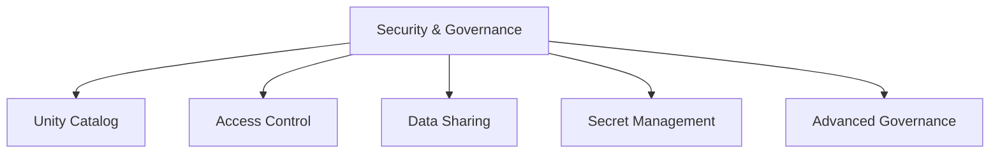
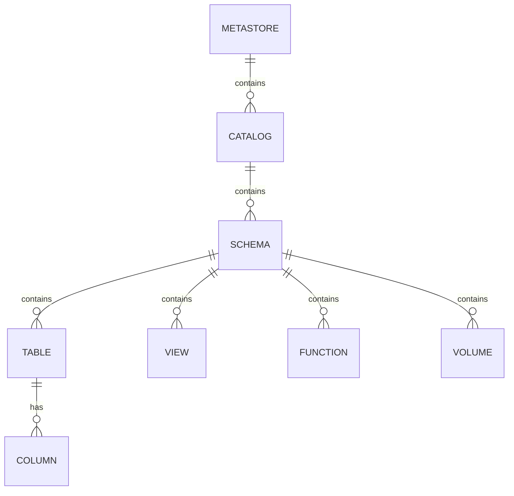
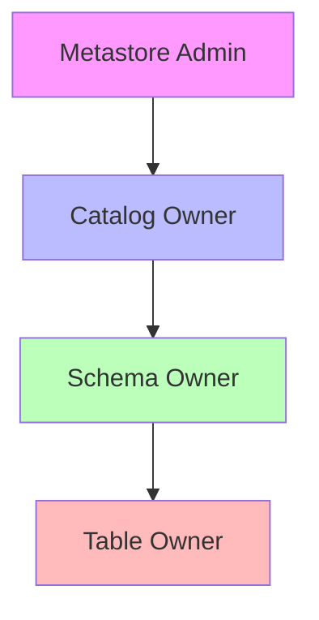
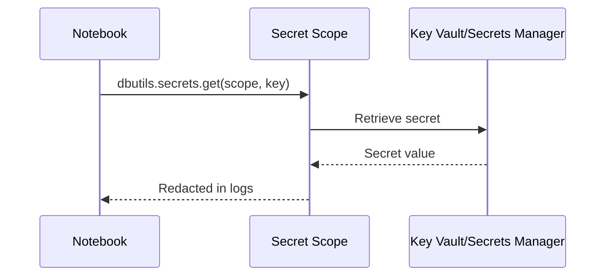

# Security & Governance (10% of Exam)

Unity Catalog is the foundation for data governance in Databricks, providing centralized access control and audit capabilities.

## Topics Overview



## Section Contents

| File | Topic | Priority |
| :--- | :--- | :--- |
| [01-unity-catalog.md](01-unity-catalog.md) | Metastore, catalog hierarchy, permission inheritance | High |
| [02-access-control.md](02-access-control.md) | Table ACLs, row/column security, dynamic views | High |
| [03-data-sharing.md](03-data-sharing.md) | Delta Sharing, external data sharing | Medium |
| [04-secret-management.md](04-secret-management.md) | Secret scopes, accessing secrets in code | Medium |
| [05-audit-lineage-network-security.md](05-audit-lineage-network-security.md) | Data lineage, audit logging, information schema, network security (Private Link, SCC) | High |
| [06-classification-compliance-permissions.md](06-classification-compliance-permissions.md) | Data classification & tagging, GDPR/CCPA compliance, advanced permission models | High |

## Unity Catalog Hierarchy



### Three-Level Namespace

```text
catalog.schema.table
```

| Level | Description | Example |
| :--- | :--- | :--- |
| Catalog | Top-level container | `prod`, `dev`, `staging` |
| Schema | Database equivalent | `sales`, `marketing` |
| Table/View | Data objects | `orders`, `customers` |

## Permission Model

### Privilege Types

| Privilege | Applies To | Description |
| :--- | :--- | :--- |
| `USE CATALOG` | Catalog | Access catalog |
| `USE SCHEMA` | Schema | Access schema |
| `SELECT` | Table/View | Read data |
| `MODIFY` | Table | Insert/Update/Delete |
| `CREATE TABLE` | Schema | Create tables |
| `ALL PRIVILEGES` | Any | Full access |

### Permission Inheritance



## Secret Management



### Secret Scope Types

| Type | Backend | Use Case |
| :--- | :--- | :--- |
| Databricks-backed | Databricks | Simple, quick setup |
| Azure Key Vault | Azure | Enterprise, centralized |
| AWS Secrets Manager | AWS | Enterprise, centralized |

## Exam Tips

1. **Unity Catalog vs Hive metastore** - UC is account-level, Hive is workspace-level
2. **Managed vs External tables** - Managed tables have lifecycle managed by UC
3. **Permission inheritance** - Privileges flow down the hierarchy
4. **Dynamic views** - Use for row/column level security
5. **Delta Sharing** - Open protocol, works across platforms

## Practice Focus Areas

- [ ] Set up Unity Catalog hierarchy
- [ ] Grant and revoke permissions
- [ ] Create dynamic views for row-level security
- [ ] Configure Delta Sharing
- [ ] Access secrets securely in notebooks
