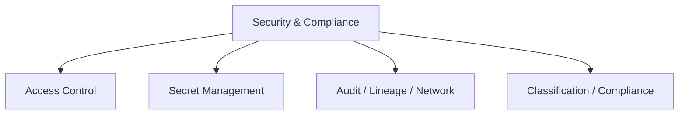

# Ensuring Data Security and Compliance (10 % of Exam)

Access control, secret management, audit and lineage, network security, and the classification / compliance controls that satisfy regulatory regimes. Unity Catalog is the foundation for most of these controls.

## Topics Overview

## Section Contents

| File | Topic | Priority |
| :--- | :--- | :--- |
| [01-access-control.md](./01-access-control.md) | GRANT / REVOKE / DENY, row filters, column masks | High |
| [02-secret-management.md](./02-secret-management.md) | Databricks secret scopes, Azure Key Vault / AWS Secrets Manager integration | High |
| [03-audit-lineage-network-security.md](./03-audit-lineage-network-security.md) | Audit log, lineage in UC, IP access lists, PrivateLink / Private Service Connect | High |
| [04-classification-compliance-permissions.md](./04-classification-compliance-permissions.md) | Sensitive-data tagging, anonymisation / pseudonymisation (hashing, tokenisation, suppression, generalisation), batch + streaming PII masking, data purging for retention | Medium |

## Key Concepts to Master

| Concept | Why it matters |
| :--- | :--- |
| **Row filters & column masks** | UC-native fine-grained access control — implemented as SQL UDFs attached to columns/tables |
| **GRANT vs DENY** | DENY overrides GRANT; REVOKE just removes an explicit GRANT (does not block access) |
| **Secret scopes** | Two backing stores: Databricks-backed and Azure-Key-Vault-backed (only on Azure) |
| **Lineage in Unity Catalog** | Automatic table-level and column-level lineage for any query run through UC |
| **Audit log** | System tables `system.access.audit` capture every UC access decision |

## Related Resources

- [Unity Catalog cheat sheet (shared)](../../../shared/cheat-sheets/unity-catalog-quick-ref.md)
- [Unity Catalog Basics (shared)](../../../shared/fundamentals/unity-catalog-basics.md)

---

**[← Previous: Monitoring and Alerting](../04-monitoring-and-alerting/README.md) | [↑ Back to DE Professional](../README.md) | [Next: Debugging and Deploying →](../06-debugging-and-deploying/README.md)**
