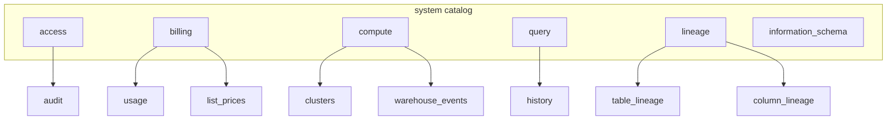

# System Tables

System tables provide observability into your Databricks account including audit logs, billing usage, compute metrics, and query history. They're essential for monitoring, cost management, and compliance.

## Overview



## System Table Categories

| Schema | Tables | Purpose |
| :--- | :--- | :--- |
| `system.access` | audit | Security and compliance audit trail |
| `system.billing` | usage, list_prices | Cost tracking and analysis |
| `system.compute` | clusters, warehouse_events | Compute resource metrics |
| `system.query` | history | SQL query execution logs |
| `system.lineage` | table_lineage, column_lineage | Data lineage tracking |
| `system.information_schema` | catalogs, schemata, tables, columns | Metadata queries |

## Enabling System Tables

System tables must be enabled by an account admin:

```sql
-- System tables are enabled at the account level
-- Done via account console or admin API
-- Once enabled, accessible via SQL

-- Check available system tables
SHOW TABLES IN system.access;
SHOW TABLES IN system.billing;
```

## Audit Logs (system.access.audit)

Tracks all security-relevant activities across your account.

### Audit Log Schema

| Column | Type | Description |
| :--- | :--- | :--- |
| event_time | TIMESTAMP | When event occurred |
| event_date | DATE | Date partition |
| workspace_id | STRING | Workspace identifier |
| source_ip_address | STRING | Origin IP |
| user_identity | STRUCT | User information |
| service_name | STRING | Service that generated event |
| action_name | STRING | Specific action |
| request_id | STRING | Unique request ID |
| request_params | MAP | Action parameters |
| response | STRUCT | Response details |

### Common Audit Queries

```sql
-- User login activity
SELECT
    event_date,
    user_identity.email,
    source_ip_address,
    COUNT(*) AS login_count
FROM system.access.audit
WHERE action_name = 'login'
    AND event_date >= current_date() - 7
GROUP BY event_date, user_identity.email, source_ip_address
ORDER BY event_date DESC, login_count DESC;

-- Table access patterns
SELECT
    user_identity.email,
    request_params.full_name_arg AS table_name,
    COUNT(*) AS access_count,
    MIN(event_time) AS first_access,
    MAX(event_time) AS last_access
FROM system.access.audit
WHERE action_name = 'getTable'
    AND event_date >= current_date() - 30
GROUP BY user_identity.email, request_params.full_name_arg
ORDER BY access_count DESC;

-- Permission changes
SELECT
    event_time,
    user_identity.email AS changed_by,
    action_name,
    request_params.securable_full_name AS object,
    request_params.changes AS permission_changes
FROM system.access.audit
WHERE action_name IN ('updatePermissions', 'grant', 'revoke')
    AND event_date >= current_date() - 7
ORDER BY event_time DESC;

-- Failed operations
SELECT
    event_time,
    user_identity.email,
    action_name,
    request_params,
    response.status_code,
    response.error_message
FROM system.access.audit
WHERE response.status_code >= 400
    AND event_date >= current_date() - 1
ORDER BY event_time DESC;
```

### Service Names and Action Types

| Service | Common Actions |
| :--- | :--- |
| `unityCatalog` | getTable, createTable, updatePermissions |
| `clusters` | create, delete, edit, start, permanentDelete |
| `jobs` | create, delete, runNow, cancel |
| `notebooks` | createNotebook, deleteNotebook, runCommand |
| `secrets` | createScope, putSecret, getSecret |
| `accounts` | login, logout, createUser |

```sql
-- Count actions by service
SELECT
    service_name,
    action_name,
    COUNT(*) AS event_count
FROM system.access.audit
WHERE event_date >= current_date() - 7
GROUP BY service_name, action_name
ORDER BY event_count DESC
LIMIT 50;
```

## Billing Usage (system.billing.usage)

Tracks resource consumption and costs.

### Billing Table Schema

| Column | Type | Description |
| :--- | :--- | :--- |
| account_id | STRING | Account identifier |
| workspace_id | STRING | Workspace identifier |
| usage_date | DATE | Usage date |
| sku_name | STRING | Product SKU |
| cloud | STRING | Cloud provider |
| usage_quantity | DECIMAL | Amount consumed |
| usage_unit | STRING | Unit of measure (DBUs, etc.) |
| custom_tags | MAP | User-defined tags |

### Billing Analysis Queries

```sql
-- Daily DBU consumption by workspace
SELECT
    usage_date,
    workspace_id,
    sku_name,
    SUM(usage_quantity) AS total_dbus
FROM system.billing.usage
WHERE usage_date >= current_date() - 30
GROUP BY usage_date, workspace_id, sku_name
ORDER BY usage_date DESC, total_dbus DESC;

-- Cost breakdown by SKU
SELECT
    sku_name,
    SUM(usage_quantity) AS total_dbus,
    SUM(usage_quantity * list_price) AS estimated_cost
FROM system.billing.usage u
LEFT JOIN system.billing.list_prices p
    ON u.sku_name = p.sku_name
WHERE usage_date >= date_trunc('month', current_date())
GROUP BY u.sku_name
ORDER BY estimated_cost DESC;

-- Usage by custom tags (team, project, etc.)
SELECT
    usage_date,
    custom_tags['team'] AS team,
    custom_tags['project'] AS project,
    SUM(usage_quantity) AS total_dbus
FROM system.billing.usage
WHERE usage_date >= current_date() - 30
    AND custom_tags['team'] IS NOT NULL
GROUP BY usage_date, custom_tags['team'], custom_tags['project']
ORDER BY usage_date DESC, total_dbus DESC;

-- Month-over-month comparison
SELECT
    date_trunc('month', usage_date) AS month,
    sku_name,
    SUM(usage_quantity) AS total_dbus
FROM system.billing.usage
WHERE usage_date >= date_trunc('month', current_date()) - INTERVAL 3 MONTHS
GROUP BY date_trunc('month', usage_date), sku_name
ORDER BY month DESC, total_dbus DESC;

-- Identify top cost drivers
SELECT
    workspace_id,
    sku_name,
    custom_tags['cluster_id'] AS cluster_id,
    SUM(usage_quantity) AS total_dbus
FROM system.billing.usage
WHERE usage_date >= current_date() - 7
GROUP BY workspace_id, sku_name, custom_tags['cluster_id']
ORDER BY total_dbus DESC
LIMIT 20;
```

### SKU Names

| SKU Pattern | Description |
| :--- | :--- |
| `STANDARD_ALL_PURPOSE_COMPUTE` | All-purpose clusters |
| `STANDARD_JOBS_COMPUTE` | Job clusters |
| `STANDARD_SQL_COMPUTE` | SQL warehouses |
| `PREMIUM_*` | Premium tier equivalents |
| `ENTERPRISE_*` | Enterprise tier |

## Compute Metrics (system.compute)

### Cluster Information

```sql
-- Active clusters
SELECT
    cluster_id,
    cluster_name,
    cluster_source,
    state,
    driver_node_type,
    num_workers,
    start_time,
    current_timestamp() - start_time AS running_duration
FROM system.compute.clusters
WHERE state = 'RUNNING'
ORDER BY running_duration DESC;

-- Cluster lifecycle events
SELECT
    cluster_id,
    cluster_name,
    state,
    state_message,
    start_time,
    terminated_time,
    termination_reason
FROM system.compute.clusters
WHERE start_time >= current_date() - 7
ORDER BY start_time DESC;

-- Cluster utilization patterns
SELECT
    date_trunc('hour', start_time) AS hour,
    COUNT(DISTINCT cluster_id) AS clusters_started,
    SUM(num_workers) AS total_workers
FROM system.compute.clusters
WHERE start_time >= current_date() - 7
GROUP BY date_trunc('hour', start_time)
ORDER BY hour DESC;
```

### SQL Warehouse Events

```sql
-- Warehouse scaling events
SELECT
    event_time,
    warehouse_id,
    event_type,
    cluster_count
FROM system.compute.warehouse_events
WHERE event_time >= current_date() - 1
ORDER BY event_time DESC;

-- Warehouse utilization
SELECT
    warehouse_id,
    COUNT(CASE WHEN event_type = 'SCALE_UP' THEN 1 END) AS scale_ups,
    COUNT(CASE WHEN event_type = 'SCALE_DOWN' THEN 1 END) AS scale_downs,
    MAX(cluster_count) AS max_clusters
FROM system.compute.warehouse_events
WHERE event_time >= current_date() - 7
GROUP BY warehouse_id;
```

## Query History (system.query.history)

Tracks SQL query execution details.

### Query History Schema

| Column | Type | Description |
| :--- | :--- | :--- |
| statement_id | STRING | Unique query ID |
| executed_by | STRING | User who ran query |
| start_time | TIMESTAMP | Query start |
| end_time | TIMESTAMP | Query end |
| duration | LONG | Execution time (ms) |
| status | STRING | Success/Failed/Canceled |
| error_message | STRING | Error details if failed |
| warehouse_id | STRING | SQL warehouse used |
| statement_text | STRING | SQL query text |
| rows_produced | LONG | Result row count |
| total_task_duration_ms | LONG | Total task time |

### Query Analysis

```sql
-- Slowest queries
SELECT
    statement_id,
    executed_by,
    start_time,
    duration / 1000 AS duration_seconds,
    rows_produced,
    LEFT(statement_text, 200) AS query_preview
FROM system.query.history
WHERE start_time >= current_date() - 1
    AND status = 'FINISHED'
ORDER BY duration DESC
LIMIT 20;

-- Query patterns by user
SELECT
    executed_by,
    COUNT(*) AS query_count,
    AVG(duration) / 1000 AS avg_duration_seconds,
    MAX(duration) / 1000 AS max_duration_seconds,
    SUM(rows_produced) AS total_rows
FROM system.query.history
WHERE start_time >= current_date() - 7
GROUP BY executed_by
ORDER BY query_count DESC;

-- Failed queries
SELECT
    start_time,
    executed_by,
    error_message,
    LEFT(statement_text, 300) AS query_preview
FROM system.query.history
WHERE status = 'FAILED'
    AND start_time >= current_date() - 1
ORDER BY start_time DESC;

-- Queries by time of day
SELECT
    HOUR(start_time) AS hour_of_day,
    COUNT(*) AS query_count,
    AVG(duration) / 1000 AS avg_duration_seconds
FROM system.query.history
WHERE start_time >= current_date() - 7
GROUP BY HOUR(start_time)
ORDER BY hour_of_day;

-- Most expensive queries (by total task duration)
SELECT
    statement_id,
    executed_by,
    total_task_duration_ms / 1000 AS total_task_seconds,
    duration / 1000 AS wall_clock_seconds,
    LEFT(statement_text, 200) AS query_preview
FROM system.query.history
WHERE start_time >= current_date() - 1
ORDER BY total_task_duration_ms DESC
LIMIT 20;
```

## Lineage Tables

### Table Lineage

```sql
-- Downstream dependencies of a table
SELECT
    source_table_full_name,
    target_table_full_name,
    source_type,
    target_type
FROM system.lineage.table_lineage
WHERE source_table_full_name = 'prod.silver.customers'
ORDER BY target_table_full_name;

-- Upstream sources for a table
SELECT
    source_table_full_name,
    target_table_full_name
FROM system.lineage.table_lineage
WHERE target_table_full_name = 'prod.gold.revenue';

-- Full lineage graph
SELECT
    source_table_full_name,
    target_table_full_name,
    source_type,
    target_type,
    created_by
FROM system.lineage.table_lineage
WHERE source_table_catalog = 'prod'
ORDER BY source_table_full_name, target_table_full_name;
```

### Column Lineage

```sql
-- Column-level lineage
SELECT
    source_table_full_name,
    source_column_name,
    target_table_full_name,
    target_column_name
FROM system.lineage.column_lineage
WHERE target_table_full_name = 'prod.gold.customer_metrics';
```

## Information Schema

### Metadata Queries

```sql
-- List all catalogs
SELECT * FROM system.information_schema.catalogs;

-- List all schemas
SELECT
    catalog_name,
    schema_name,
    schema_owner
FROM system.information_schema.schemata
WHERE catalog_name = 'prod';

-- List all tables
SELECT
    table_catalog,
    table_schema,
    table_name,
    table_type,
    created,
    last_altered
FROM system.information_schema.tables
WHERE table_catalog = 'prod'
    AND table_schema = 'gold';

-- List columns for a table
SELECT
    column_name,
    data_type,
    is_nullable,
    column_default
FROM system.information_schema.columns
WHERE table_catalog = 'prod'
    AND table_schema = 'gold'
    AND table_name = 'customers';
```

## Building Dashboards

### Executive Cost Dashboard

```sql
-- Daily cost summary
CREATE OR REPLACE VIEW admin.monitoring.daily_cost_summary AS
SELECT
    usage_date,
    workspace_id,
    SUM(CASE WHEN sku_name LIKE '%ALL_PURPOSE%' THEN usage_quantity ELSE 0 END) AS all_purpose_dbus,
    SUM(CASE WHEN sku_name LIKE '%JOBS%' THEN usage_quantity ELSE 0 END) AS jobs_dbus,
    SUM(CASE WHEN sku_name LIKE '%SQL%' THEN usage_quantity ELSE 0 END) AS sql_dbus,
    SUM(usage_quantity) AS total_dbus
FROM system.billing.usage
WHERE usage_date >= current_date() - 30
GROUP BY usage_date, workspace_id;
```

### Security Dashboard

```sql
-- Security events summary
CREATE OR REPLACE VIEW admin.monitoring.security_summary AS
SELECT
    event_date,
    service_name,
    action_name,
    COUNT(*) AS event_count,
    COUNT(DISTINCT user_identity.email) AS unique_users,
    COUNT(CASE WHEN response.status_code >= 400 THEN 1 END) AS failures
FROM system.access.audit
WHERE event_date >= current_date() - 7
GROUP BY event_date, service_name, action_name;
```

## Use Cases

- **Cost Allocation Chargebacks**: Using `system.billing.usage` combined with custom workspace or cluster tags to automatically generate monthly chargeback reports for different engineering departments based on their specific DBU consumption.
- **Security Incident Auditing**: Querying `system.access.audit` to forensically trace exactly when a user's permissions were escalated or to identify the origin IP address of repeated failed login attempts.
- **Impact Analysis via Lineage**: Utilizing `system.lineage.table_lineage` to programmatically build a dependency graph that alerts downstream data consumers whenever an upstream Bronze table is scheduled for deprecation or schema changes.

## Common Issues & Errors

### System Tables Not Enabled

**Scenario:** Can't query system tables.

**Fix:** Request account admin to enable system tables.

### Permission Denied

**Scenario:** User can't access system tables.

**Fix:** Grant appropriate permissions:

```sql
GRANT SELECT ON SCHEMA system.billing TO `cost-analysts`;
GRANT SELECT ON TABLE system.access.audit TO `security-team`;
```

### Query Performance

**Scenario:** System table queries are slow.

**Fix:** Always filter by date partition:

```sql
-- Good: Uses partition pruning
WHERE event_date >= current_date() - 7

-- Bad: Scans all data
WHERE event_time >= current_timestamp() - INTERVAL 7 DAYS
```

## Exam Tips

1. **System catalog** - All system tables in `system` catalog
2. **Date partitioning** - Always filter by date columns for performance
3. **Retention** - Audit logs 365 days, query history 30 days
4. **Audit scope** - Account-level, covers all workspaces
5. **user_identity** - Struct with email, user_id, etc.
6. **request_params** - MAP type, access with bracket notation
7. **Billing SKUs** - Know common patterns (ALL_PURPOSE, JOBS, SQL)
8. **Lineage tables** - Track table and column dependencies
9. **Information schema** - Standard SQL metadata tables
10. **Enable via admin** - Account admin enables system tables

## Key Takeaways

- **System catalog**: All system tables live in the `system` catalog and must be enabled by an account admin before use.
- **Date partitioning**: Always filter on date columns (e.g., `event_date`, `usage_date`) to activate partition pruning; filtering on timestamp columns causes full scans.
- **Audit log retention**: `system.access.audit` retains data for 365 days; `system.query.history` retains data for only 30 days.
- **Billing with tags**: `system.billing.usage` stores custom cluster/workspace tags in a `MAP` type column, accessed with bracket notation (`custom_tags['team']`).
- **SKU naming patterns**: Know the key SKU patterns — `ALL_PURPOSE`, `JOBS`, `SQL` — for cost breakdown queries.
- **Lineage tables**: `system.lineage.table_lineage` and `column_lineage` track upstream/downstream dataset dependencies for impact analysis.
- **Audit scope**: Audit logs are account-level and cover all workspaces; the `user_identity` column is a STRUCT with email and user_id fields.
- **Permission grants**: Users must be explicitly granted `SELECT` on system schemas/tables (e.g., `GRANT SELECT ON SCHEMA system.billing TO ...`).

## Related Topics

- [Spark UI Debugging](02-spark-ui-debugging.md) - Job-level monitoring
- [Query Profiler](04-query-profiler.md) - Query optimization
- [Access Control](../04-security-governance/02-access-control.md) - Audit for compliance

## Official Documentation

- [System Tables](https://docs.databricks.com/administration-guide/system-tables/index.html)
- [Audit Logs](https://docs.databricks.com/administration-guide/account-settings/audit-logs.html)
- [Billing Tables](https://docs.databricks.com/administration-guide/system-tables/billing.html)
- [Query History](https://docs.databricks.com/administration-guide/system-tables/query-history.html)

---

**[↑ Back to Monitoring & Logging](./README.md) | [Next: Spark UI Debugging](./02-spark-ui-debugging.md) →**
