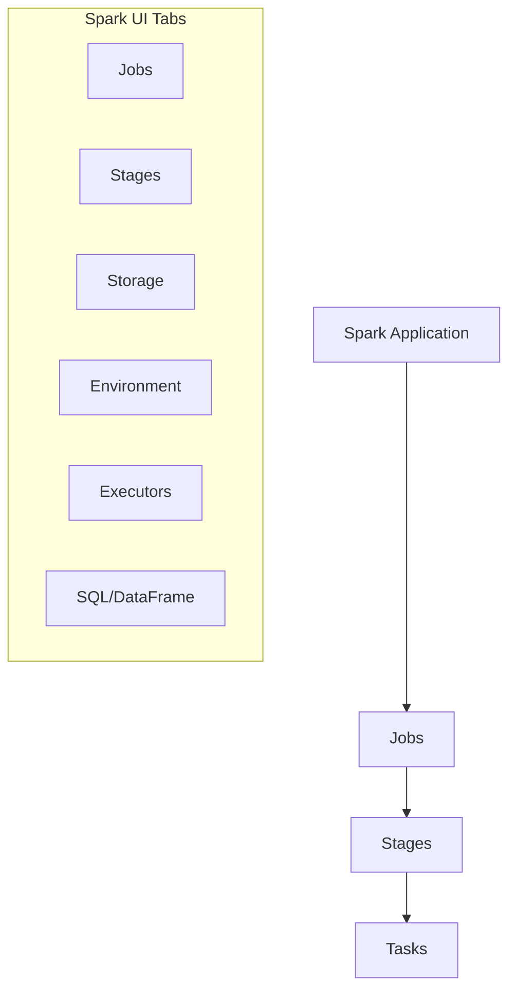
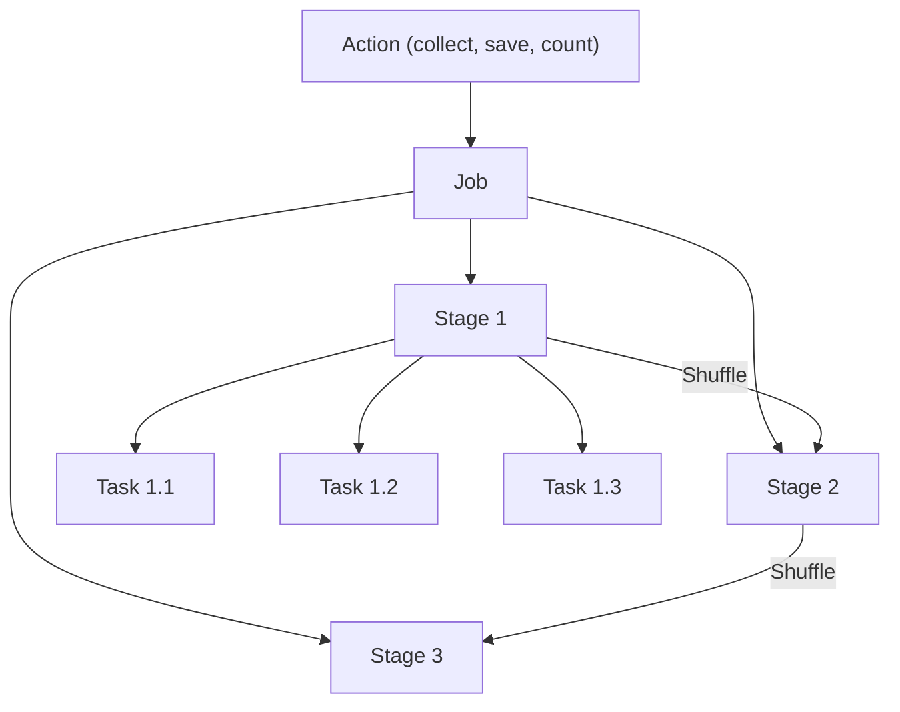
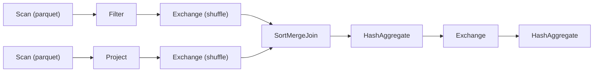

# Spark UI Debugging

The Spark UI provides detailed visibility into job execution, enabling identification of performance bottlenecks, data skew, and resource issues. Understanding how to navigate and interpret the Spark UI is essential for debugging production pipelines.

## Overview



## Spark Execution Hierarchy

### Jobs, Stages, and Tasks



| Level | Created By | Characteristics |
| :--- | :--- | :--- |
| Job | Each action (save, collect, count) | Contains multiple stages |
| Stage | Shuffle boundaries | Contains multiple tasks |
| Task | Partitions | Smallest unit of work |

### What Triggers Shuffles

| Operation | Causes Shuffle |
| :--- | :--- |
| `groupBy`, `reduceByKey` | Yes |
| `join` (most types) | Yes |
| `repartition` | Yes |
| `distinct` | Yes |
| `orderBy`, `sort` | Yes |
| `map`, `filter` | No |
| `coalesce` (reduce only) | No |
| `broadcast` join | No (small table) |

## Jobs Tab

### Job List View

The Jobs tab shows all jobs in the application:

| Column | Description |
| :--- | :--- |
| Job Id | Unique identifier |
| Description | Action that triggered job |
| Submitted | Start timestamp |
| Duration | Total execution time |
| Stages | Succeeded/Total stages |
| Tasks | Succeeded/Total tasks |

### Identifying Issues from Jobs

```text
Signs of Problems:
- Long duration compared to similar jobs
- Failed stages/tasks
- Many retried tasks
- Significant time spent in specific stages
```

## Stages Tab

### Stage Details

Each stage shows:

| Metric | Description | What to Look For |
| :--- | :--- | :--- |
| Duration | Wall clock time | Compare to expected |
| Input | Data read | Size vs expected |
| Output | Data written | Compare to input |
| Shuffle Read | Data from previous stages | Large = potential bottleneck |
| Shuffle Write | Data for next stages | Large = expensive |

### DAG Visualization



### Stage Metrics to Monitor

```text
Key Metrics:
├── Duration
│   ├── Scheduler Delay (waiting for resources)
│   ├── Task Deserialization
│   ├── GC Time (garbage collection)
│   ├── Result Serialization
│   └── Getting Result Time
├── Shuffle Read
│   ├── Read Size
│   ├── Records Read
│   └── Fetch Wait Time
├── Shuffle Write
│   ├── Write Size
│   └── Records Written
└── Spill
    ├── Spill (Memory) - data spilled to memory
    └── Spill (Disk) - data spilled to disk
```

## Tasks Tab

### Task-Level Analysis

Individual task view reveals:

| Column | Description | Issues Indicated |
| :--- | :--- | :--- |
| Duration | Task execution time | Variance indicates skew |
| GC Time | Garbage collection | High = memory pressure |
| Input Size | Data read by task | Uneven = skewed partitions |
| Shuffle Read | From other executors | High = shuffle-heavy |
| Shuffle Write | To other executors | High = expensive shuffle |
| Errors | Error messages | Failed tasks |

### Task Duration Distribution

```text
Normal Distribution:
Task 1: ████████░░ 8s
Task 2: ████████░░ 8s
Task 3: ████████░░ 9s
Task 4: ████████░░ 8s

Skewed Distribution (Problem!):
Task 1: ██░░░░░░░░ 2s
Task 2: ██░░░░░░░░ 2s
Task 3: ██░░░░░░░░ 2s
Task 4: ██████████████████████████████ 60s  ← Straggler
```

## Executors Tab

### Executor Metrics

| Metric | Description | Healthy Range |
| :--- | :--- | :--- |
| RDD Blocks | Cached data blocks | Based on caching strategy |
| Storage Memory | Memory for caching | < 60% typically |
| Disk Used | Spilled data on disk | Should be minimal |
| Active Tasks | Currently running | Even distribution |
| Failed Tasks | Task failures | Should be 0 or low |
| Total GC Time | Garbage collection | < 10% of total time |

### Executor Health Indicators

```text
Healthy Executor:
├── GC Time: 5% of total
├── Storage Memory: 40% used
├── Disk Used: 0 MB
├── Failed Tasks: 0
└── Active Tasks: 4 (= cores)

Unhealthy Executor:
├── GC Time: 40% of total ← Memory pressure
├── Storage Memory: 95% used ← Near limit
├── Disk Used: 10 GB ← Spilling to disk
├── Failed Tasks: 5 ← Task failures
└── Active Tasks: 1 ← Underutilized
```

## SQL/DataFrame Tab

### Query Execution Plans

The SQL tab shows:

- Executed SQL queries and DataFrame operations
- Query plans (logical and physical)
- Per-operator metrics

### Reading Query Plans

```text
== Physical Plan ==
*(5) HashAggregate(keys=[customer_id], functions=[sum(amount)])
+- Exchange hashpartitioning(customer_id, 200), ENSURE_REQUIREMENTS
   +- *(4) HashAggregate(keys=[customer_id], functions=[partial_sum(amount)])
      +- *(4) Project [customer_id, amount]
         +- *(4) BroadcastHashJoin [order_id], [order_id], Inner
            :- *(2) Filter isnotnull(order_id)
            :  +- *(2) Scan parquet [order_id, customer_id, amount]
            +- BroadcastExchange HashedRelationBroadcastMode
               +- *(3) Scan parquet [order_id]
```

### Plan Components

| Component | Symbol | Description |
| :--- | :--- | :--- |
| Scan | `Scan parquet` | Read from storage |
| Filter | `Filter` | Apply predicates |
| Project | `Project` | Select columns |
| Exchange | `Exchange` | Shuffle data |
| HashAggregate | `HashAggregate` | Aggregation |
| BroadcastHashJoin | `BroadcastHashJoin` | Broadcast join |
| SortMergeJoin | `SortMergeJoin` | Sort-merge join |
| Sort | `Sort` | Order data |

## Common Performance Issues

### Data Skew

**Symptoms:**

- One task much longer than others
- Straggler tasks in stage
- Uneven input sizes across tasks

**In Spark UI:**

```text
Stage 5 Task Summary:
Min Duration: 2s
25th percentile: 3s
Median: 4s
75th percentile: 5s
Max Duration: 180s  ← Significant skew!
```

**Solutions:**

```python
# Enable AQE skew handling

spark.conf.set("spark.sql.adaptive.enabled", "true")
spark.conf.set("spark.sql.adaptive.skewJoin.enabled", "true")

# Salting technique for severe skew

from pyspark.sql.functions import col, concat, lit, rand

# Add salt to skewed key

df_salted = df.withColumn(
    "salted_key",
    concat(col("skewed_key"), lit("_"), (rand() * 10).cast("int"))
)

# Join with salted keys
# Then remove salt after join

```

### Shuffle Spill

**Symptoms:**

- Spill (Disk) > 0 in stage details
- Slow shuffle operations
- High GC time

**In Spark UI:**

```text
Shuffle Spill (Memory): 10 GB
Shuffle Spill (Disk): 5 GB  ← Problem!
```

**Solutions:**

```python
# Increase memory fraction for execution

spark.conf.set("spark.memory.fraction", "0.8")

# Increase shuffle partitions

spark.conf.set("spark.sql.shuffle.partitions", "400")

# Use more/larger executors
# Cluster configuration change

```

### Small File Problem

**Symptoms:**

- Many small tasks
- High task overhead
- Slow stage startup

**In Spark UI:**

```text
Stage 1: 10000 tasks  ← Too many small tasks
Input: 1 GB
Average task input: 100 KB  ← Very small
```

**Solutions:**

```python
# Coalesce before writing

df.coalesce(100).write.format("delta").save("/path")

# Repartition for better distribution

df.repartition(100).write.format("delta").save("/path")

# Use OPTIMIZE on Delta tables

spark.sql("OPTIMIZE my_table")
```

### Broadcast Join Failure

**Symptoms:**

- Sort-merge join when broadcast expected
- Large shuffle read/write
- Long join stages

**In Spark UI:**

```text
Expected: BroadcastHashJoin
Actual: SortMergeJoin
Shuffle Read: 50 GB  ← Large shuffle
```

**Solutions:**

```python
from pyspark.sql.functions import broadcast

# Force broadcast

result = large_df.join(broadcast(small_df), "key")

# Increase broadcast threshold (default 10MB)

spark.conf.set("spark.sql.autoBroadcastJoinThreshold", "100MB")
```

### Excessive GC

**Symptoms:**

- High GC Time in executors
- Task duration variance
- Executor failures

**In Spark UI:**

```text
Executor 1 GC Time: 45% of total  ← Too high!
```

**Solutions:**

```python

# Increase executor memory
# --executor-memory 16g

# Tune G1GC
# --conf spark.executor.extraJavaOptions="-XX:+UseG1GC -XX:G1HeapRegionSize=16m"

# Reduce data cached in memory

df.unpersist()

# Use Kryo serialization

spark.conf.set("spark.serializer", "org.apache.spark.serializer.KryoSerializer")
```

### OOM (Out of Memory)

**Symptoms:**

- Executor lost errors
- Container killed by YARN/Kubernetes
- Task failures with OOM

**Solutions:**

```python

# Increase driver/executor memory
# --driver-memory 8g
# --executor-memory 16g

# Increase memory overhead

spark.conf.set("spark.executor.memoryOverhead", "2g")

# Avoid collecting large results to driver
# Bad: df.collect()
# Good: df.write.save() or df.take(100)

# Increase partitions to reduce per-partition memory

spark.conf.set("spark.sql.shuffle.partitions", "400")
```

## Interpreting Metrics

### Healthy vs Unhealthy Indicators

| Metric | Healthy | Concerning | Critical |
| :--- | :--- | :--- | :--- |
| GC Time | <5% | 10-20% | >20% |
| Spill (Disk) | 0 | >0 | Large |
| Task Duration CV | <0.5 | 0.5-1.0 | >1.0 |
| Failed Tasks | 0 | 1-5 | >5 |
| Shuffle Read Wait | <10% | 10-30% | >30% |

### Performance Checklist

```text
□ Check job duration against baseline
□ Look for failed stages/tasks
□ Check task duration distribution for skew
□ Verify shuffle sizes are reasonable
□ Check for spill (memory/disk)
□ Review executor GC times
□ Examine query plan for unexpected operations
□ Verify broadcast joins are working
□ Check partition counts and sizes
```

## Accessing Spark UI

### During Job Execution

```python
# Get Spark UI URL

spark.sparkContext.uiWebUrl

# In Databricks notebooks
# Click "View" next to cluster name
# Or use driver logs link

```

### After Job Completion

```text
Databricks:
1. Go to cluster details
2. Click "Spark UI" tab
3. Select completed application

Spark History Server:
1. Navigate to history server URL
2. Select completed application
```

## Use Cases

### Debugging Slow Job

```text
1. Open Spark UI for job
2. Identify slowest stage
3. Check stage metrics:
   - Large shuffle read/write?
   - Spill to disk?
   - Skewed task durations?
4. Drill into tasks:
   - Find straggler tasks
   - Check input sizes
   - Review error messages
5. Apply appropriate fix
```

### Optimizing Joins

```text
1. Find join stage in SQL tab
2. Check join type:
   - BroadcastHashJoin (ideal for small table)
   - SortMergeJoin (large tables)
   - ShuffledHashJoin
3. If SortMergeJoin with small table:
   - Force broadcast
   - Increase threshold
4. Check shuffle metrics
5. Look for skew in join keys
```

## Exam Tips

1. **Job-Stage-Task hierarchy** - Actions create jobs, shuffles create stages
2. **Exchange = Shuffle** - Exchange nodes indicate data movement
3. **Skew detection** - Look at task duration variance
4. **Spill indicators** - Spill (Disk) > 0 means memory pressure
5. **GC overhead** - >10% GC time indicates memory issues
6. **Broadcast vs SortMerge** - Know when each is used
7. **Partition count** - Too few = skew, too many = overhead
8. **AQE** - Adaptive Query Execution helps with runtime optimization
9. **Straggler tasks** - Often indicate data skew
10. **Driver vs Executor OOM** - Different causes and solutions

## Key Takeaways

- **Job-Stage-Task hierarchy**: Each Spark action creates a Job; shuffle boundaries create Stage splits; each partition creates one Task.
- **Exchange = Shuffle**: Every `Exchange` node in a physical plan represents a full network shuffle and is a primary performance cost.
- **Skew detection**: A straggler task with a much longer duration than its peers and a much larger input size indicates data skew in that partition.
- **Spill is a red flag**: Any non-zero `Spill (Disk)` in stage details indicates memory pressure and usually requires increasing partitions or executor memory.
- **GC overhead threshold**: GC time above 10% of total executor time indicates memory pressure; above 20% is critical and likely causes instability.
- **AQE helps at runtime**: Adaptive Query Execution can automatically handle skew joins, coalesce small shuffle partitions, and switch join strategies based on actual data sizes.
- **Broadcast vs SortMergeJoin**: `BroadcastHashJoin` eliminates the shuffle for the small side; `SortMergeJoin` requires a shuffle on both sides — always prefer broadcast for small tables.
- **OOM types differ**: Driver OOM is caused by collecting too much data (avoid `df.collect()`); Executor OOM requires increasing `spark.executor.memoryOverhead` or reducing per-partition data.

## Related Topics

- [Query Profiler](04-query-profiler.md) - Query plan analysis
- [Performance Optimization](../08-performance-optimization/03-spark-tuning.md) - Tuning strategies
- [Structured Streaming](../01-data-processing/03-structured-streaming-part1.md) - Streaming UI

## Official Documentation

- [Spark Web UI](https://spark.apache.org/docs/latest/web-ui.html)
- [Monitoring Spark Applications](https://docs.databricks.com/clusters/debugging-spark-ui.html)
- [Performance Tuning](https://spark.apache.org/docs/latest/sql-performance-tuning.html)

---

**[← Previous: System Tables](./01-system-tables.md) | [↑ Back to Monitoring & Logging](./README.md) | [Next: Lakeflow Event Logs](./03-lakeflow-event-logs.md) →**
