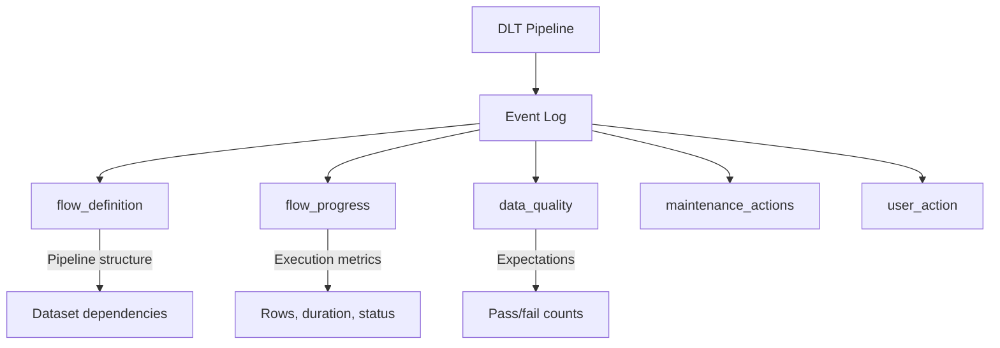
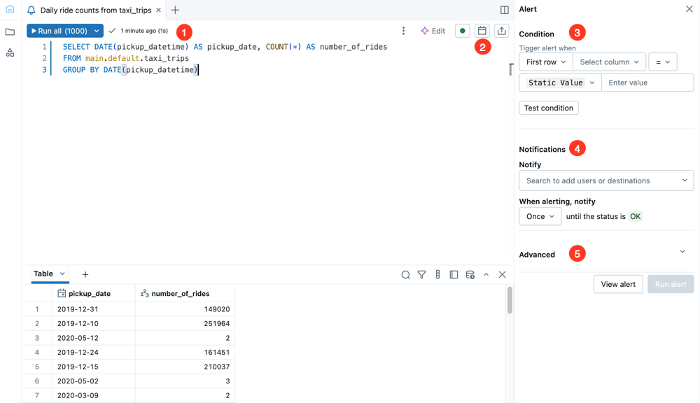

# Lakeflow/DLT Event Logs

Delta Live Tables (DLT) / Lakeflow pipelines generate detailed event logs that provide observability into pipeline execution, data quality, and maintenance operations. Understanding these logs is essential for monitoring and debugging production pipelines.

## Overview



## Event Log Location

### Accessing Event Logs

```sql
-- Query event log using event_log() function
SELECT *
FROM event_log(TABLE(main.default.my_pipeline_target_table))
ORDER BY timestamp DESC;

-- For pipelines without target table, use pipeline storage location
SELECT *
FROM delta.`/pipelines/<pipeline-id>/system/events`
ORDER BY timestamp DESC;
```

### Event Log Schema

| Column | Type | Description |
| :--- | :--- | :--- |
| id | STRING | Unique event ID |
| timestamp | TIMESTAMP | Event timestamp |
| origin | STRUCT | Pipeline and cluster info |
| event_type | STRING | Type of event |
| level | STRING | INFO, WARN, ERROR |
| maturity_level | STRING | STABLE, EVOLVING |
| message | STRING | Human-readable message |
| details | STRING | JSON with event details |
| error | STRUCT | Error information if failed |

## Event Types

### flow_definition

Captures pipeline graph structure and dataset definitions.

```sql
SELECT
    timestamp,
    details:flow_definition.name AS dataset_name,
    details:flow_definition.schema AS schema_name,
    details:flow_definition.target_type AS target_type,
    details:flow_definition.flow_type AS flow_type
FROM event_log(TABLE(my_table))
WHERE event_type = 'flow_definition'
ORDER BY timestamp DESC;
```

### flow_progress

Tracks execution progress for each dataset update.

```sql
SELECT
    timestamp,
    details:flow_progress.data_quality.dataset AS dataset,
    details:flow_progress.metrics.num_output_rows AS rows_written,
    details:flow_progress.status AS status,
    details:flow_progress.metrics.seconds_of_processing AS processing_time
FROM event_log(TABLE(my_table))
WHERE event_type = 'flow_progress'
ORDER BY timestamp DESC;
```

### Metrics in flow_progress

| Metric | Description |
| :--- | :--- |
| `num_output_rows` | Rows written to target |
| `num_upserted_rows` | Rows upserted (APPLY CHANGES) |
| `num_deleted_rows` | Rows deleted |
| `seconds_of_processing` | Processing duration |
| `seconds_of_backlog` | Streaming backlog time |

### data_quality

Captures expectation results for data quality checks.

```sql
SELECT
    timestamp,
    details:expectations.dataset AS dataset,
    details:expectations.name AS expectation_name,
    details:expectations.passed_records AS passed,
    details:expectations.failed_records AS failed
FROM event_log(TABLE(my_table))
WHERE event_type = 'flow_progress'
    AND details:expectations IS NOT NULL
ORDER BY timestamp DESC;
```

### maintenance_actions

Records OPTIMIZE, VACUUM, and other maintenance operations.

```sql
SELECT
    timestamp,
    details:maintenance_actions.dataset AS dataset,
    details:maintenance_actions.action AS action,
    details:maintenance_actions.files_removed AS files_removed,
    details:maintenance_actions.bytes_removed AS bytes_removed
FROM event_log(TABLE(my_table))
WHERE event_type = 'maintenance_actions'
ORDER BY timestamp DESC;
```

### user_action

Captures manual interventions like full refresh or stop.

```sql
SELECT
    timestamp,
    details:user_action.action AS action,
    details:user_action.user_id AS user_id
FROM event_log(TABLE(my_table))
WHERE event_type = 'user_action'
ORDER BY timestamp DESC;
```

## Common Monitoring Queries

### Pipeline Execution Summary

```sql
-- Overall pipeline run summary
SELECT
    DATE_TRUNC('hour', timestamp) AS hour,
    COUNT(CASE WHEN event_type = 'flow_progress' THEN 1 END) AS dataset_updates,
    SUM(CAST(details:flow_progress.metrics.num_output_rows AS BIGINT)) AS total_rows,
    SUM(CAST(details:flow_progress.metrics.seconds_of_processing AS DOUBLE)) AS total_processing_seconds
FROM event_log(TABLE(my_table))
WHERE timestamp >= current_timestamp() - INTERVAL 24 HOURS
    AND event_type = 'flow_progress'
GROUP BY DATE_TRUNC('hour', timestamp)
ORDER BY hour DESC;
```

### Dataset Processing Metrics

```sql
-- Per-dataset metrics
SELECT
    details:flow_progress.data_quality.dataset AS dataset,
    COUNT(*) AS update_count,
    SUM(CAST(details:flow_progress.metrics.num_output_rows AS BIGINT)) AS total_rows,
    AVG(CAST(details:flow_progress.metrics.seconds_of_processing AS DOUBLE)) AS avg_processing_seconds,
    MAX(CAST(details:flow_progress.metrics.seconds_of_processing AS DOUBLE)) AS max_processing_seconds
FROM event_log(TABLE(my_table))
WHERE event_type = 'flow_progress'
    AND timestamp >= current_timestamp() - INTERVAL 7 DAYS
GROUP BY details:flow_progress.data_quality.dataset
ORDER BY total_rows DESC;
```

### Data Quality Monitoring

```sql
-- Expectation pass/fail rates
SELECT
    details:expectations.dataset AS dataset,
    details:expectations.name AS expectation,
    SUM(CAST(details:expectations.passed_records AS BIGINT)) AS total_passed,
    SUM(CAST(details:expectations.failed_records AS BIGINT)) AS total_failed,
    ROUND(
        SUM(CAST(details:expectations.passed_records AS BIGINT)) * 100.0 /
        NULLIF(SUM(CAST(details:expectations.passed_records AS BIGINT)) +
               SUM(CAST(details:expectations.failed_records AS BIGINT)), 0),
        2
    ) AS pass_rate
FROM event_log(TABLE(my_table))
WHERE event_type = 'flow_progress'
    AND details:expectations IS NOT NULL
    AND timestamp >= current_timestamp() - INTERVAL 24 HOURS
GROUP BY details:expectations.dataset, details:expectations.name
ORDER BY pass_rate ASC;
```

### Error Analysis

```sql
-- Failed updates and errors
SELECT
    timestamp,
    details:flow_progress.data_quality.dataset AS dataset,
    details:flow_progress.status AS status,
    error.message AS error_message,
    error.exception AS exception
FROM event_log(TABLE(my_table))
WHERE event_type = 'flow_progress'
    AND (details:flow_progress.status = 'FAILED' OR error IS NOT NULL)
ORDER BY timestamp DESC
LIMIT 50;
```

### Streaming Lag Monitoring

```sql
-- Monitor streaming backlog
SELECT
    timestamp,
    details:flow_progress.data_quality.dataset AS dataset,
    CAST(details:flow_progress.metrics.seconds_of_backlog AS DOUBLE) AS backlog_seconds,
    CAST(details:flow_progress.metrics.num_output_rows AS BIGINT) AS rows_processed
FROM event_log(TABLE(my_table))
WHERE event_type = 'flow_progress'
    AND details:flow_progress.metrics.seconds_of_backlog IS NOT NULL
    AND timestamp >= current_timestamp() - INTERVAL 1 HOUR
ORDER BY timestamp DESC;
```

## Building Monitoring Dashboards

### Pipeline Health Dashboard

```sql
-- Create materialized view for dashboard
CREATE OR REPLACE VIEW monitoring.pipeline_health AS
SELECT
    DATE_TRUNC('hour', timestamp) AS hour,
    origin.pipeline_id,
    COUNT(DISTINCT origin.update_id) AS pipeline_runs,
    SUM(CASE WHEN level = 'ERROR' THEN 1 ELSE 0 END) AS errors,
    SUM(CASE WHEN level = 'WARN' THEN 1 ELSE 0 END) AS warnings,
    SUM(CAST(details:flow_progress.metrics.num_output_rows AS BIGINT)) AS rows_processed
FROM event_log(TABLE(my_table))
WHERE timestamp >= current_timestamp() - INTERVAL 7 DAYS
GROUP BY DATE_TRUNC('hour', timestamp), origin.pipeline_id;
```

### Data Quality Trends

```sql
-- Track quality over time
CREATE OR REPLACE VIEW monitoring.quality_trends AS
SELECT
    DATE(timestamp) AS date,
    details:expectations.dataset AS dataset,
    details:expectations.name AS expectation,
    SUM(CAST(details:expectations.passed_records AS BIGINT)) AS passed,
    SUM(CAST(details:expectations.failed_records AS BIGINT)) AS failed
FROM event_log(TABLE(my_table))
WHERE event_type = 'flow_progress'
    AND details:expectations IS NOT NULL
    AND timestamp >= current_timestamp() - INTERVAL 30 DAYS
GROUP BY DATE(timestamp), details:expectations.dataset, details:expectations.name;
```

## Alerting Patterns



*SQL alert configuration showing threshold condition and notification channel settings.*

### Alert on Data Quality Failures

```python
# Databricks notebook scheduled job

from pyspark.sql.functions import col, sum as spark_sum

# Query recent quality failures

failures_df = spark.sql("""
    SELECT
        details:expectations.dataset AS dataset,
        details:expectations.name AS expectation,
        SUM(CAST(details:expectations.failed_records AS BIGINT)) AS failed_count
    FROM event_log(TABLE(my_table))
    WHERE event_type = 'flow_progress'
        AND details:expectations IS NOT NULL
        AND timestamp >= current_timestamp() - INTERVAL 1 HOUR
    GROUP BY details:expectations.dataset, details:expectations.name
    HAVING SUM(CAST(details:expectations.failed_records AS BIGINT)) > 0
""")

if failures_df.count() > 0:
    # Send alert (webhook, email, etc.)
    failures = failures_df.collect()
    alert_message = f"Data quality failures detected: {len(failures)} expectations failed"
    # send_alert(alert_message)
```

### Alert on Processing Delays

```python
# Check for streaming lag

lag_df = spark.sql("""
    SELECT
        details:flow_progress.data_quality.dataset AS dataset,
        MAX(CAST(details:flow_progress.metrics.seconds_of_backlog AS DOUBLE)) AS max_backlog
    FROM event_log(TABLE(my_table))
    WHERE event_type = 'flow_progress'
        AND details:flow_progress.metrics.seconds_of_backlog IS NOT NULL
        AND timestamp >= current_timestamp() - INTERVAL 15 MINUTES
    GROUP BY details:flow_progress.data_quality.dataset
    HAVING MAX(CAST(details:flow_progress.metrics.seconds_of_backlog AS DOUBLE)) > 300
""")

if lag_df.count() > 0:
    # Alert on significant backlog (> 5 minutes)
    pass
```

## Event Log Retention

### Configuring Retention

```python
# DLT pipeline configuration

{
    "configuration": {
        "pipelines.eventLog.retentionDays": "30"
    }
}
```

### Manual Cleanup

```sql
-- Event logs are Delta tables, can use VACUUM
VACUUM delta.`/pipelines/<pipeline-id>/system/events` RETAIN 168 HOURS;
```

## Troubleshooting Common Issues

### Pipeline Stuck or Slow

```sql
-- Check recent processing times
SELECT
    timestamp,
    details:flow_progress.data_quality.dataset AS dataset,
    CAST(details:flow_progress.metrics.seconds_of_processing AS DOUBLE) AS processing_time,
    details:flow_progress.status AS status
FROM event_log(TABLE(my_table))
WHERE event_type = 'flow_progress'
    AND timestamp >= current_timestamp() - INTERVAL 1 HOUR
ORDER BY processing_time DESC
LIMIT 20;

-- Check for pending datasets
SELECT
    timestamp,
    details:flow_progress.data_quality.dataset AS dataset,
    details:flow_progress.status AS status
FROM event_log(TABLE(my_table))
WHERE event_type = 'flow_progress'
    AND details:flow_progress.status IN ('PENDING', 'RUNNING')
ORDER BY timestamp DESC;
```

### Data Quality Investigation

```sql
-- Find records that failed expectations
SELECT
    timestamp,
    details:expectations.dataset AS dataset,
    details:expectations.name AS expectation,
    details:expectations.failed_records AS failed_count
FROM event_log(TABLE(my_table))
WHERE event_type = 'flow_progress'
    AND details:expectations IS NOT NULL
    AND CAST(details:expectations.failed_records AS BIGINT) > 0
ORDER BY timestamp DESC;
```

### Pipeline Dependency Analysis

```sql
-- View pipeline graph
SELECT
    details:flow_definition.name AS dataset_name,
    details:flow_definition.target_type AS target_type,
    details:flow_definition.schema AS schema
FROM event_log(TABLE(my_table))
WHERE event_type = 'flow_definition'
ORDER BY details:flow_definition.name;
```

## Integration with External Monitoring

### Export to External Systems

```python
# Export event logs to external monitoring

event_log_df = spark.sql("""
    SELECT
        timestamp,
        event_type,
        level,
        message,
        details
    FROM event_log(TABLE(my_table))
    WHERE timestamp >= current_timestamp() - INTERVAL 1 HOUR
""")

# Write to external sink

(event_log_df.write
    .format("json")
    .mode("append")
    .save("/Volumes/monitoring/dlt_events/"))

# Or stream to Kafka/Event Hub for real-time monitoring

```

### Metrics to External Dashboard

```sql
-- Prepare metrics for Grafana/Datadog
SELECT
    timestamp,
    'dlt_rows_processed' AS metric_name,
    origin.pipeline_id AS pipeline,
    details:flow_progress.data_quality.dataset AS dataset,
    CAST(details:flow_progress.metrics.num_output_rows AS DOUBLE) AS value
FROM event_log(TABLE(my_table))
WHERE event_type = 'flow_progress'
    AND timestamp >= current_timestamp() - INTERVAL 5 MINUTES;
```

## Use Cases

- **Data Quality Alerting**: Querying the `data_quality` events in the log to trigger a PagerDuty or Slack alert if the expectation pass rate for a critical Gold dataset drops below a required 99% threshold.
- **Pipeline SLA Monitoring**: Tracking `flow_progress` events to measure the `seconds_of_processing` trends over time, ensuring the overall pipeline consistently meets its required delivery SLAs.
- **Streaming Backlog Analysis**: Using the `seconds_of_backlog` metric to monitor streaming ingestion health and proactively scale up the underlying compute cluster when event consumption falls too far behind production.

## Common Issues & Errors

### Event Log Not Found

**Scenario:** Can't query event log.

**Fix:** Verify pipeline has run and target table exists:

```sql
-- Check pipeline storage location directly
SELECT * FROM delta.`/pipelines/<pipeline-id>/system/events` LIMIT 10;
```

### Missing Expectation Results

**Scenario:** No expectation data in logs.

**Fix:** Verify expectations are defined in pipeline:

```python
@dlt.expect("valid_id", "id IS NOT NULL")  # Must be defined
def my_table():
    return ...
```

### Stale Metrics

**Scenario:** Metrics not updating.

**Fix:** Check pipeline is running and not paused:

```sql
SELECT
    MAX(timestamp) AS last_event
FROM event_log(TABLE(my_table))
WHERE event_type = 'flow_progress';
```

## Exam Tips

1. **Event log function** - Use `event_log(TABLE(target_table))` to query
2. **Event types** - flow_definition, flow_progress, user_action, maintenance_actions
3. **flow_progress metrics** - num_output_rows, seconds_of_processing, seconds_of_backlog
4. **Expectations in logs** - Pass/fail counts in flow_progress events
5. **JSON details** - Use `:` notation to extract from details column
6. **Streaming backlog** - seconds_of_backlog indicates lag
7. **Error tracking** - Check error struct for failure details
8. **Retention** - Configure with pipelines.eventLog.retentionDays
9. **Storage location** - `/pipelines/<id>/system/events` Delta table
10. **Level column** - INFO, WARN, ERROR for filtering

## Key Takeaways

- **Event log access**: Query the event log using `event_log(TABLE(target_table))` or directly via `delta.\`/pipelines/<id>/system/events\`` for pipelines without a named target.
- **Key event types**: `flow_definition` captures pipeline structure; `flow_progress` captures per-dataset execution metrics and expectation results; `maintenance_actions` records OPTIMIZE/VACUUM runs.
- **JSON extraction syntax**: Use the colon (`:`) notation to extract fields from the `details` STRING column (e.g., `details:flow_progress.metrics.num_output_rows`).
- **Streaming backlog metric**: `seconds_of_backlog` in `flow_progress` events indicates how far behind a streaming dataset is; a growing value signals consumer lag.
- **Expectation results location**: Pass/fail counts for data quality constraints appear inside `flow_progress` events when `details:expectations` is not NULL — not in a separate event type.
- **Error diagnosis**: Check the `error.message` and `error.exception` fields within `flow_progress` events to diagnose failed dataset updates.
- **Retention configuration**: Set event log retention with the pipeline property `pipelines.eventLog.retentionDays`; the event log is a Delta table and can be vacuumed with `VACUUM`.
- **Level column filtering**: Use `level = 'ERROR'` or `level = 'WARN'` to quickly filter the event log for operational issues.

## Related Topics

- [Lakeflow Pipelines](../07-lakeflow-pipelines/01-declarative-pipelines.md) - DLT basics
- [Expectations](../07-lakeflow-pipelines/02-expectations-data-quality.md) - Data quality
- [System Tables](01-system-tables.md) - Account-level monitoring

## Official Documentation

- [DLT Event Logs](https://docs.databricks.com/delta-live-tables/observability.html)
- [Monitoring DLT Pipelines](https://docs.databricks.com/delta-live-tables/monitoring.html)
- [Event Log Schema](https://docs.databricks.com/delta-live-tables/observability.html#event-log-schema)

---

**[← Previous: Spark UI Debugging](./02-spark-ui-debugging.md) | [↑ Back to Monitoring & Logging](./README.md) | [Next: Query Profiler](./04-query-profiler.md) →**
