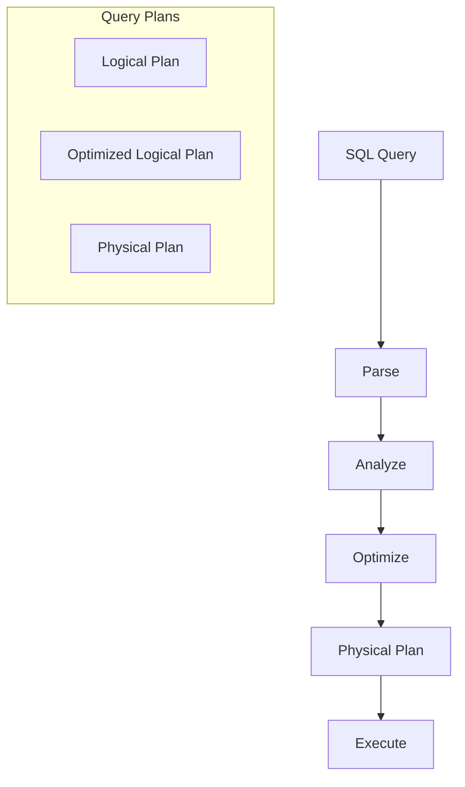
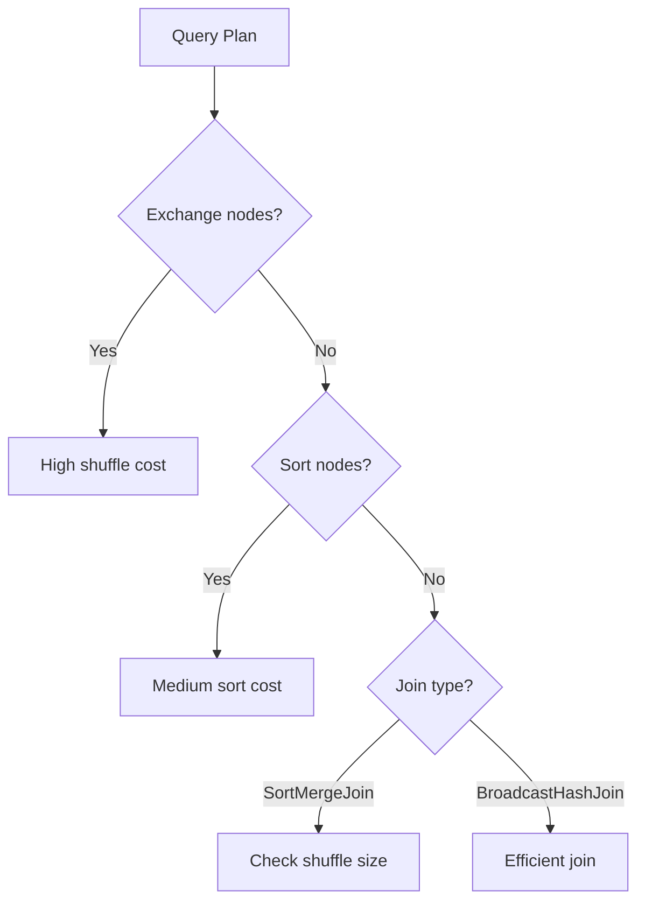
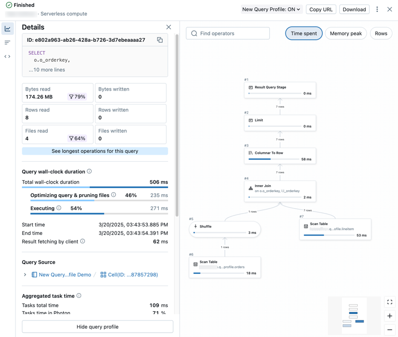

# Query Profiler

The Query Profiler helps analyze query execution plans and identify performance bottlenecks. Understanding how to interpret query plans and optimize queries is essential for building efficient data pipelines.

## Overview



## Query Plans

### Understanding Query Plans

| Plan Type | Description | When to Use |
| :--- | :--- | :--- |
| Parsed Logical | Initial parse of SQL | Verify SQL syntax |
| Analyzed Logical | With resolved references | Check table/column resolution |
| Optimized Logical | After optimization rules | Understand optimizer decisions |
| Physical Plan | Execution strategy | Performance analysis |

### Viewing Query Plans

```sql
-- EXPLAIN shows physical plan
EXPLAIN SELECT * FROM orders WHERE order_date = '2024-01-15';

-- EXPLAIN EXTENDED shows more detail
EXPLAIN EXTENDED SELECT * FROM orders WHERE order_date = '2024-01-15';

-- EXPLAIN FORMATTED for readable output
EXPLAIN FORMATTED SELECT * FROM orders WHERE order_date = '2024-01-15';

-- EXPLAIN COST shows estimated costs
EXPLAIN COST SELECT * FROM orders WHERE order_date = '2024-01-15';
```

```python
# DataFrame API

df = spark.table("orders").filter("order_date = '2024-01-15'")

# Print physical plan

df.explain()

# Print extended plan (all stages)

df.explain(mode="extended")

# Print formatted plan

df.explain(mode="formatted")

# Print cost plan

df.explain(mode="cost")
```

## Reading Physical Plans

### Plan Components

```text
== Physical Plan ==
*(2) HashAggregate(keys=[customer_id#123], functions=[sum(amount#124)])
+- Exchange hashpartitioning(customer_id#123, 200), ENSURE_REQUIREMENTS, [id=#45]
   +- *(1) HashAggregate(keys=[customer_id#123], functions=[partial_sum(amount#124)])
      +- *(1) Project [customer_id#123, amount#124]
         +- *(1) Filter (isnotnull(order_date#125) AND (order_date#125 = 2024-01-15))
            +- *(1) ColumnarToRow
               +- FileScan parquet [customer_id#123,amount#124,order_date#125]
                     Batched: true, DataFilters: [isnotnull(order_date#125), (order_date#125 = 2024-01-15)]
                     PartitionFilters: []
                     PushedFilters: [IsNotNull(order_date), EqualTo(order_date,2024-01-15)]
```

### Key Operators

| Operator | Symbol | Description | Performance Impact |
| :--- | :--- | :--- | :--- |
| FileScan | `FileScan parquet` | Read from storage | Base I/O cost |
| Filter | `Filter` | Apply predicates | Low |
| Project | `Project` | Select columns | Low |
| Exchange | `Exchange` | **Shuffle data** | High |
| HashAggregate | `HashAggregate` | Hash-based aggregation | Medium |
| SortAggregate | `SortAggregate` | Sort-based aggregation | Medium-High |
| BroadcastHashJoin | `BroadcastHashJoin` | Broadcast small table | Low (small) |
| SortMergeJoin | `SortMergeJoin` | Sort and merge | Medium-High |
| ShuffledHashJoin | `ShuffledHashJoin` | Shuffle both tables | High |
| Sort | `Sort` | Order data | Medium-High |

### Understanding Notation

```text
*(2) HashAggregate(...)
 │  └─ (2) is the stage/WholeStageCodegen ID
 └─ * means WholeStageCodegen enabled (optimized)

Exchange hashpartitioning(customer_id#123, 200)
        │                              └─ 200 partitions
        └─ Shuffle by customer_id hash

#123 - Column reference ID

```

## Identifying Performance Issues

### Expensive Operations



### Signs of Poor Performance

| Sign in Plan | Meaning | Solution |
| :--- | :--- | :--- |
| Multiple Exchange nodes | Many shuffles | Reduce shuffles, repartition |
| Large shuffle partition count | Data spread thin | Adjust shuffle partitions |
| SortMergeJoin on small table | Missed broadcast | Force broadcast hint |
| Sort before join | Expensive sort | Use bucketing |
| No partition pruning | Full scan | Add partition filter |
| BroadcastNestedLoopJoin | Cartesian-like join | Fix join condition |

### Analyzing Shuffle

```text
Exchange hashpartitioning(customer_id#123, 200), ENSURE_REQUIREMENTS
└─ 200 = spark.sql.shuffle.partitions

Indicators:
- High partition count with small data = overhead
- Low partition count with large data = memory pressure
- "ENSURE_REQUIREMENTS" = shuffle required for correctness
```

## Query Plan Optimization

### Partition Pruning

```sql
-- Check if partition pruning is working

EXPLAIN FORMATTED
SELECT * FROM orders WHERE order_date = '2024-01-15';

-- Look for:
-- PartitionFilters: [isnotnull(order_date), (order_date = 2024-01-15)]
-- vs empty PartitionFilters: [] means NO pruning
```

```text
Good (Pruning):
PartitionFilters: [(order_date = 2024-01-15)]

Bad (No Pruning):
PartitionFilters: []
DataFilters: [(order_date = 2024-01-15)]  -- Filter after scan
```

### Predicate Pushdown

```sql
-- Check if predicates are pushed to scan

EXPLAIN
SELECT * FROM orders WHERE amount > 100;

-- Look for:
-- PushedFilters: [IsNotNull(amount), GreaterThan(amount,100)]
```

### Join Strategy Selection

```sql
-- Check join type in plan
EXPLAIN
SELECT o.*, c.name
FROM orders o
JOIN customers c ON o.customer_id = c.customer_id;

-- Look for:
-- BroadcastHashJoin (good for small table)
-- SortMergeJoin (for large tables)
-- BroadcastNestedLoopJoin (avoid - usually wrong)
```

## Query Profiler in Databricks

### SQL Warehouse Query Profile



*Query Profile in the Databricks SQL editor visualizing per-stage execution details.*

```text
Access:
1. Run query in SQL editor
2. Click "Query Profile" tab
3. View execution details

Shows:
- Query plan visualization
- Per-operator metrics
- Time breakdown
- Data scanned/shuffled
```

### Metrics Available

| Metric | Description |
| :--- | :--- |
| Duration | Total execution time |
| Rows Scanned | Input rows read |
| Rows Produced | Output rows |
| Peak Memory | Maximum memory used |
| Shuffle Read/Write | Data shuffled |
| Spill | Data spilled to disk |

## Optimizing Queries

### Join Optimization

```sql
-- Force broadcast join
SELECT /*+ BROADCAST(small_table) */ *
FROM large_table l
JOIN small_table s ON l.id = s.id;

-- Force sort-merge join (when needed)
SELECT /*+ MERGE(t2) */ *
FROM t1 JOIN t2 ON t1.id = t2.id;

-- Shuffle hash join
SELECT /*+ SHUFFLE_HASH(t2) */ *
FROM t1 JOIN t2 ON t1.id = t2.id;
```

### Aggregate Optimization

```sql
-- Check partial vs final aggregation
EXPLAIN
SELECT customer_id, SUM(amount)
FROM orders
GROUP BY customer_id;

-- Good plan shows:
-- HashAggregate (final)
-- +- Exchange
--    +- HashAggregate (partial)  -- Partial agg before shuffle
```

### Filter Pushdown

```sql
-- Ensure filters are pushed down
EXPLAIN
SELECT * FROM (
    SELECT * FROM orders WHERE order_date = '2024-01-15'
) sub
WHERE amount > 100;

-- Both filters should be at scan level
```

## AQE (Adaptive Query Execution)

### What AQE Optimizes

| Optimization | Description |
| :--- | :--- |
| Coalesce Partitions | Reduce small partitions after shuffle |
| Skew Join | Split skewed partitions |
| Switch Join Strategy | Change join type based on runtime stats |

### Checking AQE

```sql
-- Enable AQE (usually on by default)
SET spark.sql.adaptive.enabled = true;

-- Check if AQE modified plan
EXPLAIN FORMATTED
SELECT /*+ REPARTITION_BY_RANGE(10, customer_id) */ *
FROM orders;

-- Look for "AdaptiveSparkPlan" in output
```

### AQE Configuration

```python
# Key AQE settings

spark.conf.set("spark.sql.adaptive.enabled", "true")
spark.conf.set("spark.sql.adaptive.coalescePartitions.enabled", "true")
spark.conf.set("spark.sql.adaptive.skewJoin.enabled", "true")
spark.conf.set("spark.sql.adaptive.localShuffleReader.enabled", "true")
```

## ANALYZE TABLE

### Collecting Statistics

```sql
-- Analyze table for optimizer statistics
ANALYZE TABLE orders COMPUTE STATISTICS;

-- Analyze specific columns
ANALYZE TABLE orders COMPUTE STATISTICS FOR COLUMNS customer_id, amount;

-- View statistics
DESCRIBE EXTENDED orders;
```

### Statistics Impact

```text
Without statistics:
- Optimizer uses heuristics
- May choose wrong join order
- May miss broadcast opportunity

With statistics:
- Accurate row count estimates
- Better join ordering
- Optimal join strategy selection
```

## Query Optimization Patterns

### Pattern 1: Reduce Shuffles

```sql
-- Before: Multiple shuffles
SELECT *
FROM orders o
JOIN customers c ON o.customer_id = c.customer_id
JOIN products p ON o.product_id = p.product_id;

-- After: Use broadcast for small tables
SELECT /*+ BROADCAST(c), BROADCAST(p) */ *
FROM orders o
JOIN customers c ON o.customer_id = c.customer_id
JOIN products p ON o.product_id = p.product_id;
```

### Pattern 2: Filter Early

```sql
-- Before: Filter late
SELECT *
FROM (SELECT * FROM orders JOIN customers ON ...) sub
WHERE order_date = '2024-01-15';

-- After: Filter early (let optimizer push down)
SELECT *
FROM orders o
JOIN customers c ON o.customer_id = c.customer_id
WHERE o.order_date = '2024-01-15';
```

### Pattern 3: Avoid Expensive Functions in Filters

```sql
-- Bad: Function prevents pruning
SELECT * FROM orders
WHERE YEAR(order_date) = 2024;

-- Good: Direct comparison enables pruning
SELECT * FROM orders
WHERE order_date >= '2024-01-01' AND order_date < '2025-01-01';
```

### Pattern 4: Select Only Needed Columns

```sql
-- Bad: Select all columns
SELECT * FROM large_table WHERE ...;

-- Good: Select only needed columns
SELECT col1, col2, col3 FROM large_table WHERE ...;
```

## Use Cases

- **Join Strategy Verification**: Checking the read physical execution plan to confirm that joining a massive fact table with a small dimension table is correctly utilizing an efficient `BroadcastHashJoin` rather than a costly `SortMergeJoin`, adding SQL broadcast hints if the optimizer missed it.
- **Partition Pruning Validation**: Inspecting the `FileScan` node of a query plan to ensure `PartitionFilters` are actively pruning underlying storage directories, guaranteeing the query isn't accidentally doing a full table scan on a multi-terabyte historical dataset.
- **Identifying Processing Skew**: Using the query profiler metrics within the Databricks SQL UI to visually spot individual tasks that take disproportionately longer to complete than their peers, indicating underlying data skew that might require bucketing strategies or explicit AQE tuning.

## Common Issues & Errors

### No Partition Pruning

**Scenario:** Full table scan despite partition filter.

**Fix:** Use direct partition column comparison:

```sql
-- Bad: Function on partition column
WHERE CAST(order_date AS STRING) = '2024-01-15'

-- Good: Direct comparison
WHERE order_date = DATE'2024-01-15'
```

### Missed Broadcast Join

**Scenario:** SortMergeJoin when broadcast expected.

**Fix:** Force broadcast or increase threshold:

```sql
-- Option 1: Hint
SELECT /*+ BROADCAST(small_table) */ ...

-- Option 2: Increase threshold
SET spark.sql.autoBroadcastJoinThreshold = 100m;
```

### Excessive Shuffles

**Scenario:** Multiple Exchange nodes for simple query.

**Fix:** Review query structure and repartition strategically:

```python
# Pre-partition data by common join key

df.repartition("customer_id").write.saveAsTable("orders_by_customer")
```

### Cartesian Join

**Scenario:** BroadcastNestedLoopJoin or CartesianProduct in plan.

**Fix:** Add or fix join condition:

```sql
-- Bad: Missing join condition
SELECT * FROM t1, t2 WHERE t1.x > t2.y;

-- Good: Proper equi-join
SELECT * FROM t1 JOIN t2 ON t1.id = t2.id WHERE t1.x > t2.y;
```

## Exam Tips

1. **EXPLAIN types** - EXPLAIN, EXPLAIN EXTENDED, EXPLAIN FORMATTED, EXPLAIN COST
2. **Exchange = Shuffle** - Exchange nodes indicate data movement
3. **Partition pruning** - Check PartitionFilters vs DataFilters
4. **Predicate pushdown** - Look for PushedFilters in scan
5. **Join types** - BroadcastHashJoin < SortMergeJoin < ShuffledHashJoin (cost)
6. **Broadcast threshold** - Default 10MB, can increase
7. **AQE** - Adaptive Query Execution optimizes at runtime
8. **Statistics** - ANALYZE TABLE improves optimizer decisions
9. **WholeStageCodegen** - * prefix means codegen enabled (good)
10. **Filter early** - Push filters before joins/aggregations

## Key Takeaways

- **EXPLAIN variants**: `EXPLAIN` shows only the physical plan; `EXPLAIN EXTENDED` shows all four plan stages; `EXPLAIN FORMATTED` gives a structured, readable output; `EXPLAIN COST` shows optimizer statistics.
- **Exchange = Shuffle**: Every `Exchange` node in a query plan is a full network shuffle — reducing Exchange nodes is the highest-impact query optimization.
- **PartitionFilters vs DataFilters**: `PartitionFilters` in the `FileScan` node means partition directories are pruned (skipped entirely); `DataFilters` are applied after reading data from files.
- **Predicate pushdown**: `PushedFilters` in the `FileScan` node means predicates are pushed into the Parquet/Delta reader to filter rows during the scan, before data enters Spark memory.
- **Join cost ranking**: `BroadcastHashJoin` (best) < `SortMergeJoin` < `ShuffledHashJoin` < `BroadcastNestedLoopJoin` < `CartesianProduct` (worst).
- **WholeStageCodegen**: An asterisk (`*`) prefix on a plan operator means WholeStageCodegen is active, which fuses multiple operators into a single compiled function for better performance.
- **AQE at runtime**: Adaptive Query Execution re-optimizes the remaining plan after each shuffle stage using actual runtime statistics, enabling dynamic join strategy switching and partition coalescing.
- **ANALYZE TABLE**: Running `ANALYZE TABLE ... COMPUTE STATISTICS FOR COLUMNS` gives the Cost-Based Optimizer accurate row counts and column histograms, enabling better join ordering and broadcast decisions.

## Related Topics

- [Spark UI Debugging](02-spark-ui-debugging.md) - Runtime analysis
- [Performance Optimization](../08-performance-optimization/03-spark-tuning.md) - Tuning strategies
- [Delta Lake Operations](../01-data-processing/06-delta-lake-operations-part1.md) - Data skipping

## Official Documentation

- [Spark SQL EXPLAIN](https://spark.apache.org/docs/latest/sql-ref-syntax-qry-explain.html)
- [Query Profile](https://docs.databricks.com/sql/user/queries/query-profile.html)
- [Adaptive Query Execution](https://docs.databricks.com/optimizations/aqe.html)
- [Cost-Based Optimizer](https://docs.databricks.com/optimizations/cbo.html)

---

**[← Previous: Lakeflow Event Logs](./03-lakeflow-event-logs.md) | [↑ Back to Monitoring & Logging](./README.md)**
