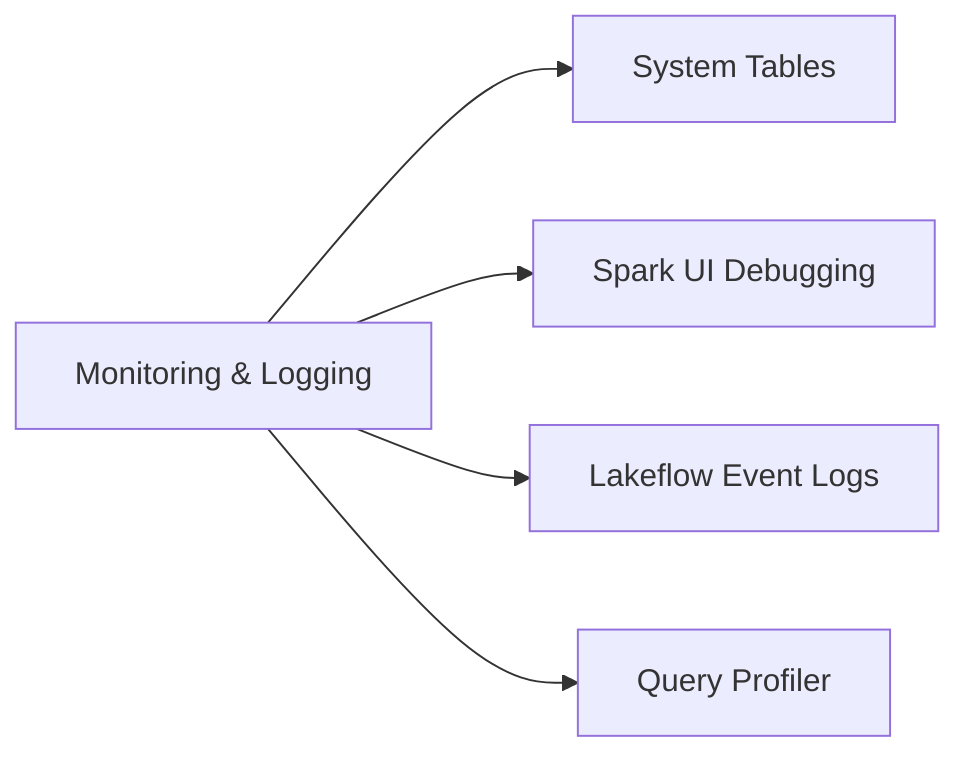
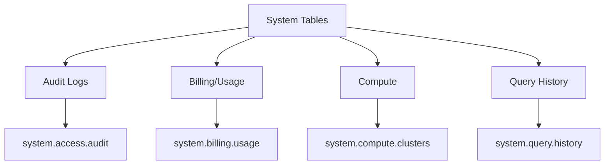
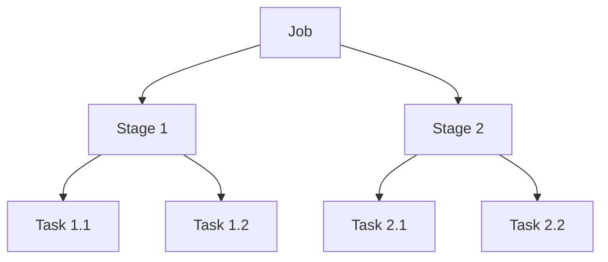

# Monitoring & Logging (10% of Exam)

Effective monitoring and debugging are critical for maintaining production data pipelines.

## Topics Overview



## Section Contents

| File | Topic | Priority |
|------|-------|----------|
| [01-system-tables.md](01-system-tables.md) | Audit logs, billing usage, query history | High |
| [02-spark-ui-debugging.md](02-spark-ui-debugging.md) | Stages, tasks, shuffle analysis | High |
| [03-lakeflow-event-logs.md](03-lakeflow-event-logs.md) | Pipeline observability, event log queries | Medium |
| [04-query-profiler.md](04-query-profiler.md) | Query plans, performance bottlenecks | Medium |

## System Tables Overview



### Key System Tables

| Table | Purpose | Retention |
|-------|---------|-----------|
| `system.access.audit` | Security audit trail | 365 days |
| `system.billing.usage` | Cost tracking | 365 days |
| `system.compute.clusters` | Cluster metadata | 365 days |
| `system.query.history` | SQL query logs | 30 days |

## Spark UI Components



### Key Metrics to Monitor

| Metric | Indicates | Action |
|--------|-----------|--------|
| Shuffle Read/Write | Data movement | Reduce shuffles |
| Spill (Memory) | Memory pressure | Increase memory or partitions |
| Spill (Disk) | Severe memory issue | Add nodes or optimize |
| Task Duration Variance | Data skew | Repartition or salting |
| GC Time | Memory churn | Tune GC settings |

## Lakeflow/DLT Event Logs

### Event Types

| Event | Description |
|-------|-------------|
| `flow_definition` | Pipeline graph structure |
| `planning_information` | Query plans |
| `flow_progress` | Execution metrics |
| `user_action` | Manual interventions |
| `maintenance_actions` | OPTIMIZE, VACUUM |

### Querying Event Logs

```sql
SELECT *
FROM event_log(TABLE(pipeline_name))
WHERE event_type = 'flow_progress'
```

## Exam Tips

1. **System tables location** - All in `system` catalog under Unity Catalog
2. **Audit log latency** - Near real-time but not instant
3. **Spark UI tabs** - Jobs > Stages > Tasks for drill-down
4. **Shuffle indicators** - Exchange nodes in query plans
5. **Event log retention** - Configure based on compliance needs

## Practice Focus Areas

- [ ] Query system tables for usage analysis
- [ ] Identify bottlenecks in Spark UI
- [ ] Analyze DLT pipeline event logs
- [ ] Interpret query execution plans
- [ ] Set up alerts on pipeline metrics

---

**[← Back to Certification](../README.md)**
