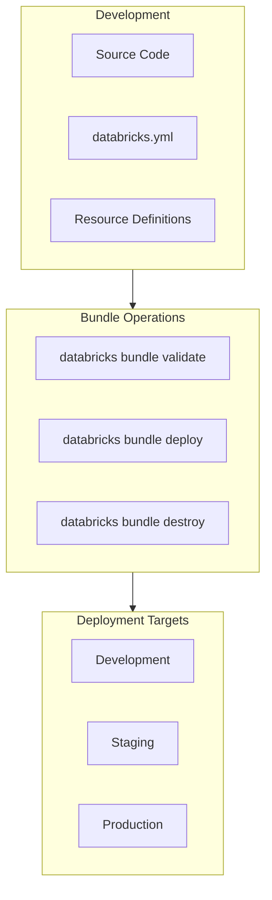

# Databricks Asset Bundles (DAB) — Part 1

Databricks Asset Bundles provide a standardized way to package, validate, and deploy Databricks resources as code. This part covers bundle structure, resource definitions, variables, commands, target configuration, and artifact packaging.

## Overview



## Bundle Structure

### Standard Project Layout

```text
my-databricks-project/
├── databricks.yml              # Main bundle configuration
├── resources/
│   ├── jobs.yml               # Job definitions
│   ├── pipelines.yml          # DLT pipeline definitions
│   └── clusters.yml           # Cluster configurations
├── src/
│   ├── notebooks/             # Notebook source files
│   │   ├── bronze/
│   │   ├── silver/
│   │   └── gold/
│   └── python/                # Python wheel/modules
│       ├── etl/
│       └── utils/
├── tests/
│   ├── unit/                  # Unit tests
│   └── integration/           # Integration tests
├── fixtures/                  # Test data
└── .databricks/               # Generated state files (gitignore)
```

### Core Configuration File

```yaml
# databricks.yml

bundle:
  name: my-etl-project

# Include additional configuration files

include:
  - resources/*.yml

# Variables for parameterization

variables:
  environment:
    description: "Deployment environment"
    default: dev
  catalog:
    description: "Unity Catalog name"
    default: dev_catalog

# Workspace configuration

workspace:
  host: https://adb-1234567890.1.azuredatabricks.net

# Artifact locations

artifacts:
  default:
    type: whl
    path: ./src/python
    build: poetry build

# Deployment targets

targets:
  dev:
    mode: development
    default: true
    variables:
      environment: dev
      catalog: dev_catalog
    workspace:
      root_path: /Workspace/Users/${workspace.current_user.userName}/.bundle/${bundle.name}/${bundle.target}

  staging:
    variables:
      environment: staging
      catalog: staging_catalog
    workspace:
      root_path: /Workspace/Shared/.bundle/${bundle.name}/${bundle.target}

  prod:
    mode: production
    variables:
      environment: prod
      catalog: prod_catalog
    workspace:
      root_path: /Workspace/Shared/.bundle/${bundle.name}/${bundle.target}
    run_as:
      service_principal_name: etl-service-principal
```

## Resource Definitions

### Job Configuration

```yaml
# resources/jobs.yml

resources:
  jobs:
    etl_daily_job:
      name: "ETL Daily Pipeline - ${var.environment}"
      schedule:
        quartz_cron_expression: "0 0 6 * * ?"
        timezone_id: "UTC"

      email_notifications:
        on_failure:
          - data-team@company.com

      tags:
        environment: ${var.environment}
        team: data-engineering

      tasks:
        - task_key: bronze_ingestion
          notebook_task:
            notebook_path: ../src/notebooks/bronze/ingest.py
            base_parameters:
              catalog: ${var.catalog}
              environment: ${var.environment}
          job_cluster_key: etl_cluster

        - task_key: silver_transform
          depends_on:
            - task_key: bronze_ingestion
          notebook_task:
            notebook_path: ../src/notebooks/silver/transform.py
            base_parameters:
              catalog: ${var.catalog}
          job_cluster_key: etl_cluster

        - task_key: gold_aggregate
          depends_on:
            - task_key: silver_transform
          notebook_task:
            notebook_path: ../src/notebooks/gold/aggregate.py
            base_parameters:
              catalog: ${var.catalog}
          job_cluster_key: etl_cluster

      job_clusters:
        - job_cluster_key: etl_cluster
          new_cluster:
            spark_version: "14.3.x-scala2.12"
            node_type_id: "Standard_DS3_v2"
            num_workers: 2
            spark_conf:
              spark.databricks.delta.preview.enabled: "true"
```

### DLT Pipeline Configuration

```yaml
# resources/pipelines.yml

resources:
  pipelines:
    streaming_pipeline:
      name: "Streaming ETL - ${var.environment}"
      target: "${var.catalog}.${var.environment}_streaming"
      development: ${var.environment == "dev"}

      configuration:
        environment: ${var.environment}
        catalog: ${var.catalog}

      clusters:
        - label: default
          num_workers: 2
          node_type_id: "Standard_DS3_v2"

      libraries:
        - notebook:
            path: ../src/notebooks/streaming/pipeline.py

      continuous: false

      notifications:
        - email_recipients:
            - data-team@company.com
          alerts:
            - on-update-failure
            - on-flow-failure
```

### Cluster Configuration

```yaml
# resources/clusters.yml

resources:
  clusters:
    shared_analytics:
      cluster_name: "Analytics Cluster - ${var.environment}"
      spark_version: "14.3.x-scala2.12"
      node_type_id: "Standard_DS4_v2"
      autoscale:
        min_workers: 1
        max_workers: 8
      spark_conf:
        spark.databricks.cluster.profile: serverless
      custom_tags:
        environment: ${var.environment}
```

## Variables and Substitutions

### Variable Types

```yaml
# databricks.yml

variables:
  # Simple variable with default
  environment:
    default: dev

  # Variable without default (required)
  db_password:
    description: "Database password"

  # Complex variable with lookup
  instance_pool_id:
    lookup:
      instance_pool: etl-pool
```

### Built-in Variables

| Variable | Description | Example |
| :--- | :--- | :--- |
| `${bundle.name}` | Bundle name | my-etl-project |
| `${bundle.target}` | Current target | dev, prod |
| `${workspace.current_user.userName}` | Current user | `user@company.com` |
| `${workspace.root_path}` | Workspace root | /Workspace/Shared/... |
| `${resources.jobs.<name>.id}` | Job ID after deploy | 123456789 |

### Variable Substitution Examples

```yaml
# Using variables in configurations

resources:
  jobs:
    my_job:
      name: "Job - ${var.environment}"

      tasks:
        - task_key: main
          notebook_task:
            notebook_path: /Workspace/${workspace.root_path}/notebooks/main
            base_parameters:
              # Reference another variable
              catalog: ${var.catalog}
              # Use bundle metadata
              bundle_name: ${bundle.name}
```

## Bundle Commands

### Core Commands

```bash
# Initialize new bundle from template

databricks bundle init

# Validate bundle configuration

databricks bundle validate

# Deploy bundle to target

databricks bundle deploy

# Deploy to specific target

databricks bundle deploy -t prod

# Run a job defined in bundle

databricks bundle run etl_daily_job

# Run with parameters

databricks bundle run etl_daily_job --params '{"date": "2024-01-15"}'

# Destroy deployed resources

databricks bundle destroy

# Show bundle summary

databricks bundle summary
```

### Development Mode

```bash
# Deploy in development mode (personal copy)

databricks bundle deploy -t dev

# Development mode characteristics:
# - Prefixes resource names with user email
# - Pauses job schedules
# - Sets pipelines to development mode
# - Uses personal workspace path

```

### Validation and Debugging

```bash
# Validate configuration

databricks bundle validate

# Validate specific target

databricks bundle validate -t prod

# Show resolved configuration

databricks bundle validate --output json

# Debug deployment issues

databricks bundle deploy --debug
```

## Target Configuration

### Development vs Production Modes

```yaml
targets:
  dev:
    mode: development
    # Development mode:
    # - Prefixes names with username
    # - Pauses schedules
    # - Enables pipeline development mode

  prod:
    mode: production
    # Production mode:
    # - Uses exact resource names
    # - Enables schedules
    # - Requires run_as for identity
```

### Environment-Specific Overrides

```yaml
targets:
  dev:
    variables:
      cluster_size: small
    resources:
      jobs:
        etl_job:
          job_clusters:
            - job_cluster_key: main
              new_cluster:
                num_workers: 1

  prod:
    variables:
      cluster_size: large
    resources:
      jobs:
        etl_job:
          job_clusters:
            - job_cluster_key: main
              new_cluster:
                num_workers: 8
                driver_node_type_id: "Standard_DS5_v2"
```

### Service Principal Authentication

```yaml
targets:
  prod:
    mode: production
    run_as:
      service_principal_name: production-etl-sp

    # Or use service principal ID
    # run_as:
    #   service_principal_id: "00000000-0000-0000-0000-000000000000"
```

## Artifacts and Libraries

### Python Wheel Artifacts

```yaml
# databricks.yml

artifacts:
  etl_package:
    type: whl
    path: ./src/python
    build: poetry build
    # Or: build: python setup.py bdist_wheel

# Reference in job

resources:
  jobs:
    my_job:
      tasks:
        - task_key: main
          python_wheel_task:
            package_name: etl_package
            entry_point: main
          libraries:
            - whl: ../artifacts/etl_package/*.whl
```

### JAR Artifacts

```yaml
artifacts:
  spark_extensions:
    type: jar
    path: ./libs
    build: mvn package -DskipTests

resources:
  jobs:
    my_job:
      tasks:
        - task_key: main
          libraries:
            - jar: ../artifacts/spark_extensions/*.jar
```

> **Continue reading:** [Part 2 — Sync, CI/CD Integration, Bundle Templates, Common Patterns & Exam Tips](./01-asset-bundles-part2.md)

---

**[↑ Back to Testing & Deployment](./README.md) | [Next: Asset Bundles — Part 2](./01-asset-bundles-part2.md) →**
