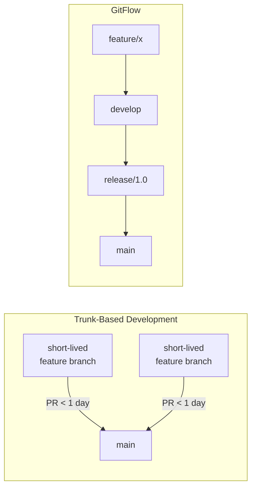

# Advanced Testing & Operations — Part 2

This file covers deployment validation, automated rollback, GitOps patterns, and common troubleshooting scenarios.

> For property-based testing, Lakeflow Declarative Pipelines testing, streaming tests, and integration patterns, see [Part 1](./06-advanced-testing-operations-part1.md).

## Deployment Validation

### Post-Deployment Health Checks

```python
# scripts/post_deploy_checks.py

"""Post-deployment validation suite."""
from databricks.sdk import WorkspaceClient
from databricks.sdk.service.sql import StatementState

class PostDeploymentValidator:
    """Run health checks after deployment."""

    def __init__(self, catalog: str, warehouse_id: str):
        self.client = WorkspaceClient()
        self.catalog = catalog
        self.warehouse_id = warehouse_id
        self.results = []

    def check_tables_exist(self, expected_tables: list[str]):
        """Verify all expected tables exist after deployment."""
        for table in expected_tables:
            result = self._run_sql(
                f"SELECT 1 FROM {self.catalog}.information_schema.tables "
                f"WHERE table_schema || '.' || table_name = '{table}'"
            )
            exists = len(result) > 0
            self.results.append({
                "check": f"table_exists_{table}",
                "passed": exists,
                "message": f"Table {table} {'exists' if exists else 'MISSING'}"
            })

    def check_row_counts(self, table_minimums: dict[str, int]):
        """Verify tables have minimum expected row counts."""
        for table, min_rows in table_minimums.items():
            result = self._run_sql(
                f"SELECT COUNT(*) as cnt FROM {self.catalog}.{table}"
            )
            actual = result[0]["cnt"] if result else 0
            passed = actual >= min_rows
            self.results.append({
                "check": f"row_count_{table}",
                "passed": passed,
                "message": (
                    f"{table}: {actual} rows "
                    f"(minimum: {min_rows})"
                )
            })

    def check_freshness(self, table: str, max_age_hours: int):
        """Verify table data is fresh enough."""
        result = self._run_sql(f"""
            SELECT MAX(updated_at) as latest
            FROM {self.catalog}.{table}
        """)
        if result and result[0]["latest"]:
            from datetime import datetime, timedelta
            latest = result[0]["latest"]
            cutoff = datetime.now() - timedelta(hours=max_age_hours)
            passed = latest >= cutoff
        else:
            passed = False

        self.results.append({
            "check": f"freshness_{table}",
            "passed": passed,
            "message": f"{table} freshness check"
        })

    def check_jobs_healthy(self, job_names: list[str]):
        """Verify critical jobs are not in a failed state."""
        for job_name in job_names:
            jobs = list(self.client.jobs.list(name=job_name))
            if not jobs:
                self.results.append({
                    "check": f"job_exists_{job_name}",
                    "passed": False,
                    "message": f"Job '{job_name}' not found"
                })
                continue

            job = jobs[0]
            runs = list(self.client.jobs.list_runs(
                job_id=job.job_id, limit=1
            ))
            if runs:
                last_run = runs[0]
                passed = str(last_run.state.result_state) != "FAILED"
            else:
                passed = True  # No runs yet is okay

            self.results.append({
                "check": f"job_healthy_{job_name}",
                "passed": passed,
                "message": f"Job '{job_name}' health check"
            })

    def report(self) -> bool:
        """Print results and return overall pass/fail."""
        all_passed = True
        for r in self.results:
            status = "PASS" if r["passed"] else "FAIL"
            print(f"  [{status}] {r['message']}")
            if not r["passed"]:
                all_passed = False

        print(f"\nOverall: {'PASSED' if all_passed else 'FAILED'}")
        return all_passed

    def _run_sql(self, statement: str):
        """Execute SQL and return results."""
        response = self.client.statement_execution.execute_statement(
            warehouse_id=self.warehouse_id,
            statement=statement,
            wait_timeout="30s"
        )
        if response.status.state == StatementState.SUCCEEDED:
            if response.result and response.result.data_array:
                columns = [c.name for c in response.manifest.schema.columns]
                return [
                    dict(zip(columns, row))
                    for row in response.result.data_array
                ]
        return []
```

```bash
#!/bin/bash
# scripts/post_deploy_validate.sh
# Run post-deployment validation as part of CI/CD

set -euo pipefail

ENVIRONMENT=$1

echo "Running post-deployment validation for ${ENVIRONMENT}..."

# Wait for any triggered jobs to start

sleep 30

# Run validation notebook

databricks bundle run post_deploy_checks -t "${ENVIRONMENT}"

# Check exit status

if [ $? -ne 0 ]; then
    echo "Post-deployment validation FAILED"
    echo "Initiating rollback..."
    ./scripts/rollback.sh "${ENVIRONMENT}"
    exit 1
fi

echo "Post-deployment validation PASSED"
```

### Automated Rollback Triggers

```yaml
# .github/workflows/deploy-with-rollback.yml

name: Deploy with Auto-Rollback

on:
  push:
    branches: [main]

jobs:
  deploy-and-validate:
    runs-on: ubuntu-latest
    environment: production
    steps:
      - uses: actions/checkout@v4
        with:
          fetch-depth: 2  # Need previous commit for rollback

      - uses: databricks/setup-cli@main

      - name: Record current state
        id: pre-deploy
        run: |
          echo "commit_before=$(git rev-parse HEAD~1)" >> $GITHUB_OUTPUT

      - name: Deploy to production
        run: databricks bundle deploy -t prod
        env:
          DATABRICKS_HOST: ${{ secrets.PROD_HOST }}
          DATABRICKS_TOKEN: ${{ secrets.PROD_TOKEN }}

      - name: Run smoke tests
        id: smoke
        continue-on-error: true
        run: databricks bundle run smoke_test_job -t prod
        env:
          DATABRICKS_HOST: ${{ secrets.PROD_HOST }}
          DATABRICKS_TOKEN: ${{ secrets.PROD_TOKEN }}

      - name: Rollback on failure
        if: steps.smoke.outcome == 'failure'
        run: |
          echo "Smoke tests failed. Rolling back to ${{ steps.pre-deploy.outputs.commit_before }}"
          git checkout ${{ steps.pre-deploy.outputs.commit_before }}
          databricks bundle deploy -t prod
        env:
          DATABRICKS_HOST: ${{ secrets.PROD_HOST }}
          DATABRICKS_TOKEN: ${{ secrets.PROD_TOKEN }}

      - name: Alert on rollback
        if: steps.smoke.outcome == 'failure'
        uses: slackapi/slack-github-action@v1
        with:
          channel-id: incidents
          slack-message: |
            ROLLBACK TRIGGERED for production deployment.
            Failed commit: ${{ github.sha }}
            Rolled back to: ${{ steps.pre-deploy.outputs.commit_before }}
        env:
          SLACK_BOT_TOKEN: ${{ secrets.SLACK_BOT_TOKEN }}
```

## GitOps for Databricks

### Mono-Repo vs Multi-Repo Strategies

| Aspect | Mono-Repo | Multi-Repo |
| :--- | :--- | :--- |
| Structure | Single repo for all pipelines | Separate repo per project/team |
| Shared code | Easy internal imports | Requires package publishing |
| CI/CD | Longer pipelines, path-based triggers | Simpler per-repo pipelines |
| Ownership | CODEOWNERS file per directory | Repo-level permissions |
| Discoverability | All code in one place | Need a catalog/registry |
| Best for | Small-medium teams, shared infra | Large orgs, independent teams |

```text
# Mono-repo structure

databricks-platform/
├── CODEOWNERS
├── .github/workflows/
│   ├── ci.yml              # Shared CI
│   └── cd.yml              # Shared CD with path filters
├── projects/
│   ├── ingestion/           # Team A
│   │   ├── databricks.yml
│   │   ├── src/
│   │   └── tests/
│   ├── analytics/           # Team B
│   │   ├── databricks.yml
│   │   ├── src/
│   │   └── tests/
│   └── ml-features/         # Team C
│       ├── databricks.yml
│       ├── src/
│       └── tests/
├── shared/                   # Shared libraries
│   ├── etl-core/
│   └── data-quality/
└── infrastructure/           # Terraform/IaC
    ├── workspaces/
    └── unity-catalog/
```

```yaml
# .github/workflows/cd.yml - Path-filtered deployment for mono-repo

name: Deploy

on:
  push:
    branches: [main]
    paths:
      - 'projects/ingestion/**'
      - 'projects/analytics/**'
      - 'shared/**'

jobs:
  detect-changes:
    runs-on: ubuntu-latest
    outputs:
      ingestion: ${{ steps.filter.outputs.ingestion }}
      analytics: ${{ steps.filter.outputs.analytics }}
    steps:
      - uses: actions/checkout@v4
      - uses: dorny/paths-filter@v3
        id: filter
        with:
          filters: |
            ingestion:
              - 'projects/ingestion/**'
              - 'shared/**'
            analytics:
              - 'projects/analytics/**'
              - 'shared/**'

  deploy-ingestion:
    needs: detect-changes
    if: needs.detect-changes.outputs.ingestion == 'true'
    runs-on: ubuntu-latest
    steps:
      - uses: actions/checkout@v4
      - uses: databricks/setup-cli@main
      - run: databricks bundle deploy -t prod
        working-directory: projects/ingestion
        env:
          DATABRICKS_HOST: ${{ secrets.PROD_HOST }}
          DATABRICKS_TOKEN: ${{ secrets.PROD_TOKEN }}

  deploy-analytics:
    needs: detect-changes
    if: needs.detect-changes.outputs.analytics == 'true'
    runs-on: ubuntu-latest
    steps:
      - uses: actions/checkout@v4
      - uses: databricks/setup-cli@main
      - run: databricks bundle deploy -t prod
        working-directory: projects/analytics
        env:
          DATABRICKS_HOST: ${{ secrets.PROD_HOST }}
          DATABRICKS_TOKEN: ${{ secrets.PROD_TOKEN }}
```

### Branch Strategy Comparison



| Strategy | Best For | Pros | Cons |
| :--- | :--- | :--- | :--- |
| Trunk-based | Small teams, frequent deploys | Simple, fast iteration | Requires feature flags |
| GitFlow | Large teams, scheduled releases | Structured, clear releases | Complex, slow merges |
| GitHub Flow | Medium teams | Simple, PR-based | No staging branch |
| Environment branches | Multi-env promotion | Clear env mapping | Branch divergence risk |

**Recommendation for data engineering:** Trunk-based development with feature flags. Data pipelines benefit from frequent small changes rather than large batch releases.

### Pull Request Templates for Data Engineering

```markdown
<!-- .github/PULL_REQUEST_TEMPLATE.md -->
## Description

<!-- What does this change do? Why is it needed? -->

## Type of Change

- [ ] New pipeline / data source
- [ ] Pipeline modification
- [ ] Bug fix
- [ ] Schema change
- [ ] Configuration change
- [ ] Performance optimization

## Impact Assessment

- [ ] **Tables affected:** <!-- list tables -->
- [ ] **Downstream consumers:** <!-- who reads these tables? -->
- [ ] **Schema changes:** <!-- any column additions/removals? -->
- [ ] **Backfill required:** <!-- does historical data need reprocessing? -->

## Testing

- [ ] Unit tests pass locally
- [ ] Integration tests pass in staging
- [ ] Data quality checks verified
- [ ] Tested with production-scale data sample

## Deployment Notes

- [ ] No manual steps required
- [ ] Requires schema migration (attached migration file)
- [ ] Requires configuration change in target environment
- [ ] Requires backfill job after deployment

## Rollback Plan

<!-- How would you roll back this change if something goes wrong? -->
```

```text

# CODEOWNERS - Enforce reviews by area
# .github/CODEOWNERS

# Data platform team reviews shared infrastructure

/shared/                    @data-platform-team
/infrastructure/            @data-platform-team

# Team-specific code ownership

/projects/ingestion/        @ingestion-team
/projects/analytics/        @analytics-team
/projects/ml-features/      @ml-team

# CI/CD changes require platform team review

/.github/                   @data-platform-team
**/databricks.yml           @data-platform-team
```

## Practice Questions

**Question 1:** A data engineer is setting up CI/CD for a Databricks project that spans three teams, each owning separate pipelines. All teams share common cluster configurations and notification settings. What is the recommended approach for organizing their Databricks Asset Bundles?

A) Create a single databricks.yml with all resources and use variables to toggle per team
B) Use the `include` directive to reference shared YAML files from each team's bundle
C) Duplicate the shared configuration in each team's databricks.yml for independence
D) Store all configuration in environment variables and reference them at deploy time

> [!success]- Answer
> **Correct Answer: B**
>
> The `include` directive in databricks.yml allows multiple bundles to reference shared configuration files (e.g., common cluster definitions, notification settings) without duplication. Each team maintains their own databricks.yml while inheriting shared resources from a common directory. This follows DRY principles and ensures consistent configuration across teams.

**Question 2:** Which authentication method eliminates the need for long-lived secrets in GitHub Actions when deploying to Databricks?

A) Personal Access Tokens stored in GitHub Secrets
B) Service principal client secret in environment variables
C) OIDC federation with GitHub Actions identity provider
D) SSH keys stored in the repository

> [!success]- Answer
> **Correct Answer: C**
>
> OIDC (OpenID Connect) federation allows GitHub Actions to authenticate with Databricks using short-lived JWT tokens. The CI runner requests a token from GitHub's OIDC provider, and Databricks validates it against a federation policy configured on the service principal. This eliminates storing long-lived secrets entirely.

**Question 3:** A data engineer needs to test Lakeflow Declarative Pipelines pipeline transformation logic in a local pytest environment. What is the correct approach?

A) Install the Lakeflow Declarative Pipelines runtime locally and import `dlt` decorators in tests
B) Extract transformation logic into plain PySpark functions and test those
C) Run `databricks bundle run` from within pytest to execute Lakeflow Declarative Pipelines tests
D) Use `unittest.mock` to fully mock the Lakeflow Declarative Pipelines runtime

> [!success]- Answer
> **Correct Answer: B**
>
> DLT pipelines depend on the Databricks DLT runtime, which cannot run locally. The recommended pattern is to extract transformation logic (joins, filters, aggregations) into standalone PySpark functions, then test those functions with a local SparkSession and standard pytest. The DLT notebook simply calls these functions within `@dlt.table` decorated functions.

**Question 4:** A team has deployed a new version of their production ETL pipeline, but post-deployment smoke tests are failing. They are using Databricks Asset Bundles. What is the fastest way to rollback?

A) Delete the production job and recreate it manually from the Databricks UI
B) Run `databricks bundle destroy` and then redeploy from the previous commit
C) Check out the previous Git commit and run `databricks bundle deploy -t prod`
D) Use Delta Time Travel to restore all affected tables

> [!success]- Answer
> **Correct Answer: C**
>
> The fastest rollback approach with DAB is to checkout the previous known-good commit from Git and re-run `databricks bundle deploy -t prod`. This redeploys the exact previous configuration (job definitions, notebook code, cluster settings) without destroying existing resources first. Delta Time Travel (D) handles data rollback but does not restore job/pipeline configurations.

**Question 5:** Which testing strategy best complements property-based testing when validating PySpark transformations?

A) Only run end-to-end tests in production
B) Use `chispa.assert_df_equality` for exact output comparison alongside Hypothesis for edge case discovery
C) Rely solely on Hypothesis to generate all test scenarios
D) Skip unit tests and use Great Expectations for all validation

> [!success]- Answer
> **Correct Answer: B**
>
> Property-based testing (using Hypothesis) excels at discovering unexpected edge cases by generating random inputs and checking invariants (e.g., "deduplication never increases row count"). It complements example-based testing with chispa, which verifies exact expected outputs for specific known inputs. Together they provide thorough coverage: chispa for correctness of known cases, Hypothesis for robustness against unexpected inputs.

## Common Issues / Errors

### OIDC Token Exchange Fails

**Scenario:** GitHub Actions OIDC authentication fails with "invalid token" error.

**Fix:** Verify the federation policy configuration:

```bash

# Check the subject claim matches exactly
# Format: repo:<org>/<repo>:ref:refs/heads/<branch>
# Common mistake: missing the 'ref:' prefix or wrong branch name

# Correct subject for main branch:
# repo:my-org/my-repo:ref:refs/heads/main

# Correct subject for environment:
# repo:my-org/my-repo:environment:production

# Verify in workflow with:

- name: Debug OIDC
  run: |
    echo "Subject: repo:${{ github.repository }}:ref:${{ github.ref }}"
```

### Multi-Project Bundle Include Path Resolution

**Scenario:** `include` paths fail with "file not found" when deploying.

**Fix:** Include paths are relative to the bundle root (location of databricks.yml):

```yaml

# If databricks.yml is in projects/ingestion/
# And shared files are in ../../shared/

include:
  - ../../shared/common-clusters.yml    # Relative to databricks.yml
  - resources/*.yml                      # Relative to databricks.yml
```

### Coverage Drops Below Threshold

**Scenario:** CI fails because PySpark code coverage is below the required threshold.

**Fix:** Configure `.coveragerc` to exclude untestable code:

```text
# .coveragerc

[run]
omit =
    src/notebooks/*          # Notebook wrappers not unit-testable
    src/pipelines/dlt_*.py   # DLT decorators need runtime

[report]
exclude_lines =
    pragma: no cover
    if __name__ == .__main__
    # Databricks-specific lines that cannot run locally
    dbutils.widgets
    display\(
```

### Integration Test Schema Collisions

**Scenario:** Parallel CI runs cause test failures because they write to the same schema.

**Fix:** Use unique schema names per test run:

```python
import uuid

@pytest.fixture(scope="session")
def test_schema(db_spark):
    schema = f"test_catalog.ci_{uuid.uuid4().hex[:8]}"
    db_spark.sql(f"CREATE SCHEMA {schema}")
    yield schema
    db_spark.sql(f"DROP SCHEMA {schema} CASCADE")
```

### Blue/Green View Switch Fails

**Scenario:** Switching views between blue and green schemas fails due to permissions.

**Fix:** Ensure the service principal has `CREATE VIEW` permissions on the target schema:

```sql
-- Grant the deployment SP permission to create/replace views
GRANT CREATE TABLE ON SCHEMA prod_catalog.prod TO `prod-deploy-sp`;
GRANT USAGE ON SCHEMA prod_catalog.prod_blue TO `prod-deploy-sp`;
GRANT SELECT ON SCHEMA prod_catalog.prod_blue TO `prod-deploy-sp`;
GRANT USAGE ON SCHEMA prod_catalog.prod_green TO `prod-deploy-sp`;
GRANT SELECT ON SCHEMA prod_catalog.prod_green TO `prod-deploy-sp`;
```

### Canary Deployment Timeout

**Scenario:** Canary monitoring exceeds the CI job timeout.

**Fix:** Use async monitoring with a separate check job:

```yaml
# Split canary into deploy + async monitor

- name: Deploy canary
  run: |
    databricks bundle deploy -t prod-canary
    databricks bundle run canary_job -t prod-canary --no-wait

- name: Wait for canary window
  run: sleep 600  # 10-minute observation window

- name: Check canary health
  run: |
    databricks bundle run canary_health_check -t prod-canary
```

### Artifact Build Fails in CI

**Scenario:** Python wheel build succeeds locally but fails in CI.

**Fix:** Ensure CI has all build dependencies:

```yaml
- name: Install build tools
  run: |
    pip install poetry build setuptools wheel
    # For JAR artifacts:
    # sudo apt-get install -y maven

- name: Build artifacts
  run: |
    cd libs/etl-core
    poetry install
    poetry build
```

## Exam Tips

1. **OIDC federation** - Understand that OIDC eliminates stored secrets by using short-lived JWT tokens exchanged between the CI provider and Databricks
2. **Bundle includes** - Know that `include` merges YAML files and paths are relative to the bundle root (databricks.yml location)
3. **Lookup references** - `${resources.jobs.my_job.id}` resolves after deployment; cannot be used before the resource is created
4. **Blue/green vs canary** - Blue/green swaps entire environments; canary routes a subset of traffic to the new version
5. **Testing Lakeflow Declarative Pipelines** - Extract transformation logic into plain functions; test those with local SparkSession; Lakeflow Declarative Pipelines decorators cannot run outside the Lakeflow Declarative Pipelines runtime
6. **Test isolation** - Use unique schemas per test run (`test_<uuid>`) and `DROP SCHEMA CASCADE` in teardown
7. **Coverage gating** - Use `--cov-fail-under=80` in pytest to enforce minimum coverage in CI
8. **Rollback with DAB** - Checkout previous commit and `databricks bundle deploy`; Delta Time Travel for data-level rollback
9. **Feature flags** - Store in Unity Catalog table; check in pipeline code to toggle behavior per environment
10. **Mono-repo CI** - Use path-based triggers (`paths:` filter in GitHub Actions) to deploy only changed projects

## Key Takeaways

- **Post-deployment validation**: Always run a smoke test job immediately after deployment and trigger an automated rollback (git checkout previous commit + redeploy) if it fails.
- **OIDC replaces stored secrets**: OIDC federation with GitHub Actions requires `permissions: id-token: write` in the workflow and a matching federation policy on the Databricks service principal — no stored client secrets needed.
- **Bundle include paths**: All paths in the `include:` directive are relative to the location of `databricks.yml`, not the working directory from which the CLI is run.
- **DLT testing pattern**: DLT decorators cannot run locally — extract transformation logic into plain PySpark functions, test those with a local SparkSession, and wrap them in `@dlt.table` for the pipeline.
- **Test schema isolation**: Use `test_catalog.ci_<uuid>` schema names for integration tests and drop the schema with `CASCADE` in test teardown to prevent parallel CI run collisions.
- **Coverage gating**: Use `--cov-fail-under=80` in pytest CI to enforce a minimum code coverage threshold and block merges on coverage regressions.
- **Mono-repo path triggers**: Use `paths:` filters in GitHub Actions to deploy only the changed project bundle, preventing unnecessary redeployments of unrelated pipelines.
- **Trunk-based with feature flags**: For data engineering, trunk-based development (short-lived branches merged to main frequently) combined with feature flags is recommended over GitFlow to enable faster iteration.

## Related Topics

- [Asset Bundles](01-asset-bundles-part1.md) - DAB fundamentals, structure, and targets
- [CI/CD Integration](02-cicd-integration-part1.md) - GitHub Actions, Azure DevOps basics
- [Git Folders](03-git-folders.md) - Git integration and branching strategies
- [Unit Testing](04-unit-testing-part1.md) - pytest, Nutter, and basic testing patterns
- [Part 1 — Advanced Testing Strategies](./06-advanced-testing-operations-part1.md)

## Official Documentation

- [Databricks Asset Bundles](https://docs.databricks.com/dev-tools/bundles/index.html)
- [OIDC Federation with Databricks](https://docs.databricks.com/dev-tools/auth/oauth-m2m.html)
- [Databricks Connect](https://docs.databricks.com/dev-tools/databricks-connect/index.html)
- [CI/CD Best Practices](https://docs.databricks.com/dev-tools/ci-cd/index.html)
- [Delta Lake Time Travel](https://docs.databricks.com/delta/history.html)
- [Great Expectations with Databricks](https://docs.databricks.com/integrations/great-expectations.html)
- [Lakeflow Declarative Pipelines Pipeline Testing](https://docs.databricks.com/delta-live-tables/testing.html)

---

**[← Previous: Advanced Testing & Operations — Part 1](./06-advanced-testing-operations-part1.md) | [↑ Back to Testing & Deployment](./README.md)**
