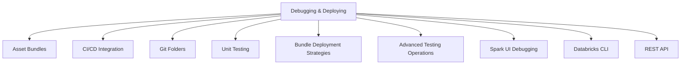

# Debugging and Deploying (10 % of Exam)

Databricks Asset Bundles, CI/CD integration, Git folders, unit testing, advanced testing operations, plus the runtime diagnostics tools (Spark UI), the Databricks CLI, and the REST API used to operate pipelines from outside the workspace.

## Topics Overview

## Section Contents

| File | Topic | Priority |
| :--- | :--- | :--- |
| [01-asset-bundles-part1.md](./01-asset-bundles-part1.md) | Bundle anatomy, targets, resources | High |
| [01-asset-bundles-part2.md](./01-asset-bundles-part2.md) | Variables, deployment, advanced patterns | High |
| [02-cicd-integration-part1.md](./02-cicd-integration-part1.md) | GitHub Actions / Azure DevOps for Databricks | High |
| [02-cicd-integration-part2.md](./02-cicd-integration-part2.md) | Multi-environment deploys, secrets, gating | High |
| [03-git-folders.md](./03-git-folders.md) | Git folders in the workspace (formerly Repos) | High |
| [04-unit-testing-part1.md](./04-unit-testing-part1.md) | pytest in notebooks, fixtures, mocks | High |
| [04-unit-testing-part2.md](./04-unit-testing-part2.md) | Testing PySpark code, Delta-table testing | High |
| [05-bundle-deployment-strategies-part1.md](./05-bundle-deployment-strategies-part1.md) | Dev / staging / prod targets, mode `development` vs `production` | High |
| [05-bundle-deployment-strategies-part2.md](./05-bundle-deployment-strategies-part2.md) | Permission patterns, run-as identities | High |
| [06-advanced-testing-operations-part1.md](./06-advanced-testing-operations-part1.md) | Integration tests, data tests, contract tests | Medium |
| [06-advanced-testing-operations-part2.md](./06-advanced-testing-operations-part2.md) | CI-driven test orchestration, advanced patterns | Medium |
| [07-spark-ui-debugging.md](./07-spark-ui-debugging.md) | Reading the Spark UI: stages, tasks, shuffle, GC | High |
| [08-databricks-cli-part1.md](./08-databricks-cli-part1.md) | Modern Databricks CLI (`databricks`), profiles, authentication | High |
| [08-databricks-cli-part2.md](./08-databricks-cli-part2.md) | Bundles, jobs, secrets, fs commands | High |
| [09-rest-api-part1.md](./09-rest-api-part1.md) | Jobs API, OAuth 2.0 + PAT auth, common endpoints | Medium |
| [09-rest-api-part2.md](./09-rest-api-part2.md) | Cluster API, workspace API, retry patterns | Medium |

## Key Concepts to Master

| Concept | Why it matters |
| :--- | :--- |
| **Databricks Asset Bundles** | YAML-driven deployment unit covering jobs, pipelines, ML experiments, dashboards |
| **`mode: development` vs `mode: production`** | Dev mode pauses schedules and prefixes resource names; production runs as the configured service principal |
| **Git folders** | Workspace-resident Git working tree (formerly Repos) — supports branch operations from the UI |
| **Spark UI** | The primary runtime diagnostic; understand stages, tasks, shuffle, and skew indicators |
| **Service principals for prod** | Production jobs should run as a service principal, not a personal token, to survive employee turnover |

## Related Resources

- [Databricks Asset Bundles documentation](https://docs.databricks.com/en/dev-tools/bundles/index.html)
- [Performance Troubleshooting appendix (shared)](../../../shared/appendix/performance-troubleshooting.md)
- [Compute selection (cost & performance domain)](../02-cost-and-performance-optimization/09-databricks-compute.md) — picking the right cluster is also a debugging concern (which cluster is the failing job on?)

---

**[← Previous: Ensuring Data Security and Compliance](../05-ensuring-data-security-and-compliance/README.md) | [↑ Back to DE Professional](../README.md) | [Next: Data Ingestion & Acquisition →](../07-data-ingestion-and-acquisition/README.md)**
